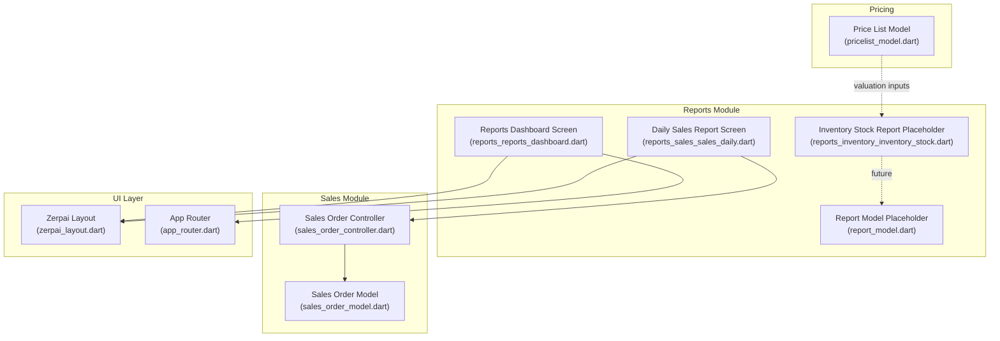
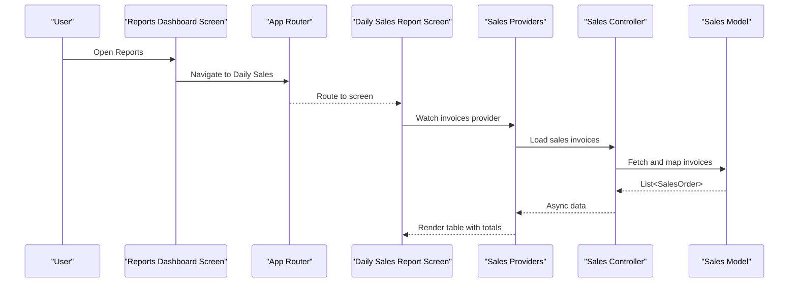
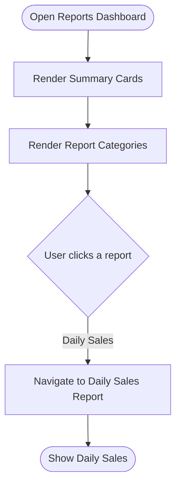
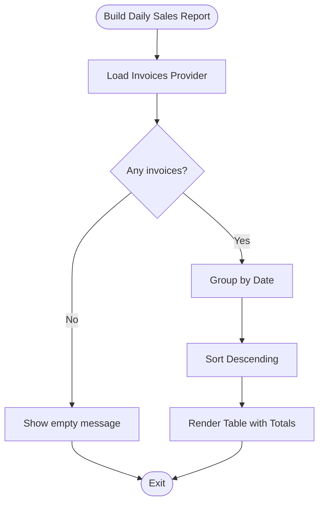
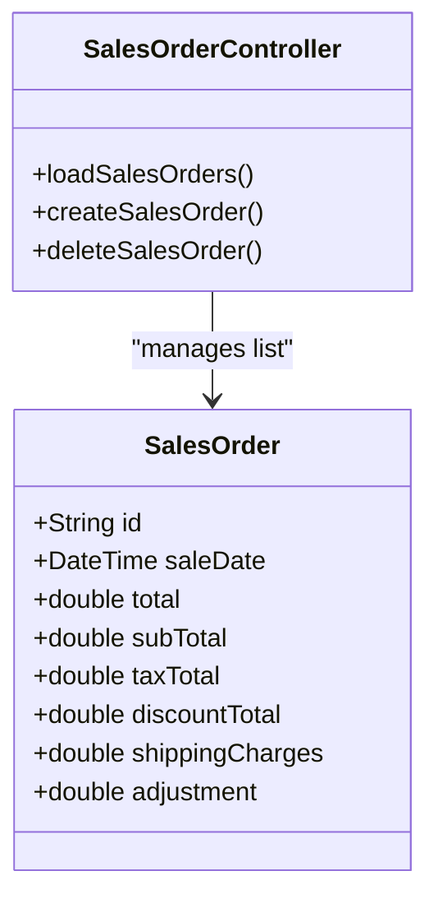
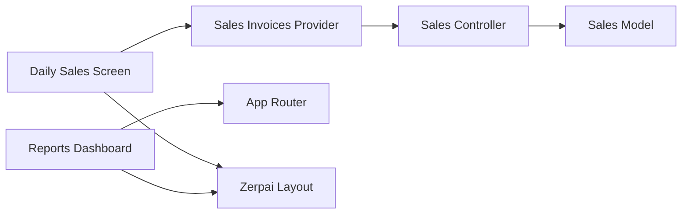

# Financial Reporting

<cite>
**Referenced Files in This Document**
- [reports_reports_dashboard.dart](file://lib/modules/reports/presentation/reports_reports_dashboard.dart)
- [reports_sales_sales_daily.dart](file://lib/modules/reports/presentation/reports_sales_sales_daily.dart)
- [sales_order_controller.dart](file://lib/modules/sales/controller/sales_order_controller.dart)
- [sales_order_model.dart](file://lib/modules/sales/models/sales_order_model.dart)
- [reports_inventory_inventory_stock.dart](file://lib/modules/reports/presentation/reports_inventory_inventory_stock.dart)
- [report_model.dart](file://lib/modules/reports/models/report_model.dart)
- [pricelist_model.dart](file://lib/modules/pricelist/models/pricelist_model.dart)
- [app_router.dart](file://lib/core/routing/app_router.dart)
- [zerpai_layout.dart](file://lib/shared/widgets/zerpai_layout.dart)
</cite>

## Table of Contents
1. [Introduction](#introduction)
2. [Project Structure](#project-structure)
3. [Core Components](#core-components)
4. [Architecture Overview](#architecture-overview)
5. [Detailed Component Analysis](#detailed-component-analysis)
6. [Dependency Analysis](#dependency-analysis)
7. [Performance Considerations](#performance-considerations)
8. [Troubleshooting Guide](#troubleshooting-guide)
9. [Conclusion](#conclusion)
10. [Appendices](#appendices)

## Introduction
This document describes the Financial Reporting system within the Zerpai ERP platform. It focuses on the financial dashboard components, sales analytics reporting, inventory valuation reports, and financial statement generation capabilities currently present in the codebase. It explains the reporting architecture, data aggregation patterns, and visualization components, and provides practical examples of report creation, filtering options, export functionality, and real-time data updates. It also documents the integration between operational data (sales, inventory) and financial reporting, KPI calculations, trend analysis, and compliance reporting requirements.

## Project Structure
The reporting module is organized around presentation screens and Riverpod providers that fetch and expose sales data. The dashboard aggregates summary cards and provides navigation to detailed reports. Sales data is modeled and loaded via a dedicated controller and service layer.

**Diagram sources**
- [reports_reports_dashboard.dart](file://lib/modules/reports/presentation/reports_reports_dashboard.dart#L1-L214)
- [reports_sales_sales_daily.dart](file://lib/modules/reports/presentation/reports_sales_sales_daily.dart#L1-L213)
- [sales_order_controller.dart](file://lib/modules/sales/controller/sales_order_controller.dart#L1-L119)
- [sales_order_model.dart](file://lib/modules/sales/models/sales_order_model.dart#L1-L118)
- [reports_inventory_inventory_stock.dart](file://lib/modules/reports/presentation/reports_inventory_inventory_stock.dart#L1-L2)
- [report_model.dart](file://lib/modules/reports/models/report_model.dart#L1-L2)
- [pricelist_model.dart](file://lib/modules/pricelist/models/pricelist_model.dart#L1-L150)
- [app_router.dart](file://lib/core/routing/app_router.dart)
- [zerpai_layout.dart](file://lib/shared/widgets/zerpai_layout.dart)

**Section sources**
- [reports_reports_dashboard.dart](file://lib/modules/reports/presentation/reports_reports_dashboard.dart#L1-L214)
- [reports_sales_sales_daily.dart](file://lib/modules/reports/presentation/reports_sales_sales_daily.dart#L1-L213)
- [sales_order_controller.dart](file://lib/modules/sales/controller/sales_order_controller.dart#L1-L119)
- [sales_order_model.dart](file://lib/modules/sales/models/sales_order_model.dart#L1-L118)
- [reports_inventory_inventory_stock.dart](file://lib/modules/reports/presentation/reports_inventory_inventory_stock.dart#L1-L2)
- [report_model.dart](file://lib/modules/reports/models/report_model.dart#L1-L2)
- [pricelist_model.dart](file://lib/modules/pricelist/models/pricelist_model.dart#L1-L150)
- [app_router.dart](file://lib/core/routing/app_router.dart)
- [zerpai_layout.dart](file://lib/shared/widgets/zerpai_layout.dart)

## Core Components
- Reports Dashboard Screen
  - Presents summary cards and categorized report tiles.
  - Navigates to specific reports via the application router.
  - Uses a shared layout component for consistent page framing.
  - Reference: [reports_reports_dashboard.dart](file://lib/modules/reports/presentation/reports_reports_dashboard.dart#L1-L214)

- Daily Sales Report Screen
  - Consumes sales invoices via Riverpod providers.
  - Aggregates daily totals and invoice counts.
  - Renders a tabular summary with totals.
  - Handles loading and error states.
  - Reference: [reports_sales_sales_daily.dart](file://lib/modules/reports/presentation/reports_sales_sales_daily.dart#L1-L213)

- Sales Data Providers and Controller
  - Exposes typed providers for invoices, quotes, payments, and other sales artifacts.
  - Loads and refreshes data, handles errors, and invalidates providers after mutations.
  - Reference: [sales_order_controller.dart](file://lib/modules/sales/controller/sales_order_controller.dart#L1-L119)

- Sales Data Model
  - Defines the shape of sales orders, including totals, taxes, discounts, and timestamps.
  - Provides JSON serialization/deserialization helpers.
  - Reference: [sales_order_model.dart](file://lib/modules/sales/models/sales_order_model.dart#L1-L118)

- Inventory Stock Report Placeholder
  - Currently empty; intended for inventory valuation and stock summaries.
  - Reference: [reports_inventory_inventory_stock.dart](file://lib/modules/reports/presentation/reports_inventory_inventory_stock.dart#L1-L2)

- Report Model Placeholder
  - Currently empty; intended to define report metadata and structure.
  - Reference: [report_model.dart](file://lib/modules/reports/models/report_model.dart#L1-L2)

- Price List Model (Valuation Inputs)
  - Supports pricing schemes and rounding preferences used in valuation contexts.
  - Reference: [pricelist_model.dart](file://lib/modules/pricelist/models/pricelist_model.dart#L1-L150)

**Section sources**
- [reports_reports_dashboard.dart](file://lib/modules/reports/presentation/reports_reports_dashboard.dart#L1-L214)
- [reports_sales_sales_daily.dart](file://lib/modules/reports/presentation/reports_sales_sales_daily.dart#L1-L213)
- [sales_order_controller.dart](file://lib/modules/sales/controller/sales_order_controller.dart#L1-L119)
- [sales_order_model.dart](file://lib/modules/sales/models/sales_order_model.dart#L1-L118)
- [reports_inventory_inventory_stock.dart](file://lib/modules/reports/presentation/reports_inventory_inventory_stock.dart#L1-L2)
- [report_model.dart](file://lib/modules/reports/models/report_model.dart#L1-L2)
- [pricelist_model.dart](file://lib/modules/pricelist/models/pricelist_model.dart#L1-L150)

## Architecture Overview
The reporting architecture follows a layered pattern:
- Presentation layer: Screens render summaries and tables, using Riverpod for state.
- Domain layer: Controllers orchestrate data fetching and mutations.
- Data model layer: Strongly typed models define financial entities.
- UI shell: Shared layout and routing components unify navigation and styling.

**Diagram sources**
- [reports_reports_dashboard.dart](file://lib/modules/reports/presentation/reports_reports_dashboard.dart#L193-L197)
- [reports_sales_sales_daily.dart](file://lib/modules/reports/presentation/reports_sales_sales_daily.dart#L13-L203)
- [sales_order_controller.dart](file://lib/modules/sales/controller/sales_order_controller.dart#L31-L33)
- [sales_order_model.dart](file://lib/modules/sales/models/sales_order_model.dart#L53-L96)
- [app_router.dart](file://lib/core/routing/app_router.dart)

## Detailed Component Analysis

### Reports Dashboard Screen
- Purpose: Central hub for report discovery and quick KPI overview.
- Features:
  - Summary cards for key metrics (e.g., Total Sales, Total Customers, Pending Invoices, Escaped Profits).
  - Category-based report tiles (Sales, Inventory, Receivables, Tax).
  - Navigation to specific reports using the application router.
- UI Shell: Uses a shared layout component for consistent page framing.
- References:
  - Summary cards rendering: [reports_reports_dashboard.dart](file://lib/modules/reports/presentation/reports_reports_dashboard.dart#L32-L112)
  - Report grid and categories: [reports_reports_dashboard.dart](file://lib/modules/reports/presentation/reports_reports_dashboard.dart#L114-L156)
  - Category tile rendering and navigation: [reports_reports_dashboard.dart](file://lib/modules/reports/presentation/reports_reports_dashboard.dart#L158-L212)
  - Layout wrapper: [zerpai_layout.dart](file://lib/shared/widgets/zerpai_layout.dart)

**Diagram sources**
- [reports_reports_dashboard.dart](file://lib/modules/reports/presentation/reports_reports_dashboard.dart#L10-L30)
- [reports_reports_dashboard.dart](file://lib/modules/reports/presentation/reports_reports_dashboard.dart#L114-L156)
- [reports_reports_dashboard.dart](file://lib/modules/reports/presentation/reports_reports_dashboard.dart#L158-L212)
- [app_router.dart](file://lib/core/routing/app_router.dart)

**Section sources**
- [reports_reports_dashboard.dart](file://lib/modules/reports/presentation/reports_reports_dashboard.dart#L1-L214)
- [zerpai_layout.dart](file://lib/shared/widgets/zerpai_layout.dart)

### Daily Sales Report Screen
- Purpose: Aggregate daily sales into a summarized table with totals.
- Data Aggregation:
  - Groups invoices by date (year-month-day).
  - Computes daily invoice count and total sales amount.
  - Sorts dates descending and displays a totals row.
- Visualization:
  - Table with flexible column widths and header styling.
  - Responsive layout inside a card with margins.
- Real-time Updates:
  - Reacts to provider state changes; refreshes automatically after mutations.
- References:
  - Provider consumption and async rendering: [reports_sales_sales_daily.dart](file://lib/modules/reports/presentation/reports_sales_sales_daily.dart#L13-L203)
  - Aggregation logic: [reports_sales_sales_daily.dart](file://lib/modules/reports/presentation/reports_sales_sales_daily.dart#L34-L51)
  - Table rendering and totals: [reports_sales_sales_daily.dart](file://lib/modules/reports/presentation/reports_sales_sales_daily.dart#L52-L182)

**Diagram sources**
- [reports_sales_sales_daily.dart](file://lib/modules/reports/presentation/reports_sales_sales_daily.dart#L23-L203)

**Section sources**
- [reports_sales_sales_daily.dart](file://lib/modules/reports/presentation/reports_sales_sales_daily.dart#L1-L213)

### Sales Analytics Reporting
- Data Source: Invoices provider exposes a list of sales orders.
- KPIs:
  - Daily invoice count and total sales amount per day.
  - Overall totals computed across all invoices.
- Trend Analysis:
  - Sorting by date descending enables trend inspection.
- Filtering Options:
  - Current implementation groups by date; future enhancements can add date range filters and dimension filters (customer, item, salesperson).
- Export Functionality:
  - Not implemented in the current code; can be added by generating CSV/PDF from the aggregated dataset.
- References:
  - Provider definitions: [sales_order_controller.dart](file://lib/modules/sales/controller/sales_order_controller.dart#L31-L33)
  - Model fields for totals: [sales_order_model.dart](file://lib/modules/sales/models/sales_order_model.dart#L16-L21)

**Diagram sources**
- [sales_order_model.dart](file://lib/modules/sales/models/sales_order_model.dart#L4-L51)
- [sales_order_controller.dart](file://lib/modules/sales/controller/sales_order_controller.dart#L67-L118)

**Section sources**
- [sales_order_controller.dart](file://lib/modules/sales/controller/sales_order_controller.dart#L1-L119)
- [sales_order_model.dart](file://lib/modules/sales/models/sales_order_model.dart#L1-L118)

### Inventory Valuation Reports
- Current State: Placeholder exists for inventory valuation and stock summaries.
- Planned Scope:
  - Stock summary by item and warehouse.
  - Inventory valuation using cost or price lists.
  - ABC analysis and aging summaries.
- Valuation Inputs:
  - Pricing schemes and rounding preferences can inform valuation methods.
- References:
  - Placeholder file: [reports_inventory_inventory_stock.dart](file://lib/modules/reports/presentation/reports_inventory_inventory_stock.dart#L1-L2)
  - Pricing model: [pricelist_model.dart](file://lib/modules/pricelist/models/pricelist_model.dart#L1-L150)

**Section sources**
- [reports_inventory_inventory_stock.dart](file://lib/modules/reports/presentation/reports_inventory_inventory_stock.dart#L1-L2)
- [pricelist_model.dart](file://lib/modules/pricelist/models/pricelist_model.dart#L1-L150)

### Financial Statement Generation
- Current State: Not implemented in the referenced files.
- Recommended Approach:
  - Build on top of sales and inventory datasets.
  - Use accounting periods and journal entries to compute income and balance sheet items.
  - Integrate with chart of accounts and ledger services.
- Compliance Reporting:
  - Align with local tax regimes (e.g., GST) and audit trails.
- References:
  - Sales and inventory foundations: [sales_order_model.dart](file://lib/modules/sales/models/sales_order_model.dart#L1-L118), [reports_inventory_inventory_stock.dart](file://lib/modules/reports/presentation/reports_inventory_inventory_stock.dart#L1-L2)

**Section sources**
- [sales_order_model.dart](file://lib/modules/sales/models/sales_order_model.dart#L1-L118)
- [reports_inventory_inventory_stock.dart](file://lib/modules/reports/presentation/reports_inventory_inventory_stock.dart#L1-L2)

## Dependency Analysis
- Presentation-to-State:
  - Daily Sales Report depends on the invoices provider from the Sales module.
- State-to-Service:
  - Sales Controller loads data from the Sales API service.
- UI Shell:
  - Both report screens wrap content in a shared layout component.
- Routing:
  - Dashboard navigates to report screens via the application router.

**Diagram sources**
- [reports_sales_sales_daily.dart](file://lib/modules/reports/presentation/reports_sales_sales_daily.dart#L13-L203)
- [sales_order_controller.dart](file://lib/modules/sales/controller/sales_order_controller.dart#L31-L33)
- [sales_order_model.dart](file://lib/modules/sales/models/sales_order_model.dart#L53-L96)
- [reports_reports_dashboard.dart](file://lib/modules/reports/presentation/reports_reports_dashboard.dart#L193-L197)
- [app_router.dart](file://lib/core/routing/app_router.dart)
- [zerpai_layout.dart](file://lib/shared/widgets/zerpai_layout.dart)

**Section sources**
- [reports_sales_sales_daily.dart](file://lib/modules/reports/presentation/reports_sales_sales_daily.dart#L1-L213)
- [sales_order_controller.dart](file://lib/modules/sales/controller/sales_order_controller.dart#L1-L119)
- [sales_order_model.dart](file://lib/modules/sales/models/sales_order_model.dart#L1-L118)
- [reports_reports_dashboard.dart](file://lib/modules/reports/presentation/reports_reports_dashboard.dart#L1-L214)
- [app_router.dart](file://lib/core/routing/app_router.dart)
- [zerpai_layout.dart](file://lib/shared/widgets/zerpai_layout.dart)

## Performance Considerations
- Data Loading
  - Use pagination or time-range filters for large invoice datasets to avoid rendering heavy tables.
  - Debounce filter changes to reduce repeated computations.
- Rendering
  - Virtualize large tables to improve scroll performance.
  - Cache aggregated results per period to avoid recomputation.
- Network
  - Batch requests for related datasets (e.g., invoices and payments) to minimize round trips.
- State Management
  - Invalidate only affected providers after mutations to limit rebuild scope.

## Troubleshooting Guide
- Empty or Missing Data
  - Verify that the invoices provider resolves to a non-empty list.
  - Confirm that the Sales Controller’s load method executes successfully.
  - References:
    - Provider watch and empty-state handling: [reports_sales_sales_daily.dart](file://lib/modules/reports/presentation/reports_sales_sales_daily.dart#L23-L32)
    - Controller load method: [sales_order_controller.dart](file://lib/modules/sales/controller/sales_order_controller.dart#L76-L84)

- Error States
  - Inspect the error branch for user-friendly messaging and logging.
  - References:
    - Error handling in report screen: [reports_sales_sales_daily.dart](file://lib/modules/reports/presentation/reports_sales_sales_daily.dart#L184-L199)

- Navigation Issues
  - Ensure route names used in dashboard navigation match registered routes.
  - References:
    - Navigation logic: [reports_reports_dashboard.dart](file://lib/modules/reports/presentation/reports_reports_dashboard.dart#L193-L197)
    - Router definition: [app_router.dart](file://lib/core/routing/app_router.dart)

**Section sources**
- [reports_sales_sales_daily.dart](file://lib/modules/reports/presentation/reports_sales_sales_daily.dart#L23-L32)
- [sales_order_controller.dart](file://lib/modules/sales/controller/sales_order_controller.dart#L76-L84)
- [reports_sales_sales_daily.dart](file://lib/modules/reports/presentation/reports_sales_sales_daily.dart#L184-L199)
- [reports_reports_dashboard.dart](file://lib/modules/reports/presentation/reports_reports_dashboard.dart#L193-L197)
- [app_router.dart](file://lib/core/routing/app_router.dart)

## Conclusion
The Financial Reporting system currently provides a dashboard for report discovery and a daily sales summary with totals. The foundation is solid: strongly typed models, Riverpod providers, and a shared UI shell. Future work should focus on:
- Implementing inventory valuation and stock summary reports.
- Extending the daily sales report with filters and export capabilities.
- Building financial statements and compliance reporting using the existing sales and inventory datasets.
- Enhancing real-time updates with server-sent events or periodic polling.

## Appendices

### Practical Examples

- Creating a Daily Sales Report
  - Steps:
    - Navigate from the dashboard to the Daily Sales Report.
    - Allow the provider to load invoices.
    - Observe daily totals and the overall summary table.
  - References:
    - Navigation: [reports_reports_dashboard.dart](file://lib/modules/reports/presentation/reports_reports_dashboard.dart#L193-L197)
    - Data rendering: [reports_sales_sales_daily.dart](file://lib/modules/reports/presentation/reports_sales_sales_daily.dart#L23-L182)

- Filtering Options
  - Add date range filters to the invoices provider.
  - Apply customer/item/salesperson filters to the dataset before aggregation.
  - References:
    - Provider exposure: [sales_order_controller.dart](file://lib/modules/sales/controller/sales_order_controller.dart#L31-L33)
    - Aggregation logic: [reports_sales_sales_daily.dart](file://lib/modules/reports/presentation/reports_sales_sales_daily.dart#L34-L51)

- Export Functionality
  - Generate CSV/PDF from the aggregated daily totals.
  - Include filters and date ranges in exported files.
  - References:
    - Totals computation: [reports_sales_sales_daily.dart](file://lib/modules/reports/presentation/reports_sales_sales_daily.dart#L148-L178)

- Real-time Data Updates
  - Invalidate providers after create/delete/update operations.
  - Re-fetch data to reflect changes immediately.
  - References:
    - Provider invalidation: [sales_order_controller.dart](file://lib/modules/sales/controller/sales_order_controller.dart#L111-L117)
    - Automatic refresh: [sales_order_controller.dart](file://lib/modules/sales/controller/sales_order_controller.dart#L89-L90)

- Integration Between Operational Data and Financial Reporting
  - Sales orders feed revenue and receivable KPIs.
  - Inventory movements inform cost of goods sold and asset valuations.
  - Pricing schemes and rounding preferences impact valuation and tax calculations.
  - References:
    - Sales model fields: [sales_order_model.dart](file://lib/modules/sales/models/sales_order_model.dart#L16-L21)
    - Pricing model: [pricelist_model.dart](file://lib/modules/pricelist/models/pricelist_model.dart#L21-L28)

- KPI Calculations and Trend Analysis
  - Daily invoice count and total sales per day.
  - Sorting by date enables trend visualization.
  - References:
    - Aggregation and sorting: [reports_sales_sales_daily.dart](file://lib/modules/reports/presentation/reports_sales_sales_daily.dart#L34-L51)

- Compliance Reporting Requirements
  - Align reports with local tax regimes (e.g., GST).
  - Maintain audit trails and versioned report snapshots.
  - References:
    - Sales model timestamps: [sales_order_model.dart](file://lib/modules/sales/models/sales_order_model.dart#L26-L27)
