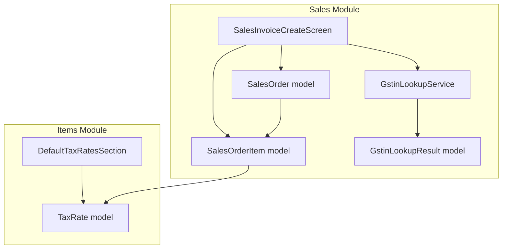
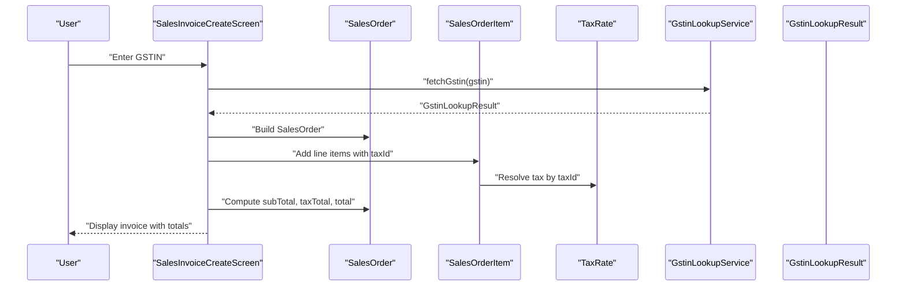
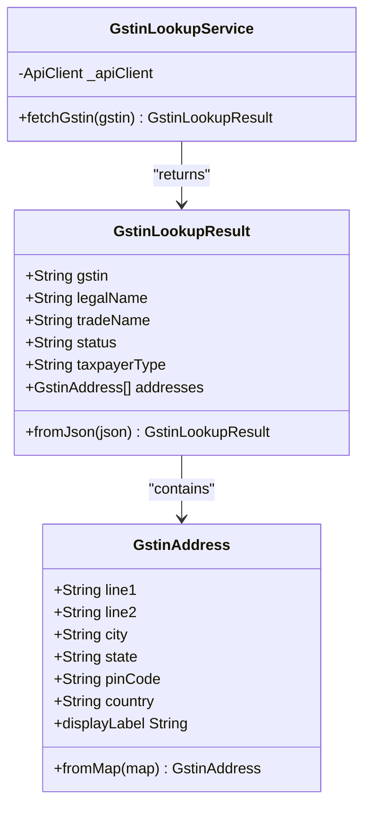
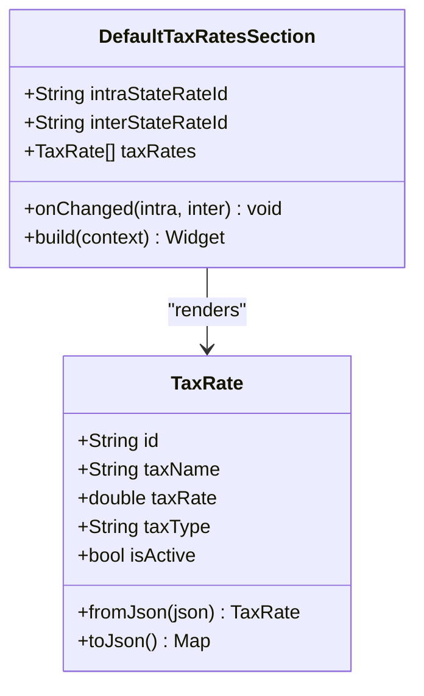
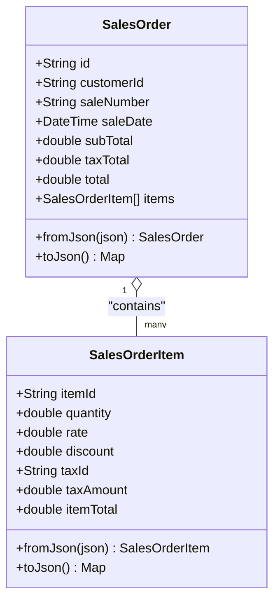
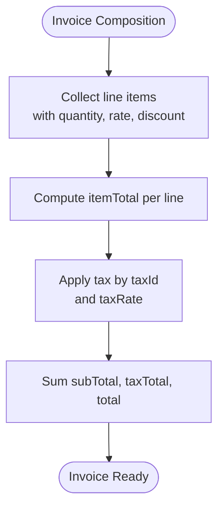
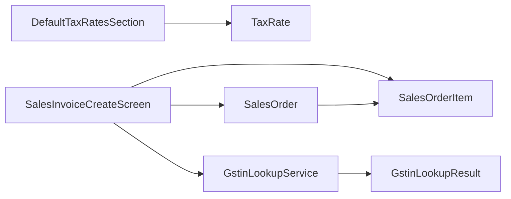

# GST Compliance

<cite>
**Referenced Files in This Document**
- [gstin_lookup_model.dart](file://lib/modules/sales/models/gstin_lookup_model.dart)
- [gstin_lookup_service.dart](file://lib/modules/sales/services/gstin_lookup_service.dart)
- [tax_rate_model.dart](file://lib/modules/items/models/tax_rate_model.dart)
- [default_tax_rates_section.dart](file://lib/modules/items/presentation/sections/default_tax_rates_section.dart)
- [sales_order_model.dart](file://lib/modules/sales/models/sales_order_model.dart)
- [sales_order_item_model.dart](file://lib/modules/sales/models/sales_order_item_model.dart)
- [item_model.dart](file://lib/modules/items/models/item_model.dart)
- [sales_invoice_invoice_create.dart](file://lib/modules/sales/presentation/sales_invoice_invoice_create.dart)
</cite>

## Table of Contents
1. [Introduction](#introduction)
2. [Project Structure](#project-structure)
3. [Core Components](#core-components)
4. [Architecture Overview](#architecture-overview)
5. [Detailed Component Analysis](#detailed-component-analysis)
6. [Dependency Analysis](#dependency-analysis)
7. [Performance Considerations](#performance-considerations)
8. [Troubleshooting Guide](#troubleshooting-guide)
9. [Conclusion](#conclusion)
10. [Appendices](#appendices)

## Introduction
This document describes the GST Compliance capabilities present in the ZerpAI ERP codebase. It focuses on GSTIN validation, tax rate management, GST calculation mechanics integrated into sales documents, and the supporting models and services that enable GST-aware operations. It also outlines how tax classification and defaults are modeled, and how the frontend composes invoices that reflect GST totals.

## Project Structure
The GST-related logic spans the Items and Sales modules:
- Items module defines tax rate models and default tax rate selection UI.
- Sales module defines sales order models, invoice creation UI, and GSTIN lookup models and service.
- The integration point is the invoice creation screen, which builds sales orders containing line items with tax metadata.

**Diagram sources**
- [tax_rate_model.dart](file://lib/modules/items/models/tax_rate_model.dart#L1-L38)
- [default_tax_rates_section.dart](file://lib/modules/items/presentation/sections/default_tax_rates_section.dart#L1-L225)
- [sales_order_model.dart](file://lib/modules/sales/models/sales_order_model.dart#L1-L118)
- [sales_order_item_model.dart](file://lib/modules/sales/models/sales_order_item_model.dart#L1-L62)
- [sales_invoice_invoice_create.dart](file://lib/modules/sales/presentation/sales_invoice_invoice_create.dart#L1-L573)
- [gstin_lookup_model.dart](file://lib/modules/sales/models/gstin_lookup_model.dart#L1-L173)
- [gstin_lookup_service.dart](file://lib/modules/sales/services/gstin_lookup_service.dart#L1-L28)

**Section sources**
- [tax_rate_model.dart](file://lib/modules/items/models/tax_rate_model.dart#L1-L38)
- [default_tax_rates_section.dart](file://lib/modules/items/presentation/sections/default_tax_rates_section.dart#L1-L225)
- [sales_order_model.dart](file://lib/modules/sales/models/sales_order_model.dart#L1-L118)
- [sales_order_item_model.dart](file://lib/modules/sales/models/sales_order_item_model.dart#L1-L62)
- [sales_invoice_invoice_create.dart](file://lib/modules/sales/presentation/sales_invoice_invoice_create.dart#L1-L573)
- [gstin_lookup_model.dart](file://lib/modules/sales/models/gstin_lookup_model.dart#L1-L173)
- [gstin_lookup_service.dart](file://lib/modules/sales/services/gstin_lookup_service.dart#L1-L28)

## Core Components
- GSTIN Lookup Model and Service: Provides structured parsing of GSTIN lookup responses and a service to fetch and parse GSTIN details.
- Tax Rate Model and Default Tax Rates UI: Defines tax rate entities and exposes a UI section to select default intra-state and inter-state tax rates for items.
- Sales Order and Line Item Models: Define the invoice/document structure and line items that carry tax identifiers and computed totals.
- Sales Invoice Creation Screen: Orchestrates invoice composition and computes subtotals and totals; integrates with tax and GSTIN lookup models.

**Section sources**
- [gstin_lookup_model.dart](file://lib/modules/sales/models/gstin_lookup_model.dart#L1-L173)
- [gstin_lookup_service.dart](file://lib/modules/sales/services/gstin_lookup_service.dart#L1-L28)
- [tax_rate_model.dart](file://lib/modules/items/models/tax_rate_model.dart#L1-L38)
- [default_tax_rates_section.dart](file://lib/modules/items/presentation/sections/default_tax_rates_section.dart#L1-L225)
- [sales_order_model.dart](file://lib/modules/sales/models/sales_order_model.dart#L1-L118)
- [sales_order_item_model.dart](file://lib/modules/sales/models/sales_order_item_model.dart#L1-L62)
- [sales_invoice_invoice_create.dart](file://lib/modules/sales/presentation/sales_invoice_invoice_create.dart#L1-L573)

## Architecture Overview
The system supports GST compliance via:
- GSTIN validation: A dedicated lookup service and model normalize GSTIN responses into a consistent structure.
- Tax rate management: TaxRate entities capture tax names, rates, and types; the UI allows selecting default intra-state and inter-state rates per item.
- GST calculation: SalesOrder and SalesOrderItem models support tax amounts and totals; the invoice screen computes subtotals and totals.
- Tax classification: Items carry tax preference and intra/inter state tax identifiers, enabling state-specific tax application.

**Diagram sources**
- [gstin_lookup_service.dart](file://lib/modules/sales/services/gstin_lookup_service.dart#L1-L28)
- [gstin_lookup_model.dart](file://lib/modules/sales/models/gstin_lookup_model.dart#L1-L173)
- [sales_order_model.dart](file://lib/modules/sales/models/sales_order_model.dart#L1-L118)
- [sales_order_item_model.dart](file://lib/modules/sales/models/sales_order_item_model.dart#L1-L62)
- [tax_rate_model.dart](file://lib/modules/items/models/tax_rate_model.dart#L1-L38)
- [sales_invoice_invoice_create.dart](file://lib/modules/sales/presentation/sales_invoice_invoice_create.dart#L1-L573)

## Detailed Component Analysis

### GSTIN Lookup Service and Model
- Purpose: Normalize GSTIN lookup responses into a consistent structure with GSTIN, legal name, trade name, status, taxpayer type, and addresses.
- Parsing: The model supports multiple response key variants for GSTIN, legal/trade names, status, and taxpayer type. Addresses are parsed from primary and additional address arrays.
- Service: The service performs a GET request to a GSTIN lookup endpoint and returns a strongly typed result.

**Diagram sources**
- [gstin_lookup_model.dart](file://lib/modules/sales/models/gstin_lookup_model.dart#L1-L173)
- [gstin_lookup_service.dart](file://lib/modules/sales/services/gstin_lookup_service.dart#L1-L28)

**Section sources**
- [gstin_lookup_model.dart](file://lib/modules/sales/models/gstin_lookup_model.dart#L1-L173)
- [gstin_lookup_service.dart](file://lib/modules/sales/services/gstin_lookup_service.dart#L1-L28)

### Tax Rate Management
- TaxRate Model: Encapsulates tax identity, name, rate, optional tax type (e.g., IGST, CGST, SGST), and activity flag. Includes JSON serialization/deserialization helpers.
- Default Tax Rates UI: Allows selecting default intra-state and inter-state tax rate IDs for items. Displays human-readable tax names and notifies parent on change.

**Diagram sources**
- [tax_rate_model.dart](file://lib/modules/items/models/tax_rate_model.dart#L1-L38)
- [default_tax_rates_section.dart](file://lib/modules/items/presentation/sections/default_tax_rates_section.dart#L1-L225)

**Section sources**
- [tax_rate_model.dart](file://lib/modules/items/models/tax_rate_model.dart#L1-L38)
- [default_tax_rates_section.dart](file://lib/modules/items/presentation/sections/default_tax_rates_section.dart#L1-L225)

### Sales Order and Line Item Models
- SalesOrder: Captures header-level fields, totals, and a list of line items. Supports JSON conversion for persistence/transmission.
- SalesOrderItem: Captures item-level details including quantity, rate, discount, taxId, taxAmount, and itemTotal. Supports JSON conversion.

**Diagram sources**
- [sales_order_model.dart](file://lib/modules/sales/models/sales_order_model.dart#L1-L118)
- [sales_order_item_model.dart](file://lib/modules/sales/models/sales_order_item_model.dart#L1-L62)

**Section sources**
- [sales_order_model.dart](file://lib/modules/sales/models/sales_order_model.dart#L1-L118)
- [sales_order_item_model.dart](file://lib/modules/sales/models/sales_order_item_model.dart#L1-L62)

### GST Calculation and Tax Classification
- Tax Classification on Items: Items include taxPreference and intra/inter state tax identifiers, enabling state-aware tax assignment.
- GST Calculation Mechanics: The invoice screen computes subTotal from line amounts and adjusts total with shipping and adjustments. While the current implementation aggregates totals, the presence of taxId and taxAmount on line items enables state-specific tax computation and segregation (e.g., CGST/SGST vs IGST) downstream.

**Diagram sources**
- [sales_invoice_invoice_create.dart](file://lib/modules/sales/presentation/sales_invoice_invoice_create.dart#L91-L108)
- [sales_order_item_model.dart](file://lib/modules/sales/models/sales_order_item_model.dart#L1-L62)
- [item_model.dart](file://lib/modules/items/models/item_model.dart#L1-L461)

**Section sources**
- [sales_invoice_invoice_create.dart](file://lib/modules/sales/presentation/sales_invoice_invoice_create.dart#L91-L108)
- [sales_order_item_model.dart](file://lib/modules/sales/models/sales_order_item_model.dart#L1-L62)
- [item_model.dart](file://lib/modules/items/models/item_model.dart#L1-L461)

### Practical Examples
- GSTIN Validation: Enter a GSTIN in the invoice screen; the GSTIN lookup service resolves legal/trade name, status, taxpayer type, and addresses.
- Tax Rate Application: Select default intra-state and inter-state tax rates for an item; the invoice screen uses taxId and taxRate to compute tax amounts and totals.
- Compliance Reporting Generation: The SalesOrder model captures subTotal, taxTotal, and total suitable for GST returns and compliance submissions.

Note: The current codebase implements the data models and UI orchestration for GST-enabled invoices. The actual tax computation logic (e.g., splitting CGST/SGST or IGST) is not implemented in the referenced files and would require extending the invoice calculation routine to apply tax rates and produce tax breakdowns.

**Section sources**
- [gstin_lookup_service.dart](file://lib/modules/sales/services/gstin_lookup_service.dart#L1-L28)
- [gstin_lookup_model.dart](file://lib/modules/sales/models/gstin_lookup_model.dart#L1-L173)
- [default_tax_rates_section.dart](file://lib/modules/items/presentation/sections/default_tax_rates_section.dart#L1-L225)
- [sales_order_model.dart](file://lib/modules/sales/models/sales_order_model.dart#L1-L118)
- [sales_order_item_model.dart](file://lib/modules/sales/models/sales_order_item_model.dart#L1-L62)
- [sales_invoice_invoice_create.dart](file://lib/modules/sales/presentation/sales_invoice_invoice_create.dart#L1-L573)

## Dependency Analysis
- Items module depends on the TaxRate model for tax configuration and the DefaultTaxRatesSection for UI selection.
- Sales module depends on SalesOrder and SalesOrderItem models for invoice composition and on the GSTIN lookup service/model for customer GSTIN verification.
- The invoice creation screen ties together Items and Sales concerns to produce a GST-aware invoice.

**Diagram sources**
- [default_tax_rates_section.dart](file://lib/modules/items/presentation/sections/default_tax_rates_section.dart#L1-L225)
- [tax_rate_model.dart](file://lib/modules/items/models/tax_rate_model.dart#L1-L38)
- [sales_invoice_invoice_create.dart](file://lib/modules/sales/presentation/sales_invoice_invoice_create.dart#L1-L573)
- [sales_order_model.dart](file://lib/modules/sales/models/sales_order_model.dart#L1-L118)
- [sales_order_item_model.dart](file://lib/modules/sales/models/sales_order_item_model.dart#L1-L62)
- [gstin_lookup_service.dart](file://lib/modules/sales/services/gstin_lookup_service.dart#L1-L28)
- [gstin_lookup_model.dart](file://lib/modules/sales/models/gstin_lookup_model.dart#L1-L173)

**Section sources**
- [default_tax_rates_section.dart](file://lib/modules/items/presentation/sections/default_tax_rates_section.dart#L1-L225)
- [tax_rate_model.dart](file://lib/modules/items/models/tax_rate_model.dart#L1-L38)
- [sales_invoice_invoice_create.dart](file://lib/modules/sales/presentation/sales_invoice_invoice_create.dart#L1-L573)
- [sales_order_model.dart](file://lib/modules/sales/models/sales_order_model.dart#L1-L118)
- [sales_order_item_model.dart](file://lib/modules/sales/models/sales_order_item_model.dart#L1-L62)
- [gstin_lookup_service.dart](file://lib/modules/sales/services/gstin_lookup_service.dart#L1-L28)
- [gstin_lookup_model.dart](file://lib/modules/sales/models/gstin_lookup_model.dart#L1-L173)

## Performance Considerations
- Prefer lazy loading of tax rates and customer lists to minimize initial payload sizes.
- Cache resolved GSTIN lookup results to reduce repeated network calls.
- Defer tax computations until after user input stabilization to avoid redundant calculations during rapid edits.

## Troubleshooting Guide
- GSTIN Lookup Failures: Verify the endpoint path and query parameters used by the GSTIN lookup service. Ensure the response structure matches the expected keys handled by the lookup model.
- Tax Rate Selection: Confirm that the DefaultTaxRatesSection receives a non-empty list of TaxRate objects and that taxId values align with existing tax configurations.
- Totals Mismatch: Validate that invoice line amounts and discounts are parsed correctly and that tax amounts are applied consistently across items.

**Section sources**
- [gstin_lookup_service.dart](file://lib/modules/sales/services/gstin_lookup_service.dart#L1-L28)
- [gstin_lookup_model.dart](file://lib/modules/sales/models/gstin_lookup_model.dart#L1-L173)
- [default_tax_rates_section.dart](file://lib/modules/items/presentation/sections/default_tax_rates_section.dart#L1-L225)
- [sales_invoice_invoice_create.dart](file://lib/modules/sales/presentation/sales_invoice_invoice_create.dart#L91-L108)

## Conclusion
The ZerpAI ERP codebase provides a solid foundation for GST compliance:
- GSTIN validation is supported via a robust lookup model and service.
- Tax rate management is modeled with TaxRate and a configurable default selection UI.
- Sales order and invoice models capture totals and line-level tax metadata, enabling GST-aware invoicing.
To complete end-to-end GST compliance, implement state-specific tax computation (e.g., CGST/SGST vs IGST) and integrate tax breakdowns into the invoice totals.

## Appendices
- Example Workflows
  - GSTIN Validation: Enter GSTIN → Call lookup service → Parse result into GstinLookupResult → Display legal/trade name and addresses.
  - Default Tax Rates: Choose intra-state and inter-state tax rates → Persist taxIds on items → Use taxId to compute tax amounts during invoice creation.
  - GST Calculation: Compute itemTotal per line → Apply tax by taxId and taxRate → Sum subTotal, taxTotal, and total for the invoice.

[No sources needed since this section provides general guidance]