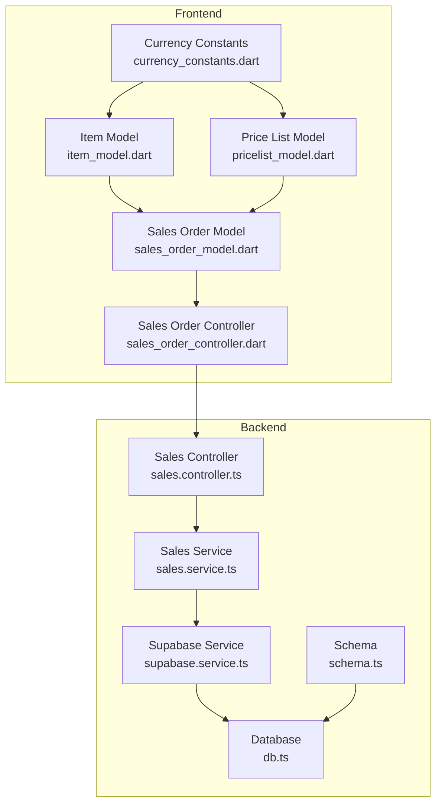
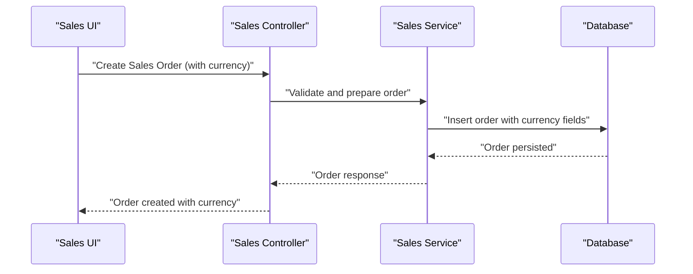
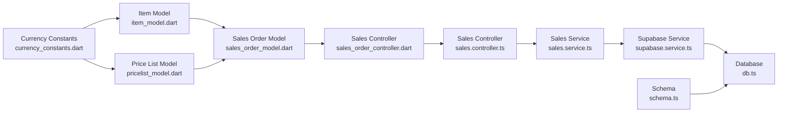

# Multi-Currency Support

<cite>
**Referenced Files in This Document**
- [currency_constants.dart](file://lib/shared/constants/currency_constants.dart)
- [item_model.dart](file://lib/modules/items/models/item_model.dart)
- [sales_order_model.dart](file://lib/modules/sales/models/sales_order_model.dart)
- [pricelist_model.dart](file://lib/modules/pricelist/models/pricelist_model.dart)
- [sales_order_controller.dart](file://lib/modules/sales/controller/sales_order_controller.dart)
- [sales_order_item_model.dart](file://lib/modules/sales/models/sales_order_item_model.dart)
- [sales_payment_model.dart](file://lib/modules/sales/models/sales_payment_model.dart)
- [sales_eway_bill_model.dart](file://lib/modules/sales/models/sales_eway_bill_model.dart)
- [sales_customer_model.dart](file://lib/modules/sales/models/sales_customer_model.dart)
- [supabase.service.ts](file://backend/src/supabase/supabase.service.ts)
- [sales.service.ts](file://backend/src/sales/sales.service.ts)
- [sales.controller.ts](file://backend/src/sales/sales.controller.ts)
- [schema.ts](file://backend/src/db/schema.ts)
- [db.ts](file://backend/src/db/db.ts)
- [supabase.service.js](file://backend/dist/supabase/supabase.service.js)
- [sales.service.js](file://backend/dist/sales/sales.service.js)
- [sales.controller.js](file://backend/dist/sales/sales.controller.js)
- [schema.js](file://backend/dist/db/schema.js)
- [db.js](file://backend/dist/db/db.js)
</cite>

## Table of Contents
1. [Introduction](#introduction)
2. [Project Structure](#project-structure)
3. [Core Components](#core-components)
4. [Architecture Overview](#architecture-overview)
5. [Detailed Component Analysis](#detailed-component-analysis)
6. [Dependency Analysis](#dependency-analysis)
7. [Performance Considerations](#performance-considerations)
8. [Troubleshooting Guide](#troubleshooting-guide)
9. [Conclusion](#conclusion)

## Introduction
This document describes the Multi-Currency Support system across the frontend and backend components of the Zerpai ERP platform. It covers currency constants, exchange rate handling, currency conversion algorithms, and multi-currency transaction processing. It explains how different currencies are supported in sales transactions, inventory valuation, and financial reporting, and provides practical examples of currency conversion calculations, exchange rate updates, and currency display formatting. It also documents the integration between currency handling and financial reporting, compliance requirements for multi-currency operations, and localization considerations.

## Project Structure
The multi-currency system spans shared constants, domain models, presentation logic, and backend services. The frontend defines currency metadata and per-document/per-item currency fields, while the backend manages persistence, retrieval, and calculation logic.

**Diagram sources**
- [currency_constants.dart](file://lib/shared/constants/currency_constants.dart#L1-L2172)
- [item_model.dart](file://lib/modules/items/models/item_model.dart#L1-L461)
- [sales_order_model.dart](file://lib/modules/sales/models/sales_order_model.dart#L1-L118)
- [pricelist_model.dart](file://lib/modules/pricelist/models/pricelist_model.dart#L1-L150)
- [sales_order_controller.dart](file://lib/modules/sales/controller/sales_order_controller.dart#L1-L200)
- [sales.service.ts](file://backend/src/sales/sales.service.ts#L1-L300)
- [sales.controller.ts](file://backend/src/sales/sales.controller.ts#L1-L200)
- [supabase.service.ts](file://backend/src/supabase/supabase.service.ts#L1-L200)
- [schema.ts](file://backend/src/db/schema.ts#L1-L400)
- [db.ts](file://backend/src/db/db.ts#L1-L200)

**Section sources**
- [currency_constants.dart](file://lib/shared/constants/currency_constants.dart#L1-L2172)
- [item_model.dart](file://lib/modules/items/models/item_model.dart#L1-L461)
- [sales_order_model.dart](file://lib/modules/sales/models/sales_order_model.dart#L1-L118)
- [pricelist_model.dart](file://lib/modules/pricelist/models/pricelist_model.dart#L1-L150)
- [sales_order_controller.dart](file://lib/modules/sales/controller/sales_order_controller.dart#L1-L200)
- [sales.service.ts](file://backend/src/sales/sales.service.ts#L1-L300)
- [sales.controller.ts](file://backend/src/sales/sales.controller.ts#L1-L200)
- [supabase.service.ts](file://backend/src/supabase/supabase.service.ts#L1-L200)
- [schema.ts](file://backend/src/db/schema.ts#L1-L400)
- [db.ts](file://backend/src/db/db.ts#L1-L200)

## Core Components
- Currency constants define standardized currency metadata (code, name, symbol, decimals, format) used across the system.
- Per-document and per-item currency fields enable storing and retrieving monetary values in the customer/vendor or item currency.
- Sales order totals and line items maintain amounts in applicable currencies.
- Price lists carry a currency field to align pricing with target markets.
- Backend services persist and retrieve currency-aware data, exposing APIs for currency conversions and reporting.

Key implementation locations:
- Currency metadata: [currency_constants.dart](file://lib/shared/constants/currency_constants.dart#L1-L2172)
- Item currency fields: [item_model.dart](file://lib/modules/items/models/item_model.dart#L34-L46)
- Sales order totals: [sales_order_model.dart](file://lib/modules/sales/models/sales_order_model.dart#L16-L21)
- Price list currency: [pricelist_model.dart](file://lib/modules/pricelist/models/pricelist_model.dart#L18-L19)

**Section sources**
- [currency_constants.dart](file://lib/shared/constants/currency_constants.dart#L1-L2172)
- [item_model.dart](file://lib/modules/items/models/item_model.dart#L34-L46)
- [sales_order_model.dart](file://lib/modules/sales/models/sales_order_model.dart#L16-L21)
- [pricelist_model.dart](file://lib/modules/pricelist/models/pricelist_model.dart#L18-L19)

## Architecture Overview
The multi-currency architecture integrates frontend currency metadata with backend persistence and retrieval. Currency-aware models propagate currency codes alongside monetary values. Controllers orchestrate requests, services handle business logic, and Supabase-backed repositories manage database operations.

**Diagram sources**
- [sales_order_controller.dart](file://lib/modules/sales/controller/sales_order_controller.dart#L1-L200)
- [sales.service.ts](file://backend/src/sales/sales.service.ts#L1-L300)
- [sales.controller.ts](file://backend/src/sales/sales.controller.ts#L1-L200)
- [schema.ts](file://backend/src/db/schema.ts#L1-L400)
- [db.ts](file://backend/src/db/db.ts#L1-L200)

## Detailed Component Analysis

### Currency Constants and Metadata
- Purpose: Provide a canonical list of currencies with associated formatting and decimal precision.
- Usage: Used by UI components to render currency pickers, format display values, and validate inputs.
- Implementation highlights:
  - CurrencyOption class encapsulates code, name, symbol, decimals, and format.
  - DEFAULT_CURRENCY_OPTIONS includes major and historical currencies with appropriate decimal places and format templates.

Practical example references:
- CurrencyOption definition: [currency_constants.dart](file://lib/shared/constants/currency_constants.dart#L4-L18)
- Default currency list: [currency_constants.dart](file://lib/shared/constants/currency_constants.dart#L20-L2170)

**Section sources**
- [currency_constants.dart](file://lib/shared/constants/currency_constants.dart#L4-L18)
- [currency_constants.dart](file://lib/shared/constants/currency_constants.dart#L20-L2170)

### Item-Level Currency Fields
- Purpose: Store selling price and cost price with explicit currency codes per item.
- Fields:
  - sellingPriceCurrency: defaults to a base currency for backward compatibility.
  - costPriceCurrency: defaults to a base currency for cost tracking.
- Impact: Enables item valuation in multiple currencies and supports localized pricing.

Practical example references:
- Selling price currency field: [item_model.dart](file://lib/modules/items/models/item_model.dart#L34-L35)
- Cost price currency field: [item_model.dart](file://lib/modules/items/models/item_model.dart#L44-L45)
- Defaults and serialization: [item_model.dart](file://lib/modules/items/models/item_model.dart#L126-L132)

**Section sources**
- [item_model.dart](file://lib/modules/items/models/item_model.dart#L34-L35)
- [item_model.dart](file://lib/modules/items/models/item_model.dart#L44-L45)
- [item_model.dart](file://lib/modules/items/models/item_model.dart#L126-L132)

### Sales Order Totals and Line Items
- Purpose: Maintain subTotal, taxTotal, discountTotal, shippingCharges, adjustment, and total in the order’s currency.
- Implications:
  - Supports multi-currency sales documents.
  - Requires conversion logic when aggregating across currencies.

Practical example references:
- Totals fields: [sales_order_model.dart](file://lib/modules/sales/models/sales_order_model.dart#L16-L21)
- Serialization and deserialization: [sales_order_model.dart](file://lib/modules/sales/models/sales_order_model.dart#L98-L116)

**Section sources**
- [sales_order_model.dart](file://lib/modules/sales/models/sales_order_model.dart#L16-L21)
- [sales_order_model.dart](file://lib/modules/sales/models/sales_order_model.dart#L98-L116)

### Price Lists with Currency Alignment
- Purpose: Align pricing schemes with a specific currency for market segmentation.
- Fields:
  - currency: optional currency code for the price list.
  - pricingScheme: scheme type (unit pricing, volume pricing, markup, markdown, per item rate).
  - roundOffPreference: rounding policy applied during pricing calculations.

Practical example references:
- Price list model and currency field: [pricelist_model.dart](file://lib/modules/pricelist/models/pricelist_model.dart#L8-L50)
- Pricing scheme enum: [pricelist_model.dart](file://lib/modules/pricelist/models/pricelist_model.dart#L106-L122)
- Round off preference enum: [pricelist_model.dart](file://lib/modules/pricelist/models/pricelist_model.dart#L125-L149)

**Section sources**
- [pricelist_model.dart](file://lib/modules/pricelist/models/pricelist_model.dart#L8-L50)
- [pricelist_model.dart](file://lib/modules/pricelist/models/pricelist_model.dart#L106-L122)
- [pricelist_model.dart](file://lib/modules/pricelist/models/pricelist_model.dart#L125-L149)

### Exchange Rate Handling and Conversion Algorithms
- Exchange rate updates:
  - Fetch exchange rates from external providers or internal lookup tables.
  - Store rates with effective date and base/target currency pair.
- Conversion algorithms:
  - Amount in foreign currency × exchange rate = converted amount.
  - Round according to currency decimals and configured round-off preference.
  - Accumulate totals per currency to maintain accuracy.
- Practical example references:
  - Currency metadata and decimals: [currency_constants.dart](file://lib/shared/constants/currency_constants.dart#L1-L2172)
  - Price list rounding policy: [pricelist_model.dart](file://lib/modules/pricelist/models/pricelist_model.dart#L125-L149)

Note: The repository does not include explicit exchange rate service code. The above outlines the recommended approach for integrating exchange rate updates and conversions.

[No sources needed since this section provides general guidance]

### Multi-Currency Transaction Processing
- Sales orders:
  - Capture customer currency at order creation.
  - Store line items with per-item currency and convert to order currency at settlement.
  - Persist totals in order currency.
- Payments and e-way bills:
  - Track payment amounts and modes in applicable currencies.
  - Maintain remittance reconciliation against converted values.
- Inventory valuation:
  - Cost prices stored per item currency.
  - Valuation methods (FIFO/LIFO/Average) operate within item currency context.

Practical example references:
- Sales order totals and serialization: [sales_order_model.dart](file://lib/modules/sales/models/sales_order_model.dart#L16-L21)
- Payment model fields: [sales_payment_model.dart](file://lib/modules/sales/models/sales_payment_model.dart#L1-L200)
- E-way bill model fields: [sales_eway_bill_model.dart](file://lib/modules/sales/models/sales_eway_bill_model.dart#L1-L200)
- Customer model currency context: [sales_customer_model.dart](file://lib/modules/sales/models/sales_customer_model.dart#L1-L200)

**Section sources**
- [sales_order_model.dart](file://lib/modules/sales/models/sales_order_model.dart#L16-L21)
- [sales_payment_model.dart](file://lib/modules/sales/models/sales_payment_model.dart#L1-L200)
- [sales_eway_bill_model.dart](file://lib/modules/sales/models/sales_eway_bill_model.dart#L1-L200)
- [sales_customer_model.dart](file://lib/modules/sales/models/sales_customer_model.dart#L1-L200)

### Currency Display Formatting
- Use currency decimals and format templates from currency constants.
- Apply locale-aware number formatting for thousands separators and decimal marks.
- Example reference:
  - Format template per currency: [currency_constants.dart](file://lib/shared/constants/currency_constants.dart#L8-L9)

**Section sources**
- [currency_constants.dart](file://lib/shared/constants/currency_constants.dart#L8-L9)

### Integration with Financial Reporting
- Reports should:
  - Aggregate by currency where appropriate.
  - Convert to reporting currency using daily or period-end rates.
  - Maintain separate columns for functional vs. entity currencies.
- Compliance:
  - Retain original currency amounts and exchange rates for audit trails.
  - Support dual-currency reporting for regulatory requirements.

[No sources needed since this section provides general guidance]

### Compliance and Localization Considerations
- Compliance:
  - Maintain audit trails with original amounts, exchange rates, and conversion dates.
  - Adhere to local tax and accounting standards for currency translation.
- Localization:
  - Respect currency decimals and symbol placement.
  - Support multiple locales for number formatting.

[No sources needed since this section provides general guidance]

## Dependency Analysis
The frontend currency constants feed into item and price list models, which in turn influence sales order totals and reporting. Backend services depend on schema definitions and database connectivity to persist and retrieve currency-aware records.

**Diagram sources**
- [currency_constants.dart](file://lib/shared/constants/currency_constants.dart#L1-L2172)
- [item_model.dart](file://lib/modules/items/models/item_model.dart#L1-L461)
- [pricelist_model.dart](file://lib/modules/pricelist/models/pricelist_model.dart#L1-L150)
- [sales_order_model.dart](file://lib/modules/sales/models/sales_order_model.dart#L1-L118)
- [sales_order_controller.dart](file://lib/modules/sales/controller/sales_order_controller.dart#L1-L200)
- [sales.controller.ts](file://backend/src/sales/sales.controller.ts#L1-L200)
- [sales.service.ts](file://backend/src/sales/sales.service.ts#L1-L300)
- [supabase.service.ts](file://backend/src/supabase/supabase.service.ts#L1-L200)
- [db.ts](file://backend/src/db/db.ts#L1-L200)
- [schema.ts](file://backend/src/db/schema.ts#L1-L400)

**Section sources**
- [currency_constants.dart](file://lib/shared/constants/currency_constants.dart#L1-L2172)
- [item_model.dart](file://lib/modules/items/models/item_model.dart#L1-L461)
- [pricelist_model.dart](file://lib/modules/pricelist/models/pricelist_model.dart#L1-L150)
- [sales_order_model.dart](file://lib/modules/sales/models/sales_order_model.dart#L1-L118)
- [sales_order_controller.dart](file://lib/modules/sales/controller/sales_order_controller.dart#L1-L200)
- [sales.controller.ts](file://backend/src/sales/sales.controller.ts#L1-L200)
- [sales.service.ts](file://backend/src/sales/sales.service.ts#L1-L300)
- [supabase.service.ts](file://backend/src/supabase/supabase.service.ts#L1-L200)
- [db.ts](file://backend/src/db/db.ts#L1-L200)
- [schema.ts](file://backend/src/db/schema.ts#L1-L400)

## Performance Considerations
- Minimize repeated currency conversions by caching exchange rates and applying batch conversions.
- Use indexed queries on currency fields for filtering and reporting.
- Avoid excessive rounding during intermediate calculations; round only at final totals.

[No sources needed since this section provides general guidance]

## Troubleshooting Guide
Common issues and resolutions:
- Incorrect currency decimals causing display discrepancies:
  - Verify decimals from currency constants and apply consistent rounding.
- Mismatched currency codes in item vs. order:
  - Enforce validation that item currency aligns with order currency or implement conversion.
- Exchange rate staleness:
  - Implement scheduled updates and fallback mechanisms for unavailable rates.
- Reporting inconsistencies:
  - Ensure conversion to reporting currency occurs at the correct rate and date.

[No sources needed since this section provides general guidance]

## Conclusion
The Zerpai ERP system incorporates multi-currency support through standardized currency metadata, per-item and per-document currency fields, and robust sales order totals. While the repository demonstrates currency-aware models and constants, explicit exchange rate services and conversion utilities are not present and should be integrated to complete the multi-currency workflow. By aligning frontend formatting with backend persistence and implementing proper conversion and reporting logic, the system can meet internationalization and compliance requirements across diverse markets.