# Assembly and Disassembly Operations

<cite>
**Referenced Files in This Document**
- [inventory_assemblies_assembly_create.dart](file://lib/modules/inventory/assemblies/presentation/inventory_assemblies_assembly_create.dart)
- [inventory_assemblies_assembly_list.dart](file://lib/modules/inventory/assemblies/presentation/inventory_assemblies_assembly_list.dart)
- [add_batches_dialog.dart](file://lib/modules/inventory/assemblies/presentation/widgets/add_batches_dialog.dart)
- [composite_items_provider.dart](file://lib/modules/composite/providers/composite_items_provider.dart)
- [item_composition_model.dart](file://lib/modules/items/models/item_composition_model.dart)
- [items_controller.dart](file://lib/modules/items/controller/items_controller.dart)
- [items_controller.dart](file://lib/modules/items/controller/items_state.dart)
</cite>

## Table of Contents
1. [Introduction](#introduction)
2. [Project Structure](#project-structure)
3. [Core Components](#core-components)
4. [Architecture Overview](#architecture-overview)
5. [Detailed Component Analysis](#detailed-component-analysis)
6. [Dependency Analysis](#dependency-analysis)
7. [Performance Considerations](#performance-considerations)
8. [Troubleshooting Guide](#troubleshooting-guide)
9. [Conclusion](#conclusion)
10. [Appendices](#appendices)

## Introduction
This document explains the Assembly and Disassembly Operations in the Zerpai ERP system. It covers the end-to-end manufacturing workflow including Bill of Materials (BOM) creation, component tracking, finished goods assembly, configurable product composition, component substitution rules, quality control checkpoints, and disassembly operations for returns, repairs, and inventory adjustments. It also documents the composition model for manufactured items, component costing, profit margin calculations, and integration with inventory management for accurate component consumption and finished goods production tracking.

## Project Structure
Assembly and disassembly capabilities are primarily implemented in the inventory module’s assemblies presentation layer. Supporting composition logic is integrated via composite items and item composition models. The UI screens include:
- Assembly list screen for navigation and listing
- Assembly create screen for new assembly orders
- Add batches dialog for batch-level tracking during assembly

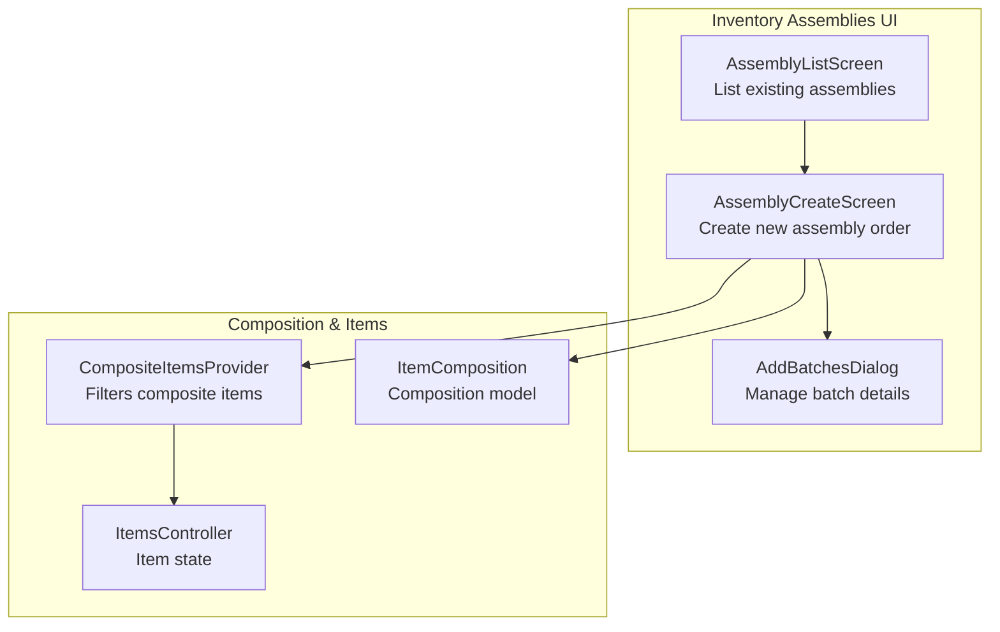

**Diagram sources**
- [inventory_assemblies_assembly_list.dart](file://lib/modules/inventory/assemblies/presentation/inventory_assemblies_assembly_list.dart#L1-L37)
- [inventory_assemblies_assembly_create.dart](file://lib/modules/inventory/assemblies/presentation/inventory_assemblies_assembly_create.dart#L1-L590)
- [add_batches_dialog.dart](file://lib/modules/inventory/assemblies/presentation/widgets/add_batches_dialog.dart#L1-L488)
- [composite_items_provider.dart](file://lib/modules/composite/providers/composite_items_provider.dart#L1-L26)
- [item_composition_model.dart](file://lib/modules/items/models/item_composition_model.dart#L1-L51)
- [items_controller.dart](file://lib/modules/items/controller/items_controller.dart)
- [items_controller.dart](file://lib/modules/items/controller/items_state.dart)

**Section sources**
- [inventory_assemblies_assembly_list.dart](file://lib/modules/inventory/assemblies/presentation/inventory_assemblies_assembly_list.dart#L1-L37)
- [inventory_assemblies_assembly_create.dart](file://lib/modules/inventory/assemblies/presentation/inventory_assemblies_assembly_create.dart#L1-L590)
- [add_batches_dialog.dart](file://lib/modules/inventory/assemblies/presentation/widgets/add_batches_dialog.dart#L1-L488)
- [composite_items_provider.dart](file://lib/modules/composite/providers/composite_items_provider.dart#L1-L26)
- [item_composition_model.dart](file://lib/modules/items/models/item_composition_model.dart#L1-L51)

## Core Components
- AssemblyListScreen: Provides navigation to create new assembly orders and lists existing assemblies.
- AssemblyCreateScreen: Captures assembly metadata (composite item, assembly number, description, assembled date, quantity), displays associated items (BOM), and supports batch management.
- AddBatchesDialog: Manages batch references, manufacturer batch numbers, manufactured/expiry dates, and quantities for assembly inputs.
- CompositeItemsProvider: Filters items that are composite (either tracked via associated ingredients or have compositions).
- ItemComposition: Defines composition attributes for items (content, strength, unit, schedule identifiers).

Key UI behaviors:
- Composite item selection triggers display of associated items table.
- Quantity controls scale total quantities required per component.
- Batch management allows adding new or existing batches and toggling overwrite behavior.
- Footer actions include Save as Draft, Assemble (with split menu), and Cancel.

**Section sources**
- [inventory_assemblies_assembly_list.dart](file://lib/modules/inventory/assemblies/presentation/inventory_assemblies_assembly_list.dart#L1-L37)
- [inventory_assemblies_assembly_create.dart](file://lib/modules/inventory/assemblies/presentation/inventory_assemblies_assembly_create.dart#L1-L590)
- [add_batches_dialog.dart](file://lib/modules/inventory/assemblies/presentation/widgets/add_batches_dialog.dart#L1-L488)
- [composite_items_provider.dart](file://lib/modules/composite/providers/composite_items_provider.dart#L1-L26)
- [item_composition_model.dart](file://lib/modules/items/models/item_composition_model.dart#L1-L51)

## Architecture Overview
The assembly workflow integrates UI screens with composition providers and models. The create screen orchestrates:
- Selection of a composite item
- Population of BOM-associated items
- Batch-level input for component tracking
- Footer actions to finalize assembly

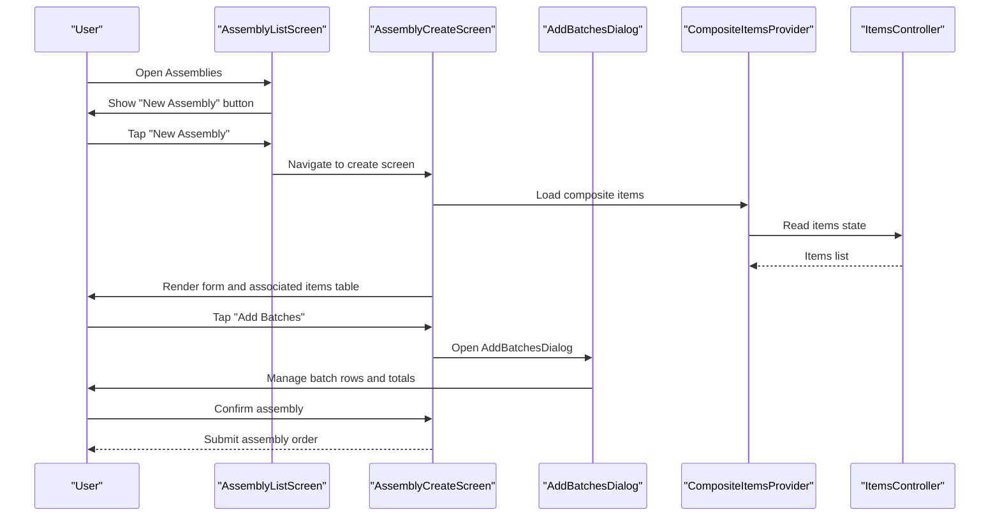

**Diagram sources**
- [inventory_assemblies_assembly_list.dart](file://lib/modules/inventory/assemblies/presentation/inventory_assemblies_assembly_list.dart#L1-L37)
- [inventory_assemblies_assembly_create.dart](file://lib/modules/inventory/assemblies/presentation/inventory_assemblies_assembly_create.dart#L1-L590)
- [add_batches_dialog.dart](file://lib/modules/inventory/assemblies/presentation/widgets/add_batches_dialog.dart#L1-L488)
- [composite_items_provider.dart](file://lib/modules/composite/providers/composite_items_provider.dart#L1-L26)
- [items_controller.dart](file://lib/modules/items/controller/items_controller.dart)
- [items_controller.dart](file://lib/modules/items/controller/items_state.dart)

## Detailed Component Analysis

### AssemblyCreateScreen
Responsibilities:
- Capture assembly metadata (composite item, assembly number, description, assembled date, quantity).
- Display associated items table derived from the selected composite item.
- Support batch management via AddBatchesDialog.
- Provide footer actions for saving drafts, assembling, and canceling.

Processing logic highlights:
- Composite item selection enables rendering of associated items section.
- Quantity change updates total quantities required per component.
- Batch management computes total quantity to be added across rows.
- Overwrite toggle controls whether to replace line item quantities with the total quantity.

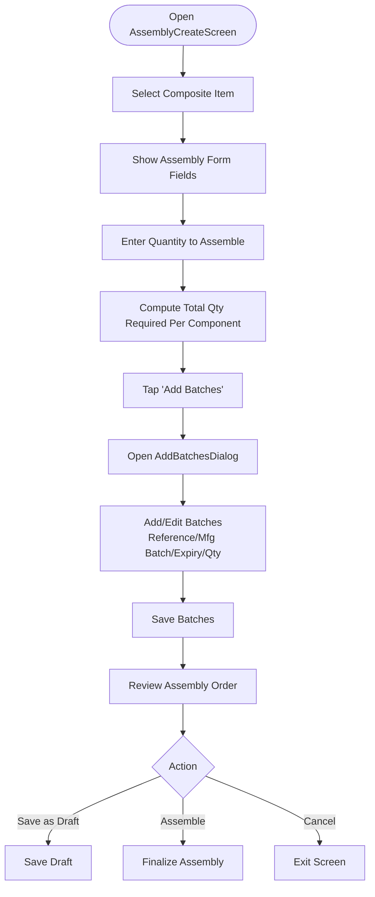

**Diagram sources**
- [inventory_assemblies_assembly_create.dart](file://lib/modules/inventory/assemblies/presentation/inventory_assemblies_assembly_create.dart#L1-L590)
- [add_batches_dialog.dart](file://lib/modules/inventory/assemblies/presentation/widgets/add_batches_dialog.dart#L1-L488)

**Section sources**
- [inventory_assemblies_assembly_create.dart](file://lib/modules/inventory/assemblies/presentation/inventory_assemblies_assembly_create.dart#L1-L590)
- [add_batches_dialog.dart](file://lib/modules/inventory/assemblies/presentation/widgets/add_batches_dialog.dart#L1-L488)

### AddBatchesDialog
Responsibilities:
- Manage batch rows with fields for batch reference, manufacturer batch number, manufactured date, expiry date, and quantity.
- Allow adding new or selecting existing batches.
- Toggle overwrite behavior to replace line item quantities with the total quantity.
- Compute and display total quantity added across rows.

UI behaviors:
- Dynamic batch rows with add/remove actions.
- Real-time total calculation across batch entries.
- Footer with Save and Cancel actions.

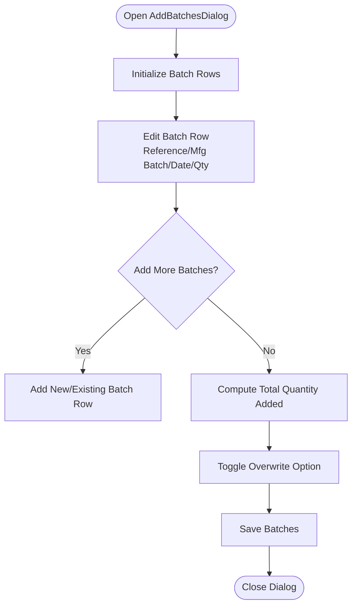

**Diagram sources**
- [add_batches_dialog.dart](file://lib/modules/inventory/assemblies/presentation/widgets/add_batches_dialog.dart#L1-L488)

**Section sources**
- [add_batches_dialog.dart](file://lib/modules/inventory/assemblies/presentation/widgets/add_batches_dialog.dart#L1-L488)

### CompositeItemsProvider and Composition Model
Composite items are identified by either tracking associated ingredients or having a non-empty compositions list. The composition model encapsulates composition attributes for items.

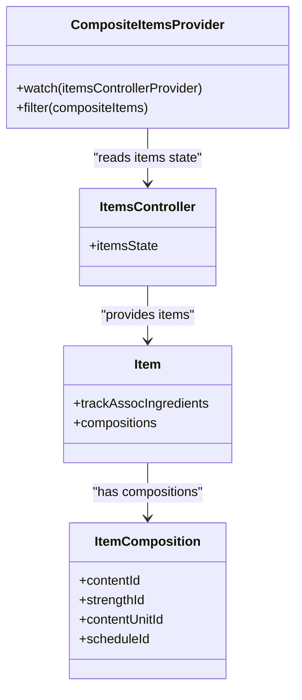

**Diagram sources**
- [composite_items_provider.dart](file://lib/modules/composite/providers/composite_items_provider.dart#L1-L26)
- [items_controller.dart](file://lib/modules/items/controller/items_controller.dart)
- [items_controller.dart](file://lib/modules/items/controller/items_state.dart)
- [item_composition_model.dart](file://lib/modules/items/models/item_composition_model.dart#L1-L51)

**Section sources**
- [composite_items_provider.dart](file://lib/modules/composite/providers/composite_items_provider.dart#L1-L26)
- [item_composition_model.dart](file://lib/modules/items/models/item_composition_model.dart#L1-L51)

### Assembly Workflow: Manufacturing and BOM
End-to-end assembly workflow:
- Create assembly order with composite item selection and metadata.
- Populate BOM components in the associated items table.
- Optionally add batch details for each component.
- Finalize assembly to record finished goods and consume components.

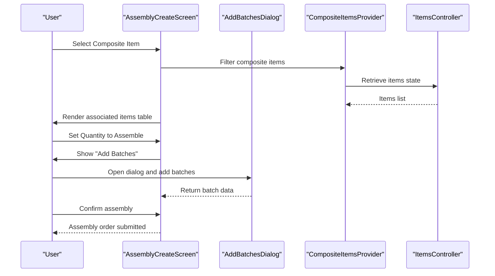

**Diagram sources**
- [inventory_assemblies_assembly_create.dart](file://lib/modules/inventory/assemblies/presentation/inventory_assemblies_assembly_create.dart#L1-L590)
- [add_batches_dialog.dart](file://lib/modules/inventory/assemblies/presentation/widgets/add_batches_dialog.dart#L1-L488)
- [composite_items_provider.dart](file://lib/modules/composite/providers/composite_items_provider.dart#L1-L26)
- [items_controller.dart](file://lib/modules/items/controller/items_controller.dart)
- [items_controller.dart](file://lib/modules/items/controller/items_state.dart)

### Disassembly Operations: Returns, Repairs, Inventory Adjustments
Conceptual flow for disassembly:
- Create disassembly order referencing the finished good.
- Select components to remove and optionally assign replacement components.
- Record batch-level details for returned or scrapped components.
- Update inventory: reduce finished goods, increase component availability, adjust batch records.

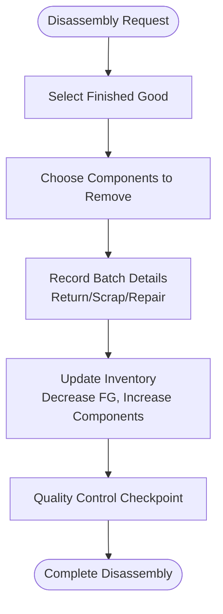

[No sources needed since this diagram shows conceptual workflow, not actual code structure]

### Configurable Products and Component Substitution Rules
Conceptual model for configurable products:
- Composite item defines allowable substitutions per component.
- Substitution rules specify compatible alternatives (e.g., strength, unit, schedule).
- During assembly/disassembly, enforce rules and log deviations.

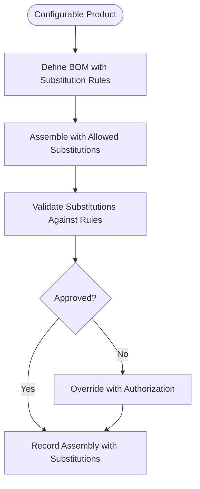

[No sources needed since this diagram shows conceptual workflow, not actual code structure]

### Quality Control Checkpoints
Conceptual QC checkpoints:
- Pre-assembly: Verify BOM completeness and component availability.
- Post-assembly: Inspect finished goods and batch details.
- Disassembly: Validate returned components and replacements.

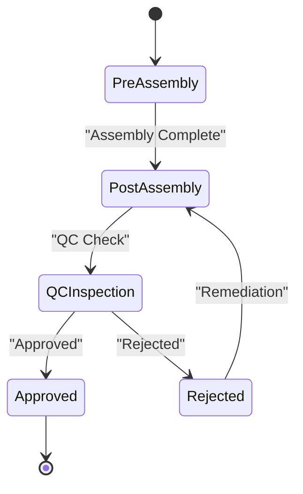

[No sources needed since this diagram shows conceptual workflow, not actual code structure]

### Composition Model, Costing, and Profit Margin
Composition model:
- ItemComposition captures content, strength, unit, and schedule identifiers.
- These attributes support recipe adherence and batch-level traceability.

Costing and margins:
- Component costs are aggregated per assembly order.
- Profit margin calculations can be applied at order level or per batch depending on pricing strategy.
- Service items can be added to associate additional costs (rent, labor, scrap).

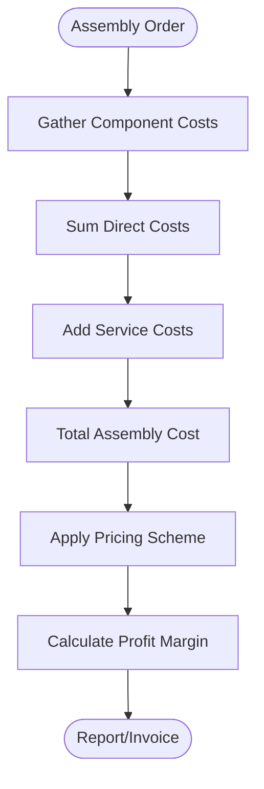

[No sources needed since this diagram shows conceptual workflow, not actual code structure]

### Practical Examples
- Assembly order example: Select composite item “Widget X”, set quantity to 100, add batch details for each component, save as draft, then assemble.
- Component reservation example: Use associated items table to reserve required quantities against available stock; adjust totals when quantity changes.
- Finished goods receipt: After assembly, record finished goods into the selected warehouse and update inventory balances.

[No sources needed since this section provides general guidance]

## Dependency Analysis
The assembly UI depends on:
- CompositeItemsProvider to filter composite items.
- ItemsController for items state.
- AddBatchesDialog for batch-level input management.

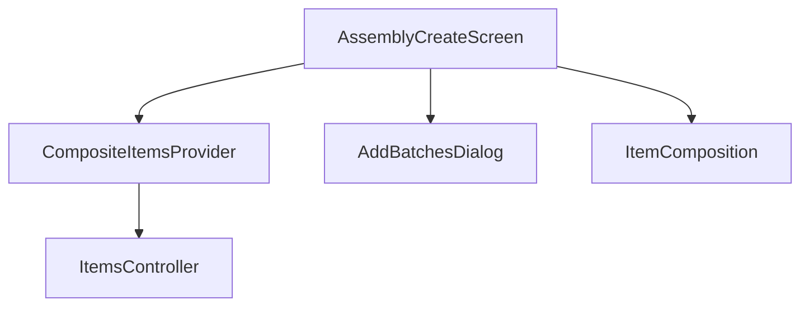

**Diagram sources**
- [inventory_assemblies_assembly_create.dart](file://lib/modules/inventory/assemblies/presentation/inventory_assemblies_assembly_create.dart#L1-L590)
- [composite_items_provider.dart](file://lib/modules/composite/providers/composite_items_provider.dart#L1-L26)
- [items_controller.dart](file://lib/modules/items/controller/items_controller.dart)
- [items_controller.dart](file://lib/modules/items/controller/items_state.dart)
- [add_batches_dialog.dart](file://lib/modules/inventory/assemblies/presentation/widgets/add_batches_dialog.dart#L1-L488)
- [item_composition_model.dart](file://lib/modules/items/models/item_composition_model.dart#L1-L51)

**Section sources**
- [inventory_assemblies_assembly_create.dart](file://lib/modules/inventory/assemblies/presentation/inventory_assemblies_assembly_create.dart#L1-L590)
- [composite_items_provider.dart](file://lib/modules/composite/providers/composite_items_provider.dart#L1-L26)
- [items_controller.dart](file://lib/modules/items/controller/items_controller.dart)
- [items_controller.dart](file://lib/modules/items/controller/items_state.dart)
- [add_batches_dialog.dart](file://lib/modules/inventory/assemblies/presentation/widgets/add_batches_dialog.dart#L1-L488)
- [item_composition_model.dart](file://lib/modules/items/models/item_composition_model.dart#L1-L51)

## Performance Considerations
- Batch row management: Limit the number of simultaneous batch edits; debounce total calculations.
- Composite item filtering: Cache filtered composite items to avoid repeated filtering on large item lists.
- UI responsiveness: Use asynchronous loading states for item lists and batch computations.

[No sources needed since this section provides general guidance]

## Troubleshooting Guide
Common issues and resolutions:
- Composite item not appearing: Verify the item’s trackAssocIngredients flag or compositions list.
- Associated items table empty: Ensure a composite item is selected before enabling the section.
- Batch quantity mismatch: Confirm total quantity computed across batch rows matches the assembly quantity.
- Overwrite behavior confusion: Understand that overwrite replaces line item quantities with the total quantity.

**Section sources**
- [composite_items_provider.dart](file://lib/modules/composite/providers/composite_items_provider.dart#L1-L26)
- [inventory_assemblies_assembly_create.dart](file://lib/modules/inventory/assemblies/presentation/inventory_assemblies_assembly_create.dart#L1-L590)
- [add_batches_dialog.dart](file://lib/modules/inventory/assemblies/presentation/widgets/add_batches_dialog.dart#L1-L488)

## Conclusion
The Assembly and Disassembly Operations in Zerpai ERP are centered around a robust UI for creating assembly orders, managing batch-level component tracking, and integrating with composite item composition models. The current implementation focuses on assembly creation and batch management, with clear pathways to extend support for disassembly, configurable products, substitution rules, and quality control checkpoints. Integrating these features with inventory management ensures accurate component consumption and finished goods production tracking.

## Appendices
- Related models and providers: CompositeItemsProvider, ItemComposition, ItemsController, and ItemsState.
- UI screens: AssemblyListScreen, AssemblyCreateScreen, and AddBatchesDialog.

[No sources needed since this section summarizes without analyzing specific files]