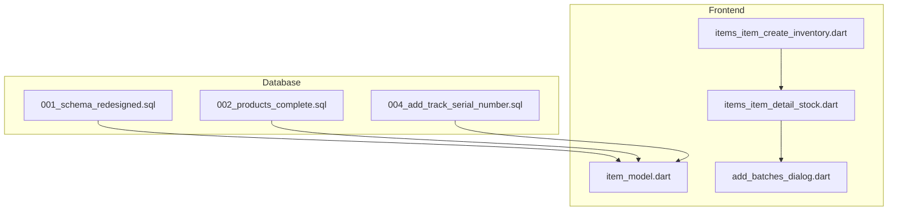
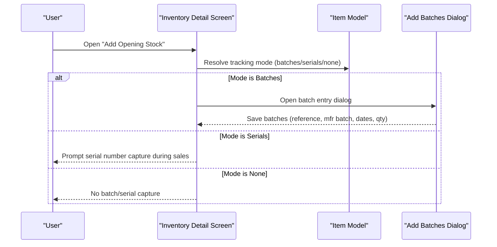
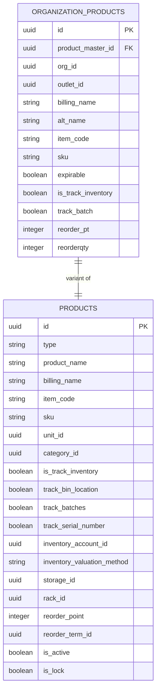
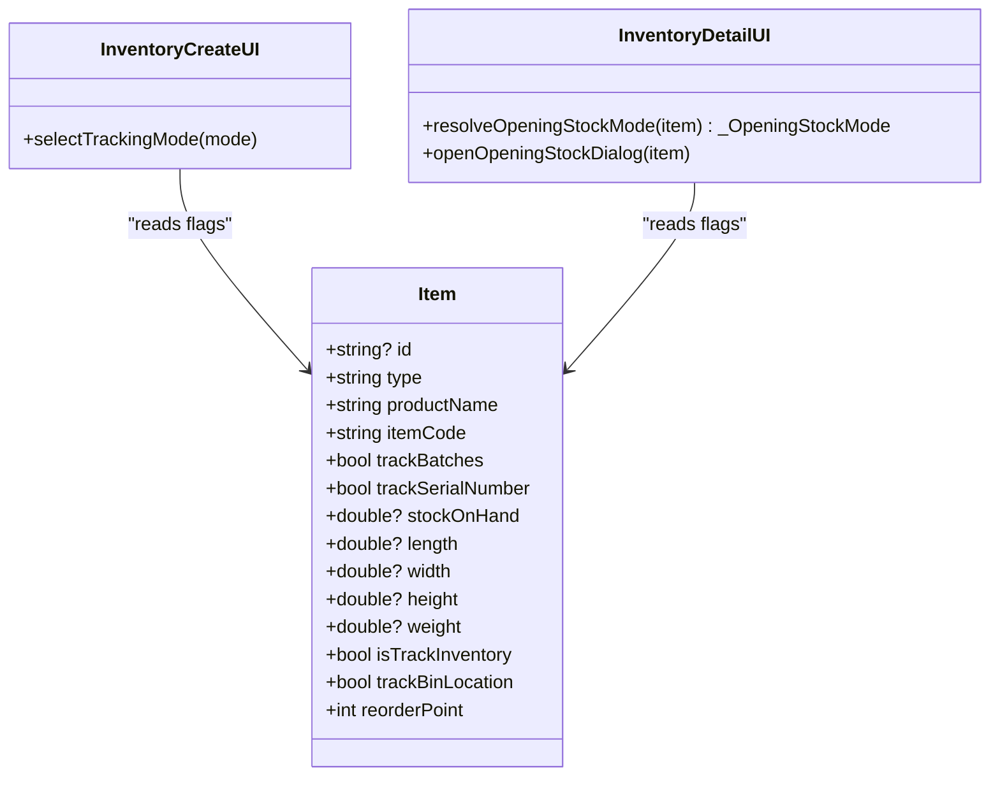
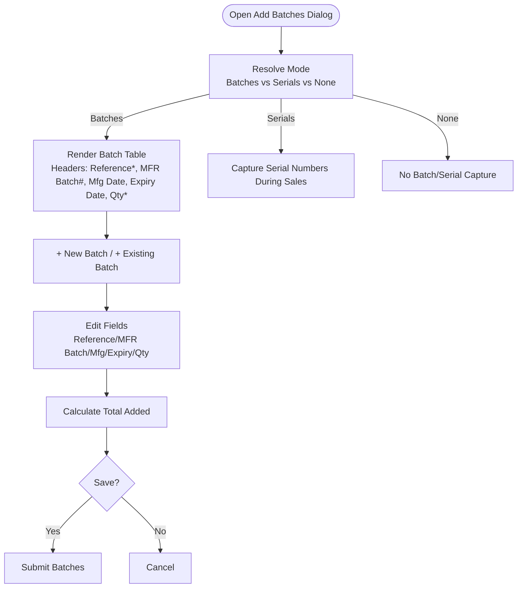
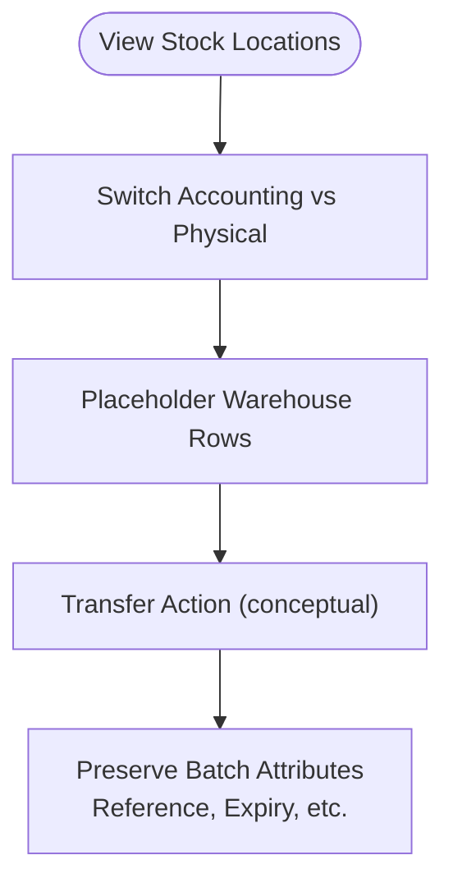
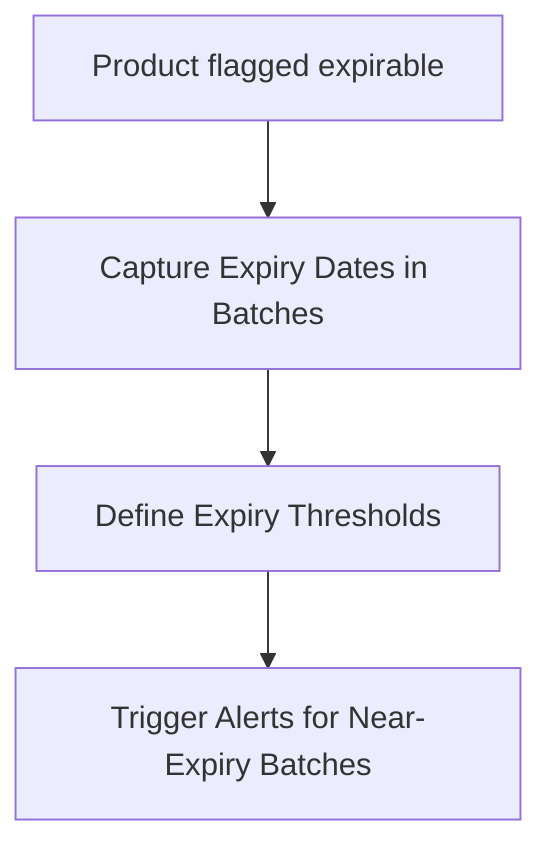
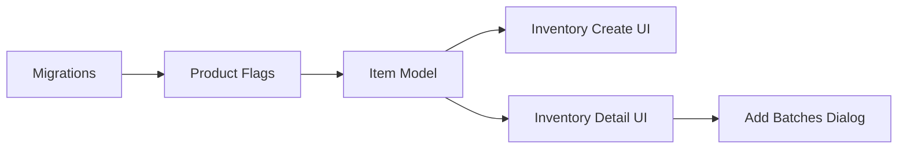

# Batch and Serial Number Tracking

<cite>
**Referenced Files in This Document**
- [004_add_track_serial_number.sql](file://supabase/migrations/004_add_track_serial_number.sql)
- [001_schema_redesigned.sql](file://supabase/migrations/001_schema_redesigned.sql)
- [002_products_complete.sql](file://supabase/migrations/002_products_complete.sql)
- [item_model.dart](file://lib/modules/items/models/item_model.dart)
- [items_item_detail_stock.dart](file://lib/modules/items/presentation/sections/items_item_detail_stock.dart)
- [items_item_create_inventory.dart](file://lib/modules/items/presentation/sections/items_item_create_inventory.dart)
- [add_batches_dialog.dart](file://lib/modules/inventory/assemblies/presentation/widgets/add_batches_dialog.dart)
</cite>

## Table of Contents
1. [Introduction](#introduction)
2. [Project Structure](#project-structure)
3. [Core Components](#core-components)
4. [Architecture Overview](#architecture-overview)
5. [Detailed Component Analysis](#detailed-component-analysis)
6. [Dependency Analysis](#dependency-analysis)
7. [Performance Considerations](#performance-considerations)
8. [Troubleshooting Guide](#troubleshooting-guide)
9. [Conclusion](#conclusion)
10. [Appendices](#appendices)

## Introduction
This document explains the Batch and Serial Number Tracking functionality implemented in the system. It covers:
- Batch-specific inventory tracking and expiry date management
- Serial number unique identification for high-value items
- Workflows for batch creation, batch transfer between locations, and batch expiration alerts
- Practical procedures for batch entry and serial number assignment during sales
- Database schema for batch tracking, batch inventory queries, and batch-specific pricing considerations
- Compliance considerations for pharmaceutical and regulated products

## Project Structure
The implementation spans three layers:
- Database migrations define product tracking flags and indexes
- Frontend models and UI present batch/serial controls and batch entry dialogs
- Inventory detail screens orchestrate opening stock and batch/serial modes



**Diagram sources**
- [001_schema_redesigned.sql](file://supabase/migrations/001_schema_redesigned.sql#L1-L180)
- [002_products_complete.sql](file://supabase/migrations/002_products_complete.sql#L1-L381)
- [004_add_track_serial_number.sql](file://supabase/migrations/004_add_track_serial_number.sql#L1-L15)
- [item_model.dart](file://lib/modules/items/models/item_model.dart#L1-L461)
- [items_item_create_inventory.dart](file://lib/modules/items/presentation/sections/items_item_create_inventory.dart#L1-L769)
- [items_item_detail_stock.dart](file://lib/modules/items/presentation/sections/items_item_detail_stock.dart#L1-L786)
- [add_batches_dialog.dart](file://lib/modules/inventory/assemblies/presentation/widgets/add_batches_dialog.dart#L1-L488)

**Section sources**
- [001_schema_redesigned.sql](file://supabase/migrations/001_schema_redesigned.sql#L1-L180)
- [002_products_complete.sql](file://supabase/migrations/002_products_complete.sql#L1-L381)
- [004_add_track_serial_number.sql](file://supabase/migrations/004_add_track_serial_number.sql#L1-L15)
- [item_model.dart](file://lib/modules/items/models/item_model.dart#L1-L461)
- [items_item_create_inventory.dart](file://lib/modules/items/presentation/sections/items_item_create_inventory.dart#L1-L769)
- [items_item_detail_stock.dart](file://lib/modules/items/presentation/sections/items_item_detail_stock.dart#L1-L786)
- [add_batches_dialog.dart](file://lib/modules/inventory/assemblies/presentation/widgets/add_batches_dialog.dart#L1-L488)

## Core Components
- Product tracking flags:
  - Batch tracking flag on organization products
  - Serial number tracking flag on products
- Frontend model mapping:
  - Item model exposes tracking flags and stock metrics
- UI workflows:
  - Inventory creation screen selects tracking mode (none, serial numbers, batches)
  - Inventory detail screen opens “Add Opening Stock” dialog with batch/serial mode resolution
  - Batch entry dialog captures batch reference, manufacturer batch number, manufactured date, expiry date, and quantity

**Section sources**
- [001_schema_redesigned.sql](file://supabase/migrations/001_schema_redesigned.sql#L53-L104)
- [002_products_complete.sql](file://supabase/migrations/002_products_complete.sql#L132-L226)
- [004_add_track_serial_number.sql](file://supabase/migrations/004_add_track_serial_number.sql#L1-L15)
- [item_model.dart](file://lib/modules/items/models/item_model.dart#L76-L86)
- [items_item_create_inventory.dart](file://lib/modules/items/presentation/sections/items_item_create_inventory.dart#L114-L154)
- [items_item_detail_stock.dart](file://lib/modules/items/presentation/sections/items_item_detail_stock.dart#L411-L417)
- [add_batches_dialog.dart](file://lib/modules/inventory/assemblies/presentation/widgets/add_batches_dialog.dart#L29-L35)

## Architecture Overview
The system integrates database flags with UI-driven workflows to support batch and serial tracking. The flow below illustrates how a product’s tracking settings influence the UI and batch entry process.



**Diagram sources**
- [items_item_detail_stock.dart](file://lib/modules/items/presentation/sections/items_item_detail_stock.dart#L411-L417)
- [items_item_create_inventory.dart](file://lib/modules/items/presentation/sections/items_item_create_inventory.dart#L114-L154)
- [add_batches_dialog.dart](file://lib/modules/inventory/assemblies/presentation/widgets/add_batches_dialog.dart#L1-L488)
- [item_model.dart](file://lib/modules/items/models/item_model.dart#L76-L86)

## Detailed Component Analysis

### Database Schema for Batch and Serial Tracking
- Organization product table includes batch tracking flag for org-specific product variants
- Product table includes serial number tracking flag and batch tracking flag
- Serial number tracking column is added to products with a supporting index for performance



**Diagram sources**
- [001_schema_redesigned.sql](file://supabase/migrations/001_schema_redesigned.sql#L53-L104)
- [002_products_complete.sql](file://supabase/migrations/002_products_complete.sql#L132-L226)

**Section sources**
- [001_schema_redesigned.sql](file://supabase/migrations/001_schema_redesigned.sql#L53-L104)
- [002_products_complete.sql](file://supabase/migrations/002_products_complete.sql#L132-L226)
- [004_add_track_serial_number.sql](file://supabase/migrations/004_add_track_serial_number.sql#L1-L15)

### Frontend Model and UI Flags
- Item model exposes:
  - Inventory flags: track batches, track serial number
  - Stock-on-hand metric for display
- Inventory creation screen:
  - Radio selection among “None”, “Track Serial Number”, “Track Batches”
- Inventory detail screen:
  - Resolves opening stock mode based on flags
  - Opens “Add Opening Stock” dialog with appropriate mode



**Diagram sources**
- [item_model.dart](file://lib/modules/items/models/item_model.dart#L4-L172)
- [items_item_create_inventory.dart](file://lib/modules/items/presentation/sections/items_item_create_inventory.dart#L114-L154)
- [items_item_detail_stock.dart](file://lib/modules/items/presentation/sections/items_item_detail_stock.dart#L411-L417)

**Section sources**
- [item_model.dart](file://lib/modules/items/models/item_model.dart#L76-L86)
- [items_item_create_inventory.dart](file://lib/modules/items/presentation/sections/items_item_create_inventory.dart#L114-L154)
- [items_item_detail_stock.dart](file://lib/modules/items/presentation/sections/items_item_detail_stock.dart#L411-L417)

### Batch Entry Workflow
- The batch entry dialog supports:
  - Adding new batches or selecting existing batch references
  - Capturing manufacturer batch number, manufactured date, expiry date, and quantity
  - Overwrite toggle to replace line item quantities
- The dialog computes totals and enforces required fields



**Diagram sources**
- [add_batches_dialog.dart](file://lib/modules/inventory/assemblies/presentation/widgets/add_batches_dialog.dart#L1-L488)
- [items_item_detail_stock.dart](file://lib/modules/items/presentation/sections/items_item_detail_stock.dart#L411-L417)

**Section sources**
- [add_batches_dialog.dart](file://lib/modules/inventory/assemblies/presentation/widgets/add_batches_dialog.dart#L29-L35)
- [add_batches_dialog.dart](file://lib/modules/inventory/assemblies/presentation/widgets/add_batches_dialog.dart#L303-L352)
- [add_batches_dialog.dart](file://lib/modules/inventory/assemblies/presentation/widgets/add_batches_dialog.dart#L434-L467)

### Serial Number Tracking for High-Value Items
- Serial number tracking is enabled via a product flag
- The inventory detail screen resolves opening stock mode to serials when applicable
- Serial number assignment during sales is supported conceptually by the UI’s serials mode

```mermaid
sequenceDiagram
participant User as "User"
participant Create as "Inventory Create UI"
participant Detail as "Inventory Detail UI"
participant Model as "Item Model"
User->>Create : Select "Track Serial Number"
Create->>Model : Persist track_serial_number = true
User->>Detail : Open "Add Opening Stock"
Detail->>Model : Read flags
Detail-->>User : Open dialog with Serials mode
User-->>Detail : Enter serial numbers during sales
```

**Diagram sources**
- [items_item_create_inventory.dart](file://lib/modules/items/presentation/sections/items_item_create_inventory.dart#L128-L140)
- [items_item_detail_stock.dart](file://lib/modules/items/presentation/sections/items_item_detail_stock.dart#L411-L417)
- [item_model.dart](file://lib/modules/items/models/item_model.dart#L76-L86)

**Section sources**
- [004_add_track_serial_number.sql](file://supabase/migrations/004_add_track_serial_number.sql#L1-L15)
- [items_item_create_inventory.dart](file://lib/modules/items/presentation/sections/items_item_create_inventory.dart#L128-L140)
- [items_item_detail_stock.dart](file://lib/modules/items/presentation/sections/items_item_detail_stock.dart#L411-L417)

### Batch Transfer Between Locations
- The system supports warehouse-level stock views and toggles between accounting and physical stock
- Batch transfer would typically involve moving quantities between warehouses while preserving batch attributes
- The UI currently demonstrates a placeholder warehouse row and does not implement transfer actions



**Diagram sources**
- [items_item_detail_stock.dart](file://lib/modules/items/presentation/sections/items_item_detail_stock.dart#L50-L106)
- [items_item_detail_stock.dart](file://lib/modules/items/presentation/sections/items_item_detail_stock.dart#L108-L215)

**Section sources**
- [items_item_detail_stock.dart](file://lib/modules/items/presentation/sections/items_item_detail_stock.dart#L50-L106)
- [items_item_detail_stock.dart](file://lib/modules/items/presentation/sections/items_item_detail_stock.dart#L108-L215)

### Batch Expiration Alerts
- The product schema includes an expirable flag at the organization product level
- Expiry date management is captured in the batch entry dialog
- Expiration alerts are not implemented in the current UI; they can be introduced by querying batches with expiry dates near thresholds



**Diagram sources**
- [001_schema_redesigned.sql](file://supabase/migrations/001_schema_redesigned.sql#L79-L80)
- [add_batches_dialog.dart](file://lib/modules/inventory/assemblies/presentation/widgets/add_batches_dialog.dart#L339-L340)

**Section sources**
- [001_schema_redesigned.sql](file://supabase/migrations/001_schema_redesigned.sql#L79-L80)
- [add_batches_dialog.dart](file://lib/modules/inventory/assemblies/presentation/widgets/add_batches_dialog.dart#L339-L340)

### Practical Procedures

- Batch entry during opening stock:
  - Open “Add Opening Stock” from the item detail
  - Choose “Track Batches” mode
  - Add rows with batch reference, manufacturer batch number, manufactured date, expiry date, and quantity
  - Optionally overwrite the line item with total quantities

- Serial number assignment during sales:
  - Enable “Track Serial Number” during product creation
  - During sales, capture serial numbers as prompted by the serials mode

- Batch expiry reporting:
  - Use the batch entry dialog to populate expiry dates
  - Implement periodic queries against batches to identify near-expiry items

**Section sources**
- [items_item_detail_stock.dart](file://lib/modules/items/presentation/sections/items_item_detail_stock.dart#L419-L457)
- [items_item_create_inventory.dart](file://lib/modules/items/presentation/sections/items_item_create_inventory.dart#L128-L140)
- [add_batches_dialog.dart](file://lib/modules/inventory/assemblies/presentation/widgets/add_batches_dialog.dart#L303-L352)

### Batch-Specific Pricing Calculations
- The product table includes valuation method options (e.g., FIFO, LIFO, Weighted Average)
- Batch-specific pricing can leverage these methods when assigning costs to batches
- The UI currently focuses on batch attributes; pricing logic can be integrated at the transaction layer

**Section sources**
- [002_products_complete.sql](file://supabase/migrations/002_products_complete.sql#L207-L207)
- [items_item_create_inventory.dart](file://lib/modules/items/presentation/sections/items_item_create_inventory.dart#L232-L234)

## Dependency Analysis
- Database migrations define product tracking flags and indexes
- Frontend models depend on database flags to render appropriate UI
- UI components coordinate batch entry and serial capture based on flags



**Diagram sources**
- [001_schema_redesigned.sql](file://supabase/migrations/001_schema_redesigned.sql#L53-L104)
- [002_products_complete.sql](file://supabase/migrations/002_products_complete.sql#L132-L226)
- [004_add_track_serial_number.sql](file://supabase/migrations/004_add_track_serial_number.sql#L1-L15)
- [item_model.dart](file://lib/modules/items/models/item_model.dart#L76-L86)
- [items_item_create_inventory.dart](file://lib/modules/items/presentation/sections/items_item_create_inventory.dart#L114-L154)
- [items_item_detail_stock.dart](file://lib/modules/items/presentation/sections/items_item_detail_stock.dart#L411-L417)
- [add_batches_dialog.dart](file://lib/modules/inventory/assemblies/presentation/widgets/add_batches_dialog.dart#L1-L488)

**Section sources**
- [item_model.dart](file://lib/modules/items/models/item_model.dart#L76-L86)
- [items_item_create_inventory.dart](file://lib/modules/items/presentation/sections/items_item_create_inventory.dart#L114-L154)
- [items_item_detail_stock.dart](file://lib/modules/items/presentation/sections/items_item_detail_stock.dart#L411-L417)
- [add_batches_dialog.dart](file://lib/modules/inventory/assemblies/presentation/widgets/add_batches_dialog.dart#L1-L488)

## Performance Considerations
- Index on serial number tracking flag improves filtering for serial-enabled products
- Batch and serial tracking introduce additional storage and query complexity; consider partitioning or materialized views for large inventories
- Batch expiry queries should leverage indexes on expiry dates and batch references

**Section sources**
- [004_add_track_serial_number.sql](file://supabase/migrations/004_add_track_serial_number.sql#L10-L11)

## Troubleshooting Guide
- Enabling/disabling inventory tracking after transactions:
  - The inventory creation UI warns that inventory tracking cannot be changed after transactions are created
- Serial number capture:
  - Ensure the product flag for serial tracking is enabled before attempting serial capture during sales
- Batch entry:
  - Required fields include batch reference and quantity; verify totals and overwrite behavior as needed

**Section sources**
- [items_item_create_inventory.dart](file://lib/modules/items/presentation/sections/items_item_create_inventory.dart#L38-L41)
- [add_batches_dialog.dart](file://lib/modules/inventory/assemblies/presentation/widgets/add_batches_dialog.dart#L252-L256)
- [add_batches_dialog.dart](file://lib/modules/inventory/assemblies/presentation/widgets/add_batches_dialog.dart#L434-L467)

## Conclusion
The system provides a solid foundation for batch and serial number tracking:
- Database flags enable batch and serial tracking at product and organization levels
- Frontend models and UI workflows support batch entry and serial capture
- Batch transfer and expiration alerting are conceptual extensions that can be implemented with minimal schema and UI updates
- Compliance-ready features such as expiry date capture and valuation methods support regulatory needs

## Appendices
- Compliance checklist for pharmaceutical and regulated products:
  - Enable batch tracking and expiry capture for expirable products
  - Define and enforce reorder points and terms
  - Implement expiry threshold alerts and reporting
  - Maintain audit trails for batch and serial movements