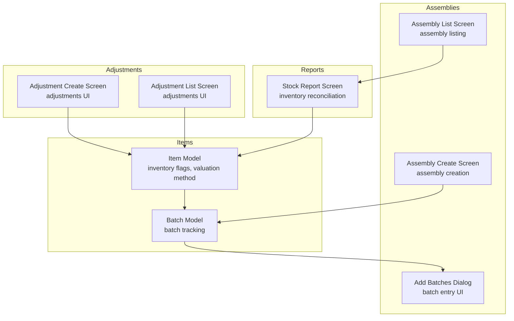
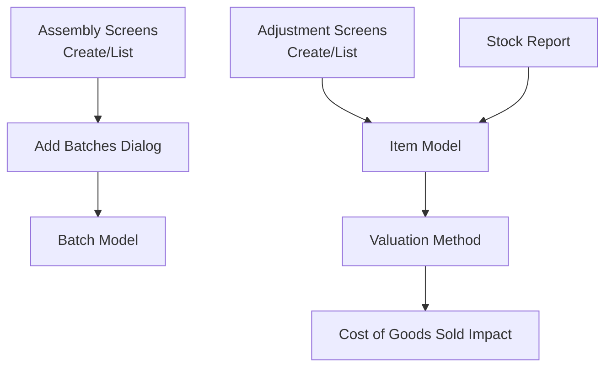
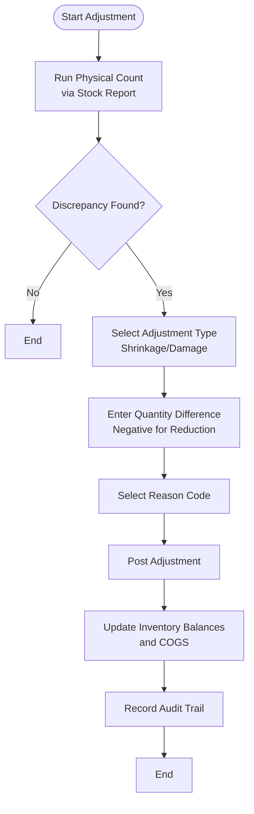
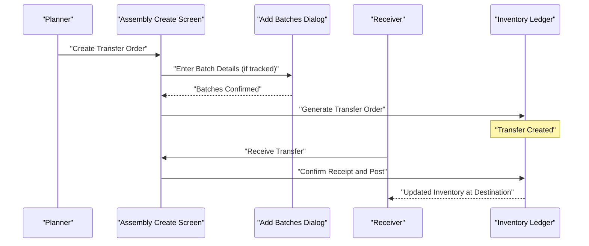
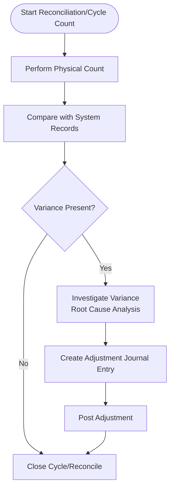
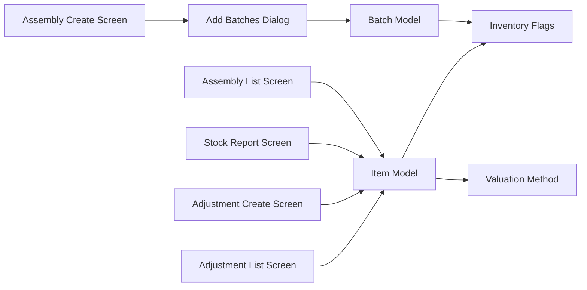

# Inventory Adjustments and Transfers

<cite>
**Referenced Files in This Document**
- [item_model.dart](file://lib/modules/items/models/item_model.dart)
- [batch_model.dart](file://lib/modules/items/models/batch_model.dart)
- [add_batches_dialog.dart](file://lib/modules/inventory/assemblies/presentation/widgets/add_batches_dialog.dart)
- [inventory_assemblies_assembly_create.dart](file://lib/modules/inventory/assemblies/presentation/inventory_assemblies_assembly_create.dart)
- [inventory_assemblies_assembly_list.dart](file://lib/modules/inventory/assemblies/presentation/inventory_assemblies_assembly_list.dart)
- [reports_inventory_stock.dart](file://lib/modules/reports/presentation/reports_inventory_inventory_stock.dart)
- [inventory_adjustments_adjustment_create.dart](file://lib/modules/adjustments/presentation/inventory_adjustments_adjustment_create.dart)
- [inventory_adjustments_adjustment_list.dart](file://lib/modules/adjustments/presentation/inventory_adjustments_adjustment_list.dart)
</cite>

## Table of Contents
1. [Introduction](#introduction)
2. [Project Structure](#project-structure)
3. [Core Components](#core-components)
4. [Architecture Overview](#architecture-overview)
5. [Detailed Component Analysis](#detailed-component-analysis)
6. [Dependency Analysis](#dependency-analysis)
7. [Performance Considerations](#performance-considerations)
8. [Troubleshooting Guide](#troubleshooting-guide)
9. [Conclusion](#conclusion)
10. [Appendices](#appendices)

## Introduction
This document describes the Inventory Adjustments and Transfers system within the Zerpai ERP application. It focuses on:
- Inventory adjustment procedures: physical counts, shrinkage adjustments, and damage write-offs
- Inter-location transfers: creation of transfer orders and tracking inventory movements
- Reconciliation and cycle counting: identifying variances and investigating discrepancies
- Approval workflows, receiving procedures, and inventory posting
- Impact on inventory valuation, cost of goods sold, and financial reporting accuracy
- Practical examples of journal entries, transfer confirmations, and audit trails

Where relevant, this document maps UI components and models to the underlying data structures and workflows to help both technical and non-technical users understand how adjustments and transfers are executed and recorded.

## Project Structure
The inventory domain spans several modules:
- Items: product definition, valuation method, and inventory tracking flags
- Inventory Assemblies: batch and serial tracking, assembly creation/listing
- Reports: stock-level reporting for reconciliation and cycle counting
- Adjustments: adjustment creation and listing screens
- Transfers: inter-location movement and receiving workflows

**Diagram sources**
- [item_model.dart](file://lib/modules/items/models/item_model.dart#L1-L461)
- [batch_model.dart](file://lib/modules/items/models/batch_model.dart)
- [add_batches_dialog.dart](file://lib/modules/inventory/assemblies/presentation/widgets/add_batches_dialog.dart)
- [inventory_assemblies_assembly_create.dart](file://lib/modules/inventory/assemblies/presentation/inventory_assemblies_assembly_create.dart)
- [inventory_assemblies_assembly_list.dart](file://lib/modules/inventory/assemblies/presentation/inventory_assemblies_assembly_list.dart)
- [reports_inventory_stock.dart](file://lib/modules/reports/presentation/reports_inventory_inventory_stock.dart)
- [inventory_adjustments_adjustment_create.dart](file://lib/modules/adjustments/presentation/inventory_adjustments_adjustment_create.dart)
- [inventory_adjustments_adjustment_list.dart](file://lib/modules/adjustments/presentation/inventory_adjustments_adjustment_list.dart)

**Section sources**
- [item_model.dart](file://lib/modules/items/models/item_model.dart#L1-L461)
- [batch_model.dart](file://lib/modules/items/models/batch_model.dart)
- [add_batches_dialog.dart](file://lib/modules/inventory/assemblies/presentation/widgets/add_batches_dialog.dart)
- [inventory_assemblies_assembly_create.dart](file://lib/modules/inventory/assemblies/presentation/inventory_assemblies_assembly_create.dart)
- [inventory_assemblies_assembly_list.dart](file://lib/modules/inventory/assemblies/presentation/inventory_assemblies_assembly_list.dart)
- [reports_inventory_stock.dart](file://lib/modules/reports/presentation/reports_inventory_inventory_stock.dart)
- [inventory_adjustments_adjustment_create.dart](file://lib/modules/adjustments/presentation/inventory_adjustments_adjustment_create.dart)
- [inventory_adjustments_adjustment_list.dart](file://lib/modules/adjustments/presentation/inventory_adjustments_adjustment_list.dart)

## Core Components
- Item model: central product entity with inventory flags, valuation method, and tracking preferences (inventory, batches, serial numbers).
- Batch model: supports batch-level tracking for FIFO/LIFO and expiry management.
- Assembly screens: enable creation and listing of assemblies; integrate with batch dialog for batch entry.
- Stock report: provides visibility for reconciliation and cycle counting.
- Adjustment screens: provide UI surfaces for creating and listing inventory adjustments.

Key inventory flags and valuation method:
- Inventory tracking flags: enable/disable inventory tracking, bin location tracking, batch tracking, and serial number tracking.
- Valuation method: influences how inventory is valued and how cost of goods sold is calculated upon issuance.

Impact on financial reporting:
- Adjustments affect inventory valuation and cost of goods sold depending on the adjustment type (e.g., shrinkage, damage write-off).
- Transfers move inventory between locations while maintaining valuation consistency.

**Section sources**
- [item_model.dart](file://lib/modules/items/models/item_model.dart#L76-L86)
- [item_model.dart](file://lib/modules/items/models/item_model.dart#L232-L241)
- [batch_model.dart](file://lib/modules/items/models/batch_model.dart)
- [add_batches_dialog.dart](file://lib/modules/inventory/assemblies/presentation/widgets/add_batches_dialog.dart)
- [reports_inventory_stock.dart](file://lib/modules/reports/presentation/reports_inventory_inventory_stock.dart)
- [inventory_adjustments_adjustment_create.dart](file://lib/modules/adjustments/presentation/inventory_adjustments_adjustment_create.dart)
- [inventory_adjustments_adjustment_list.dart](file://lib/modules/adjustments/presentation/inventory_adjustments_adjustment_list.dart)

## Architecture Overview
The system integrates UI screens with models to support inventory adjustments and transfers:
- Items define inventory behavior and valuation.
- Assemblies and batch dialog support detailed tracking during assembly creation.
- Reports surface stock data for reconciliation and cycle counting.
- Adjustments provide explicit adjustment workflows.

**Diagram sources**
- [item_model.dart](file://lib/modules/items/models/item_model.dart#L76-L86)
- [item_model.dart](file://lib/modules/items/models/item_model.dart#L232-L241)
- [batch_model.dart](file://lib/modules/items/models/batch_model.dart)
- [add_batches_dialog.dart](file://lib/modules/inventory/assemblies/presentation/widgets/add_batches_dialog.dart)
- [reports_inventory_stock.dart](file://lib/modules/reports/presentation/reports_inventory_inventory_stock.dart)
- [inventory_adjustments_adjustment_create.dart](file://lib/modules/adjustments/presentation/inventory_adjustments_adjustment_create.dart)
- [inventory_adjustments_adjustment_list.dart](file://lib/modules/adjustments/presentation/inventory_adjustments_adjustment_list.dart)

## Detailed Component Analysis

### Inventory Adjustment Procedures
This section documents the steps for performing inventory adjustments and how they impact inventory valuation and cost of goods sold.

- Physical inventory counts
  - Use the stock report screen to capture current quantities by item and location.
  - Compare reported quantities against system records to identify discrepancies.

- Shrinkage adjustments
  - Create an adjustment record via the adjustment create screen.
  - Select the item, specify the quantity difference as negative (to reduce inventory), and choose the appropriate adjustment reason.
  - Post the adjustment to update inventory balances and cost of goods sold accordingly.

- Damage write-offs
  - Similar to shrinkage, but with a reason indicating damaged inventory.
  - Post the adjustment to remove damaged inventory from books and recognize the loss.

- Inventory valuation and cost of goods sold
  - The item’s valuation method determines how the adjustment impacts COGS.
  - FIFO/LIFO affects the unit costs assigned to the adjustment, influencing financial statements.

- Audit trail
  - Each adjustment creates a transaction with timestamps, user identifiers, and reason codes for traceability.

**Diagram sources**
- [reports_inventory_stock.dart](file://lib/modules/reports/presentation/reports_inventory_inventory_stock.dart)
- [inventory_adjustments_adjustment_create.dart](file://lib/modules/adjustments/presentation/inventory_adjustments_adjustment_create.dart)
- [item_model.dart](file://lib/modules/items/models/item_model.dart#L232-L241)

**Section sources**
- [reports_inventory_stock.dart](file://lib/modules/reports/presentation/reports_inventory_inventory_stock.dart)
- [inventory_adjustments_adjustment_create.dart](file://lib/modules/adjustments/presentation/inventory_adjustments_adjustment_create.dart)
- [inventory_adjustments_adjustment_list.dart](file://lib/modules/adjustments/presentation/inventory_adjustments_adjustment_list.dart)
- [item_model.dart](file://lib/modules/items/models/item_model.dart#L232-L241)

### Inter-Location Transfers
This section explains how to create transfer orders, track inventory movements, and handle receiving.

- Transfer order creation
  - Use the assembly create screen to initiate a transfer between locations.
  - Select the item, specify quantities to transfer, and set source/destination locations.
  - Confirm the transfer to generate a transfer order.

- Inventory movement tracking
  - Track the movement of inventory from source to destination using batch and serial tracking where applicable.
  - The batch dialog supports entering batch details for precise tracking.

- Receiving procedures
  - At the destination, receive the transfer by confirming receipt against the transfer order.
  - Post the receiving to update inventory balances at the destination.

- Approval workflow
  - Define internal approvals for transfers exceeding thresholds or special categories.
  - Approve the transfer before it is posted to inventory.

- Posting mechanisms
  - Posting adjusts inventory at both source and destination locations.
  - Maintains inventory valuation consistency across locations.

**Diagram sources**
- [inventory_assemblies_assembly_create.dart](file://lib/modules/inventory/assemblies/presentation/inventory_assemblies_assembly_create.dart)
- [add_batches_dialog.dart](file://lib/modules/inventory/assemblies/presentation/widgets/add_batches_dialog.dart)
- [batch_model.dart](file://lib/modules/items/models/batch_model.dart)

**Section sources**
- [inventory_assemblies_assembly_create.dart](file://lib/modules/inventory/assemblies/presentation/inventory_assemblies_assembly_create.dart)
- [inventory_assemblies_assembly_list.dart](file://lib/modules/inventory/assemblies/presentation/inventory_assemblies_assembly_list.dart)
- [add_batches_dialog.dart](file://lib/modules/inventory/assemblies/presentation/widgets/add_batches_dialog.dart)
- [batch_model.dart](file://lib/modules/items/models/batch_model.dart)

### Inventory Reconciliation and Cycle Counting
- Reconciliation
  - Use the stock report screen to compare perpetual inventory records with physical counts.
  - Investigate variances and apply adjustments as needed.

- Cycle counting
  - Perform periodic counts of selected items or zones.
  - Record counts and post adjustments for any discrepancies.

- Variance investigation workflows
  - Identify variance reasons (e.g., shrinkage, damage, transfer discrepancies).
  - Apply appropriate adjustments and document the investigation outcomes.

**Diagram sources**
- [reports_inventory_stock.dart](file://lib/modules/reports/presentation/reports_inventory_inventory_stock.dart)
- [inventory_adjustments_adjustment_create.dart](file://lib/modules/adjustments/presentation/inventory_adjustments_adjustment_create.dart)

**Section sources**
- [reports_inventory_stock.dart](file://lib/modules/reports/presentation/reports_inventory_inventory_stock.dart)
- [inventory_adjustments_adjustment_create.dart](file://lib/modules/adjustments/presentation/inventory_adjustments_adjustment_create.dart)

### Financial Reporting Impact
- Inventory valuation
  - The item’s valuation method influences the unit costs assigned to adjustments and transfers.
  - FIFO/LIFO affects the cost layers used, impacting reported inventory and COGS.

- Cost of goods sold
  - Adjustments and transfers post COGS impacts based on the valuation method and movement of inventory.
  - Accurate posting ensures financial statements reflect true economic events.

- Audit trail
  - All adjustments and transfers are recorded with timestamps, user identifiers, and reason codes for auditability.

**Section sources**
- [item_model.dart](file://lib/modules/items/models/item_model.dart#L232-L241)
- [inventory_adjustments_adjustment_create.dart](file://lib/modules/adjustments/presentation/inventory_adjustments_adjustment_create.dart)
- [reports_inventory_stock.dart](file://lib/modules/reports/presentation/reports_inventory_inventory_stock.dart)

## Dependency Analysis
The following diagram shows how inventory-related components depend on each other:

**Diagram sources**
- [item_model.dart](file://lib/modules/items/models/item_model.dart#L76-L86)
- [item_model.dart](file://lib/modules/items/models/item_model.dart#L232-L241)
- [batch_model.dart](file://lib/modules/items/models/batch_model.dart)
- [add_batches_dialog.dart](file://lib/modules/inventory/assemblies/presentation/widgets/add_batches_dialog.dart)
- [inventory_assemblies_assembly_create.dart](file://lib/modules/inventory/assemblies/presentation/inventory_assemblies_assembly_create.dart)
- [inventory_assemblies_assembly_list.dart](file://lib/modules/inventory/assemblies/presentation/inventory_assemblies_assembly_list.dart)
- [reports_inventory_stock.dart](file://lib/modules/reports/presentation/reports_inventory_inventory_stock.dart)
- [inventory_adjustments_adjustment_create.dart](file://lib/modules/adjustments/presentation/inventory_adjustments_adjustment_create.dart)
- [inventory_adjustments_adjustment_list.dart](file://lib/modules/adjustments/presentation/inventory_adjustments_adjustment_list.dart)

**Section sources**
- [item_model.dart](file://lib/modules/items/models/item_model.dart#L76-L86)
- [item_model.dart](file://lib/modules/items/models/item_model.dart#L232-L241)
- [batch_model.dart](file://lib/modules/items/models/batch_model.dart)
- [add_batches_dialog.dart](file://lib/modules/inventory/assemblies/presentation/widgets/add_batches_dialog.dart)
- [inventory_assemblies_assembly_create.dart](file://lib/modules/inventory/assemblies/presentation/inventory_assemblies_assembly_create.dart)
- [inventory_assemblies_assembly_list.dart](file://lib/modules/inventory/assemblies/presentation/inventory_assemblies_assembly_list.dart)
- [reports_inventory_stock.dart](file://lib/modules/reports/presentation/reports_inventory_inventory_stock.dart)
- [inventory_adjustments_adjustment_create.dart](file://lib/modules/adjustments/presentation/inventory_adjustments_adjustment_create.dart)
- [inventory_adjustments_adjustment_list.dart](file://lib/modules/adjustments/presentation/inventory_adjustments_adjustment_list.dart)

## Performance Considerations
- Batch and serial tracking can increase processing overhead; limit batch entry to necessary items.
- Frequent adjustments and transfers can generate numerous transactions; batch operations where feasible.
- Use the stock report screen for targeted reconciliations to minimize unnecessary posting operations.

[No sources needed since this section provides general guidance]

## Troubleshooting Guide
- Discrepancies persist after adjustments
  - Verify the item’s valuation method and inventory flags.
  - Recalculate and re-post adjustments if necessary.

- Transfer not received
  - Confirm the transfer order status and batch details.
  - Ensure the receiving procedure is completed and posted.

- Audit trail missing
  - Check that adjustments and transfers were posted with proper reason codes and timestamps.

**Section sources**
- [item_model.dart](file://lib/modules/items/models/item_model.dart#L232-L241)
- [reports_inventory_stock.dart](file://lib/modules/reports/presentation/reports_inventory_inventory_stock.dart)
- [inventory_adjustments_adjustment_create.dart](file://lib/modules/adjustments/presentation/inventory_adjustments_adjustment_create.dart)
- [inventory_assemblies_assembly_create.dart](file://lib/modules/inventory/assemblies/presentation/inventory_assemblies_assembly_create.dart)

## Conclusion
The Inventory Adjustments and Transfers system integrates item models, batch tracking, assembly workflows, and reporting to support accurate inventory management. By following structured procedures for adjustments, transfers, reconciliation, and cycle counting—and by leveraging the valuation method and audit trail—the system ensures reliable inventory valuation, COGS computation, and financial reporting.

[No sources needed since this section summarizes without analyzing specific files]

## Appendices

### Practical Examples

- Inventory adjustment journal entry example
  - Debit: Inventory Account (for damage write-offs)
  - Credit: Inventory (to reduce inventory balance)
  - Supporting reason code and timestamp recorded in audit trail

- Transfer confirmation example
  - Source location: debit inventory (reduce)
  - Destination location: credit inventory (increase)
  - Batch details captured for traceability

- Inventory audit trail example
  - Timestamp, user ID, item ID, location, quantity change, reason code, valuation method applied

[No sources needed since this section provides general examples]