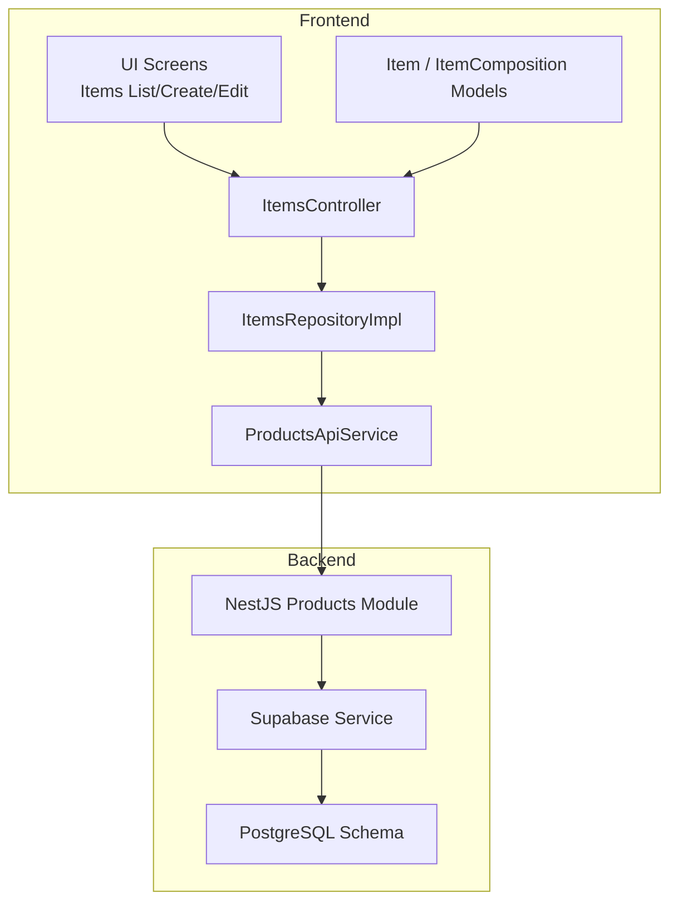
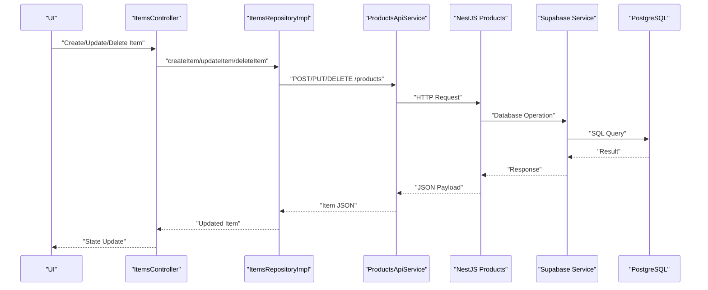
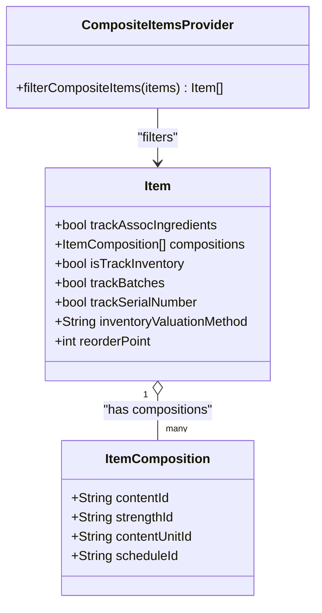
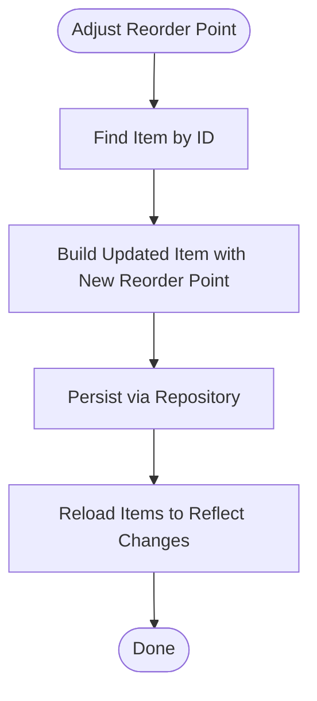
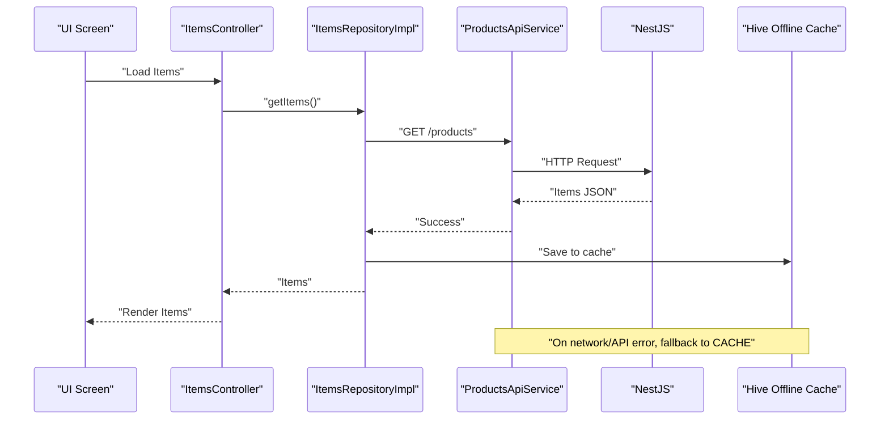
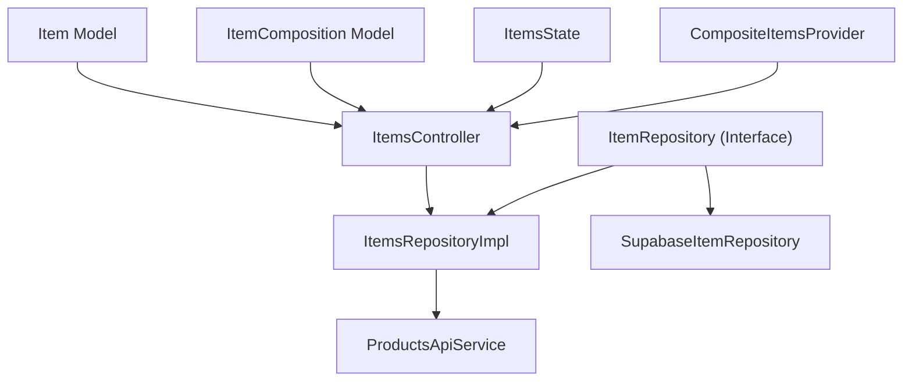

# Inventory Management
**Last Updated: 2026-04-20 12:46:08**

<cite>
**Referenced Files in This Document**
- [item_model.dart](file://lib/modules/items/models/item_model.dart)
- [item_composition_model.dart](file://lib/modules/items/models/item_composition_model.dart)
- [items_controller.dart](file://lib/modules/items/controller/items_controller.dart)
- [items_state.dart](file://lib/modules/items/controller/items_state.dart)
- [items_repository.dart](file://lib/modules/items/repositories/items_repository.dart)
- [items_repository_impl.dart](file://lib/modules/items/repositories/items_repository_impl.dart)
- [supabase_item_repository.dart](file://lib/modules/items/repositories/supabase_item_repository.dart)
- [products_api_service.dart](file://lib/modules/items/services/products_api_service.dart)
- [composite_items_provider.dart](file://lib/modules/composite/providers/composite_items_provider.dart)
</cite>

## Table of Contents
1. [Introduction](#introduction)
2. [Project Structure](#project-structure)
3. [Core Components](#core-components)
4. [Architecture Overview](#architecture-overview)
5. [Detailed Component Analysis](#detailed-component-analysis)
6. [Dependency Analysis](#dependency-analysis)
7. [Performance Considerations](#performance-considerations)
8. [Troubleshooting Guide](#troubleshooting-guide)
9. [Conclusion](#conclusion)
10. [Appendices](#appendices)

## Introduction
This document provides comprehensive documentation for the Inventory Management feature. It explains the end-to-end inventory workflow including product master management, real-time stock tracking, batch and serial number management, assembly/disassembly operations, and inventory adjustments. It also covers the product composition system, multi-branch inventory tracking, reorder point management, and inventory valuation methods. Practical examples illustrate inventory operations, batch tracking scenarios, assembly creation workflows, and inventory adjustment procedures. Finally, it documents the integration between frontend UI components and backend services, including real-time stock updates and offline synchronization capabilities.

## Project Structure
The Inventory Management feature spans three layers:
- Frontend (Flutter) modules:
  - Models define product and composition structures.
  - Controllers orchestrate data loading, validation, and updates.
  - Repositories abstract data access with online-first caching.
  - Services handle HTTP communication with the backend.
- Backend (NestJS) modules:
  - Product management APIs expose endpoints for CRUD operations and lookups.
  - Supabase integration provides database connectivity and RLS policies.

**Diagram sources**
- [items_controller.dart](file://lib/modules/items/controller/items_controller.dart#L16-L23)
- [items_repository_impl.dart](file://lib/modules/items/repositories/items_repository_impl.dart#L14-L22)
- [products_api_service.dart](file://lib/modules/items/services/products_api_service.dart#L7-L8)
- [item_model.dart](file://lib/modules/items/models/item_model.dart#L4-L172)

**Section sources**
- [items_controller.dart](file://lib/modules/items/controller/items_controller.dart#L16-L23)
- [items_repository_impl.dart](file://lib/modules/items/repositories/items_repository_impl.dart#L14-L22)
- [products_api_service.dart](file://lib/modules/items/services/products_api_service.dart#L7-L8)
- [item_model.dart](file://lib/modules/items/models/item_model.dart#L4-L172)

## Core Components
- Item model: Central entity representing products with inventory settings, valuation method, reorder point, and composition links.
- ItemComposition model: Defines child-table entries for composite items.
- ItemsController: Orchestrates loading, validation, creation, updates, deletions, and lookup synchronization.
- ItemsRepositoryImpl: Implements online-first caching with Hive for offline fallback.
- ProductsApiService: Encapsulates HTTP requests to the backend products endpoints.
- Composite provider: Filters composite items for assembly workflows.

Key inventory-relevant fields in Item:
- Tracking flags: inventory tracking, batch tracking, serial number tracking, bin location tracking.
- Valuation method: inventory valuation method selection.
- Reorder point: threshold for reorder alerts.
- Storage/rack: multi-branch location identifiers.
- Stock on hand: current quantity.

**Section sources**
- [item_model.dart](file://lib/modules/items/models/item_model.dart#L76-L86)
- [item_model.dart](file://lib/modules/items/models/item_model.dart#L106-L107)
- [item_composition_model.dart](file://lib/modules/items/models/item_composition_model.dart#L3-L13)
- [items_controller.dart](file://lib/modules/items/controller/items_controller.dart#L186-L230)
- [items_repository_impl.dart](file://lib/modules/items/repositories/items_repository_impl.dart#L14-L22)
- [products_api_service.dart](file://lib/modules/items/services/products_api_service.dart#L51-L136)
- [composite_items_provider.dart](file://lib/modules/composite/providers/composite_items_provider.dart#L8-L25)

## Architecture Overview
The system follows an online-first architecture:
- UI triggers actions via ItemsController.
- ItemsController delegates to ItemsRepositoryImpl.
- ItemsRepositoryImpl calls ProductsApiService for network operations.
- ProductsApiService communicates with NestJS backend endpoints.
- Backend integrates with Supabase service and database schema.
- Offline caching persists data locally using Hive.

**Diagram sources**
- [items_controller.dart](file://lib/modules/items/controller/items_controller.dart#L232-L346)
- [items_repository_impl.dart](file://lib/modules/items/repositories/items_repository_impl.dart#L166-L272)
- [products_api_service.dart](file://lib/modules/items/services/products_api_service.dart#L80-L136)

## Detailed Component Analysis

### Product Master Management
- Creation and updates enforce backend-required validations (type, product name, item code, unit ID).
- Inventory-specific validations require a valuation method when inventory tracking is enabled.
- Backend DTO mapping ensures only permitted fields are sent to avoid whitelist errors.
- Offline caching stores product data locally for resilience.

Practical example: Creating a tracked item
- Prepare Item with inventory tracking enabled and valuation method set.
- Call ItemsController.createItem.
- Repository caches the created item locally.
- UI reflects updated state after reload.

**Section sources**
- [items_controller.dart](file://lib/modules/items/controller/items_controller.dart#L186-L230)
- [items_controller.dart](file://lib/modules/items/controller/items_controller.dart#L232-L288)
- [items_repository_impl.dart](file://lib/modules/items/repositories/items_repository_impl.dart#L166-L197)
- [products_api_service.dart](file://lib/modules/items/services/products_api_service.dart#L80-L101)
- [item_model.dart](file://lib/modules/items/models/item_model.dart#L312-L333)

### Real-Time Stock Tracking
- Item includes a stock on hand field for current quantity.
- Multi-branch tracking is supported via storage and rack identifiers.
- Reorder point management allows automated alerts when stock falls below threshold.

Example fields and behaviors:
- stockOnHand: current quantity.
- storageId and rackId: branch/location association.
- reorderPoint and reorderTermId: reorder trigger and term.

**Section sources**
- [item_model.dart](file://lib/modules/items/models/item_model.dart#L106-L107)
- [item_model.dart](file://lib/modules/items/models/item_model.dart#L242-L245)
- [items_controller.dart](file://lib/modules/items/controller/items_controller.dart#L513-L560)

### Batch and Serial Number Management
- Item supports batch tracking and serial number tracking flags.
- Backend payload includes explicit serial number flag to ensure correct persistence.
- UI screens expose inventory settings tabs to enable tracking modes.

Workflow highlights:
- Enable trackBatches and/or trackSerialNumber on Item.
- Backend enforces required validations for inventory-enabled items.
- Offline caching preserves tracking preferences.

**Section sources**
- [item_model.dart](file://lib/modules/items/models/item_model.dart#L78-L79)
- [item_model.dart](file://lib/modules/items/models/item_model.dart#L234-L236)
- [products_api_service.dart](file://lib/modules/items/services/products_api_service.dart#L82-L84)
- [items_item_create_inventory.dart](file://lib/modules/items/presentation/sections/items_item_create_inventory.dart)

### Assembly/Disassembly Operations
- Composite items are identified by a composition list or a dedicated tracking flag.
- The composite items provider filters items suitable for assembly workflows.
- Composition entries link content, strength, and units for formula-based items.

**Diagram sources**
- [item_model.dart](file://lib/modules/items/models/item_model.dart#L96-L98)
- [item_composition_model.dart](file://lib/modules/items/models/item_composition_model.dart#L3-L13)
- [composite_items_provider.dart](file://lib/modules/composite/providers/composite_items_provider.dart#L8-L25)

**Section sources**
- [item_model.dart](file://lib/modules/items/models/item_model.dart#L96-L98)
- [item_composition_model.dart](file://lib/modules/items/models/item_composition_model.dart#L3-L13)
- [composite_items_provider.dart](file://lib/modules/composite/providers/composite_items_provider.dart#L8-L25)

### Inventory Adjustments
- Reorder point updates are supported via ItemsController with a dedicated method.
- The controller locates the item, constructs an updated Item, and persists via repository.
- After successful update, the controller reloads items to reflect changes.

**Diagram sources**
- [items_controller.dart](file://lib/modules/items/controller/items_controller.dart#L513-L560)

**Section sources**
- [items_controller.dart](file://lib/modules/items/controller/items_controller.dart#L513-L560)

### Inventory Valuation Methods
- The Item model includes an inventory valuation method field.
- Backend validation requires a valuation method when inventory tracking is enabled.
- Supported methods are determined by backend configuration and lookups.

**Section sources**
- [item_model.dart](file://lib/modules/items/models/item_model.dart#L81)
- [items_controller.dart](file://lib/modules/items/controller/items_controller.dart#L218-L222)

### Multi-Branch Inventory Tracking
- Storage and rack identifiers enable multi-branch tracking.
- UI exposes storage locations and rack selections during item creation/editing.
- Backend endpoints and schema support location-aware inventory.

**Section sources**
- [item_model.dart](file://lib/modules/items/models/item_model.dart#L82-L83)
- [items_item_create_inventory.dart](file://lib/modules/items/presentation/sections/items_item_create_inventory.dart)

### Integration Between Frontend and Backend
- ProductsApiService encapsulates HTTP operations to /products endpoints.
- ItemsRepositoryImpl implements online-first caching with Hive for offline fallback.
- ItemsController orchestrates UI actions, validation, and state updates.

**Diagram sources**
- [items_repository_impl.dart](file://lib/modules/items/repositories/items_repository_impl.dart#L24-L83)
- [products_api_service.dart](file://lib/modules/items/services/products_api_service.dart#L51-L64)

**Section sources**
- [products_api_service.dart](file://lib/modules/items/services/products_api_service.dart#L51-L136)
- [items_repository_impl.dart](file://lib/modules/items/repositories/items_repository_impl.dart#L24-L83)
- [items_controller.dart](file://lib/modules/items/controller/items_controller.dart#L25-L60)

## Dependency Analysis
The following diagram shows key dependencies among inventory components:

**Diagram sources**
- [item_model.dart](file://lib/modules/items/models/item_model.dart#L4-L172)
- [item_composition_model.dart](file://lib/modules/items/models/item_composition_model.dart#L3-L13)
- [items_controller.dart](file://lib/modules/items/controller/items_controller.dart#L16-L23)
- [items_state.dart](file://lib/modules/items/controller/items_state.dart#L7-L61)
- [items_repository.dart](file://lib/modules/items/repositories/items_repository.dart#L3-L9)
- [items_repository_impl.dart](file://lib/modules/items/repositories/items_repository_impl.dart#L14-L22)
- [supabase_item_repository.dart](file://lib/modules/items/repositories/supabase_item_repository.dart#L7-L41)
- [products_api_service.dart](file://lib/modules/items/services/products_api_service.dart#L7-L8)
- [composite_items_provider.dart](file://lib/modules/composite/providers/composite_items_provider.dart#L8-L25)

**Section sources**
- [items_controller.dart](file://lib/modules/items/controller/items_controller.dart#L16-L23)
- [items_repository.dart](file://lib/modules/items/repositories/items_repository.dart#L3-L9)
- [items_repository_impl.dart](file://lib/modules/items/repositories/items_repository_impl.dart#L14-L22)
- [supabase_item_repository.dart](file://lib/modules/items/repositories/supabase_item_repository.dart#L7-L41)
- [products_api_service.dart](file://lib/modules/items/services/products_api_service.dart#L7-L8)
- [composite_items_provider.dart](file://lib/modules/composite/providers/composite_items_provider.dart#L8-L25)

## Performance Considerations
- Online-first caching minimizes latency and improves reliability by storing recent data locally.
- Parallel lookup loading reduces initial render time by fetching units, categories, tax rates, and other metadata concurrently.
- Logging and performance timing help diagnose slow operations and optimize caching strategies.

Recommendations:
- Monitor cache hit ratios and last sync timestamps.
- Consider incremental cache updates to reduce full reloads.
- Profile network calls and adjust retry/backoff strategies as needed.

**Section sources**
- [items_repository_impl.dart](file://lib/modules/items/repositories/items_repository_impl.dart#L26-L56)
- [items_controller.dart](file://lib/modules/items/controller/items_controller.dart#L71-L88)

## Troubleshooting Guide
Common issues and resolutions:
- Network failures during item load: The repository falls back to cached data and logs warnings. Verify connectivity and retry.
- API errors: The repository attempts offline fallback and logs detailed error info. Inspect error messages and status codes.
- Validation failures: ItemsController validates required fields and valuation method; review validation errors returned in state.
- Cache write failures: The repository logs warnings but continues; check storage permissions and disk space.

Actions:
- Force refresh items to bypass cache when needed.
- Clear validation errors after correcting input.
- Check cache statistics to confirm offline availability.

**Section sources**
- [items_repository_impl.dart](file://lib/modules/items/repositories/items_repository_impl.dart#L57-L82)
- [items_controller.dart](file://lib/modules/items/controller/items_controller.dart#L186-L230)
- [items_repository_impl.dart](file://lib/modules/items/repositories/items_repository_impl.dart#L274-L295)

## Conclusion
The Inventory Management feature integrates robust frontend state management with resilient backend services and offline-first caching. It supports comprehensive inventory workflows including product master management, real-time stock tracking, batch and serial number controls, assembly/disassembly operations, reorder point management, and valuation methods. The modular design enables scalability, maintainability, and seamless offline operation.

## Appendices

### Practical Examples Index
- Product creation with inventory tracking and valuation method.
- Enabling batch and serial number tracking.
- Updating reorder point for a product.
- Filtering composite items for assembly workflows.

**Section sources**
- [items_controller.dart](file://lib/modules/items/controller/items_controller.dart#L232-L288)
- [item_model.dart](file://lib/modules/items/models/item_model.dart#L234-L236)
- [items_controller.dart](file://lib/modules/items/controller/items_controller.dart#L513-L560)
- [composite_items_provider.dart](file://lib/modules/composite/providers/composite_items_provider.dart#L8-L25)