# Product Master Management

<cite>
**Referenced Files in This Document**
- [item_model.dart](file://lib/modules/items/models/item_model.dart)
- [item_composition_model.dart](file://lib/modules/items/models/item_composition_model.dart)
- [tax_rate_model.dart](file://lib/modules/items/models/tax_rate_model.dart)
- [unit_model.dart](file://lib/modules/items/models/unit_model.dart)
- [composition_section.dart](file://lib/modules/items/presentation/sections/composition_section.dart)
- [formulation_section.dart](file://lib/modules/items/presentation/sections/formulation_section.dart)
- [sales_section.dart](file://lib/modules/items/presentation/sections/sales_section.dart)
- [purchase_section.dart](file://lib/modules/items/presentation/sections/purchase_section.dart)
- [default_tax_rates_section.dart](file://lib/modules/items/presentation/sections/default_tax_rates_section.dart)
- [items_item_create.dart](file://lib/modules/items/presentation/items_item_create.dart)
- [items_item_create_tabs.dart](file://lib/modules/items/presentation/sections/items_item_create_tabs.dart)
- [items_item_create_images.dart](file://lib/modules/items/presentation/sections/items_item_create_images.dart)
- [products_api_service.dart](file://lib/modules/items/services/products_api_service.dart)
- [items_repository.dart](file://lib/modules/items/repositories/items_repository.dart)
- [products.controller.ts](file://backend/src/products/products.controller.ts)
- [products.service.ts](file://backend/src/products/products.service.ts)
- [create-product.dto.ts](file://backend/src/products/dto/create-product.dto.ts)
- [update-product.dto.ts](file://backend/src/products/dto/update-product.dto.ts)
- [002_products_complete.sql](file://supabase/migrations/002_products_complete.sql)
</cite>

## Table of Contents
1. [Introduction](#introduction)
2. [Project Structure](#project-structure)
3. [Core Components](#core-components)
4. [Architecture Overview](#architecture-overview)
5. [Detailed Component Analysis](#detailed-component-analysis)
6. [Dependency Analysis](#dependency-analysis)
7. [Performance Considerations](#performance-considerations)
8. [Troubleshooting Guide](#troubleshooting-guide)
9. [Conclusion](#conclusion)
10. [Appendices](#appendices)

## Introduction
This document describes the Product Master Management system, focusing on the end-to-end product registration workflow and the multi-tab interface used to capture product data. It covers the product data model, tax configuration, composition management for manufactured items, default tax rates, images handling, and the integration between the Flutter frontend and NestJS backend APIs for Create, Read, Update, and Delete operations.

## Project Structure
The system is organized into:
- Frontend (Flutter):
  - Models for product, composition, tax, and unit data
  - Presentation layer with multi-tab sections for Composition, Formulation, Sales, and Purchase
  - Services for API communication and repository abstractions
- Backend (NestJS):
  - Controllers exposing product and lookup endpoints
  - Services implementing CRUD and lookup synchronization logic
  - DTOs validating product creation and updates
  - Database schema via Supabase migrations

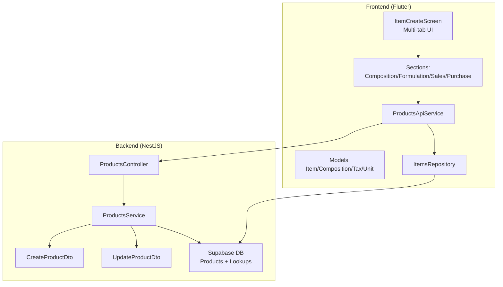

**Diagram sources**
- [items_item_create.dart](file://lib/modules/items/presentation/items_item_create.dart#L44-L544)
- [composition_section.dart](file://lib/modules/items/presentation/sections/composition_section.dart#L6-L581)
- [formulation_section.dart](file://lib/modules/items/presentation/sections/formulation_section.dart#L5-L548)
- [sales_section.dart](file://lib/modules/items/presentation/sections/sales_section.dart#L42-L335)
- [purchase_section.dart](file://lib/modules/items/presentation/sections/purchase_section.dart#L40-L380)
- [products_api_service.dart](file://lib/modules/items/services/products_api_service.dart#L7-L208)
- [items_repository.dart](file://lib/modules/items/repositories/items_repository.dart#L3-L53)
- [products.controller.ts](file://backend/src/products/products.controller.ts#L19-L250)
- [products.service.ts](file://backend/src/products/products.service.ts#L8-L723)
- [create-product.dto.ts](file://backend/src/products/dto/create-product.dto.ts#L21-L265)
- [update-product.dto.ts](file://backend/src/products/dto/update-product.dto.ts#L1-L7)
- [002_products_complete.sql](file://supabase/migrations/002_products_complete.sql#L132-L226)

**Section sources**
- [items_item_create.dart](file://lib/modules/items/presentation/items_item_create.dart#L44-L544)
- [products.controller.ts](file://backend/src/products/products.controller.ts#L19-L250)
- [products.service.ts](file://backend/src/products/products.service.ts#L8-L723)
- [create-product.dto.ts](file://backend/src/products/dto/create-product.dto.ts#L21-L265)
- [update-product.dto.ts](file://backend/src/products/dto/update-product.dto.ts#L1-L7)
- [002_products_complete.sql](file://supabase/migrations/002_products_complete.sql#L132-L226)

## Core Components
- Product Data Model (Item):
  - Comprehensive attributes covering basic info, tax/regulatory fields, sales/purchase pricing, formulation, composition, inventory settings, and system metadata
  - Includes serialization/deserialization helpers and copyWith for immutable updates
- Composition Model (ItemComposition):
  - Child table representation for product ingredients and schedules
- Tax Rate Model:
  - Lookup model for tax rates used in default tax configuration
- Unit Model:
  - Lookup model for units used across product attributes
- Multi-tab UI:
  - Composition, Formulation, Sales, Purchase sections with responsive layouts and managed lookups
- API Service:
  - Encapsulates HTTP requests to backend endpoints and error formatting
- Repository:
  - Abstraction for data access; mock implementation included

**Section sources**
- [item_model.dart](file://lib/modules/items/models/item_model.dart#L4-L461)
- [item_composition_model.dart](file://lib/modules/items/models/item_composition_model.dart#L3-L51)
- [tax_rate_model.dart](file://lib/modules/items/models/tax_rate_model.dart#L3-L38)
- [unit_model.dart](file://lib/modules/items/models/unit_model.dart#L3-L38)
- [items_item_create_tabs.dart](file://lib/modules/items/presentation/sections/items_item_create_tabs.dart#L3-L260)
- [products_api_service.dart](file://lib/modules/items/services/products_api_service.dart#L7-L208)
- [items_repository.dart](file://lib/modules/items/repositories/items_repository.dart#L3-L53)

## Architecture Overview
The system follows a layered architecture:
- Frontend captures product data via multi-tab forms and sends payloads to backend endpoints
- Backend validates payloads using DTOs, persists data to Supabase, and returns normalized responses
- Lookups (units, categories, tax rates, manufacturers, brands, vendors, storage locations, racks, reorder terms, accounts) are synchronized and queried via dedicated endpoints
- Composition data is persisted separately and linked to products

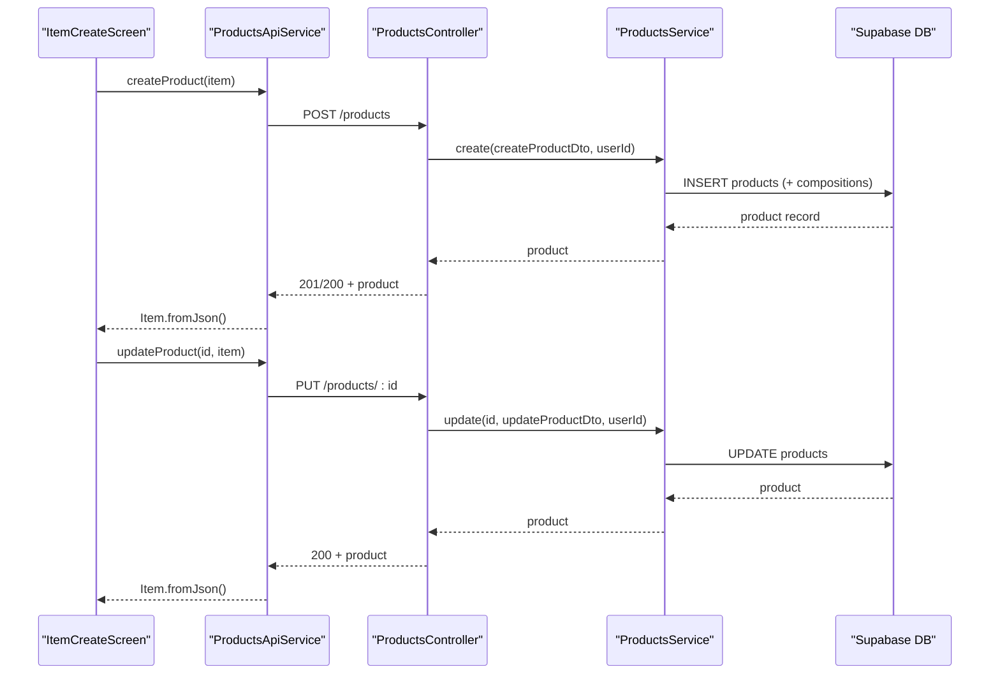

**Diagram sources**
- [items_item_create.dart](file://lib/modules/items/presentation/items_item_create.dart#L449-L451)
- [products_api_service.dart](file://lib/modules/items/services/products_api_service.dart#L80-L124)
- [products.controller.ts](file://backend/src/products/products.controller.ts#L227-L243)
- [products.service.ts](file://backend/src/products/products.service.ts#L18-L89)

## Detailed Component Analysis

### Product Data Model (Item)
The Item model defines the complete product schema with:
- Basic Info: type, product_name, billing_name, item_code, sku, unit_id, category_id, flags for returnability and e-commerce publishing
- Tax & Regulatory: hsn_code, tax_preference, intra_state_tax_id, inter_state_tax_id
- Images: primary_image_url, image_urls
- Sales: selling_price, selling_price_currency, mrp, ptr, sales_account_id, sales_description
- Purchase: cost_price, cost_price_currency, purchase_account_id, preferred_vendor_id, purchase_description
- Formulation: length, width, height, dimension_unit, weight, weight_unit, manufacturer_id, brand_id, mpn, upc, isbn, ean
- Composition: track_assoc_ingredients, buying_rule_id, schedule_of_drug_id
- Inventory Settings: is_track_inventory, track_bin_location, track_batches, track_serial_number, inventory_account_id, inventory_valuation_method, storage_id, rack_id, reorder_point, reorder_term_id
- Status Flags: is_active, is_lock, is_sales_item, is_purchase_item, is_temperature_controlled
- System Fields: created_at, created_by_id, updated_at, updated_by_id, stock_on_hand
- Composition child table: compositions

```mermaid
classDiagram
class Item {
+String? id
+String type
+String productName
+String? billingName
+String itemCode
+String? sku
+String unitId
+String? categoryId
+bool isReturnable
+bool pushToEcommerce
+String? hsnCode
+String? taxPreference
+String? intraStateTaxId
+String? interStateTaxId
+String? primaryImageUrl
+String[]? imageUrls
+double? sellingPrice
+String sellingPriceCurrency
+double? mrp
+double? ptr
+String? salesAccountId
+String? salesDescription
+double? costPrice
+String costPriceCurrency
+String? purchaseAccountId
+String? preferredVendorId
+String? purchaseDescription
+double? length
+double? width
+double? height
+String dimensionUnit
+double? weight
+String weightUnit
+String? manufacturerId
+String? brandId
+String? mpn
+String? upc
+String? isbn
+String? ean
+bool trackAssocIngredients
+String? buyingRuleId
+String? scheduleOfDrugId
+bool isTrackInventory
+bool trackBinLocation
+bool trackBatches
+bool trackSerialNumber
+String? inventoryAccountId
+String? inventoryValuationMethod
+String? storageId
+String? rackId
+int reorderPoint
+String? reorderTermId
+bool isActive
+bool isLock
+bool isSalesItem
+bool isPurchaseItem
+bool isTemperatureControlled
+ItemComposition[]? compositions
+DateTime? createdAt
+String? createdById
+DateTime? updatedAt
+String? updatedById
+double? stockOnHand
+fromJson(json)
+toJson()
+copyWith(...)
}
class ItemComposition {
+String? contentId
+String? strengthId
+String? contentUnitId
+String? scheduleId
+copyWith(...)
+fromJson(json)
+toJson()
}
Item --> ItemComposition : "has many"
```

**Diagram sources**
- [item_model.dart](file://lib/modules/items/models/item_model.dart#L4-L461)
- [item_composition_model.dart](file://lib/modules/items/models/item_composition_model.dart#L3-L51)

**Section sources**
- [item_model.dart](file://lib/modules/items/models/item_model.dart#L4-L461)
- [item_composition_model.dart](file://lib/modules/items/models/item_composition_model.dart#L3-L51)

### Multi-tab Interface Design
The product creation screen organizes fields into four primary tabs:
- Composition Information: manages active ingredients, strengths, units, buying rules, and drug schedules
- Formulate Information: handles dimensions, weights, manufacturer, brand, and identifiers (MPN, UPC, ISBN, EAN)
- Sales Information: selling price, MRP, PTR, sales account, and sales description
- Purchase Information: cost price, purchase account, preferred vendor, and purchase description

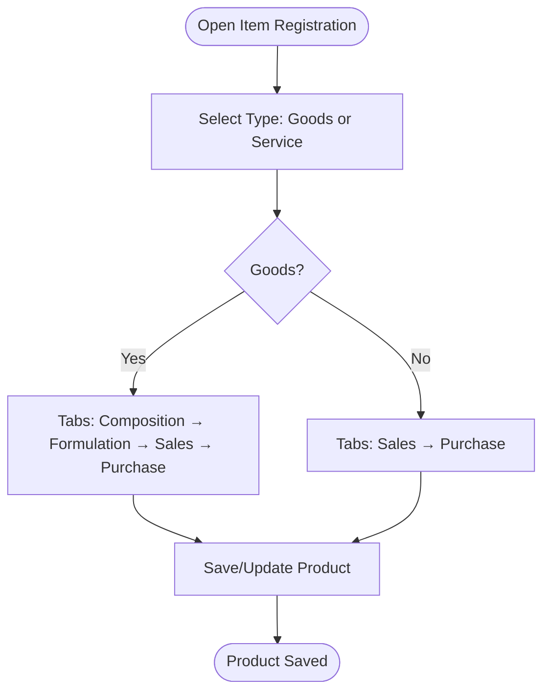

**Diagram sources**
- [items_item_create_tabs.dart](file://lib/modules/items/presentation/sections/items_item_create_tabs.dart#L3-L130)
- [items_item_create.dart](file://lib/modules/items/presentation/items_item_create.dart#L44-L544)

**Section sources**
- [items_item_create_tabs.dart](file://lib/modules/items/presentation/sections/items_item_create_tabs.dart#L3-L260)
- [items_item_create.dart](file://lib/modules/items/presentation/items_item_create.dart#L44-L544)

### Composition System for Manufactured Items
The Composition section supports:
- Track Active Ingredients flag
- Composition rows with content, strength, content unit, and schedule
- Managed lookups for contents, strengths, content units, buying rules, and drug schedules
- Add/remove rows and responsive layout for desktop and mobile
- Optional synchronization and usage checks for lookup deletions

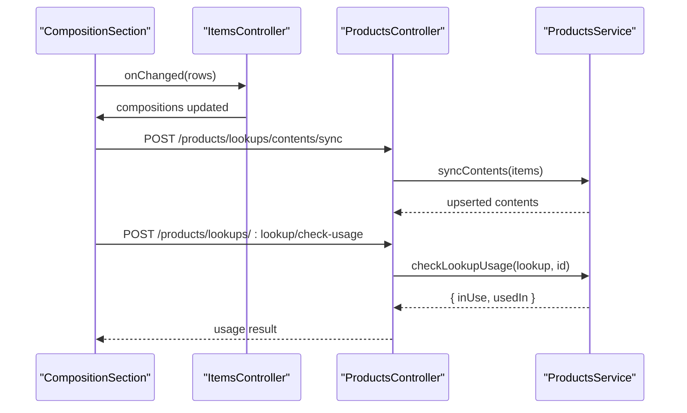

**Diagram sources**
- [composition_section.dart](file://lib/modules/items/presentation/sections/composition_section.dart#L6-L581)
- [products.controller.ts](file://backend/src/products/products.controller.ts#L173-L215)
- [products.service.ts](file://backend/src/products/products.service.ts#L548-L606)

**Section sources**
- [composition_section.dart](file://lib/modules/items/presentation/sections/composition_section.dart#L6-L581)
- [products.controller.ts](file://backend/src/products/products.controller.ts#L173-L215)
- [products.service.ts](file://backend/src/products/products.service.ts#L548-L606)

### Default Tax Rates Configuration
The Default Tax Rates section allows selecting intra-state and inter-state tax rates. It displays tax names and supports switching between read-only and editable modes.

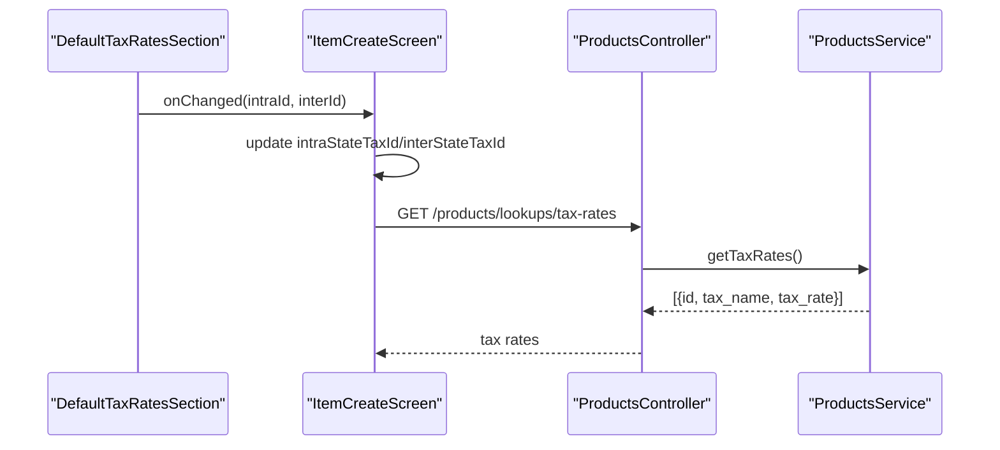

**Diagram sources**
- [default_tax_rates_section.dart](file://lib/modules/items/presentation/sections/default_tax_rates_section.dart#L5-L225)
- [products.controller.ts](file://backend/src/products/products.controller.ts#L80-L83)
- [products.service.ts](file://backend/src/products/products.service.ts#L406-L415)

**Section sources**
- [default_tax_rates_section.dart](file://lib/modules/items/presentation/sections/default_tax_rates_section.dart#L5-L225)
- [products.controller.ts](file://backend/src/products/products.controller.ts#L80-L83)
- [products.service.ts](file://backend/src/products/products.service.ts#L406-L415)

### Product Images Management
The image management UI supports:
- Uploading multiple images
- Selecting a primary image
- Thumbnail navigation and preview
- Deleting images and marking others as primary
- Integration with StorageService for upload and URL retrieval

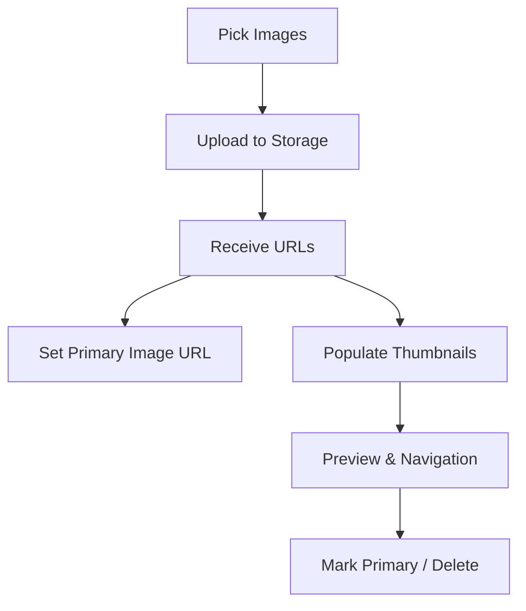

**Diagram sources**
- [items_item_create_images.dart](file://lib/modules/items/presentation/sections/items_item_create_images.dart#L141-L157)
- [items_item_create_images.dart](file://lib/modules/items/presentation/sections/items_item_create_images.dart#L290-L565)

**Section sources**
- [items_item_create_images.dart](file://lib/modules/items/presentation/sections/items_item_create_images.dart#L141-L603)

### Product Creation Workflow
End-to-end creation flow:
- Build Item from form inputs across tabs
- Optionally upload images and derive primary and image URLs
- Send payload to backend via ProductsApiService
- Backend validates via CreateProductDto and persists product and compositions
- Return normalized Item to UI

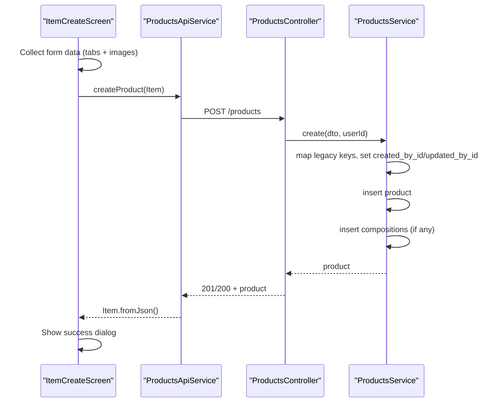

**Diagram sources**
- [items_item_create.dart](file://lib/modules/items/presentation/items_item_create.dart#L449-L524)
- [products_api_service.dart](file://lib/modules/items/services/products_api_service.dart#L80-L101)
- [products.controller.ts](file://backend/src/products/products.controller.ts#L227-L233)
- [products.service.ts](file://backend/src/products/products.service.ts#L18-L89)
- [create-product.dto.ts](file://backend/src/products/dto/create-product.dto.ts#L21-L265)

**Section sources**
- [items_item_create.dart](file://lib/modules/items/presentation/items_item_create.dart#L449-L524)
- [products_api_service.dart](file://lib/modules/items/services/products_api_service.dart#L80-L101)
- [products.controller.ts](file://backend/src/products/products.controller.ts#L227-L233)
- [products.service.ts](file://backend/src/products/products.service.ts#L18-L89)
- [create-product.dto.ts](file://backend/src/products/dto/create-product.dto.ts#L21-L265)

### Product Editing Workflow
- Pre-populate form with existing Item data
- Allow toggling tabs and editing fields
- On save, call updateProduct with Item payload
- Backend applies partial updates via UpdateProductDto

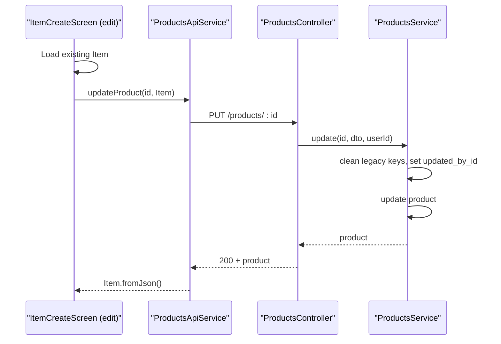

**Diagram sources**
- [items_item_create.dart](file://lib/modules/items/presentation/items_item_create.dart#L74-L139)
- [products_api_service.dart](file://lib/modules/items/services/products_api_service.dart#L103-L124)
- [products.controller.ts](file://backend/src/products/products.controller.ts#L235-L243)
- [products.service.ts](file://backend/src/products/products.service.ts#L148-L179)
- [update-product.dto.ts](file://backend/src/products/dto/update-product.dto.ts#L1-L7)

**Section sources**
- [items_item_create.dart](file://lib/modules/items/presentation/items_item_create.dart#L74-L139)
- [products_api_service.dart](file://lib/modules/items/services/products_api_service.dart#L103-L124)
- [products.controller.ts](file://backend/src/products/products.controller.ts#L235-L243)
- [products.service.ts](file://backend/src/products/products.service.ts#L148-L179)
- [update-product.dto.ts](file://backend/src/products/dto/update-product.dto.ts#L1-L7)

### Product Deletion Workflow
- Call deleteProduct(id)
- Backend performs soft delete by setting is_active=false
- Returns success message

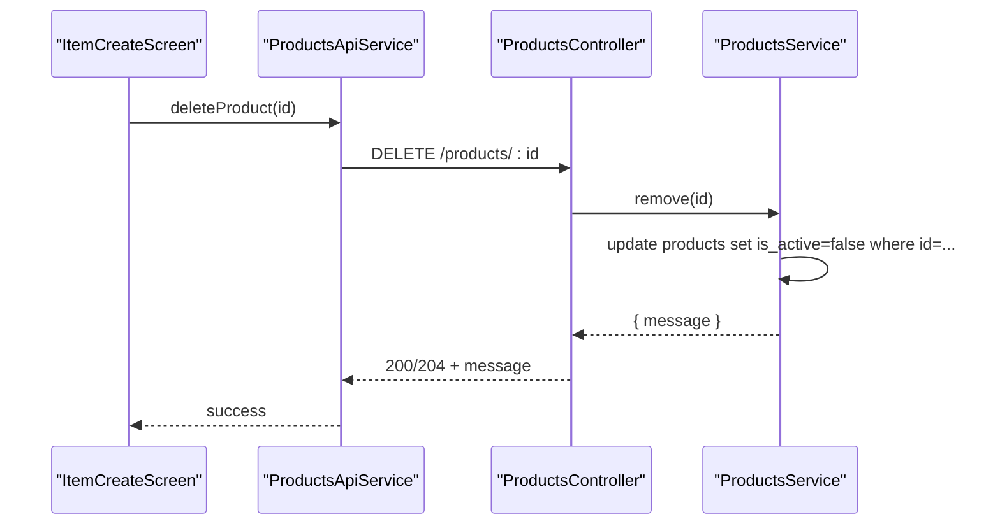

**Diagram sources**
- [products_api_service.dart](file://lib/modules/items/services/products_api_service.dart#L126-L136)
- [products.controller.ts](file://backend/src/products/products.controller.ts#L245-L248)
- [products.service.ts](file://backend/src/products/products.service.ts#L181-L194)

**Section sources**
- [products_api_service.dart](file://lib/modules/items/services/products_api_service.dart#L126-L136)
- [products.controller.ts](file://backend/src/products/products.controller.ts#L245-L248)
- [products.service.ts](file://backend/src/products/products.service.ts#L181-L194)

### Practical Examples

#### Example 1: Creating a Manufactured Good with Composition
- Select type "goods"
- Go to Composition tab and add ingredient rows with content, strength, unit, and schedule
- Save; backend persists product and compositions

#### Example 2: Configuring Default Tax Rates
- Open Default Tax Rates section and select intra-state and inter-state tax rate IDs
- Save; backend uses these IDs when calculating taxes

#### Example 3: Product Search and Filtering
- Use the items report UI to filter by item_code, product_name, category, unit, manufacturer, brand, vendor, and status flags
- Apply filters and sort to locate products efficiently

[No sources needed since this subsection provides conceptual examples]

## Dependency Analysis
- Frontend depends on:
  - Models for data typing and serialization
  - Sections for UI composition
  - ProductsApiService for HTTP communication
  - ItemsRepository for abstraction and caching
- Backend depends on:
  - DTOs for validation
  - SupabaseService for database operations
  - Migrations for schema definition

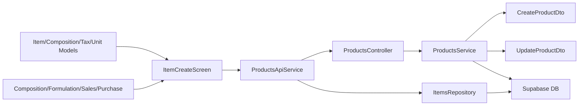

**Diagram sources**
- [item_model.dart](file://lib/modules/items/models/item_model.dart#L4-L461)
- [items_item_create.dart](file://lib/modules/items/presentation/items_item_create.dart#L44-L544)
- [products_api_service.dart](file://lib/modules/items/services/products_api_service.dart#L7-L208)
- [products.controller.ts](file://backend/src/products/products.controller.ts#L19-L250)
- [products.service.ts](file://backend/src/products/products.service.ts#L8-L723)
- [create-product.dto.ts](file://backend/src/products/dto/create-product.dto.ts#L21-L265)
- [update-product.dto.ts](file://backend/src/products/dto/update-product.dto.ts#L1-L7)
- [items_repository.dart](file://lib/modules/items/repositories/items_repository.dart#L3-L53)

**Section sources**
- [item_model.dart](file://lib/modules/items/models/item_model.dart#L4-L461)
- [items_item_create.dart](file://lib/modules/items/presentation/items_item_create.dart#L44-L544)
- [products_api_service.dart](file://lib/modules/items/services/products_api_service.dart#L7-L208)
- [products.controller.ts](file://backend/src/products/products.controller.ts#L19-L250)
- [products.service.ts](file://backend/src/products/products.service.ts#L8-L723)
- [create-product.dto.ts](file://backend/src/products/dto/create-product.dto.ts#L21-L265)
- [update-product.dto.ts](file://backend/src/products/dto/update-product.dto.ts#L1-L7)
- [items_repository.dart](file://lib/modules/items/repositories/items_repository.dart#L3-L53)

## Performance Considerations
- Use lazy loading and constrained layouts in sections to optimize rendering on smaller screens
- Minimize unnecessary re-renders by using immutable copyWith patterns and setState scoping
- Batch uploads for images and leverage thumbnail previews to reduce memory overhead
- Backend queries use indexes on frequently filtered columns (item_code, sku, category_id, unit_id, manufacturer_id, brand_id, vendor_id, is_active)
- Lookup synchronization uses upsert with conflict resolution to avoid duplicates and maintain referential integrity

[No sources needed since this section provides general guidance]

## Troubleshooting Guide
Common issues and resolutions:
- Validation errors during product creation/update:
  - The API service formats detailed validation messages from DTOs; inspect error messages and field constraints
- Item code conflicts:
  - Backend throws conflict exceptions when item_code already exists; change the item_code and retry
- Lookup usage conflicts:
  - Before deleting lookup items (e.g., units, categories, tax rates), check usage via dedicated endpoints; remove associations first
- Image upload failures:
  - The UI warns and continues if image upload fails; retry or remove problematic images

**Section sources**
- [products_api_service.dart](file://lib/modules/items/services/products_api_service.dart#L10-L49)
- [products.service.ts](file://backend/src/products/products.service.ts#L45-L51)
- [products.controller.ts](file://backend/src/products/products.controller.ts#L52-L55)
- [items_item_create_images.dart](file://lib/modules/items/presentation/sections/items_item_create_images.dart#L335-L346)

## Conclusion
The Product Master Management system provides a robust, multi-tab interface for registering and managing products, with strong backend validation, lookup synchronization, and composition handling for manufactured goods. The architecture cleanly separates concerns between frontend UI and backend services, enabling scalable enhancements and maintenance.

## Appendices

### Product Data Model Attributes Reference
- Basic Information: type, product_name, billing_name, item_code, sku, unit_id, category_id, is_returnable, push_to_ecommerce
- Tax & Regulatory: hsn_code, tax_preference, intra_state_tax_id, inter_state_tax_id
- Images: primary_image_url, image_urls
- Sales: selling_price, selling_price_currency, mrp, ptr, sales_account_id, sales_description
- Purchase: cost_price, cost_price_currency, purchase_account_id, preferred_vendor_id, purchase_description
- Formulation: length, width, height, dimension_unit, weight, weight_unit, manufacturer_id, brand_id, mpn, upc, isbn, ean
- Composition: track_assoc_ingredients, buying_rule_id, schedule_of_drug_id
- Inventory Settings: is_track_inventory, track_bin_location, track_batches, track_serial_number, inventory_account_id, inventory_valuation_method, storage_id, rack_id, reorder_point, reorder_term_id
- Status Flags: is_active, is_lock, is_sales_item, is_purchase_item, is_temperature_controlled
- System Fields: created_at, created_by_id, updated_at, updated_by_id, stock_on_hand
- Composition Child Table: compositions

**Section sources**
- [item_model.dart](file://lib/modules/items/models/item_model.dart#L4-L461)

### Backend API Endpoints Summary
- Products:
  - GET /products
  - GET /products/:id
  - POST /products
  - PUT /products/:id
  - DELETE /products/:id
- Lookups:
  - GET /products/lookups/units
  - POST /products/lookups/units/sync
  - POST /products/lookups/units/check-usage
  - GET /products/lookups/content-units
  - POST /products/lookups/content-units/sync
  - GET /products/lookups/categories
  - POST /products/lookups/categories/sync
  - GET /products/lookups/tax-rates
  - GET /products/lookups/manufacturers
  - POST /products/lookups/manufacturers/sync
  - GET /products/lookups/brands
  - POST /products/lookups/brands/sync
  - GET /products/lookups/vendors
  - POST /products/lookups/vendors/sync
  - GET /products/lookups/storage-locations
  - POST /products/lookups/storage-locations/sync
  - GET /products/lookups/racks
  - POST /products/lookups/racks/sync
  - GET /products/lookups/reorder-terms
  - POST /products/lookups/reorder-terms/sync
  - GET /products/lookups/accounts
  - POST /products/lookups/accounts/sync
  - GET /products/lookups/contents
  - POST /products/lookups/contents/sync
  - GET /products/lookups/strengths
  - POST /products/lookups/strengths/sync
  - GET /products/lookups/buying-rules
  - POST /products/lookups/buying-rules/sync
  - GET /products/lookups/drug-schedules
  - POST /products/lookups/drug-schedules/sync
  - POST /products/lookups/:lookup/check-usage

**Section sources**
- [products.controller.ts](file://backend/src/products/products.controller.ts#L23-L215)

### Database Schema Highlights
- Products table with comprehensive columns for goods/service types, pricing, tax, formulation, inventory, and system metadata
- Product compositions table linking products to content, strength, unit, and schedule
- Lookup tables for units, categories, tax rates, manufacturers, brands, accounts, storage locations, racks, reorder terms, and vendors
- Indexes optimized for common filters and joins

**Section sources**
- [002_products_complete.sql](file://supabase/migrations/002_products_complete.sql#L132-L241)