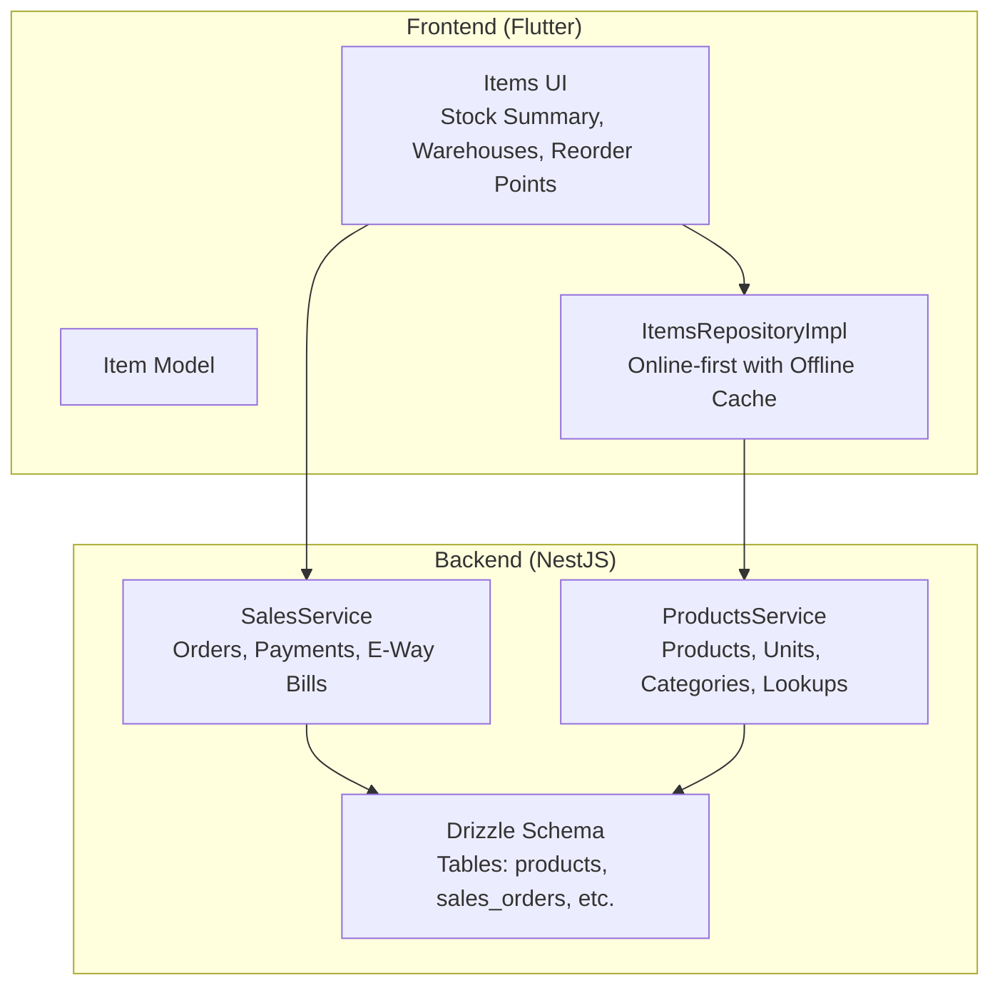
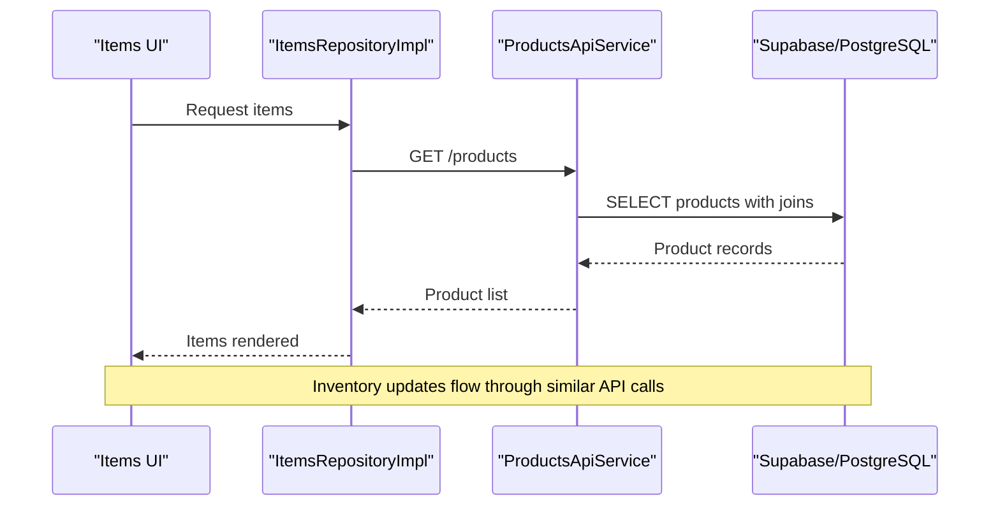
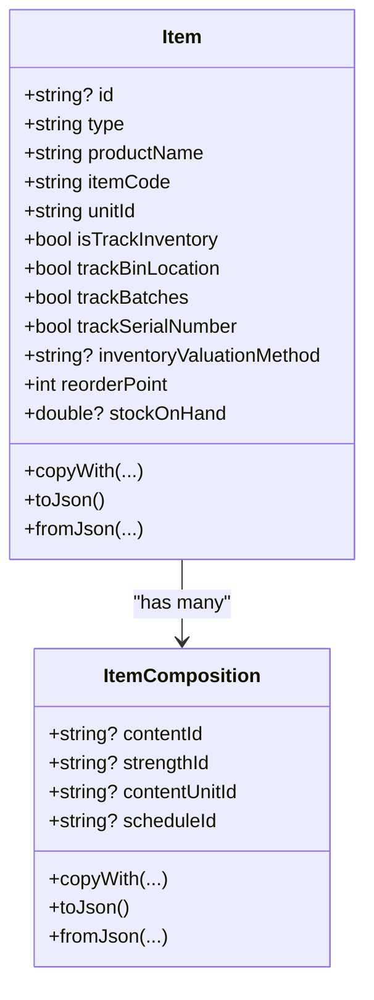
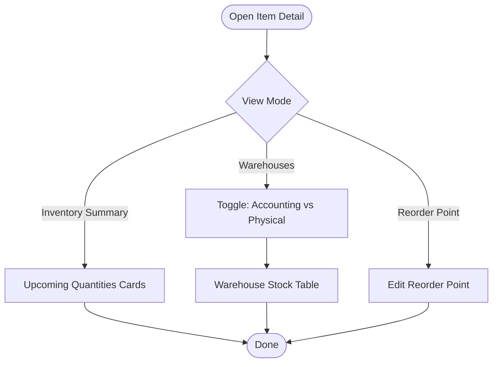
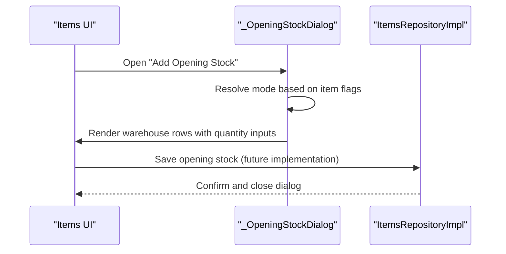
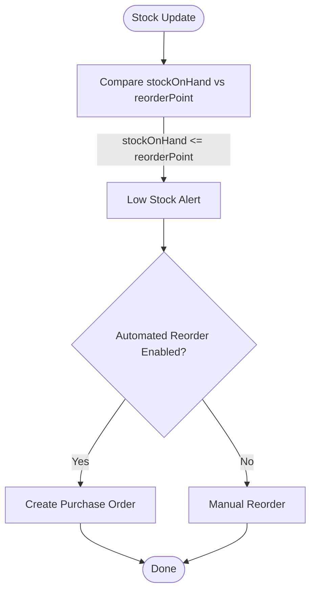
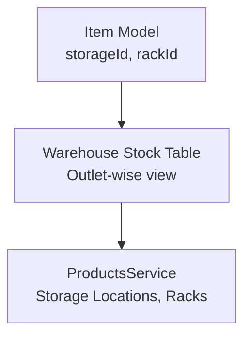
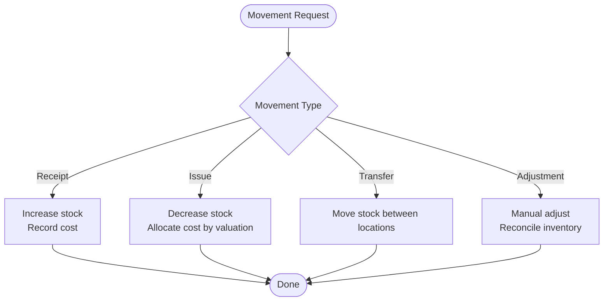
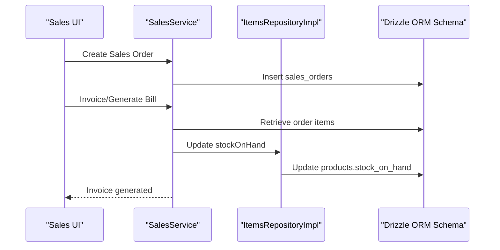
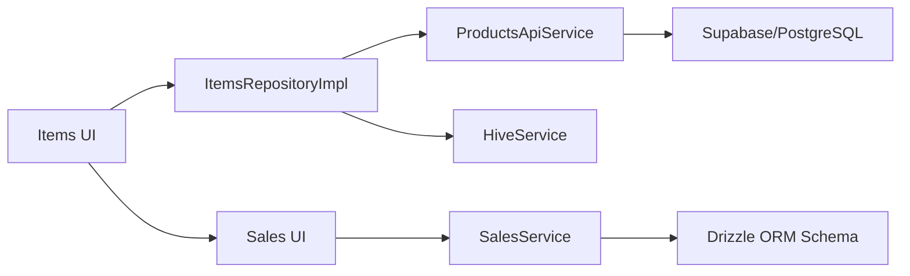

# Stock Tracking System

<cite>
**Referenced Files in This Document**
- [README.md](file://README.md)
- [PRD.md](file://PRD/PRD.md)
- [item_model.dart](file://lib/modules/items/models/item_model.dart)
- [item_composition_model.dart](file://lib/modules/items/models/item_composition_model.dart)
- [items_item_detail_stock.dart](file://lib/modules/items/presentation/sections/items_item_detail_stock.dart)
- [items_opening_stock_dialog.dart](file://lib/modules/items/presentation/sections/items_opening_stock_dialog.dart)
- [items_repository.dart](file://lib/modules/items/repositories/items_repository.dart)
- [items_repository_impl.dart](file://lib/modules/items/repositories/items_repository_impl.dart)
- [sales_order_model.dart](file://lib/modules/sales/models/sales_order_model.dart)
- [products.service.ts](file://backend/src/products/products.service.ts)
- [sales.service.ts](file://backend/src/sales/sales.service.ts)
- [schema.ts](file://backend/src/db/schema.ts)
- [batch_model.dart](file://lib/modules/items/models/batch_model.dart)
</cite>

## Table of Contents
1. [Introduction](#introduction)
2. [Project Structure](#project-structure)
3. [Core Components](#core-components)
4. [Architecture Overview](#architecture-overview)
5. [Detailed Component Analysis](#detailed-component-analysis)
6. [Dependency Analysis](#dependency-analysis)
7. [Performance Considerations](#performance-considerations)
8. [Troubleshooting Guide](#troubleshooting-guide)
9. [Conclusion](#conclusion)
10. [Appendices](#appendices)

## Introduction
This document describes the Stock Tracking System within the Zerpai ERP platform. It focuses on real-time stock monitoring, inventory valuation methods, multi-outlet stock synchronization, and the integration between stock updates and sales/invoice generation. It also covers stock movement tracking (receipts, issues, transfers, adjustments), valuation algorithms (FIFO/LIFO), reorder point management, low stock alerts, and automated reordering workflows. Practical examples of stock transactions, batch-specific tracking, and inventory reconciliation procedures are included to guide implementation and operational excellence.

## Project Structure
The Stock Tracking System spans the frontend Flutter modules and the backend NestJS services:
- Frontend (Flutter):
  - Items domain: models, repositories, and UI for inventory management, including stock summary, warehouse locations, reorder points, and opening stock.
  - Sales domain: models for sales orders and payments.
- Backend (NestJS):
  - Products service for product metadata, units, categories, and lookups.
  - Sales service for sales order lifecycle and related documents.
  - Drizzle ORM schema for database modeling.

**Diagram sources**
- [items_item_detail_stock.dart](file://lib/modules/items/presentation/sections/items_item_detail_stock.dart#L1-L786)
- [items_repository_impl.dart](file://lib/modules/items/repositories/items_repository_impl.dart#L1-L297)
- [products.service.ts](file://backend/src/products/products.service.ts#L1-L723)
- [sales.service.ts](file://backend/src/sales/sales.service.ts#L1-L162)
- [schema.ts](file://backend/src/db/schema.ts#L1-L200)

**Section sources**
- [README.md](file://README.md#L1-L200)
- [PRD.md](file://PRD/PRD.md#L1-L300)

## Core Components
- Item Model: Central entity representing products with inventory flags (tracking batches, serial numbers, bin locations), valuation method, reorder point, and stock-on-hand.
- Items Repository Implementation: Online-first caching strategy with Hive for offline access and fallback.
- Sales Order Model: Defines sales documents with totals and items for invoice generation and stock impact.
- Backend Services:
  - ProductsService: CRUD and metadata sync for products, units, categories, and lookups.
  - SalesService: CRUD for sales orders, payments, and e-way bills.

**Section sources**
- [item_model.dart](file://lib/modules/items/models/item_model.dart#L1-L461)
- [items_repository.dart](file://lib/modules/items/repositories/items_repository.dart#L1-L53)
- [items_repository_impl.dart](file://lib/modules/items/repositories/items_repository_impl.dart#L1-L297)
- [sales_order_model.dart](file://lib/modules/sales/models/sales_order_model.dart#L1-L118)
- [products.service.ts](file://backend/src/products/products.service.ts#L1-L723)
- [sales.service.ts](file://backend/src/sales/sales.service.ts#L1-L162)

## Architecture Overview
The system integrates frontend UI with backend services and database:
- Frontend reads/writes product and inventory data via ItemsRepositoryImpl, which calls ProductsApiService and caches results in Hive.
- Sales operations are handled by SalesService and persisted via Drizzle ORM schema.
- Inventory valuation and movement are modeled conceptually through the Item model’s valuation method and reorder point fields.

**Diagram sources**
- [items_repository_impl.dart](file://lib/modules/items/repositories/items_repository_impl.dart#L24-L83)
- [products.service.ts](file://backend/src/products/products.service.ts#L91-L118)

## Detailed Component Analysis

### Item Model and Inventory Settings
The Item model encapsulates inventory-related attributes:
- Tracking flags: isTrackInventory, trackBinLocation, trackBatches, trackSerialNumber.
- Valuation: inventoryValuationMethod.
- Reorder point: reorderPoint and reorderTermId.
- Stock-on-hand: stockOnHand.

These fields enable:
- Real-time stock monitoring by toggling views (accounting vs physical stock).
- Batch and serial tracking modes for opening stock and future movements.
- Reorder point management for low stock alerts and automated reordering workflows.

**Diagram sources**
- [item_model.dart](file://lib/modules/items/models/item_model.dart#L4-L172)
- [item_composition_model.dart](file://lib/modules/items/models/item_composition_model.dart#L3-L50)

**Section sources**
- [item_model.dart](file://lib/modules/items/models/item_model.dart#L74-L86)
- [item_model.dart](file://lib/modules/items/models/item_model.dart#L106-L107)

### Stock Monitoring UI (Warehouses and Reorder Points)
The Items UI provides:
- Inventory Summary cards for upcoming quantities (to be shipped, received, invoiced, billed).
- Warehouse stock view with toggle between Accounting Stock and Physical Stock.
- Reorder Point section with add/edit capability.

**Diagram sources**
- [items_item_detail_stock.dart](file://lib/modules/items/presentation/sections/items_item_detail_stock.dart#L4-L48)
- [items_item_detail_stock.dart](file://lib/modules/items/presentation/sections/items_item_detail_stock.dart#L50-L106)
- [items_item_detail_stock.dart](file://lib/modules/items/presentation/sections/items_item_detail_stock.dart#L521-L610)

**Section sources**
- [items_item_detail_stock.dart](file://lib/modules/items/presentation/sections/items_item_detail_stock.dart#L4-L48)
- [items_item_detail_stock.dart](file://lib/modules/items/presentation/sections/items_item_detail_stock.dart#L50-L106)
- [items_item_detail_stock.dart](file://lib/modules/items/presentation/sections/items_item_detail_stock.dart#L521-L610)

### Opening Stock Dialog and Batch/Serial Modes
The Opening Stock dialog supports:
- Per-warehouse quantity entry.
- Mode selection based on tracking flags:
  - Batches: batch-specific tracking.
  - Serials: serial-number tracking.
  - None: standard quantity-only.

**Diagram sources**
- [items_opening_stock_dialog.dart](file://lib/modules/items/presentation/sections/items_opening_stock_dialog.dart#L18-L100)
- [items_opening_stock_dialog.dart](file://lib/modules/items/presentation/sections/items_opening_stock_dialog.dart#L102-L162)
- [items_item_detail_stock.dart](file://lib/modules/items/presentation/sections/items_item_detail_stock.dart#L411-L417)

**Section sources**
- [items_opening_stock_dialog.dart](file://lib/modules/items/presentation/sections/items_opening_stock_dialog.dart#L1-L171)
- [items_item_detail_stock.dart](file://lib/modules/items/presentation/sections/items_item_detail_stock.dart#L411-L417)

### Inventory Valuation Methods and Cost Calculation Mechanisms
Valuation method is stored in the Item model as inventoryValuationMethod. While the frontend currently exposes this field, backend valuation logic is not implemented in the provided files. Recommended approaches:
- FIFO: First In, First Out; cost of goods sold follows chronological receipt.
- LIFO: Last In, First Out; cost of goods sold follows most recent receipt.
- Weighted Average: Average cost per unit based on total cost/quantity.
- Specific/Standard: Specific identification or fixed/standard costs.

Integration points:
- Backend ProductsService stores valuation method in products.
- Future backend stock movement service should implement valuation calculations during receipts/issues/transfers.

**Section sources**
- [item_model.dart](file://lib/modules/items/models/item_model.dart#L81-L81)
- [products.service.ts](file://backend/src/products/products.service.ts#L18-L89)

### Reorder Point Management, Low Stock Alerts, and Automated Reordering
Reorder point is part of the Item model (reorderPoint). The UI enables adding/editing reorder points and displays them in a dedicated section. Automated reordering workflows can be implemented by:
- Comparing current stock-on-hand against reorder point.
- Triggering purchase orders when stock falls below reorder point.
- Integrating with purchase order creation in the sales domain.

**Diagram sources**
- [item_model.dart](file://lib/modules/items/models/item_model.dart#L84-L84)
- [items_item_detail_stock.dart](file://lib/modules/items/presentation/sections/items_item_detail_stock.dart#L521-L610)

**Section sources**
- [item_model.dart](file://lib/modules/items/models/item_model.dart#L84-L84)
- [items_item_detail_stock.dart](file://lib/modules/items/presentation/sections/items_item_detail_stock.dart#L521-L610)

### Multi-Outlets Stock Synchronization
Multi-outlet synchronization can be achieved by:
- Storing warehouse/location identifiers in the Item model (storageId/rackId).
- Using warehouse rows in the UI to represent outlet-specific stock.
- Backend lookups for storage locations and racks to maintain consistency.

**Diagram sources**
- [item_model.dart](file://lib/modules/items/models/item_model.dart#L82-L83)
- [items_item_detail_stock.dart](file://lib/modules/items/presentation/sections/items_item_detail_stock.dart#L108-L215)
- [products.service.ts](file://backend/src/products/products.service.ts#L488-L531)

**Section sources**
- [item_model.dart](file://lib/modules/items/models/item_model.dart#L82-L83)
- [items_item_detail_stock.dart](file://lib/modules/items/presentation/sections/items_item_detail_stock.dart#L108-L215)
- [products.service.ts](file://backend/src/products/products.service.ts#L488-L531)

### Stock Movement Tracking (Receipts, Issues, Transfers, Adjustments)
Conceptual flow for stock movements:
- Receipts: Increase stockOnHand; optionally tracked by batches/serials.
- Issues: Decrease stockOnHand; allocate cost based on valuation method.
- Transfers: Move stock between warehouses/locations.
- Adjustments: Manual increases/decreases for inventory reconciliation.

[No sources needed since this diagram shows conceptual workflow, not actual code structure]

### Integration Between Stock Updates and Sales/Invoice Generation
Sales orders drive stock reduction upon invoicing. The SalesService manages sales documents and totals. Integration points:
- On invoice creation, reduce stockOnHand for ordered items.
- Apply valuation method to compute cost of goods sold.
- Maintain audit trail of stock movements linked to sales.

**Diagram sources**
- [sales.service.ts](file://backend/src/sales/sales.service.ts#L80-L97)
- [sales_order_model.dart](file://lib/modules/sales/models/sales_order_model.dart#L1-L118)
- [items_repository_impl.dart](file://lib/modules/items/repositories/items_repository_impl.dart#L200-L239)
- [schema.ts](file://backend/src/db/schema.ts#L1-L200)

**Section sources**
- [sales.service.ts](file://backend/src/sales/sales.service.ts#L80-L97)
- [sales_order_model.dart](file://lib/modules/sales/models/sales_order_model.dart#L1-L118)
- [items_repository_impl.dart](file://lib/modules/items/repositories/items_repository_impl.dart#L200-L239)

### Practical Examples

#### Example 1: Adding Opening Stock with Batch Tracking
- Enable trackBatches on the item.
- Open “Add Opening Stock” dialog.
- Enter quantities per warehouse; the UI indicates “No batches added” until batch entries are provided.
- Save operation persists opening stock and initializes batch records for future receipts/issues.

**Section sources**
- [items_opening_stock_dialog.dart](file://lib/modules/items/presentation/sections/items_opening_stock_dialog.dart#L149-L155)
- [items_item_detail_stock.dart](file://lib/modules/items/presentation/sections/items_item_detail_stock.dart#L411-L417)

#### Example 2: Low Stock Alert and Automated Reorder
- Set reorderPoint on an item.
- When stockOnHand drops below reorderPoint, the UI highlights the reorder point section.
- Automated workflow triggers purchase order creation when stock falls below threshold.

**Section sources**
- [items_item_detail_stock.dart](file://lib/modules/items/presentation/sections/items_item_detail_stock.dart#L521-L610)
- [item_model.dart](file://lib/modules/items/models/item_model.dart#L84-L84)

#### Example 3: Inventory Reconciliation
- Compare Accounting Stock vs Physical Stock.
- Investigate discrepancies by reviewing receipts/issues/transfers.
- Apply adjustments to reconcile stockOnHand.

**Section sources**
- [items_item_detail_stock.dart](file://lib/modules/items/presentation/sections/items_item_detail_stock.dart#L276-L338)

## Dependency Analysis
- ItemsRepositoryImpl depends on ProductsApiService and HiveService for online-first caching.
- Items UI depends on Item model and ItemsRepositoryImpl.
- SalesService depends on Drizzle ORM schema for persistence.
- ProductsService depends on Supabase for product and lookup data.

**Diagram sources**
- [items_repository_impl.dart](file://lib/modules/items/repositories/items_repository_impl.dart#L14-L22)
- [items_repository.dart](file://lib/modules/items/repositories/items_repository.dart#L1-L53)
- [sales.service.ts](file://backend/src/sales/sales.service.ts#L1-L162)
- [schema.ts](file://backend/src/db/schema.ts#L1-L200)
- [products.service.ts](file://backend/src/products/products.service.ts#L1-L723)

**Section sources**
- [items_repository_impl.dart](file://lib/modules/items/repositories/items_repository_impl.dart#L14-L22)
- [sales.service.ts](file://backend/src/sales/sales.service.ts#L1-L162)
- [products.service.ts](file://backend/src/products/products.service.ts#L1-L723)

## Performance Considerations
- Online-first caching reduces latency and improves reliability; fallback to Hive ensures availability during network issues.
- Use warehouse toggles to minimize heavy computations for large datasets.
- Batch and serial tracking should be enabled selectively to avoid unnecessary overhead.

[No sources needed since this section provides general guidance]

## Troubleshooting Guide
- Network/API errors: ItemsRepositoryImpl logs warnings and falls back to Hive cache. Verify connectivity and retry.
- Cache failures: Errors during caching are logged but do not block operations; check HiveService health.
- API exceptions: Logged with status codes; inspect logs for resolution.
- Sales order retrieval: Throws NotFoundException if ID not found; validate IDs before operations.

**Section sources**
- [items_repository_impl.dart](file://lib/modules/items/repositories/items_repository_impl.dart#L57-L82)
- [items_repository_impl.dart](file://lib/modules/items/repositories/items_repository_impl.dart#L140-L162)
- [sales.service.ts](file://backend/src/sales/sales.service.ts#L72-L78)

## Conclusion
The Stock Tracking System integrates frontend inventory UI with backend services and database to support real-time monitoring, valuation, and multi-outlet synchronization. While valuation and movement logic are not fully implemented in the provided files, the Item model and UI components lay a strong foundation for FIFO/LIFO and batch/serial tracking, reorder point management, and sales-driven inventory updates. Extending backend services with valuation algorithms and stock movement handlers will complete the system’s capabilities.

## Appendices

### Appendix A: Batch Model Placeholder
A batch model file exists but is currently empty. It should define batch-specific attributes (batch number, expiry date, quantity, cost) to support batch-level tracking.

**Section sources**
- [batch_model.dart](file://lib/modules/items/models/batch_model.dart#L1-L2)