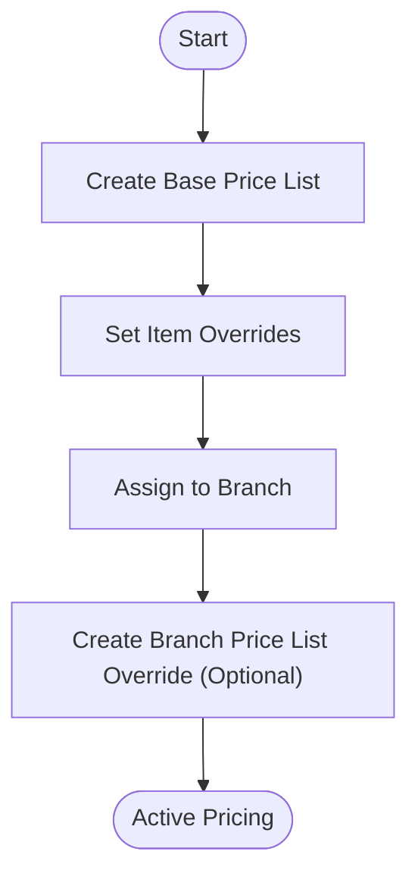

# Price Lists Management

## Introduction
Price Lists in Zerpai ERP allow businesses to manage custom pricing for different scenarios, such as wholesale rates, seasonal discounts, or branch-specific pricing. This module is separate from the core Items module to allow for flexible price management across the organization.

## Core Components
- **Price List**: Defines the base pricing rules and item-level price overrides.
- **Branch Price List**: Allows specific branches to override the base price list or create unique pricing for their local market.

## Key Workflows
1. **Create Price List**: Define a name, currency, and pricing scheme (e.g., Markup/Markdown or individual item pricing).
2. **Assign to Branch**: Map a price list to one or more branches.
3. **Item Pricing Overrides**: Specify custom rates for individual items within a price list.

## Sidebar Navigation
Price Lists is a standalone module in the sidebar with the following structure:
- **Price List**
- **Branch Price List**
