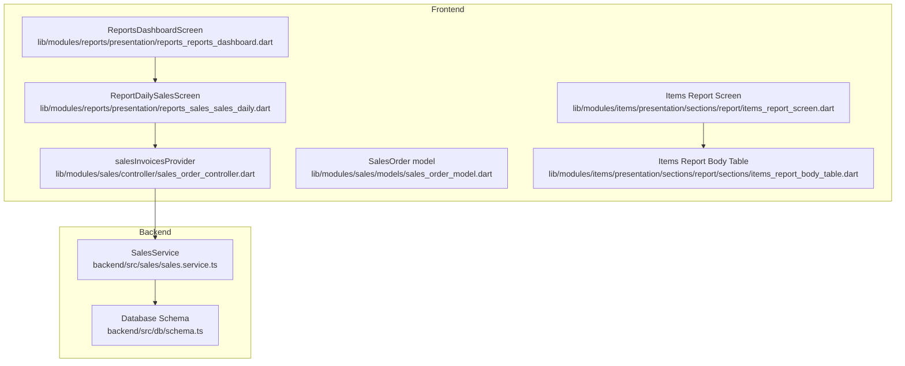
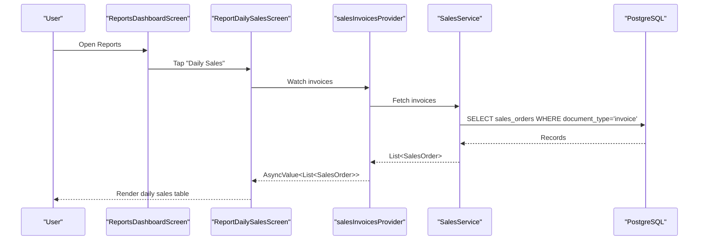
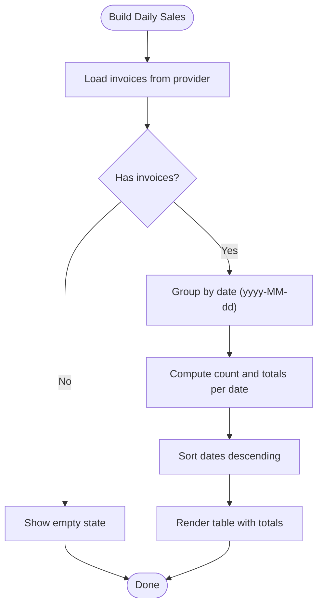
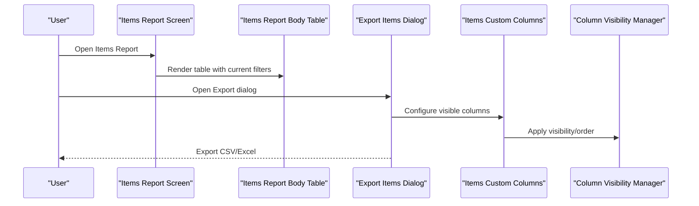
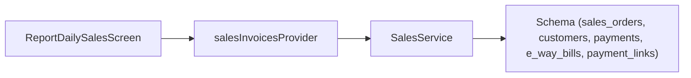

# Reporting & Analytics

<cite>
**Referenced Files in This Document**
- [reports_reports_dashboard.dart](file://lib/modules/reports/presentation/reports_reports_dashboard.dart)
- [reports_sales_sales_daily.dart](file://lib/modules/reports/presentation/reports_sales_sales_daily.dart)
- [sales_order_controller.dart](file://lib/modules/sales/controller/sales_order_controller.dart)
- [sales_order_model.dart](file://lib/modules/sales/models/sales_order_model.dart)
- [sales.service.ts](file://backend/src/sales/sales.service.ts)
- [schema.ts](file://backend/src/db/schema.ts)
- [items_report_screen.dart](file://lib/modules/items/presentation/sections/report/items_report_screen.dart)
- [items_report_body_table.dart](file://lib/modules/items/presentation/sections/report/sections/items_report_body_table.dart)
- [export_items_dialog.dart](file://lib/modules/items/presentation/sections/report/dialogs/export_items_dialog.dart)
- [items_custom_columns.dart](file://lib/modules/items/presentation/sections/report/dialogs/items_custom_columns.dart)
- [column_visibility_manager.dart](file://lib/modules/items/presentation/sections/report/column_visibility_manager.dart)
</cite>

## Table of Contents
1. [Introduction](#introduction)
2. [Project Structure](#project-structure)
3. [Core Components](#core-components)
4. [Architecture Overview](#architecture-overview)
5. [Detailed Component Analysis](#detailed-component-analysis)
6. [Dependency Analysis](#dependency-analysis)
7. [Performance Considerations](#performance-considerations)
8. [Troubleshooting Guide](#troubleshooting-guide)
9. [Conclusion](#conclusion)
10. [Appendices](#appendices)

## Introduction
This document describes the Reporting & Analytics feature of the system. It covers the dashboard components, sales reporting, inventory analytics, GST compliance reporting, and financial dashboards. It explains the reporting engine architecture, data visualization components, export capabilities (CSV, Excel), and report customization options. Practical examples illustrate report generation, dashboard usage, sales analytics interpretation, and inventory reporting workflows. The reporting data sources, aggregation mechanisms, and performance optimization strategies for large datasets are documented.

## Project Structure
The Reporting & Analytics feature spans frontend Flutter screens and providers and backend NestJS services backed by PostgreSQL via Drizzle ORM. The frontend provides:
- A Reports Dashboard screen with summary cards and categorized report links
- A Daily Sales Report screen that aggregates invoices by date
- Items report screens with filtering, sorting, and export dialog support

The backend exposes sales data and related entities (customers, payments, e-way bills, payment links) through typed services and database schemas.

**Diagram sources**
- [reports_reports_dashboard.dart](file://lib/modules/reports/presentation/reports_reports_dashboard.dart#L1-L214)
- [reports_sales_sales_daily.dart](file://lib/modules/reports/presentation/reports_sales_sales_daily.dart#L1-L213)
- [sales_order_controller.dart](file://lib/modules/sales/controller/sales_order_controller.dart#L1-L119)
- [sales_order_model.dart](file://lib/modules/sales/models/sales_order_model.dart#L1-L118)
- [sales.service.ts](file://backend/src/sales/sales.service.ts#L1-L162)
- [schema.ts](file://backend/src/db/schema.ts#L213-L292)
- [items_report_screen.dart](file://lib/modules/items/presentation/sections/report/items_report_screen.dart)
- [items_report_body_table.dart](file://lib/modules/items/presentation/sections/report/sections/items_report_body_table.dart)

**Section sources**
- [reports_reports_dashboard.dart](file://lib/modules/reports/presentation/reports_reports_dashboard.dart#L1-L214)
- [reports_sales_sales_daily.dart](file://lib/modules/reports/presentation/reports_sales_sales_daily.dart#L1-L213)
- [sales_order_controller.dart](file://lib/modules/sales/controller/sales_order_controller.dart#L1-L119)
- [sales_order_model.dart](file://lib/modules/sales/models/sales_order_model.dart#L1-L118)
- [sales.service.ts](file://backend/src/sales/sales.service.ts#L1-L162)
- [schema.ts](file://backend/src/db/schema.ts#L213-L292)
- [items_report_screen.dart](file://lib/modules/items/presentation/sections/report/items_report_screen.dart)
- [items_report_body_table.dart](file://lib/modules/items/presentation/sections/report/sections/items_report_body_table.dart)

## Core Components
- Reports Dashboard Screen: Presents summary cards and categorized report links (Sales, Inventory, Receivables, Tax).
- Daily Sales Report Screen: Aggregates sales invoices by date and displays counts and totals in a tabular format.
- Sales Data Providers: Riverpod providers expose sales data (invoices, quotes, payments, credit notes, etc.) to the UI.
- Backend SalesService: Provides CRUD and lookup operations for sales-related entities and supports GSTIN lookup.
- Database Schema: Defines sales orders, customers, payments, e-way bills, and payment links tables.

Practical examples:
- Navigate to “Daily Sales” from the Reports Dashboard to view aggregated daily sales.
- Use the Items Report screen to filter, sort, and export item records.

**Section sources**
- [reports_reports_dashboard.dart](file://lib/modules/reports/presentation/reports_reports_dashboard.dart#L1-L214)
- [reports_sales_sales_daily.dart](file://lib/modules/reports/presentation/reports_sales_sales_daily.dart#L1-L213)
- [sales_order_controller.dart](file://lib/modules/sales/controller/sales_order_controller.dart#L1-L119)
- [sales.service.ts](file://backend/src/sales/sales.service.ts#L1-L162)
- [schema.ts](file://backend/src/db/schema.ts#L213-L292)

## Architecture Overview
The reporting architecture follows a layered pattern:
- Frontend: Screens and Riverpod providers fetch and render data.
- Backend: NestJS services encapsulate business logic and query the database.
- Data Store: PostgreSQL tables define normalized entities for sales, customers, payments, e-way bills, and payment links.

**Diagram sources**
- [reports_reports_dashboard.dart](file://lib/modules/reports/presentation/reports_reports_dashboard.dart#L194-L196)
- [reports_sales_sales_daily.dart](file://lib/modules/reports/presentation/reports_sales_sales_daily.dart#L13-L14)
- [sales_order_controller.dart](file://lib/modules/sales/controller/sales_order_controller.dart#L31-L33)
- [sales.service.ts](file://backend/src/sales/sales.service.ts#L64-L66)
- [schema.ts](file://backend/src/db/schema.ts#L237-L253)

## Detailed Component Analysis

### Reports Dashboard
Responsibilities:
- Display summary KPIs (Total Sales, Total Customers, Pending Invoices, Escaped Profits).
- Present categorized report tiles (Sales, Inventory, Receivables, Tax) with actionable links.

Usage example:
- From the dashboard, select “Daily Sales” to navigate to the daily sales report screen.

Customization:
- Add new report categories and items by extending the report grid builder.

**Section sources**
- [reports_reports_dashboard.dart](file://lib/modules/reports/presentation/reports_reports_dashboard.dart#L32-L112)
- [reports_reports_dashboard.dart](file://lib/modules/reports/presentation/reports_reports_dashboard.dart#L114-L156)
- [reports_reports_dashboard.dart](file://lib/modules/reports/presentation/reports_reports_dashboard.dart#L158-L212)

### Daily Sales Report
Responsibilities:
- Load invoices via a Riverpod provider.
- Group invoices by date, compute invoice count and total amounts per day.
- Render a summary table with totals.

Processing logic:
- Extract date part from saleDate, aggregate counts and totals, sort by date descending, and render a totals row.

**Diagram sources**
- [reports_sales_sales_daily.dart](file://lib/modules/reports/presentation/reports_sales_sales_daily.dart#L23-L200)

**Section sources**
- [reports_sales_sales_daily.dart](file://lib/modules/reports/presentation/reports_sales_sales_daily.dart#L9-L204)

### Sales Data Providers and Models
Responsibilities:
- Provide typed access to sales data (invoices, quotes, payments, credit notes, etc.).
- Define the SalesOrder model used across screens.

Key points:
- salesInvoicesProvider returns invoices filtered by document type.
- SalesOrder model includes saleDate, total, and related metadata.

**Section sources**
- [sales_order_controller.dart](file://lib/modules/sales/controller/sales_order_controller.dart#L31-L33)
- [sales_order_model.dart](file://lib/modules/sales/models/sales_order_model.dart#L4-L51)
- [sales_order_model.dart](file://lib/modules/sales/models/sales_order_model.dart#L53-L96)

### Backend SalesService and Schema
Responsibilities:
- Expose findSalesByType to filter sales documents by type (e.g., invoice).
- Support GSTIN lookup (mocked).
- Define tables for customers, sales orders, payments, e-way bills, and payment links.

Data sources:
- sales_orders table stores invoices and related totals.
- customers table holds customer metadata including GSTIN.

**Section sources**
- [sales.service.ts](file://backend/src/sales/sales.service.ts#L64-L66)
- [sales.service.ts](file://backend/src/sales/sales.service.ts#L9-L27)
- [schema.ts](file://backend/src/db/schema.ts#L237-L253)
- [schema.ts](file://backend/src/db/schema.ts#L214-L234)
- [schema.ts](file://backend/src/db/schema.ts#L254-L267)
- [schema.ts](file://backend/src/db/schema.ts#L269-L281)
- [schema.ts](file://backend/src/db/schema.ts#L283-L291)

### Inventory Analytics and Export Dialogs
Responsibilities:
- Items Report Screen: Presents filters, views, and actions for item records.
- Items Report Body Table: Renders item data with customizable columns.
- Export Items Dialog: Enables exporting item lists (CSV/Excel).
- Items Custom Columns: Allows selecting visible columns.
- Column Visibility Manager: Manages visibility and ordering of columns.

Workflow example:
- Open Items Report screen, apply filters, open Export dialog, choose CSV/Excel, and download.

**Diagram sources**
- [items_report_screen.dart](file://lib/modules/items/presentation/sections/report/items_report_screen.dart)
- [items_report_body_table.dart](file://lib/modules/items/presentation/sections/report/sections/items_report_body_table.dart)
- [export_items_dialog.dart](file://lib/modules/items/presentation/sections/report/dialogs/export_items_dialog.dart)
- [items_custom_columns.dart](file://lib/modules/items/presentation/sections/report/dialogs/items_custom_columns.dart)
- [column_visibility_manager.dart](file://lib/modules/items/presentation/sections/report/column_visibility_manager.dart)

**Section sources**
- [items_report_screen.dart](file://lib/modules/items/presentation/sections/report/items_report_screen.dart)
- [items_report_body_table.dart](file://lib/modules/items/presentation/sections/report/sections/items_report_body_table.dart)
- [export_items_dialog.dart](file://lib/modules/items/presentation/sections/report/dialogs/export_items_dialog.dart)
- [items_custom_columns.dart](file://lib/modules/items/presentation/sections/report/dialogs/items_custom_columns.dart)
- [column_visibility_manager.dart](file://lib/modules/items/presentation/sections/report/column_visibility_manager.dart)

### GST Compliance Reporting
Current capability:
- GSTIN lookup is supported by SalesService (mocked).
- No dedicated GST Summary or Tax Liability Report screens are present in the frontend.

Recommendation:
- Extend backend with GST computation endpoints and add frontend screens for GST Summary and Tax Liability Report.

**Section sources**
- [sales.service.ts](file://backend/src/sales/sales.service.ts#L9-L27)

### Financial Dashboards
Current capability:
- Reports Dashboard includes summary cards for Total Sales, Total Customers, Pending Invoices, and Escaped Profits.
- Daily Sales Report aggregates invoice totals by date.

Recommendation:
- Add more financial KPIs and drill-down visuals (e.g., revenue by period, receivables aging) using chart libraries.

**Section sources**
- [reports_reports_dashboard.dart](file://lib/modules/reports/presentation/reports_reports_dashboard.dart#L32-L63)
- [reports_sales_sales_daily.dart](file://lib/modules/reports/presentation/reports_sales_sales_daily.dart#L34-L51)

## Dependency Analysis
The reporting feature exhibits clear separation of concerns:
- Frontend screens depend on Riverpod providers for data.
- Providers depend on backend services.
- Services query normalized database tables.

**Diagram sources**
- [reports_sales_sales_daily.dart](file://lib/modules/reports/presentation/reports_sales_sales_daily.dart#L13-L14)
- [sales_order_controller.dart](file://lib/modules/sales/controller/sales_order_controller.dart#L31-L33)
- [sales.service.ts](file://backend/src/sales/sales.service.ts#L64-L66)
- [schema.ts](file://backend/src/db/schema.ts#L237-L253)

**Section sources**
- [reports_sales_sales_daily.dart](file://lib/modules/reports/presentation/reports_sales_sales_daily.dart#L13-L204)
- [sales_order_controller.dart](file://lib/modules/sales/controller/sales_order_controller.dart#L31-L33)
- [sales.service.ts](file://backend/src/sales/sales.service.ts#L64-L66)
- [schema.ts](file://backend/src/db/schema.ts#L237-L253)

## Performance Considerations
- Pagination and virtualization: Implement pagination or virtual scrolling in large report tables to limit DOM/rendering overhead.
- Client-side caching: Cache frequently accessed report data (e.g., daily sales) to reduce network requests.
- Efficient grouping/aggregation: Prefer server-side aggregation for large datasets; if client-side, use efficient Map-based accumulation and avoid repeated sorts.
- Debounced filters: Debounce filter inputs to minimize re-computation during typing.
- Column virtualization: For wide item reports, virtualize columns to improve rendering performance.
- Export batching: For exports, stream or chunk large datasets to avoid memory spikes.

## Troubleshooting Guide
Common issues and resolutions:
- Empty report data: Verify that invoices exist with documentType set to invoice and that the provider is subscribed.
- Loading errors: Inspect AsyncValue error handling in the Daily Sales screen and ensure backend endpoints return expected shapes.
- Export failures: Confirm export dialog configuration and selected columns; validate CSV/Excel generation pipeline.
- Column visibility mismatches: Check column visibility manager state and custom columns dialog selections.

**Section sources**
- [reports_sales_sales_daily.dart](file://lib/modules/reports/presentation/reports_sales_sales_daily.dart#L184-L199)
- [export_items_dialog.dart](file://lib/modules/items/presentation/sections/report/dialogs/export_items_dialog.dart)

## Conclusion
The Reporting & Analytics feature provides a solid foundation with a dashboard, daily sales aggregation, and robust export capabilities for items. The backend offers typed access to sales data and supports GSTIN lookup. To enhance the system, add dedicated GST and tax liability reports, expand financial dashboards with richer KPIs and charts, and implement server-side aggregation and advanced export features for large datasets.

## Appendices

### Practical Examples Index
- Generate Daily Sales Report: Open Reports Dashboard → Tap “Daily Sales” → Review aggregated table.
- Export Items Report: Open Items Report → Open Export dialog → Choose CSV/Excel → Download.
- Customize Columns: Open Items Report → Open Custom Columns dialog → Toggle visibility → Apply.

[No sources needed since this section provides general guidance]