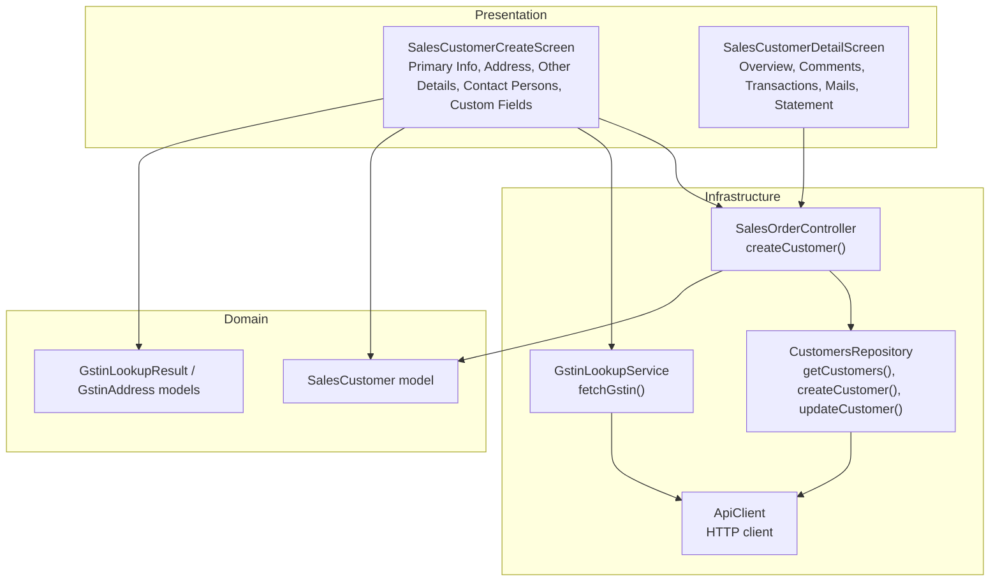
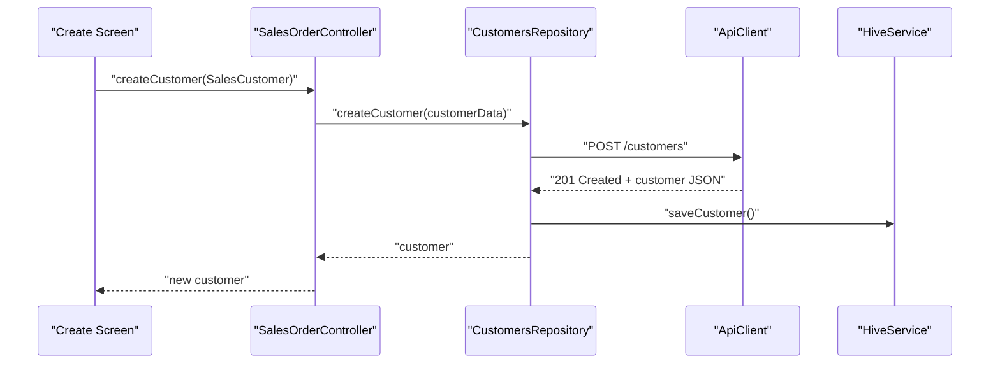
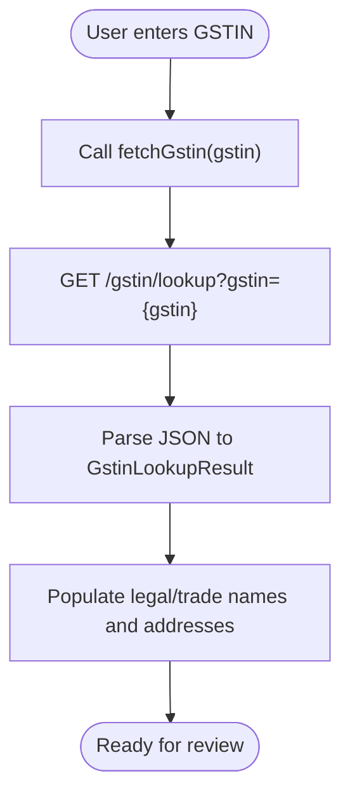
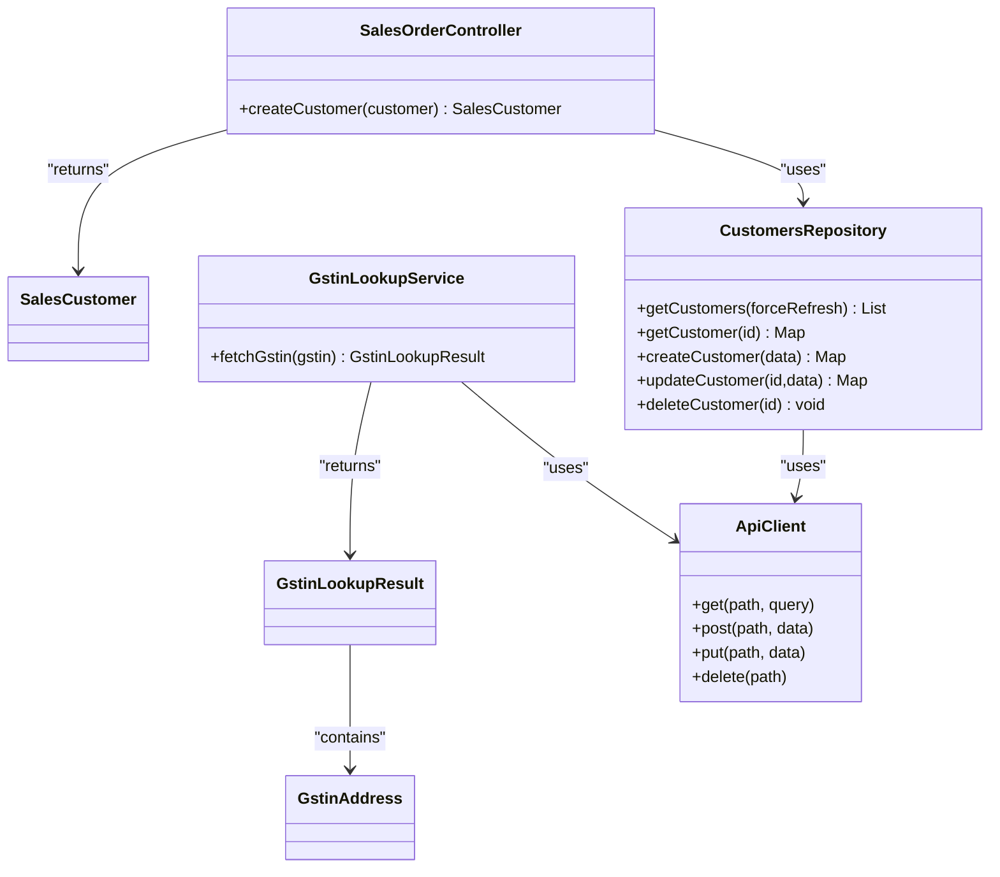

# Customer Management

<cite>
**Referenced Files in This Document**
- [sales_customer_model.dart](file://lib/modules/sales/models/sales_customer_model.dart)
- [gstin_lookup_model.dart](file://lib/modules/sales/models/gstin_lookup_model.dart)
- [gstin_lookup_service.dart](file://lib/modules/sales/services/gstin_lookup_service.dart)
- [customers_repository.dart](file://lib/modules/sales/repositories/customers_repository.dart)
- [sales_customer_customer_create.dart](file://lib/modules/sales/presentation/sales_customer_customer_create.dart)
- [sales_customer_customer_overview.dart](file://lib/modules/sales/presentation/sales_customer_customer_overview.dart)
- [sales_customer_primary_info_section.dart](file://lib/modules/sales/presentation/sections/sales_customer_primary_info_section.dart)
- [sales_customer_address_section.dart](file://lib/modules/sales/presentation/sections/sales_customer_address_section.dart)
- [sales_customer_contact_persons_section.dart](file://lib/modules/sales/presentation/sections/sales_customer_contact_persons_section.dart)
- [sales_customer_other_details_section.dart](file://lib/modules/sales/presentation/sections/sales_customer_other_details_section.dart)
- [sales_customer_custom_fields_section.dart](file://lib/modules/sales/presentation/sections/sales_customer_custom_fields_section.dart)
- [sales_order_controller.dart](file://lib/modules/sales/controller/sales_order_controller.dart)
- [api_client.dart](file://lib/shared/services/api_client.dart)
</cite>

## Table of Contents
1. [Introduction](#introduction)
2. [Project Structure](#project-structure)
3. [Core Components](#core-components)
4. [Architecture Overview](#architecture-overview)
5. [Detailed Component Analysis](#detailed-component-analysis)
6. [Dependency Analysis](#dependency-analysis)
7. [Performance Considerations](#performance-considerations)
8. [Troubleshooting Guide](#troubleshooting-guide)
9. [Conclusion](#conclusion)

## Introduction
This document describes the Customer Management system within the Zerpai ERP application. It focuses on customer onboarding workflows, GST compliance integration, customer profile management, contact person handling, and address management. It explains the customer creation process, GSTIN validation via a lookup service, customer categorization, credit limit management, and multi-address support. Practical examples illustrate customer registration scenarios, GST verification workflows, and customer data synchronization patterns. Finally, it covers the customer overview interface, search and filtering capabilities, and integration with sales workflows.

## Project Structure
The Customer Management feature spans three layers:
- Presentation: UI screens and sections for creating and viewing customer records
- Domain: Models representing customer data and GST lookup results
- Infrastructure: Services and repository for API communication and offline caching



**Diagram sources**
- [sales_customer_customer_create.dart](file://lib/modules/sales/presentation/sales_customer_customer_create.dart#L27-L270)
- [sales_customer_customer_overview.dart](file://lib/modules/sales/presentation/sales_customer_customer_overview.dart#L14-L188)
- [sales_customer_primary_info_section.dart](file://lib/modules/sales/presentation/sections/sales_customer_primary_info_section.dart#L3-L327)
- [sales_customer_address_section.dart](file://lib/modules/sales/presentation/sections/sales_customer_address_section.dart#L3-L275)
- [sales_customer_other_details_section.dart](file://lib/modules/sales/presentation/sections/sales_customer_other_details_section.dart#L3-L466)
- [sales_customer_contact_persons_section.dart](file://lib/modules/sales/presentation/sections/sales_customer_contact_persons_section.dart#L3-L143)
- [sales_customer_custom_fields_section.dart](file://lib/modules/sales/presentation/sections/sales_customer_custom_fields_section.dart#L3-L223)
- [sales_customer_model.dart](file://lib/modules/sales/models/sales_customer_model.dart#L1-L93)
- [gstin_lookup_model.dart](file://lib/modules/sales/models/gstin_lookup_model.dart#L1-L173)
- [gstin_lookup_service.dart](file://lib/modules/sales/services/gstin_lookup_service.dart#L4-L27)
- [customers_repository.dart](file://lib/modules/sales/repositories/customers_repository.dart#L8-L165)
- [sales_order_controller.dart](file://lib/modules/sales/controller/sales_order_controller.dart#L67-L118)
- [api_client.dart](file://lib/shared/services/api_client.dart#L6-L62)

**Section sources**
- [sales_customer_customer_create.dart](file://lib/modules/sales/presentation/sales_customer_customer_create.dart#L27-L270)
- [sales_customer_customer_overview.dart](file://lib/modules/sales/presentation/sales_customer_customer_overview.dart#L14-L188)
- [sales_customer_model.dart](file://lib/modules/sales/models/sales_customer_model.dart#L1-L93)
- [gstin_lookup_model.dart](file://lib/modules/sales/models/gstin_lookup_model.dart#L1-L173)
- [gstin_lookup_service.dart](file://lib/modules/sales/services/gstin_lookup_service.dart#L4-L27)
- [customers_repository.dart](file://lib/modules/sales/repositories/customers_repository.dart#L8-L165)
- [sales_order_controller.dart](file://lib/modules/sales/controller/sales_order_controller.dart#L67-L118)
- [api_client.dart](file://lib/shared/services/api_client.dart#L6-L62)

## Core Components
- SalesCustomer model: Defines the customer entity with identity, profile, GST/PAN, addresses, and financial metadata.
- GstinLookupResult and GstinAddress models: Normalize GSTIN lookup responses into structured data.
- GstinLookupService: Encapsulates the GSTIN lookup endpoint and transforms raw responses.
- CustomersRepository: Implements online-first retrieval with offline fallback and maintains cache metadata.
- SalesCustomerCreateScreen and supporting sections: Provide the end-to-end customer creation UI with GSTIN prefill, addresses, contacts, and custom fields.
- SalesCustomerDetailScreen: Presents customer overview and related tabs.
- SalesOrderController: Exposes createCustomer() to persist a new customer and refreshes the customer list provider.

**Section sources**
- [sales_customer_model.dart](file://lib/modules/sales/models/sales_customer_model.dart#L1-L93)
- [gstin_lookup_model.dart](file://lib/modules/sales/models/gstin_lookup_model.dart#L1-L173)
- [gstin_lookup_service.dart](file://lib/modules/sales/services/gstin_lookup_service.dart#L4-L27)
- [customers_repository.dart](file://lib/modules/sales/repositories/customers_repository.dart#L8-L165)
- [sales_customer_customer_create.dart](file://lib/modules/sales/presentation/sales_customer_customer_create.dart#L27-L270)
- [sales_customer_customer_overview.dart](file://lib/modules/sales/presentation/sales_customer_customer_overview.dart#L14-L188)
- [sales_order_controller.dart](file://lib/modules/sales/controller/sales_order_controller.dart#L67-L118)

## Architecture Overview
The system follows a layered architecture:
- Presentation layer builds forms and manages state for customer creation and viewing.
- Domain layer defines strongly typed models for customer and GST data.
- Infrastructure layer handles HTTP requests, caching, and offline fallback.



**Diagram sources**
- [sales_customer_customer_create.dart](file://lib/modules/sales/presentation/sales_customer_customer_create.dart#L233-L269)
- [sales_order_controller.dart](file://lib/modules/sales/controller/sales_order_controller.dart#L107-L117)
- [customers_repository.dart](file://lib/modules/sales/repositories/customers_repository.dart#L78-L98)
- [api_client.dart](file://lib/shared/services/api_client.dart#L50-L52)

## Detailed Component Analysis

### Customer Creation Workflow
End-to-end customer creation integrates primary info, addresses, GST details, and optional extras.

```mermaid
sequenceDiagram
participant User as "User"
participant Create as "SalesCustomerCreateScreen"
participant Gstin as "GstinLookupService"
participant API as "ApiClient"
participant Repo as "CustomersRepository"
participant Ctrl as "SalesOrderController"
User->>Create : "Fill primary info, addresses, GSTIN"
Create->>Gstin : "fetchGstin(gstin)"
Gstin->>API : "GET /gstin/lookup?gstin=..."
API-->>Gstin : "Lookup result JSON"
Gstin-->>Create : "GstinLookupResult"
Create->>Ctrl : "createCustomer(SalesCustomer)"
Ctrl->>Repo : "createCustomer(customerData)"
Repo->>API : "POST /customers"
API-->>Repo : "Created customer"
Repo-->>Ctrl : "customer"
Ctrl-->>Create : "Success"
Create-->>User : "Navigate back"
```

Key behaviors:
- GSTIN prefill triggers a lookup and populates legal/trade names and addresses.
- Billing and shipping addresses are captured separately with copy-from-billing convenience.
- Credit limit and payment terms are configurable during creation.
- Contact persons can be added dynamically.

**Diagram sources**
- [sales_customer_customer_create.dart](file://lib/modules/sales/presentation/sales_customer_customer_create.dart#L233-L269)
- [gstin_lookup_service.dart](file://lib/modules/sales/services/gstin_lookup_service.dart#L7-L26)
- [api_client.dart](file://lib/shared/services/api_client.dart#L46-L52)
- [customers_repository.dart](file://lib/modules/sales/repositories/customers_repository.dart#L78-L98)
- [sales_order_controller.dart](file://lib/modules/sales/controller/sales_order_controller.dart#L107-L117)

**Section sources**
- [sales_customer_customer_create.dart](file://lib/modules/sales/presentation/sales_customer_customer_create.dart#L27-L270)
- [sales_customer_primary_info_section.dart](file://lib/modules/sales/presentation/sections/sales_customer_primary_info_section.dart#L3-L327)
- [sales_customer_address_section.dart](file://lib/modules/sales/presentation/sections/sales_customer_address_section.dart#L3-L275)
- [sales_customer_other_details_section.dart](file://lib/modules/sales/presentation/sections/sales_customer_other_details_section.dart#L3-L466)
- [sales_customer_contact_persons_section.dart](file://lib/modules/sales/presentation/sections/sales_customer_contact_persons_section.dart#L3-L143)
- [sales_customer_custom_fields_section.dart](file://lib/modules/sales/presentation/sections/sales_customer_custom_fields_section.dart#L3-L223)

### GST Compliance Integration
- GSTIN Lookup: The lookup service calls a dedicated endpoint and parses flexible response shapes into a normalized model.
- GST Treatment: The UI exposes a dropdown of GST classifications to categorize the customer’s tax regime.
- Place of Supply: Selection influences tax calculation contexts.
- PAN and Tax Preference: Captured for compliance and exemption reasons.



**Diagram sources**
- [gstin_lookup_service.dart](file://lib/modules/sales/services/gstin_lookup_service.dart#L7-L26)
- [gstin_lookup_model.dart](file://lib/modules/sales/models/gstin_lookup_model.dart#L18-L74)

**Section sources**
- [gstin_lookup_service.dart](file://lib/modules/sales/services/gstin_lookup_service.dart#L4-L27)
- [gstin_lookup_model.dart](file://lib/modules/sales/models/gstin_lookup_model.dart#L1-L173)
- [sales_customer_other_details_section.dart](file://lib/modules/sales/presentation/sections/sales_customer_other_details_section.dart#L3-L122)

### Customer Profile Management
- Identity and Contact: Salutation, first/last name, company name, display name, emails, phones.
- Addresses: Separate billing and shipping with attention, country/region, state, pin, phone, fax.
- Multi-address Support: The address note indicates additional addresses can be managed in the customer details section.
- Custom Fields and Reporting: Demo fields, reporting tags, remarks, assigned staff, and referral tracking.

**Section sources**
- [sales_customer_primary_info_section.dart](file://lib/modules/sales/presentation/sections/sales_customer_primary_info_section.dart#L3-L327)
- [sales_customer_address_section.dart](file://lib/modules/sales/presentation/sections/sales_customer_address_section.dart#L3-L275)
- [sales_customer_custom_fields_section.dart](file://lib/modules/sales/presentation/sections/sales_customer_custom_fields_section.dart#L3-L223)

### Contact Person Handling
- Dynamic rows for multiple contacts with salutation, first/last name, email, and work/mobile numbers.
- Add/remove controls per row.
- Integrated into the customer creation form for quick capture.

**Section sources**
- [sales_customer_contact_persons_section.dart](file://lib/modules/sales/presentation/sections/sales_customer_contact_persons_section.dart#L3-L143)
- [sales_customer_customer_create.dart](file://lib/modules/sales/presentation/sales_customer_customer_create.dart#L140-L149)

### Address Management
- Billing and Shipping address groups share similar fields.
- Copy billing to shipping shortcut reduces duplication.
- Country/region and state dropdowns support localization.
- Address formatting guidance is surfaced to users.

**Section sources**
- [sales_customer_address_section.dart](file://lib/modules/sales/presentation/sections/sales_customer_address_section.dart#L3-L275)

### Customer Overview Interface
- Left panel mini-list with expand-on-hover behavior.
- Action header with edit and more options placeholders.
- Tabs for Overview, Comments, Transactions, Mails, Statement.
- Uses Riverpod providers to watch customer lists and detail rendering.

**Section sources**
- [sales_customer_customer_overview.dart](file://lib/modules/sales/presentation/sales_customer_customer_overview.dart#L14-L188)

### Search and Filtering Capabilities
- The generic list components define reusable search and filter UI patterns, enabling discovery across customer records.
- These patterns are part of the broader sales list infrastructure and can be extended to customer views.

**Section sources**
- [sales_customer_customer_overview.dart](file://lib/modules/sales/presentation/sales_customer_customer_overview.dart#L14-L188)

### Integration with Sales Workflows
- SalesOrderController exposes createCustomer() and invalidates the customer list provider after creation to keep the UI synchronized.
- The customer list provider is used in the overview left panel and primary info parent selection dropdown.

**Section sources**
- [sales_order_controller.dart](file://lib/modules/sales/controller/sales_order_controller.dart#L107-L117)
- [sales_customer_primary_info_section.dart](file://lib/modules/sales/presentation/sections/sales_customer_primary_info_section.dart#L113-L163)

## Dependency Analysis
- Presentation depends on domain models and services for data shaping and persistence.
- Controller orchestrates repository and provider invalidation.
- Repository encapsulates API and caching concerns.
- Service abstracts external GSTIN lookup API.
- API client centralizes HTTP configuration.



**Diagram sources**
- [sales_customer_model.dart](file://lib/modules/sales/models/sales_customer_model.dart#L1-L93)
- [gstin_lookup_model.dart](file://lib/modules/sales/models/gstin_lookup_model.dart#L1-L173)
- [gstin_lookup_service.dart](file://lib/modules/sales/services/gstin_lookup_service.dart#L4-L27)
- [customers_repository.dart](file://lib/modules/sales/repositories/customers_repository.dart#L8-L165)
- [sales_order_controller.dart](file://lib/modules/sales/controller/sales_order_controller.dart#L67-L118)
- [api_client.dart](file://lib/shared/services/api_client.dart#L6-L62)

**Section sources**
- [sales_customer_model.dart](file://lib/modules/sales/models/sales_customer_model.dart#L1-L93)
- [gstin_lookup_model.dart](file://lib/modules/sales/models/gstin_lookup_model.dart#L1-L173)
- [gstin_lookup_service.dart](file://lib/modules/sales/services/gstin_lookup_service.dart#L4-L27)
- [customers_repository.dart](file://lib/modules/sales/repositories/customers_repository.dart#L8-L165)
- [sales_order_controller.dart](file://lib/modules/sales/controller/sales_order_controller.dart#L67-L118)
- [api_client.dart](file://lib/shared/services/api_client.dart#L6-L62)

## Performance Considerations
- Online-first with offline fallback: The repository fetches from the API first and falls back to cached data if network fails, ensuring availability and resilience.
- Local caching: Customer records and sync timestamps are persisted to minimize repeated network calls and improve responsiveness.
- Staleness checks: A configurable threshold determines whether cached data should be refreshed.
- UI responsiveness: The controller invalidates providers after create/update to avoid stale UI while keeping the app reactive.

**Section sources**
- [customers_repository.dart](file://lib/modules/sales/repositories/customers_repository.dart#L16-L50)
- [customers_repository.dart](file://lib/modules/sales/repositories/customers_repository.dart#L145-L163)
- [sales_order_controller.dart](file://lib/modules/sales/controller/sales_order_controller.dart#L107-L117)

## Troubleshooting Guide
- GSTIN lookup failures: The lookup service returns a default result when the response is not a map. Validate the input GSTIN and network connectivity.
- API errors during customer operations: The repository logs warnings and errors; inspect logs for stack traces and retry after resolving network or server issues.
- Offline mode: If API calls fail, cached data is returned. Verify cache staleness thresholds and manually trigger refresh when appropriate.
- UI not updating after creation: Ensure the controller invalidates the customer list provider after createCustomer() completes.

**Section sources**
- [gstin_lookup_service.dart](file://lib/modules/sales/services/gstin_lookup_service.dart#L14-L26)
- [customers_repository.dart](file://lib/modules/sales/repositories/customers_repository.dart#L34-L49)
- [customers_repository.dart](file://lib/modules/sales/repositories/customers_repository.dart#L90-L97)
- [sales_order_controller.dart](file://lib/modules/sales/controller/sales_order_controller.dart#L110-L112)

## Conclusion
The Customer Management system provides a robust, user-friendly pathway for onboarding customers with integrated GST compliance, multi-address support, and contact person handling. Its layered design ensures maintainability, while online-first caching and provider-driven UI updates deliver a responsive experience. The included workflows and patterns support practical registration scenarios, GST verification, and seamless integration with sales processes.