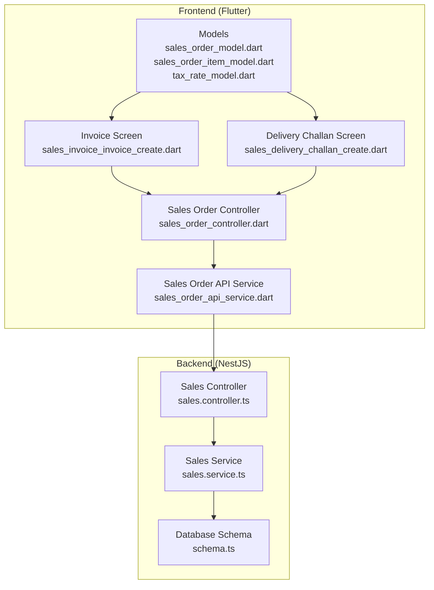
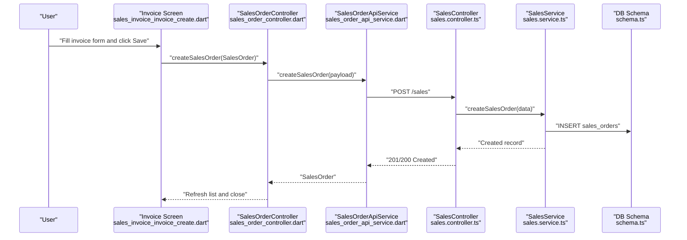
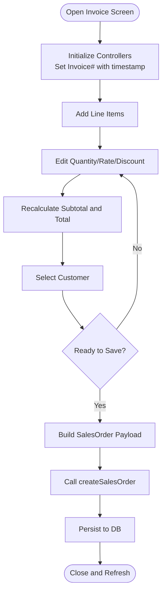
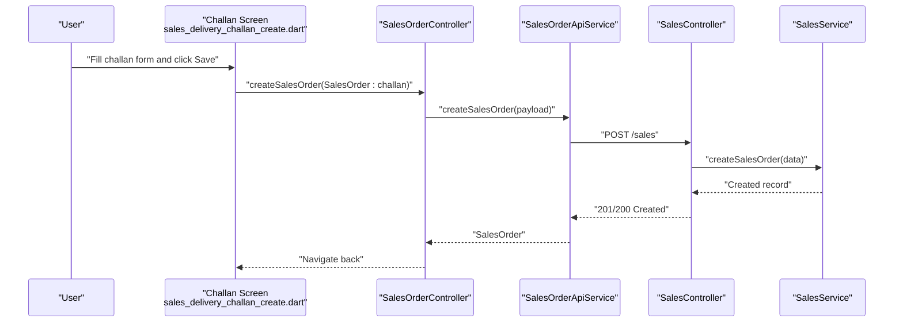
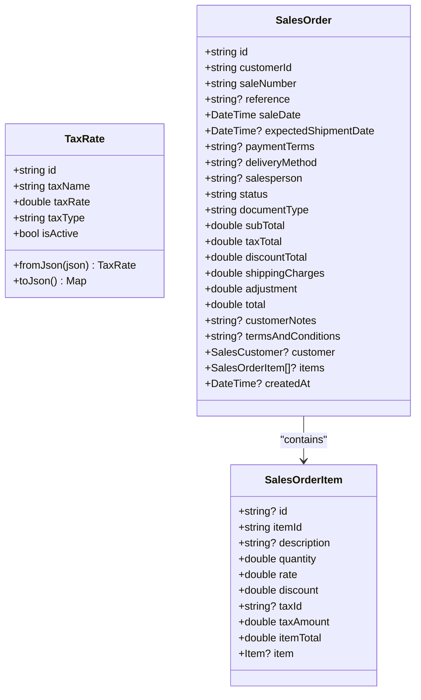
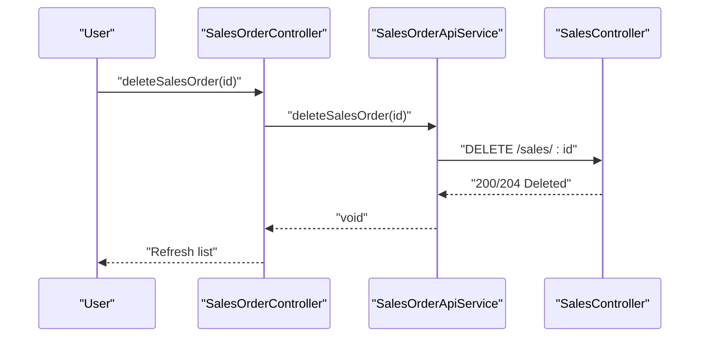
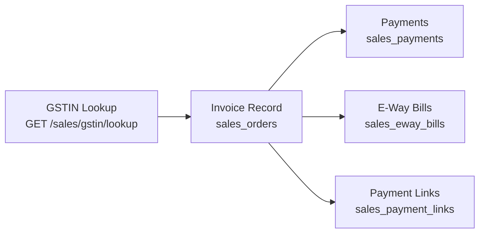
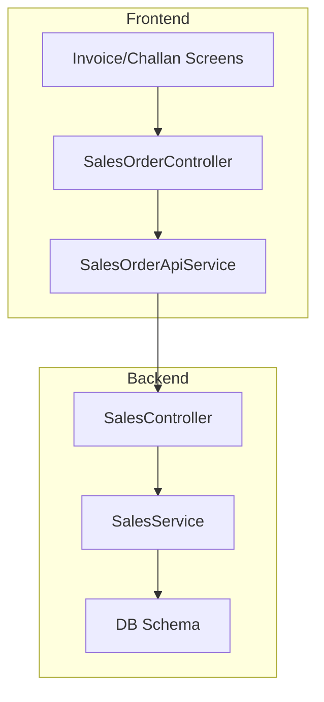
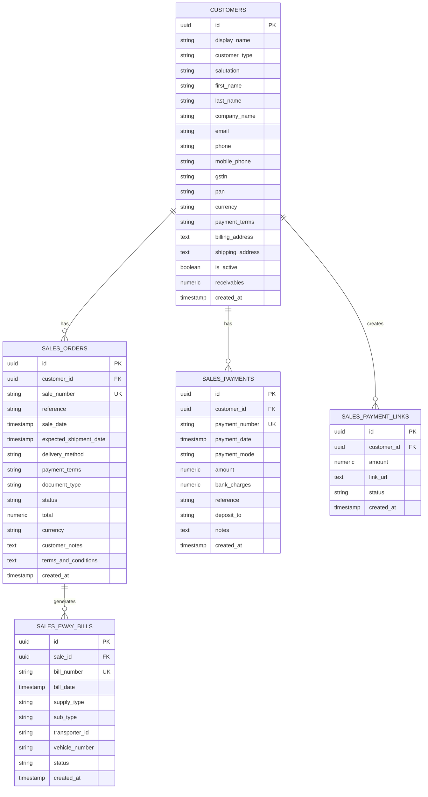

# Invoicing System

<cite>
**Referenced Files in This Document**
- [sales_invoice_invoice_create.dart](file://lib/modules/sales/presentation/sales_invoice_invoice_create.dart)
- [sales_delivery_challan_create.dart](file://lib/modules/sales/presentation/sales_delivery_challan_create.dart)
- [sales_order_controller.dart](file://lib/modules/sales/controller/sales_order_controller.dart)
- [sales_order_api_service.dart](file://lib/modules/sales/services/sales_order_api_service.dart)
- [sales_order_model.dart](file://lib/modules/sales/models/sales_order_model.dart)
- [sales_order_item_model.dart](file://lib/modules/sales/models/sales_order_item_model.dart)
- [tax_rate_model.dart](file://lib/modules/items/models/tax_rate_model.dart)
- [gstin_lookup_model.dart](file://lib/modules/sales/models/gstin_lookup_model.dart)
- [sales.service.ts](file://backend/src/sales/sales.service.ts)
- [sales.controller.ts](file://backend/src/sales/sales.controller.ts)
- [schema.ts](file://backend/src/db/schema.ts)
</cite>

## Table of Contents
1. [Introduction](#introduction)
2. [Project Structure](#project-structure)
3. [Core Components](#core-components)
4. [Architecture Overview](#architecture-overview)
5. [Detailed Component Analysis](#detailed-component-analysis)
6. [Dependency Analysis](#dependency-analysis)
7. [Performance Considerations](#performance-considerations)
8. [Troubleshooting Guide](#troubleshooting-guide)
9. [Conclusion](#conclusion)
10. [Appendices](#appendices)

## Introduction
This document describes the Invoicing System within the ZerpAI ERP platform. It focuses on invoice creation from sales orders, invoice numbering schemes, tax calculation automation, and invoice generation workflows. It also covers delivery challan creation, invoice modification and cancellation procedures, practical generation scenarios, tax computation methods, integration with accounting systems, invoice templates, bulk processing, and GST compliance requirements.

## Project Structure
The invoicing system spans the frontend Flutter module and the backend NestJS service:
- Frontend: Sales domain UI screens for invoices and challans, Riverpod state management, and API service integration.
- Backend: Sales controller and service for CRUD operations, database schema for sales documents, and mock GSTIN lookup.

**Diagram sources**
- [sales_invoice_invoice_create.dart](file://lib/modules/sales/presentation/sales_invoice_invoice_create.dart#L1-L573)
- [sales_delivery_challan_create.dart](file://lib/modules/sales/presentation/sales_delivery_challan_create.dart#L1-L343)
- [sales_order_controller.dart](file://lib/modules/sales/controller/sales_order_controller.dart#L1-L119)
- [sales_order_api_service.dart](file://lib/modules/sales/services/sales_order_api_service.dart#L1-L192)
- [sales_order_model.dart](file://lib/modules/sales/models/sales_order_model.dart#L1-L118)
- [sales_order_item_model.dart](file://lib/modules/sales/models/sales_order_item_model.dart#L1-L62)
- [tax_rate_model.dart](file://lib/modules/items/models/tax_rate_model.dart#L1-L38)
- [sales.controller.ts](file://backend/src/sales/sales.controller.ts#L1-L102)
- [sales.service.ts](file://backend/src/sales/sales.service.ts#L1-L162)
- [schema.ts](file://backend/src/db/schema.ts#L236-L253)

**Section sources**
- [sales_invoice_invoice_create.dart](file://lib/modules/sales/presentation/sales_invoice_invoice_create.dart#L1-L573)
- [sales_delivery_challan_create.dart](file://lib/modules/sales/presentation/sales_delivery_challan_create.dart#L1-L343)
- [sales_order_controller.dart](file://lib/modules/sales/controller/sales_order_controller.dart#L1-L119)
- [sales_order_api_service.dart](file://lib/modules/sales/services/sales_order_api_service.dart#L1-L192)
- [sales_order_model.dart](file://lib/modules/sales/models/sales_order_model.dart#L1-L118)
- [sales_order_item_model.dart](file://lib/modules/sales/models/sales_order_item_model.dart#L1-L62)
- [tax_rate_model.dart](file://lib/modules/items/models/tax_rate_model.dart#L1-L38)
- [sales.controller.ts](file://backend/src/sales/sales.controller.ts#L1-L102)
- [sales.service.ts](file://backend/src/sales/sales.service.ts#L1-L162)
- [schema.ts](file://backend/src/db/schema.ts#L236-L253)

## Core Components
- Invoice Creation Screen: Builds invoice headers, items table, totals, and sends a unified SalesOrder payload to the backend.
- Delivery Challan Creation Screen: Similar structure but tailored for delivery challans with distinct numbering and document type.
- Sales Order Controller: Riverpod notifier orchestrating data loading and persistence via API service.
- Sales Order API Service: Encapsulates HTTP calls to the backend sales endpoints.
- SalesOrder and SalesOrderItem models: Define the invoice/challan data contract and serialization.
- TaxRate model: Represents tax rates and types used for tax computations.
- Backend Sales Controller/Service: Exposes endpoints for sales records and implements mock GSTIN lookup.
- Database Schema: Defines sales_orders, customers, sales_payments, sales_eway_bills, and sales_payment_links tables.

**Section sources**
- [sales_invoice_invoice_create.dart](file://lib/modules/sales/presentation/sales_invoice_invoice_create.dart#L1-L573)
- [sales_delivery_challan_create.dart](file://lib/modules/sales/presentation/sales_delivery_challan_create.dart#L1-L343)
- [sales_order_controller.dart](file://lib/modules/sales/controller/sales_order_controller.dart#L1-L119)
- [sales_order_api_service.dart](file://lib/modules/sales/services/sales_order_api_service.dart#L1-L192)
- [sales_order_model.dart](file://lib/modules/sales/models/sales_order_model.dart#L1-L118)
- [sales_order_item_model.dart](file://lib/modules/sales/models/sales_order_item_model.dart#L1-L62)
- [tax_rate_model.dart](file://lib/modules/items/models/tax_rate_model.dart#L1-L38)
- [sales.controller.ts](file://backend/src/sales/sales.controller.ts#L1-L102)
- [sales.service.ts](file://backend/src/sales/sales.service.ts#L1-L162)
- [schema.ts](file://backend/src/db/schema.ts#L236-L253)

## Architecture Overview
The invoicing workflow integrates UI, state management, API service, backend controller/service, and database.

**Diagram sources**
- [sales_invoice_invoice_create.dart](file://lib/modules/sales/presentation/sales_invoice_invoice_create.dart#L525-L565)
- [sales_order_controller.dart](file://lib/modules/sales/controller/sales_order_controller.dart#L86-L95)
- [sales_order_api_service.dart](file://lib/modules/sales/services/sales_order_api_service.dart#L104-L121)
- [sales.controller.ts](file://backend/src/sales/sales.controller.ts#L91-L95)
- [sales.service.ts](file://backend/src/sales/sales.service.ts#L80-L97)
- [schema.ts](file://backend/src/db/schema.ts#L236-L253)

## Detailed Component Analysis

### Invoice Creation Workflow
- Numbering Scheme: The invoice number is auto-generated with a pattern combining a prefix and timestamp.
- Totals Calculation: Subtotal is computed from line items; shipping and adjustment are added; totals are recalculated reactively.
- Payload Construction: The screen composes a SalesOrder with items and posts it to the backend.
- Status and Document Type: Invoices are saved with a confirmed status and document type set to invoice.

**Diagram sources**
- [sales_invoice_invoice_create.dart](file://lib/modules/sales/presentation/sales_invoice_invoice_create.dart#L48-L108)
- [sales_invoice_invoice_create.dart](file://lib/modules/sales/presentation/sales_invoice_invoice_create.dart#L525-L565)
- [sales_order_model.dart](file://lib/modules/sales/models/sales_order_model.dart#L28-L51)

**Section sources**
- [sales_invoice_invoice_create.dart](file://lib/modules/sales/presentation/sales_invoice_invoice_create.dart#L48-L108)
- [sales_invoice_invoice_create.dart](file://lib/modules/sales/presentation/sales_invoice_invoice_create.dart#L525-L565)
- [sales_order_model.dart](file://lib/modules/sales/models/sales_order_model.dart#L28-L51)

### Delivery Challan Creation Workflow
- Numbering Scheme: Challan number uses a distinct prefix and timestamp.
- Document Type: Stored as a challan document type.
- Payload Construction: Similar to invoices but without tax totals and simplified fields.

**Diagram sources**
- [sales_delivery_challan_create.dart](file://lib/modules/sales/presentation/sales_delivery_challan_create.dart#L304-L341)
- [sales_order_controller.dart](file://lib/modules/sales/controller/sales_order_controller.dart#L86-L95)
- [sales_order_api_service.dart](file://lib/modules/sales/services/sales_order_api_service.dart#L104-L121)
- [sales.controller.ts](file://backend/src/sales/sales.controller.ts#L91-L95)
- [sales.service.ts](file://backend/src/sales/sales.service.ts#L80-L97)

**Section sources**
- [sales_delivery_challan_create.dart](file://lib/modules/sales/presentation/sales_delivery_challan_create.dart#L304-L341)
- [sales_order_model.dart](file://lib/modules/sales/models/sales_order_model.dart#L28-L51)

### Tax Calculation Automation
- Tax Rate Model: Provides tax name, rate, type (IGST/CGST/SGST), and active status.
- Current Implementation: The invoice screen computes subtotal and total but does not compute per-item tax amounts in the frontend. Tax totals are expected to be managed by the backend or extended in the future.
- GST Compliance: The backend includes a mock GSTIN lookup endpoint; the frontend model supports GSTIN-related fields in customer records.

**Diagram sources**
- [tax_rate_model.dart](file://lib/modules/items/models/tax_rate_model.dart#L1-L38)
- [sales_order_item_model.dart](file://lib/modules/sales/models/sales_order_item_model.dart#L1-L62)
- [sales_order_model.dart](file://lib/modules/sales/models/sales_order_model.dart#L1-L118)

**Section sources**
- [tax_rate_model.dart](file://lib/modules/items/models/tax_rate_model.dart#L1-L38)
- [sales_order_item_model.dart](file://lib/modules/sales/models/sales_order_item_model.dart#L1-L62)
- [sales_order_model.dart](file://lib/modules/sales/models/sales_order_model.dart#L1-L118)
- [gstin_lookup_model.dart](file://lib/modules/sales/models/gstin_lookup_model.dart#L1-L173)
- [sales.service.ts](file://backend/src/sales/sales.service.ts#L8-L27)

### Invoice Modification and Cancellation Procedures
- Modification: The current UI saves invoices as confirmed and does not expose editing fields after save. To support modifications, extend the invoice screen to load existing records and allow edits while preserving audit trails.
- Cancellation: The backend exposes a DELETE endpoint for sales records. Invoke it via the API service to cancel an invoice by ID.

**Diagram sources**
- [sales_order_controller.dart](file://lib/modules/sales/controller/sales_order_controller.dart#L97-L105)
- [sales_order_api_service.dart](file://lib/modules/sales/services/sales_order_api_service.dart#L123-L132)
- [sales.controller.ts](file://backend/src/sales/sales.controller.ts#L97-L100)

**Section sources**
- [sales_order_controller.dart](file://lib/modules/sales/controller/sales_order_controller.dart#L97-L105)
- [sales_order_api_service.dart](file://lib/modules/sales/services/sales_order_api_service.dart#L123-L132)
- [sales.controller.ts](file://backend/src/sales/sales.controller.ts#L97-L100)

### Practical Examples of Invoice Generation Scenarios
- Scenario A: Single product invoice with flat discount and shipping charge.
- Scenario B: Multiple line items with varying quantities and discounts.
- Scenario C: Invoice with customer notes and terms and conditions.
- Scenario D: Delivery challan with job work type and reference number.

These scenarios are supported by the invoice and challan screens’ reactive totals and item table logic.

**Section sources**
- [sales_invoice_invoice_create.dart](file://lib/modules/sales/presentation/sales_invoice_invoice_create.dart#L91-L108)
- [sales_delivery_challan_create.dart](file://lib/modules/sales/presentation/sales_delivery_challan_create.dart#L167-L247)

### Integration with Accounting Systems
- Payment Links: The backend supports generating payment links for invoices, enabling accounting reconciliation.
- Payment Records: The backend persists sales payments with modes, references, and amounts.
- GSTIN Lookup: The backend provides a mock GSTIN lookup endpoint for compliance verification.

**Diagram sources**
- [sales.controller.ts](file://backend/src/sales/sales.controller.ts#L35-L39)
- [sales.service.ts](file://backend/src/sales/sales.service.ts#L8-L27)
- [schema.ts](file://backend/src/db/schema.ts#L254-L291)

**Section sources**
- [sales.controller.ts](file://backend/src/sales/sales.controller.ts#L35-L39)
- [sales.service.ts](file://backend/src/sales/sales.service.ts#L8-L27)
- [schema.ts](file://backend/src/db/schema.ts#L254-L291)

### Invoice Templates and Bulk Processing
- Templates: The UI renders standardized invoice layouts with customer info, items, totals, and notes. Templates can be exported to PDF/print-ready formats in the UI layer.
- Bulk Processing: The backend supports retrieving invoices by type and paginated lists. Extend the UI to batch-select invoices and process them in bulk.

**Section sources**
- [sales_invoice_invoice_create.dart](file://lib/modules/sales/presentation/sales_invoice_invoice_create.dart#L111-L134)
- [sales_order_api_service.dart](file://lib/modules/sales/services/sales_order_api_service.dart#L42-L57)

### GST Compliance Requirements
- GSTIN Lookup: The backend exposes a GSTIN lookup endpoint for legal name, trade name, status, taxpayer type, and addresses.
- Customer Fields: The customer model includes GSTIN and PAN fields to capture GST compliance data.
- Tax Types: TaxRate supports IGST, CGST, and SGST types for accurate tax reporting.

**Section sources**
- [gstin_lookup_model.dart](file://lib/modules/sales/models/gstin_lookup_model.dart#L1-L173)
- [sales.service.ts](file://backend/src/sales/sales.service.ts#L8-L27)
- [schema.ts](file://backend/src/db/schema.ts#L213-L234)
- [tax_rate_model.dart](file://lib/modules/items/models/tax_rate_model.dart#L1-L38)

## Dependency Analysis
- UI depends on Riverpod providers for customers and sales data.
- Controller depends on API service for network operations.
- API service depends on shared API client and backend endpoints.
- Backend controller depends on service for business logic.
- Service depends on database schema for persistence.

**Diagram sources**
- [sales_order_controller.dart](file://lib/modules/sales/controller/sales_order_controller.dart#L1-L119)
- [sales_order_api_service.dart](file://lib/modules/sales/services/sales_order_api_service.dart#L1-L192)
- [sales.controller.ts](file://backend/src/sales/sales.controller.ts#L1-L102)
- [sales.service.ts](file://backend/src/sales/sales.service.ts#L1-L162)
- [schema.ts](file://backend/src/db/schema.ts#L236-L253)

**Section sources**
- [sales_order_controller.dart](file://lib/modules/sales/controller/sales_order_controller.dart#L1-L119)
- [sales_order_api_service.dart](file://lib/modules/sales/services/sales_order_api_service.dart#L1-L192)
- [sales.controller.ts](file://backend/src/sales/sales.controller.ts#L1-L102)
- [sales.service.ts](file://backend/src/sales/sales.service.ts#L1-L162)
- [schema.ts](file://backend/src/db/schema.ts#L236-L253)

## Performance Considerations
- Reactive Calculations: Totals are recalculated on each input change; consider debouncing for large item lists.
- Network Calls: Batch UI updates and avoid redundant refreshes after successful saves.
- Backend Pagination: Use query parameters to limit invoice lists and improve UI responsiveness.

## Troubleshooting Guide
- Error Handling: API service logs detailed error messages and status codes; UI displays snackbars for user feedback.
- Validation: Ensure required fields (customer, items) are present before saving.
- Debugging: Inspect payload sent to backend and server-side logs for discrepancies.

**Section sources**
- [sales_order_api_service.dart](file://lib/modules/sales/services/sales_order_api_service.dart#L114-L120)
- [sales_invoice_invoice_create.dart](file://lib/modules/sales/presentation/sales_invoice_invoice_create.dart#L558-L564)

## Conclusion
The ZerpAI ERP invoicing system provides a robust foundation for invoice and challan creation, with clear separation between UI, state management, API service, and backend logic. While tax computation is currently handled outside the invoice screen, the system’s schema and models support GST compliance and future enhancements. Extending the UI to support invoice modifications and cancellations, and integrating automated tax calculations, will further strengthen the system’s capabilities.

## Appendices
- Data Model Overview

**Diagram sources**
- [schema.ts](file://backend/src/db/schema.ts#L213-L291)