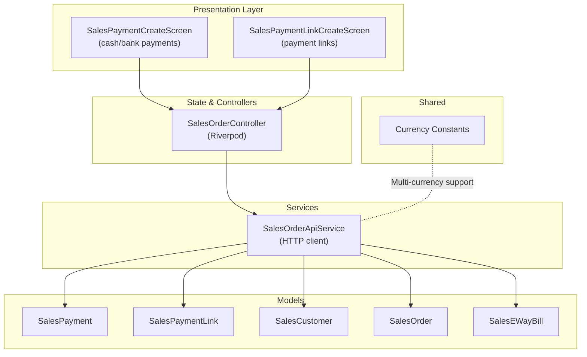
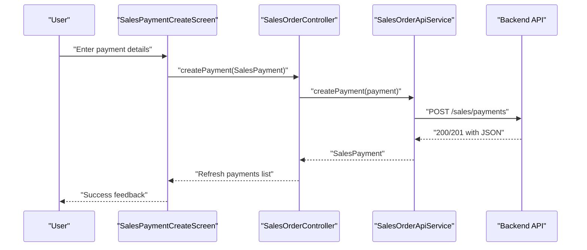
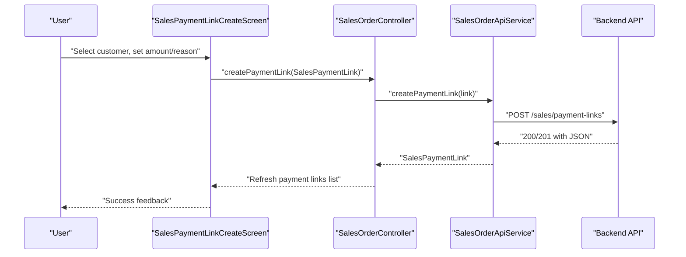
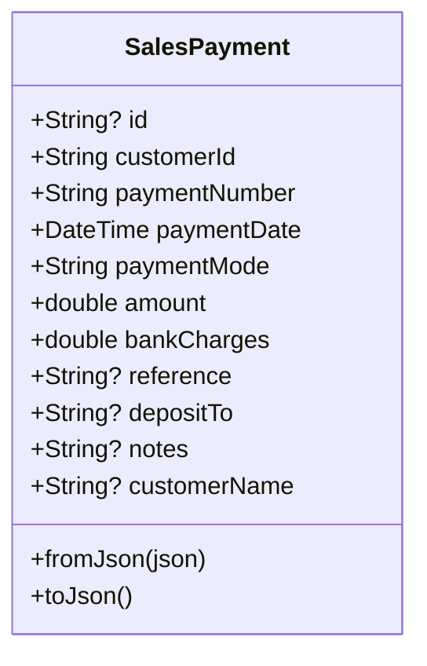
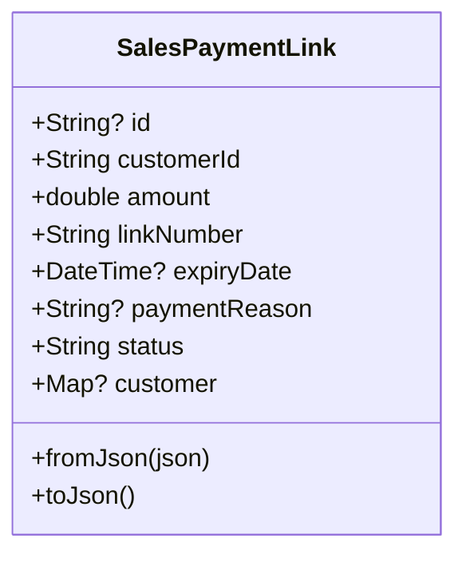
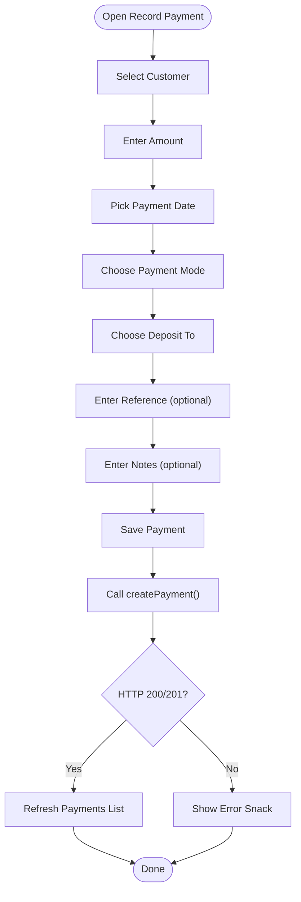
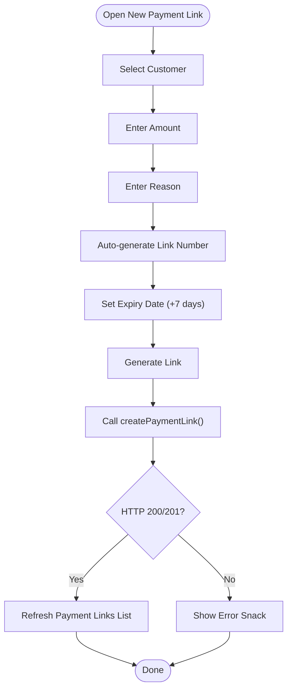
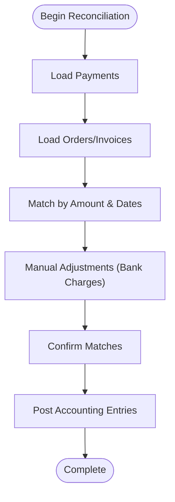
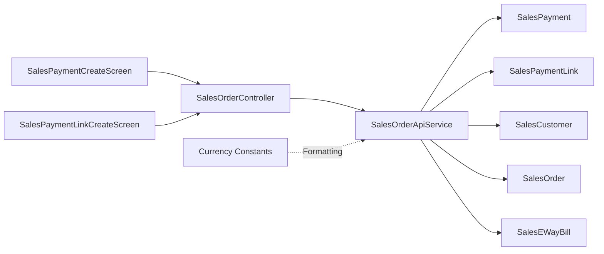

# Payment Processing

<cite>
**Referenced Files in This Document**
- [sales_payment_model.dart](file://lib/modules/sales/models/sales_payment_model.dart)
- [sales_payment_link_model.dart](file://lib/modules/sales/models/sales_payment_link_model.dart)
- [sales_payment_create.dart](file://lib/modules/sales/presentation/sales_payment_create.dart)
- [sales_payment_link_create.dart](file://lib/modules/sales/presentation/sales_payment_link_create.dart)
- [sales_order_controller.dart](file://lib/modules/sales/controller/sales_order_controller.dart)
- [sales_order_api_service.dart](file://lib/modules/sales/services/sales_order_api_service.dart)
- [currency_constants.dart](file://lib/shared/constants/currency_constants.dart)
- [sales_customer_model.dart](file://lib/modules/sales/models/sales_customer_model.dart)
- [sales_order_model.dart](file://lib/modules/sales/models/sales_order_model.dart)
- [sales_eway_bill_model.dart](file://lib/modules/sales/models/sales_eway_bill_model.dart)
</cite>

## Table of Contents
1. [Introduction](#introduction)
2. [Project Structure](#project-structure)
3. [Core Components](#core-components)
4. [Architecture Overview](#architecture-overview)
5. [Detailed Component Analysis](#detailed-component-analysis)
6. [Dependency Analysis](#dependency-analysis)
7. [Performance Considerations](#performance-considerations)
8. [Troubleshooting Guide](#troubleshooting-guide)
9. [Conclusion](#conclusion)
10. [Appendices](#appendices)

## Introduction
This document describes the Payment Processing system within the Zerpai ERP application. It focuses on cash payment handling, bank payment processing, payment link generation, and payment reconciliation workflows. It also explains payment method categorization, multi-currency support, payment reminders, and payment history tracking. Practical examples illustrate payment collection scenarios, online payment integration via payment links, and payment matching processes. Validation rules, refund processing, and integration touchpoints with accounting and inventory systems are documented to guide implementation and maintenance.

## Project Structure
The payment processing capability spans frontend UI screens, Riverpod providers, and service APIs that communicate with the backend. The relevant modules include:
- Models for payment and payment link entities
- Presentation screens for capturing cash/bank payments and generating payment links
- Controller/provider layer for state and data access
- API service layer for HTTP communication
- Shared currency constants for multi-currency support

**Diagram sources**
- [sales_payment_create.dart](file://lib/modules/sales/presentation/sales_payment_create.dart#L1-L280)
- [sales_payment_link_create.dart](file://lib/modules/sales/presentation/sales_payment_link_create.dart#L1-L141)
- [sales_order_controller.dart](file://lib/modules/sales/controller/sales_order_controller.dart#L1-L119)
- [sales_order_api_service.dart](file://lib/modules/sales/services/sales_order_api_service.dart#L1-L192)
- [sales_payment_model.dart](file://lib/modules/sales/models/sales_payment_model.dart#L1-L61)
- [sales_payment_link_model.dart](file://lib/modules/sales/models/sales_payment_link_model.dart#L1-L49)
- [currency_constants.dart](file://lib/shared/constants/currency_constants.dart#L1-L800)

**Section sources**
- [sales_payment_create.dart](file://lib/modules/sales/presentation/sales_payment_create.dart#L1-L280)
- [sales_payment_link_create.dart](file://lib/modules/sales/presentation/sales_payment_link_create.dart#L1-L141)
- [sales_order_controller.dart](file://lib/modules/sales/controller/sales_order_controller.dart#L1-L119)
- [sales_order_api_service.dart](file://lib/modules/sales/services/sales_order_api_service.dart#L1-L192)
- [sales_payment_model.dart](file://lib/modules/sales/models/sales_payment_model.dart#L1-L61)
- [sales_payment_link_model.dart](file://lib/modules/sales/models/sales_payment_link_model.dart#L1-L49)
- [currency_constants.dart](file://lib/shared/constants/currency_constants.dart#L1-L800)

## Core Components
- SalesPayment model: Encapsulates payment details including customer reference, payment number, date, mode, amount, bank charges, reference, deposit account, notes, and optional customer display name. Includes JSON serialization/deserialization helpers.
- SalesPaymentLink model: Encapsulates payment link metadata including customer, amount, link number, expiry date, reason, status, and optional customer object. Includes JSON serialization/deserialization helpers.
- SalesPaymentCreateScreen: UI for recording cash and bank payments, including amount, date, mode, deposit-to account, reference, and notes. Generates a default payment number and persists via the API service.
- SalesPaymentLinkCreateScreen: UI for generating payment links with amount, reason, expiry date, and customer selection. Persists via the API service.
- SalesOrderController: Riverpod provider exposing typed lists for payments and payment links, and customer list. Provides creation methods for customers and refresh mechanisms.
- SalesOrderApiService: HTTP client wrapper for sales endpoints including payments and payment links, with robust error handling and status checks.
- Currency constants: Shared currency options with code, name, symbol, decimals, and format for multi-currency support.

**Section sources**
- [sales_payment_model.dart](file://lib/modules/sales/models/sales_payment_model.dart#L1-L61)
- [sales_payment_link_model.dart](file://lib/modules/sales/models/sales_payment_link_model.dart#L1-L49)
- [sales_payment_create.dart](file://lib/modules/sales/presentation/sales_payment_create.dart#L1-L280)
- [sales_payment_link_create.dart](file://lib/modules/sales/presentation/sales_payment_link_create.dart#L1-L141)
- [sales_order_controller.dart](file://lib/modules/sales/controller/sales_order_controller.dart#L1-L119)
- [sales_order_api_service.dart](file://lib/modules/sales/services/sales_order_api_service.dart#L1-L192)
- [currency_constants.dart](file://lib/shared/constants/currency_constants.dart#L1-L800)

## Architecture Overview
The payment processing architecture follows a layered pattern:
- Presentation layer captures user input and triggers actions.
- State/controller layer manages asynchronous data and exposes providers.
- Service layer handles HTTP requests/responses and maps to domain models.
- Backend endpoints expose CRUD operations for payments and payment links.

**Diagram sources**
- [sales_payment_create.dart](file://lib/modules/sales/presentation/sales_payment_create.dart#L254-L278)
- [sales_order_controller.dart](file://lib/modules/sales/controller/sales_order_controller.dart#L86-L95)
- [sales_order_api_service.dart](file://lib/modules/sales/services/sales_order_api_service.dart#L77-L90)

**Diagram sources**
- [sales_payment_link_create.dart](file://lib/modules/sales/presentation/sales_payment_link_create.dart#L118-L139)
- [sales_order_controller.dart](file://lib/modules/sales/controller/sales_order_controller.dart#L63-L65)
- [sales_order_api_service.dart](file://lib/modules/sales/services/sales_order_api_service.dart#L177-L190)

## Detailed Component Analysis

### SalesPayment Model
- Purpose: Represents a single payment transaction with fields for customer, payment number, date, mode, amount, bank charges, reference, deposit account, notes, and optional customer display name.
- Serialization: Converts to/from JSON for transport and persistence.
- Usage: Created by the payment screen and sent to the backend via the API service.

**Diagram sources**
- [sales_payment_model.dart](file://lib/modules/sales/models/sales_payment_model.dart#L1-L61)

**Section sources**
- [sales_payment_model.dart](file://lib/modules/sales/models/sales_payment_model.dart#L1-L61)

### SalesPaymentLink Model
- Purpose: Represents a payment link with customer, amount, link number, expiry date, reason, status, and optional customer object.
- Serialization: Converts to/from JSON for transport and persistence.
- Usage: Created by the payment link screen and sent to the backend via the API service.

**Diagram sources**
- [sales_payment_link_model.dart](file://lib/modules/sales/models/sales_payment_link_model.dart#L1-L49)

**Section sources**
- [sales_payment_link_model.dart](file://lib/modules/sales/models/sales_payment_link_model.dart#L1-L49)

### SalesPaymentCreateScreen (Cash/Bank Payments)
- Purpose: Captures cash and bank payment details, including amount, date, mode, deposit-to account, reference, and notes. Generates a default payment number and persists via the API service.
- Inputs: Customer selection, amount, payment date, payment mode, deposit-to account, reference, notes.
- Outputs: Success feedback and payment list refresh.

**Diagram sources**
- [sales_payment_create.dart](file://lib/modules/sales/presentation/sales_payment_create.dart#L254-L278)
- [sales_order_api_service.dart](file://lib/modules/sales/services/sales_order_api_service.dart#L77-L90)

**Section sources**
- [sales_payment_create.dart](file://lib/modules/sales/presentation/sales_payment_create.dart#L1-L280)

### SalesPaymentLinkCreateScreen (Payment Links)
- Purpose: Generates a payment link with amount, reason, expiry date, and customer selection. Persists via the API service.
- Inputs: Customer selection, amount, reason, auto-generated link number, expiry date.
- Outputs: Success feedback and payment links list refresh.

**Diagram sources**
- [sales_payment_link_create.dart](file://lib/modules/sales/presentation/sales_payment_link_create.dart#L118-L139)
- [sales_order_api_service.dart](file://lib/modules/sales/services/sales_order_api_service.dart#L177-L190)

**Section sources**
- [sales_payment_link_create.dart](file://lib/modules/sales/presentation/sales_payment_link_create.dart#L1-L141)

### Multi-Currency Support
- Currency options are defined centrally with code, name, symbol, decimals, and format. This enables consistent formatting and decimal handling across the application.
- While payment models currently store amounts as numeric values, currency formatting and exchange rate handling can be integrated at the UI and service layers as needed.

**Section sources**
- [currency_constants.dart](file://lib/shared/constants/currency_constants.dart#L1-L800)

### Payment Method Categorization
- Payment modes supported in the UI include Cash, Check, Credit Card, Bank Transfer, and Other. These categories inform accounting classification and reporting.
- Bank charges are captured separately in the payment model to support reconciliation and accounting entries.

**Section sources**
- [sales_payment_create.dart](file://lib/modules/sales/presentation/sales_payment_create.dart#L132-L143)
- [sales_payment_model.dart](file://lib/modules/sales/models/sales_payment_model.dart#L1-L61)

### Payment Reminders and History Tracking
- Payment links include an expiry date, enabling reminder workflows prior to expiration.
- Payment history is maintained via the payments endpoint and exposed through the controller’s provider, allowing list views and reconciliation.

**Section sources**
- [sales_payment_link_create.dart](file://lib/modules/sales/presentation/sales_payment_link_create.dart#L126-L127)
- [sales_order_controller.dart](file://lib/modules/sales/controller/sales_order_controller.dart#L35-L37)
- [sales_order_api_service.dart](file://lib/modules/sales/services/sales_order_api_service.dart#L64-L75)

### Payment Reconciliation Workflow
- Reconciliation involves matching received payments against outstanding invoices/orders.
- The reconciliation process can leverage:
  - Payment number and reference fields
  - Payment mode and deposit-to account
  - Payment date and amount
- The system supports:
  - Viewing payment history
  - Matching payments to orders/invoices
  - Recording bank charges adjustments

[No sources needed since this diagram shows conceptual workflow, not actual code structure]

### Refund Processing
- Refunds can be modeled as negative payments or credit notes linked to original payments.
- Integration points:
  - Create a refund payment record with negative amount
  - Link refund to original payment via reference/payment number
  - Update order/invoice status and balances
  - Post accounting entries for refunds

[No sources needed since this section provides general guidance]

### Integration with Accounting and Inventory Systems
- Accounting:
  - Payment mode and deposit-to account determine ledger accounts.
  - Bank charges can be posted as expenses.
  - Payment references and numbers support audit trails.
- Inventory:
  - Payments trigger invoice generation and stock reservation/release depending on business rules.
  - E-way bills can be associated with deliveries linked to payments.

**Section sources**
- [sales_payment_model.dart](file://lib/modules/sales/models/sales_payment_model.dart#L1-L61)
- [sales_eway_bill_model.dart](file://lib/modules/sales/models/sales_eway_bill_model.dart)

## Dependency Analysis
The payment subsystem exhibits clear separation of concerns:
- Presentation depends on Riverpod for state and on the API service for network operations.
- Controller/provider orchestrates data access and exposes typed lists for UI consumption.
- API service encapsulates HTTP logic and maps JSON responses to models.
- Models are lightweight and serializable, facilitating transport and persistence.

**Diagram sources**
- [sales_payment_create.dart](file://lib/modules/sales/presentation/sales_payment_create.dart#L1-L280)
- [sales_payment_link_create.dart](file://lib/modules/sales/presentation/sales_payment_link_create.dart#L1-L141)
- [sales_order_controller.dart](file://lib/modules/sales/controller/sales_order_controller.dart#L1-L119)
- [sales_order_api_service.dart](file://lib/modules/sales/services/sales_order_api_service.dart#L1-L192)
- [sales_payment_model.dart](file://lib/modules/sales/models/sales_payment_model.dart#L1-L61)
- [sales_payment_link_model.dart](file://lib/modules/sales/models/sales_payment_link_model.dart#L1-L49)
- [currency_constants.dart](file://lib/shared/constants/currency_constants.dart#L1-L800)

**Section sources**
- [sales_order_controller.dart](file://lib/modules/sales/controller/sales_order_controller.dart#L1-L119)
- [sales_order_api_service.dart](file://lib/modules/sales/services/sales_order_api_service.dart#L1-L192)

## Performance Considerations
- Network efficiency: Batch retrieval of payment lists and lazy loading of customer lists reduce initial payload sizes.
- UI responsiveness: Use Riverpod’s async providers to avoid blocking the UI during fetch operations.
- Decimal handling: Centralized currency constants ensure consistent formatting and reduce rounding discrepancies.
- Caching: Consider caching customer and lookup data to minimize repeated network calls.

[No sources needed since this section provides general guidance]

## Troubleshooting Guide
Common issues and resolutions:
- Payment creation failures:
  - Verify customer selection and amount validity.
  - Check network connectivity and server response codes.
  - Inspect error messages returned by the API service.
- Payment link generation failures:
  - Ensure amount is valid and customer is selected.
  - Confirm link number generation and expiry date logic.
- Reconciliation mismatches:
  - Compare payment references, amounts, and dates.
  - Investigate bank charges and currency conversion impacts.
- Multi-currency formatting:
  - Validate currency decimals and symbol mapping.
  - Ensure consistent locale formatting across devices.

**Section sources**
- [sales_order_api_service.dart](file://lib/modules/sales/services/sales_order_api_service.dart#L77-L90)
- [sales_payment_create.dart](file://lib/modules/sales/presentation/sales_payment_create.dart#L268-L277)
- [sales_payment_link_create.dart](file://lib/modules/sales/presentation/sales_payment_link_create.dart#L129-L138)

## Conclusion
The Payment Processing system integrates UI capture, state management, and backend APIs to support cash and bank payments, payment link generation, and reconciliation workflows. Payment method categorization, multi-currency support, and structured models enable robust accounting and inventory integrations. The architecture supports extensibility for reminders, refund processing, and advanced reconciliation features.

## Appendices

### Practical Examples

- Cash Payment Collection
  - Scenario: Receive cash for a sale.
  - Steps: Open Record Payment, select customer, enter amount, choose Cash as payment mode, pick deposit-to account, enter reference and notes, save.
  - Outcome: Payment recorded, history updated.

- Bank Payment Processing
  - Scenario: Receive bank transfer with applicable charges.
  - Steps: Enter amount, choose Bank Transfer, specify bank charges, enter reference, save.
  - Outcome: Payment recorded with charges for reconciliation.

- Online Payment Integration via Payment Links
  - Scenario: Share a secure link for subscription payment.
  - Steps: Open New Payment Link, select customer, set amount and reason, generate link.
  - Outcome: Link created with expiry date; customer receives link; payment recorded upon completion.

- Payment Matching Process
  - Scenario: Match received payments to outstanding invoices.
  - Steps: Load payments and invoices, match by amount and approximate dates, adjust for bank charges, confirm matches.
  - Outcome: Invoices marked paid, accounting entries posted.

[No sources needed since this section provides general guidance]