# Quotation Workflow

<cite>
**Referenced Files in This Document**
- [sales_quotation_quotation_create.dart](file://lib/modules/sales/presentation/sales_quotation_quotation_create.dart)
- [sales_order_controller.dart](file://lib/modules/sales/controller/sales_order_controller.dart)
- [sales_order_api_service.dart](file://lib/modules/sales/services/sales_order_api_service.dart)
- [sales_order_model.dart](file://lib/modules/sales/models/sales_order_model.dart)
- [sales_order_item_model.dart](file://lib/modules/sales/models/sales_order_item_model.dart)
- [sales.controller.ts](file://backend/src/sales/sales.controller.ts)
- [sales.service.ts](file://backend/src/sales/sales.service.ts)
- [schema.ts](file://backend/src/db/schema.ts)
- [item_model.dart](file://lib/modules/items/models/item_model.dart)
- [items_controller.dart](file://lib/modules/items/controller/items_controller.dart)
</cite>

## Table of Contents
1. [Introduction](#introduction)
2. [Project Structure](#project-structure)
3. [Core Components](#core-components)
4. [Architecture Overview](#architecture-overview)
5. [Detailed Component Analysis](#detailed-component-analysis)
6. [Dependency Analysis](#dependency-analysis)
7. [Performance Considerations](#performance-considerations)
8. [Troubleshooting Guide](#troubleshooting-guide)
9. [Conclusion](#conclusion)
10. [Appendices](#appendices)

## Introduction
This document describes the Quotation workflow system in the Zerpai ERP application. It covers the end-to-end process for creating quotations, managing templates, calculating pricing and discounts, tracking statuses, converting quotations to sales orders, notifying customers, handling expiry dates, and integrating with customer and item management systems. Practical examples illustrate typical workflows, pricing strategies, and conversion steps.

## Project Structure
The quotation workflow spans the frontend Flutter module and the backend NestJS service:
- Frontend presentation and state management for creating quotations and rendering totals
- Backend REST endpoints for quotations and related entities
- Database schema defining sales documents and related tables

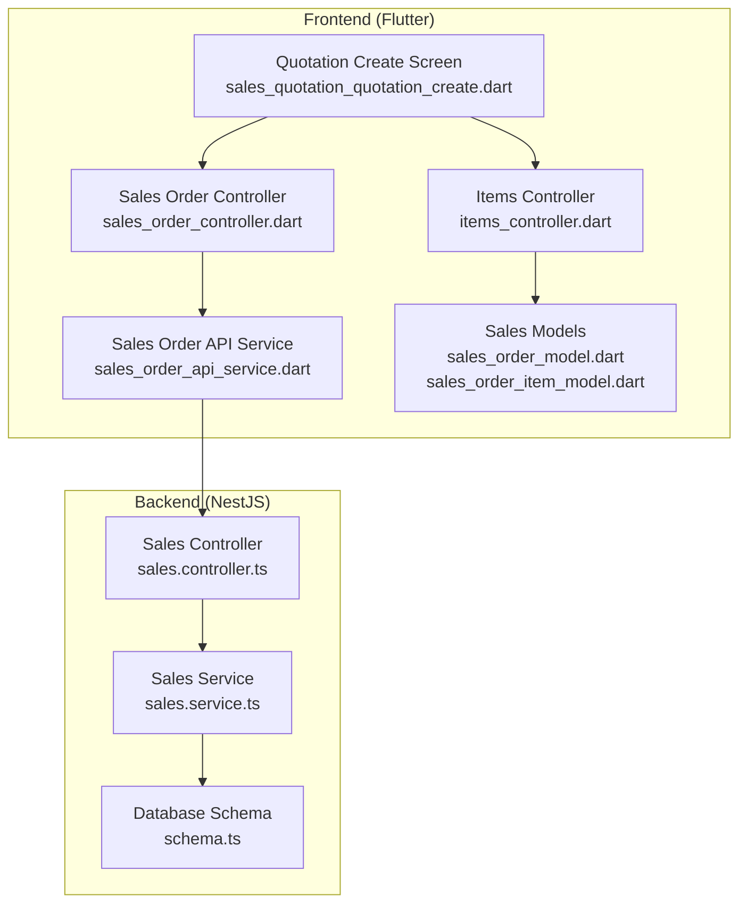

**Diagram sources**
- [sales_quotation_quotation_create.dart](file://lib/modules/sales/presentation/sales_quotation_quotation_create.dart#L1-L559)
- [sales_order_controller.dart](file://lib/modules/sales/controller/sales_order_controller.dart#L1-L119)
- [sales_order_api_service.dart](file://lib/modules/sales/services/sales_order_api_service.dart#L1-L192)
- [sales_order_model.dart](file://lib/modules/sales/models/sales_order_model.dart#L1-L118)
- [sales_order_item_model.dart](file://lib/modules/sales/models/sales_order_item_model.dart#L1-L62)
- [sales.controller.ts](file://backend/src/sales/sales.controller.ts#L1-L102)
- [sales.service.ts](file://backend/src/sales/sales.service.ts#L1-L162)
- [schema.ts](file://backend/src/db/schema.ts#L236-L253)
- [items_controller.dart](file://lib/modules/items/controller/items_controller.dart)

**Section sources**
- [sales_quotation_quotation_create.dart](file://lib/modules/sales/presentation/sales_quotation_quotation_create.dart#L1-L559)
- [sales_order_controller.dart](file://lib/modules/sales/controller/sales_order_controller.dart#L1-L119)
- [sales_order_api_service.dart](file://lib/modules/sales/services/sales_order_api_service.dart#L1-L192)
- [sales_order_model.dart](file://lib/modules/sales/models/sales_order_model.dart#L1-L118)
- [sales_order_item_model.dart](file://lib/modules/sales/models/sales_order_item_model.dart#L1-L62)
- [sales.controller.ts](file://backend/src/sales/sales.controller.ts#L1-L102)
- [sales.service.ts](file://backend/src/sales/sales.service.ts#L1-L162)
- [schema.ts](file://backend/src/db/schema.ts#L236-L253)

## Core Components
- Quotation Create Screen: Collects customer, header fields, line items, and summary totals; persists via API.
- Sales Order Controller: Riverpod notifier orchestrating data loading and persistence.
- Sales Order API Service: HTTP client wrapper for sales endpoints.
- Sales Models: Strongly typed models for quotations and items.
- Sales Controller and Service: Backend endpoints and database operations for quotations.
- Database Schema: Defines sales_orders and related entities.

**Section sources**
- [sales_quotation_quotation_create.dart](file://lib/modules/sales/presentation/sales_quotation_quotation_create.dart#L17-L559)
- [sales_order_controller.dart](file://lib/modules/sales/controller/sales_order_controller.dart#L67-L119)
- [sales_order_api_service.dart](file://lib/modules/sales/services/sales_order_api_service.dart#L104-L121)
- [sales_order_model.dart](file://lib/modules/sales/models/sales_order_model.dart#L4-L51)
- [sales_order_item_model.dart](file://lib/modules/sales/models/sales_order_item_model.dart#L3-L26)
- [sales.controller.ts](file://backend/src/sales/sales.controller.ts#L77-L100)
- [sales.service.ts](file://backend/src/sales/sales.service.ts#L80-L97)
- [schema.ts](file://backend/src/db/schema.ts#L236-L253)

## Architecture Overview
The quotation workflow follows a layered architecture:
- UI captures user input and triggers actions
- Controller coordinates state and invokes API service
- API service sends HTTP requests to backend
- Backend controller handles routing and delegates to service
- Service executes database operations and returns results

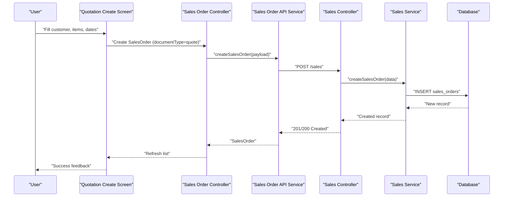

**Diagram sources**
- [sales_quotation_quotation_create.dart](file://lib/modules/sales/presentation/sales_quotation_quotation_create.dart#L512-L551)
- [sales_order_controller.dart](file://lib/modules/sales/controller/sales_order_controller.dart#L86-L95)
- [sales_order_api_service.dart](file://lib/modules/sales/services/sales_order_api_service.dart#L104-L121)
- [sales.controller.ts](file://backend/src/sales/sales.controller.ts#L91-L95)
- [sales.service.ts](file://backend/src/sales/sales.service.ts#L80-L97)
- [schema.ts](file://backend/src/db/schema.ts#L236-L253)

## Detailed Component Analysis

### Quotation Creation Screen
Responsibilities:
- Capture customer selection, quote number, reference, dates, salesperson
- Manage line items with item selection, quantity, rate, discount
- Compute sub-total, tax total placeholder, shipping, adjustments, and grand total
- Persist quotation with documentType set to quote and status set to draft or confirmed

Key behaviors:
- Header section collects customer, quote/reference dates, salesperson
- Items table supports dynamic addition/removal of rows
- Totals update on input changes
- Save action builds SalesOrder and calls controller to persist

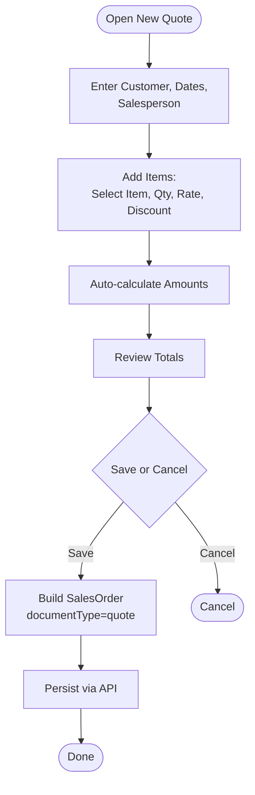

**Diagram sources**
- [sales_quotation_quotation_create.dart](file://lib/modules/sales/presentation/sales_quotation_quotation_create.dart#L135-L551)

**Section sources**
- [sales_quotation_quotation_create.dart](file://lib/modules/sales/presentation/sales_quotation_quotation_create.dart#L25-L107)
- [sales_quotation_quotation_create.dart](file://lib/modules/sales/presentation/sales_quotation_quotation_create.dart#L135-L215)
- [sales_quotation_quotation_create.dart](file://lib/modules/sales/presentation/sales_quotation_quotation_create.dart#L269-L407)
- [sales_quotation_quotation_create.dart](file://lib/modules/sales/presentation/sales_quotation_quotation_create.dart#L409-L486)
- [sales_quotation_quotation_create.dart](file://lib/modules/sales/presentation/sales_quotation_quotation_create.dart#L488-L551)

### Pricing Calculations and Discount Application
- Line amount per item = (quantity × rate) − discount
- Sub-total accumulates line amounts
- Shipping and adjustment are editable and included in total
- Tax total is maintained on model but not computed in the UI; backend can compute taxes during processing

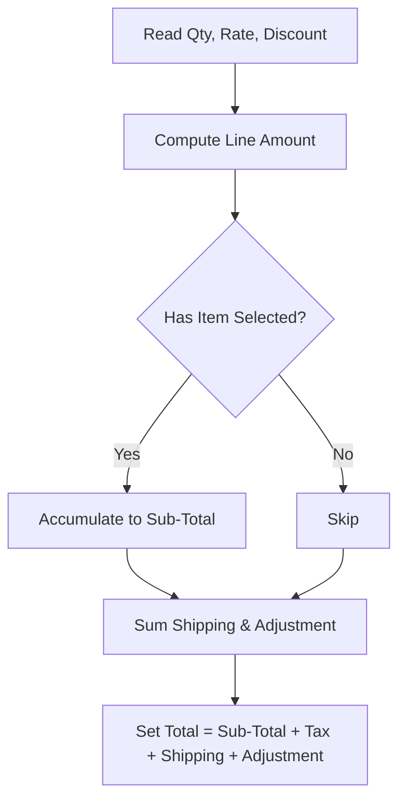

**Diagram sources**
- [sales_quotation_quotation_create.dart](file://lib/modules/sales/presentation/sales_quotation_quotation_create.dart#L90-L107)
- [sales_order_model.dart](file://lib/modules/sales/models/sales_order_model.dart#L16-L21)

**Section sources**
- [sales_quotation_quotation_create.dart](file://lib/modules/sales/presentation/sales_quotation_quotation_create.dart#L90-L107)
- [sales_order_model.dart](file://lib/modules/sales/models/sales_order_model.dart#L16-L21)

### Quotation Lifecycle Management
- Creation: documentType=quote, status=draft or confirmed
- Viewing: list providers for quotes and other sales documents
- Deletion: delete endpoint removes quotations
- Conversion: convert a quote to an order/invoice by changing status and generating downstream documents

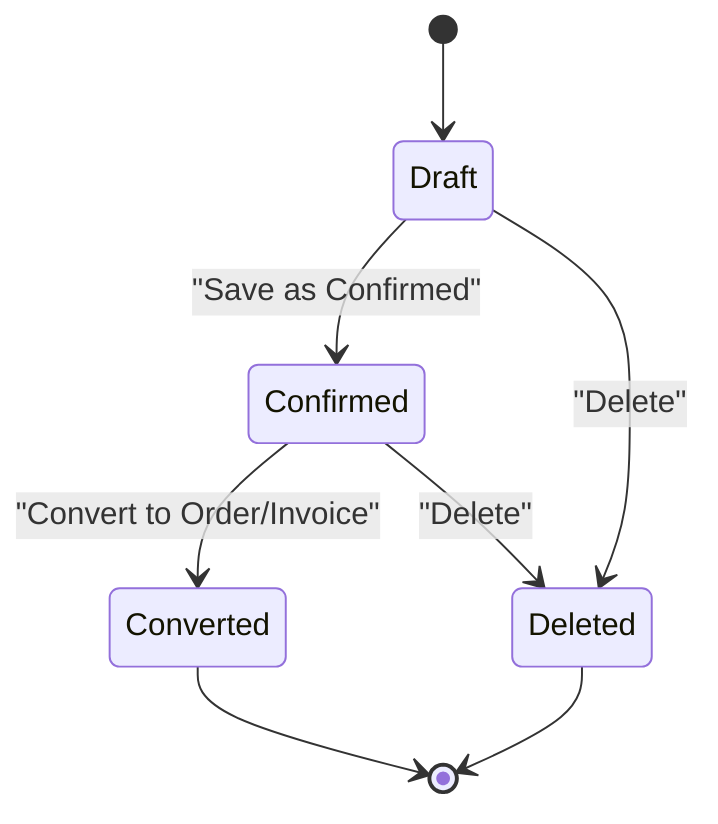

**Diagram sources**
- [sales_order_model.dart](file://lib/modules/sales/models/sales_order_model.dart#L38-L40)
- [sales_order_controller.dart](file://lib/modules/sales/controller/sales_order_controller.dart#L27-L29)
- [sales_order_controller.dart](file://lib/modules/sales/controller/sales_order_controller.dart#L97-L105)
- [sales.controller.ts](file://backend/src/sales/sales.controller.ts#L97-L100)

**Section sources**
- [sales_order_model.dart](file://lib/modules/sales/models/sales_order_model.dart#L38-L40)
- [sales_order_controller.dart](file://lib/modules/sales/controller/sales_order_controller.dart#L27-L29)
- [sales_order_controller.dart](file://lib/modules/sales/controller/sales_order_controller.dart#L97-L105)
- [sales.controller.ts](file://backend/src/sales/sales.controller.ts#L97-L100)

### Quotation-to-Order Conversion Workflows
- From UI: change status to confirmed/order and persist; downstream documents (e.g., invoice, challan, payment links) are created by backend/business logic
- Backend: createSalesOrder persists the quotation; subsequent workflows (e.g., invoice generation) are handled by business rules and APIs

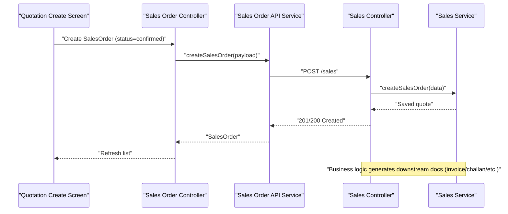

**Diagram sources**
- [sales_quotation_quotation_create.dart](file://lib/modules/sales/presentation/sales_quotation_quotation_create.dart#L512-L551)
- [sales_order_controller.dart](file://lib/modules/sales/controller/sales_order_controller.dart#L86-L95)
- [sales_order_api_service.dart](file://lib/modules/sales/services/sales_order_api_service.dart#L104-L121)
- [sales.controller.ts](file://backend/src/sales/sales.controller.ts#L91-L95)
- [sales.service.ts](file://backend/src/sales/sales.service.ts#L80-L97)

**Section sources**
- [sales_quotation_quotation_create.dart](file://lib/modules/sales/presentation/sales_quotation_quotation_create.dart#L512-L551)
- [sales_order_api_service.dart](file://lib/modules/sales/services/sales_order_api_service.dart#L104-L121)
- [sales.service.ts](file://backend/src/sales/sales.service.ts#L80-L97)

### Customer Notification Processes
- Payment links: The system supports generating payment links associated with a customer and amount; these can be used to notify customers and collect payments after conversion or for standalone payments
- E-way bills: Delivery-related notifications can be supported via e-way bills linked to sales orders

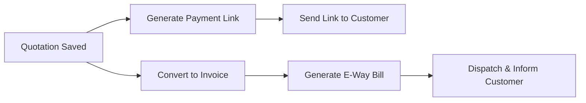

**Diagram sources**
- [sales_order_api_service.dart](file://lib/modules/sales/services/sales_order_api_service.dart#L164-L190)
- [sales.service.ts](file://backend/src/sales/sales.service.ts#L152-L160)
- [schema.ts](file://backend/src/db/schema.ts#L283-L291)

**Section sources**
- [sales_order_api_service.dart](file://lib/modules/sales/services/sales_order_api_service.dart#L164-L190)
- [sales.service.ts](file://backend/src/sales/sales.service.ts#L152-L160)
- [schema.ts](file://backend/src/db/schema.ts#L283-L291)

### Expiry Date Handling
- The UI allows setting an expiry date for quotations
- Business logic can enforce expiry checks before conversion or invoicing; currently, expiry is captured in the model and UI but not enforced in the backend service shown here

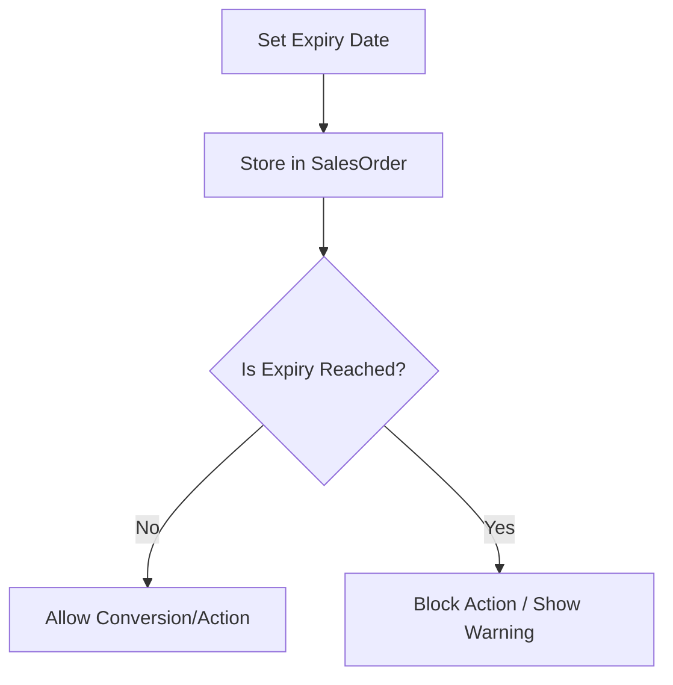

**Diagram sources**
- [sales_quotation_quotation_create.dart](file://lib/modules/sales/presentation/sales_quotation_quotation_create.dart#L36-L38)
- [sales_order_model.dart](file://lib/modules/sales/models/sales_order_model.dart#L10-L10)

**Section sources**
- [sales_quotation_quotation_create.dart](file://lib/modules/sales/presentation/sales_quotation_quotation_create.dart#L36-L38)
- [sales_order_model.dart](file://lib/modules/sales/models/sales_order_model.dart#L10-L10)

### Quotation Status Tracking
- Status defaults to draft; can be saved as confirmed
- Backend stores status in sales_orders
- UI lists providers differentiate quotes by documentType

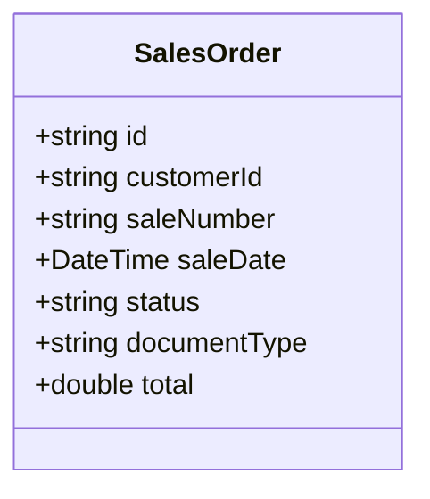

**Diagram sources**
- [sales_order_model.dart](file://lib/modules/sales/models/sales_order_model.dart#L4-L51)
- [sales_order_controller.dart](file://lib/modules/sales/controller/sales_order_controller.dart#L27-L29)
- [schema.ts](file://backend/src/db/schema.ts#L236-L253)

**Section sources**
- [sales_order_model.dart](file://lib/modules/sales/models/sales_order_model.dart#L38-L40)
- [sales_order_controller.dart](file://lib/modules/sales/controller/sales_order_controller.dart#L27-L29)
- [schema.ts](file://backend/src/db/schema.ts#L236-L253)

### Template Management
- The UI does not expose explicit quotation templates; however, the item selection and pricing fields enable consistent quoting by selecting predefined items and rates
- Price lists exist in the system and can inform pricing strategies for items; while not directly templated in the quotation screen, they support consistent pricing across quotes

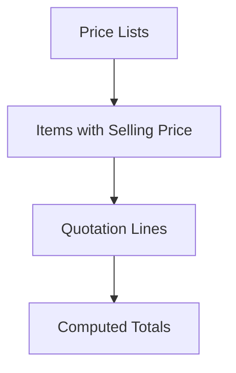

**Diagram sources**
- [item_model.dart](file://lib/modules/items/models/item_model.dart#L34-L35)
- [sales_quotation_quotation_create.dart](file://lib/modules/sales/presentation/sales_quotation_quotation_create.dart#L339-L344)

**Section sources**
- [item_model.dart](file://lib/modules/items/models/item_model.dart#L34-L35)
- [sales_quotation_quotation_create.dart](file://lib/modules/sales/presentation/sales_quotation_quotation_create.dart#L339-L344)

### Bulk Operations
- The quotation screen focuses on single-document creation and editing
- Bulk operations (e.g., importing items, mass updates) are supported in the items module and can be leveraged to prepare consistent item catalogs for quoting

**Section sources**
- [sales_quotation_quotation_create.dart](file://lib/modules/sales/presentation/sales_quotation_quotation_create.dart#L398-L403)
- [items_controller.dart](file://lib/modules/items/controller/items_controller.dart)

### Integration with Customer and Item Management Systems
- Customer integration: The UI loads customers via a provider; new customers can be created through the API service
- Item integration: The UI loads items for selection; item models carry selling prices and metadata used in pricing

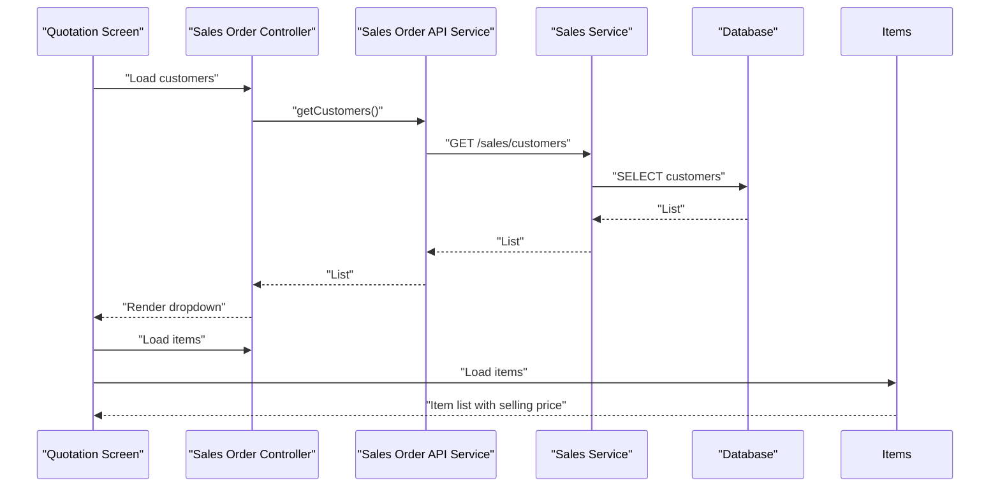

**Diagram sources**
- [sales_order_controller.dart](file://lib/modules/sales/controller/sales_order_controller.dart#L22-L25)
- [sales_order_api_service.dart](file://lib/modules/sales/services/sales_order_api_service.dart#L14-L25)
- [sales.controller.ts](file://backend/src/sales/sales.controller.ts#L18-L27)
- [sales.service.ts](file://backend/src/sales/sales.service.ts#L30-L41)
- [schema.ts](file://backend/src/db/schema.ts#L213-L234)
- [item_model.dart](file://lib/modules/items/models/item_model.dart#L34-L35)

**Section sources**
- [sales_order_controller.dart](file://lib/modules/sales/controller/sales_order_controller.dart#L22-L25)
- [sales_order_api_service.dart](file://lib/modules/sales/services/sales_order_api_service.dart#L14-L25)
- [sales.controller.ts](file://backend/src/sales/sales.controller.ts#L18-L27)
- [sales.service.ts](file://backend/src/sales/sales.service.ts#L30-L41)
- [schema.ts](file://backend/src/db/schema.ts#L213-L234)
- [item_model.dart](file://lib/modules/items/models/item_model.dart#L34-L35)

## Dependency Analysis
- UI depends on controller/provider for data and on API service for network calls
- Controller depends on API service for CRUD operations
- API service depends on backend controller endpoints
- Backend controller depends on service for business logic
- Service depends on database schema for persistence

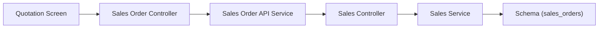

**Diagram sources**
- [sales_quotation_quotation_create.dart](file://lib/modules/sales/presentation/sales_quotation_quotation_create.dart#L512-L551)
- [sales_order_controller.dart](file://lib/modules/sales/controller/sales_order_controller.dart#L67-L95)
- [sales_order_api_service.dart](file://lib/modules/sales/services/sales_order_api_service.dart#L104-L121)
- [sales.controller.ts](file://backend/src/sales/sales.controller.ts#L77-L100)
- [sales.service.ts](file://backend/src/sales/sales.service.ts#L80-L97)
- [schema.ts](file://backend/src/db/schema.ts#L236-L253)

**Section sources**
- [sales_quotation_quotation_create.dart](file://lib/modules/sales/presentation/sales_quotation_quotation_create.dart#L512-L551)
- [sales_order_controller.dart](file://lib/modules/sales/controller/sales_order_controller.dart#L67-L95)
- [sales_order_api_service.dart](file://lib/modules/sales/services/sales_order_api_service.dart#L104-L121)
- [sales.controller.ts](file://backend/src/sales/sales.controller.ts#L77-L100)
- [sales.service.ts](file://backend/src/sales/sales.service.ts#L80-L97)
- [schema.ts](file://backend/src/db/schema.ts#L236-L253)

## Performance Considerations
- Minimize recomputation: Totals are recalculated on each input change; consider debouncing for large item sets
- Network efficiency: Batch operations (bulk item imports) reduce repeated fetches
- UI responsiveness: Keep asynchronous providers reactive and avoid heavy synchronous computations in build methods

## Troubleshooting Guide
Common issues and remedies:
- Empty customer selection prevents saving: Ensure a customer is selected before saving
- Invalid numeric inputs: Totals rely on numeric parsing; ensure quantities, rates, and discounts are valid numbers
- API errors: Inspect error logs and response codes from the API service; handle Dio exceptions gracefully
- Not finding a saved quotation: Verify documentType filtering and refresh providers

**Section sources**
- [sales_quotation_quotation_create.dart](file://lib/modules/sales/presentation/sales_quotation_quotation_create.dart#L512-L551)
- [sales_order_api_service.dart](file://lib/modules/sales/services/sales_order_api_service.dart#L114-L120)
- [sales_order_controller.dart](file://lib/modules/sales/controller/sales_order_controller.dart#L86-L95)

## Conclusion
The quotation workflow integrates a straightforward UI for capturing customer and item details, computing totals, and persisting quotations. The backend provides robust endpoints for quotations and related documents, enabling downstream conversions and notifications. While template management is not explicit in the UI, item and price list integrations support consistent quoting. Extending expiry enforcement and automated notifications would further strengthen the workflow.

## Appendices
- Practical examples:
  - Creating a quotation for a single item with quantity 1, rate equal to item’s selling price, and zero discount
  - Bulk adding multiple items, applying uniform discount per line, and adjusting shipping/adjustment
  - Converting a confirmed quotation to an order and generating an invoice via backend business rules