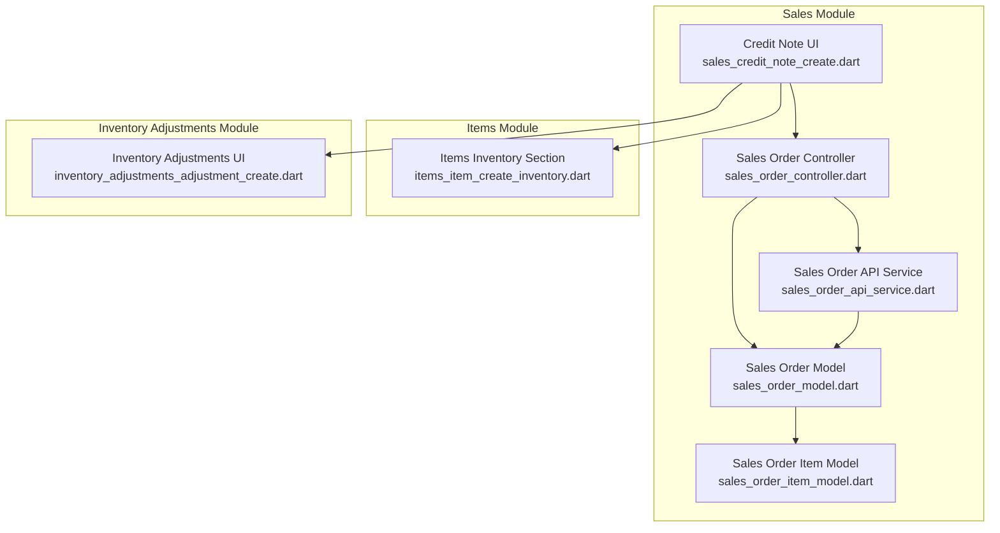
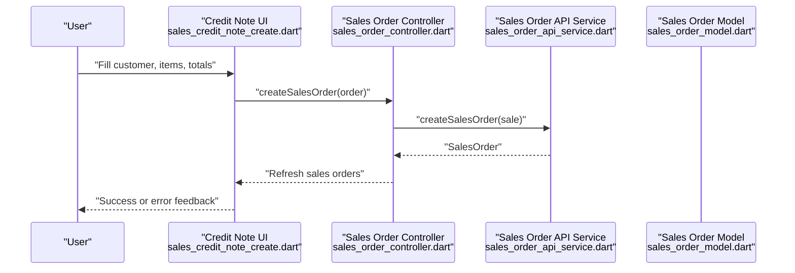
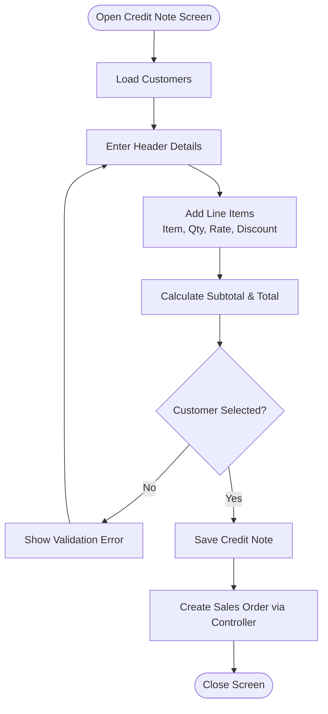
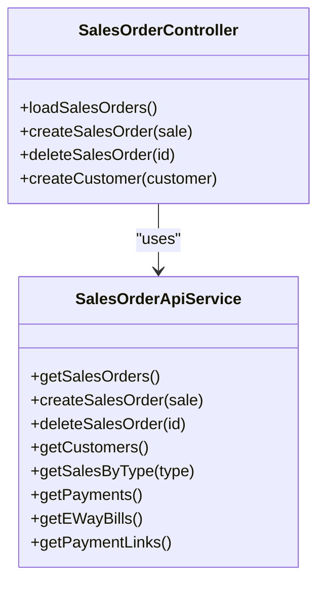
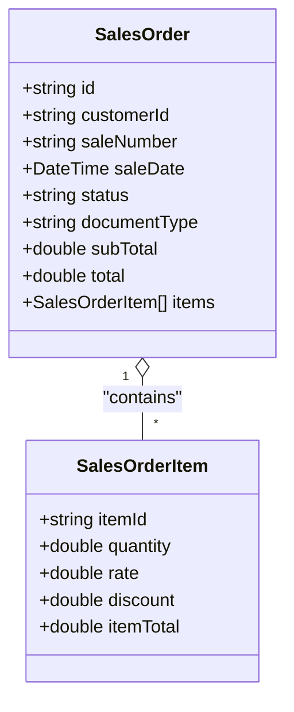
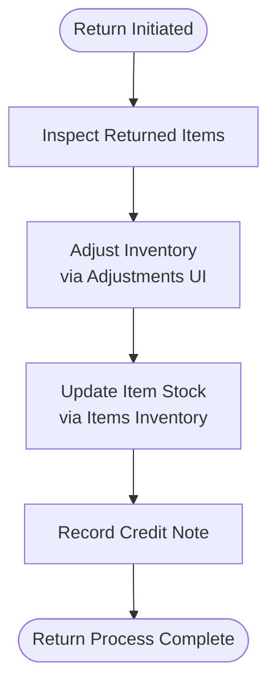
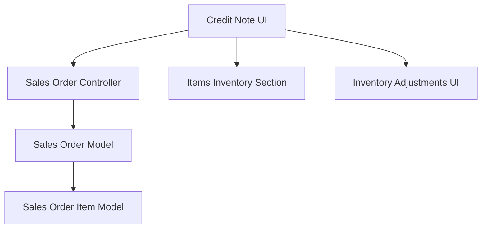

# Returns & Credit Notes

<cite>
**Referenced Files in This Document**
- [sales_credit_note_create.dart](file://lib/modules/sales/presentation/sales_credit_note_create.dart)
- [sales_order_controller.dart](file://lib/modules/sales/controller/sales_order_controller.dart)
- [sales_order_model.dart](file://lib/modules/sales/models/sales_order_model.dart)
- [sales_order_item_model.dart](file://lib/modules/sales/models/sales_order_item_model.dart)
- [items_item_create_inventory.dart](file://lib/modules/items/presentation/sections/items_item_create_inventory.dart)
- [inventory_adjustments_adjustment_create.dart](file://lib/modules/adjustments/presentation/inventory_adjustments_adjustment_create.dart)
- [sales_order_api_service.dart](file://lib/modules/sales/services/sales_order_api_service.dart)
</cite>

## Table of Contents
1. [Introduction](#introduction)
2. [Project Structure](#project-structure)
3. [Core Components](#core-components)
4. [Architecture Overview](#architecture-overview)
5. [Detailed Component Analysis](#detailed-component-analysis)
6. [Dependency Analysis](#dependency-analysis)
7. [Performance Considerations](#performance-considerations)
8. [Troubleshooting Guide](#troubleshooting-guide)
9. [Conclusion](#conclusion)

## Introduction
This document explains the Returns and Credit Notes system within the Zerpai ERP application. It focuses on how credit notes are created and processed, how return-related inventory adjustments are handled, and how the system integrates with sales orders and inventory. The content covers workflows for return processing, credit note generation, inventory return procedures, refund handling, return reason categorization, item inspection processes, return authorization workflows, return policy enforcement, return tracking, and integrations with inventory and accounting systems.

## Project Structure
The Returns and Credit Notes functionality is primarily implemented in the sales module with supporting components in items and inventory adjustments:
- Credit note creation UI is implemented in the sales presentation layer.
- Sales order model and controller orchestrate creation and retrieval of documents including credit notes.
- Inventory adjustments support return stock reconciliation.
- Items inventory section supports stock tracking and batch management.

**Diagram sources**
- [sales_credit_note_create.dart](file://lib/modules/sales/presentation/sales_credit_note_create.dart#L1-L520)
- [sales_order_controller.dart](file://lib/modules/sales/controller/sales_order_controller.dart#L1-L119)
- [sales_order_model.dart](file://lib/modules/sales/models/sales_order_model.dart#L1-L118)
- [sales_order_item_model.dart](file://lib/modules/sales/models/sales_order_item_model.dart#L1-L62)
- [items_item_create_inventory.dart](file://lib/modules/items/presentation/sections/items_item_create_inventory.dart)
- [inventory_adjustments_adjustment_create.dart](file://lib/modules/adjustments/presentation/inventory_adjustments_adjustment_create.dart)

**Section sources**
- [sales_credit_note_create.dart](file://lib/modules/sales/presentation/sales_credit_note_create.dart#L1-L520)
- [sales_order_controller.dart](file://lib/modules/sales/controller/sales_order_controller.dart#L1-L119)
- [sales_order_model.dart](file://lib/modules/sales/models/sales_order_model.dart#L1-L118)
- [sales_order_item_model.dart](file://lib/modules/sales/models/sales_order_item_model.dart#L1-L62)
- [items_item_create_inventory.dart](file://lib/modules/items/presentation/sections/items_item_create_inventory.dart)
- [inventory_adjustments_adjustment_create.dart](file://lib/modules/adjustments/presentation/inventory_adjustments_adjustment_create.dart)

## Core Components
- Credit Note Creation Screen: Provides a form to select a customer, enter header details, add line items with quantities, rates, and discounts, and save the credit note as a sales order document.
- Sales Order Controller: Manages fetching, creating, and deleting sales orders, including credit notes, and exposes providers for different document types.
- Sales Order Model: Defines the structure of sales orders and credit notes, including totals and metadata.
- Sales Order Item Model: Defines individual items within a sales order or credit note.
- Items Inventory Section: Supports stock tracking and batch management for items.
- Inventory Adjustments UI: Supports inventory adjustments to reconcile returned goods.

Key responsibilities:
- Credit note creation and validation
- Totals calculation and persistence
- Integration with customer and item lists
- Inventory reconciliation via adjustments

**Section sources**
- [sales_credit_note_create.dart](file://lib/modules/sales/presentation/sales_credit_note_create.dart#L17-L520)
- [sales_order_controller.dart](file://lib/modules/sales/controller/sales_order_controller.dart#L67-L119)
- [sales_order_model.dart](file://lib/modules/sales/models/sales_order_model.dart#L4-L118)
- [sales_order_item_model.dart](file://lib/modules/sales/models/sales_order_item_model.dart#L3-L62)
- [items_item_create_inventory.dart](file://lib/modules/items/presentation/sections/items_item_create_inventory.dart)
- [inventory_adjustments_adjustment_create.dart](file://lib/modules/adjustments/presentation/inventory_adjustments_adjustment_create.dart)

## Architecture Overview
The Returns and Credit Notes system follows a layered architecture:
- Presentation Layer: Credit note UI captures user inputs and triggers actions.
- Domain Layer: Sales order controller orchestrates data operations.
- Data Access Layer: Sales order API service handles remote persistence.
- Models: Strongly typed models represent sales orders and items.

**Diagram sources**
- [sales_credit_note_create.dart](file://lib/modules/sales/presentation/sales_credit_note_create.dart#L473-L512)
- [sales_order_controller.dart](file://lib/modules/sales/controller/sales_order_controller.dart#L86-L95)
- [sales_order_api_service.dart](file://lib/modules/sales/services/sales_order_api_service.dart)
- [sales_order_model.dart](file://lib/modules/sales/models/sales_order_model.dart#L4-L118)

## Detailed Component Analysis

### Credit Note Creation Screen
The screen enables:
- Customer selection from a dropdown populated asynchronously.
- Header fields: credit note number, reference, date, salesperson.
- Line items table with item selection, quantity, rate, discount, and calculated amount.
- Subtotal and total computation.
- Save action that persists the credit note as a sales order document.

**Diagram sources**
- [sales_credit_note_create.dart](file://lib/modules/sales/presentation/sales_credit_note_create.dart#L27-L512)

**Section sources**
- [sales_credit_note_create.dart](file://lib/modules/sales/presentation/sales_credit_note_create.dart#L17-L520)

### Sales Order Controller and Providers
The controller exposes providers for different document types, including credit notes, and manages CRUD operations:
- Providers for quotes, invoices, payments, credit notes, challans, retainer invoices, recurring invoices, e-way bills, and payment links.
- Methods to load sales orders, create a sales order (including credit notes), delete a sales order, and create customers.

**Diagram sources**
- [sales_order_controller.dart](file://lib/modules/sales/controller/sales_order_controller.dart#L67-L119)
- [sales_order_api_service.dart](file://lib/modules/sales/services/sales_order_api_service.dart)

**Section sources**
- [sales_order_controller.dart](file://lib/modules/sales/controller/sales_order_controller.dart#L10-L119)

### Sales Order and Item Models
The models define the structure for sales orders and items:
- SalesOrder includes identifiers, dates, totals, status, document type, customer association, and items.
- SalesOrderItem includes item reference, quantities, rates, discounts, taxes, and computed totals.

**Diagram sources**
- [sales_order_model.dart](file://lib/modules/sales/models/sales_order_model.dart#L4-L118)
- [sales_order_item_model.dart](file://lib/modules/sales/models/sales_order_item_model.dart#L3-L62)

**Section sources**
- [sales_order_model.dart](file://lib/modules/sales/models/sales_order_model.dart#L4-L118)
- [sales_order_item_model.dart](file://lib/modules/sales/models/sales_order_item_model.dart#L3-L62)

### Inventory Return Procedures and Stock Reconciliation
While the current implementation focuses on credit note creation, inventory return procedures can be integrated via:
- Items inventory section for stock tracking and batch management.
- Inventory adjustments UI to record returned goods and reconcile stock.

**Diagram sources**
- [items_item_create_inventory.dart](file://lib/modules/items/presentation/sections/items_item_create_inventory.dart)
- [inventory_adjustments_adjustment_create.dart](file://lib/modules/adjustments/presentation/inventory_adjustments_adjustment_create.dart)

**Section sources**
- [items_item_create_inventory.dart](file://lib/modules/items/presentation/sections/items_item_create_inventory.dart)
- [inventory_adjustments_adjustment_create.dart](file://lib/modules/adjustments/presentation/inventory_adjustments_adjustment_create.dart)

### Practical Examples

#### Example 1: Credit Note Creation
- Scenario: A customer returns damaged goods and a credit note is issued for the affected items.
- Steps:
  - Select customer from the dropdown.
  - Enter credit note number and date.
  - Add line items with quantities and rates; discounts are optional.
  - Review subtotal and total.
  - Save the credit note; the system persists it as a sales order document.

**Section sources**
- [sales_credit_note_create.dart](file://lib/modules/sales/presentation/sales_credit_note_create.dart#L473-L512)
- [sales_order_controller.dart](file://lib/modules/sales/controller/sales_order_controller.dart#L86-L95)

#### Example 2: Inventory Adjustment for Returns
- Scenario: Returned goods are received and restocked after inspection.
- Steps:
  - Navigate to inventory adjustments and create an adjustment entry for the returned items.
  - Update item stock via the items inventory section.
  - Record the credit note in the sales module.

**Section sources**
- [inventory_adjustments_adjustment_create.dart](file://lib/modules/adjustments/presentation/inventory_adjustments_adjustment_create.dart)
- [items_item_create_inventory.dart](file://lib/modules/items/presentation/sections/items_item_create_inventory.dart)

#### Example 3: Refund Handling
- Scenario: A refund is issued against the credited amount.
- Steps:
  - Create a payment or payment link in the sales module.
  - Link the payment to the customer and apply it to the credit note.
  - Confirm the payment to finalize the refund process.

**Section sources**
- [sales_order_controller.dart](file://lib/modules/sales/controller/sales_order_controller.dart#L35-L65)

## Dependency Analysis
The credit note creation depends on:
- Sales order controller for persistence and data refresh.
- Sales order model for structure and serialization.
- Sales order item model for line item representation.
- Items inventory section for stock visibility.
- Inventory adjustments UI for return stock reconciliation.

**Diagram sources**
- [sales_credit_note_create.dart](file://lib/modules/sales/presentation/sales_credit_note_create.dart#L1-L520)
- [sales_order_controller.dart](file://lib/modules/sales/controller/sales_order_controller.dart#L1-L119)
- [sales_order_model.dart](file://lib/modules/sales/models/sales_order_model.dart#L1-L118)
- [sales_order_item_model.dart](file://lib/modules/sales/models/sales_order_item_model.dart#L1-L62)
- [items_item_create_inventory.dart](file://lib/modules/items/presentation/sections/items_item_create_inventory.dart)
- [inventory_adjustments_adjustment_create.dart](file://lib/modules/adjustments/presentation/inventory_adjustments_adjustment_create.dart)

**Section sources**
- [sales_credit_note_create.dart](file://lib/modules/sales/presentation/sales_credit_note_create.dart#L1-L520)
- [sales_order_controller.dart](file://lib/modules/sales/controller/sales_order_controller.dart#L1-L119)
- [sales_order_model.dart](file://lib/modules/sales/models/sales_order_model.dart#L1-L118)
- [sales_order_item_model.dart](file://lib/modules/sales/models/sales_order_item_model.dart#L1-L62)
- [items_item_create_inventory.dart](file://lib/modules/items/presentation/sections/items_item_create_inventory.dart)
- [inventory_adjustments_adjustment_create.dart](file://lib/modules/adjustments/presentation/inventory_adjustments_adjustment_create.dart)

## Performance Considerations
- Totals calculation is performed client-side during input changes; keep the number of line items reasonable to avoid excessive recomputation.
- Asynchronous customer loading prevents UI blocking; ensure network latency is considered for user experience.
- Batch operations for inventory adjustments can reduce repeated UI refreshes.

## Troubleshooting Guide
Common issues and resolutions:
- Missing customer selection: Ensure a customer is selected before saving a credit note.
- Invalid numeric inputs: Validate quantity, rate, and discount fields to prevent parsing errors.
- Network failures: The controller logs errors during sales order creation; retry or check connectivity.
- UI not updating: The controller refreshes sales orders after create/delete; wait for the refresh or manually trigger a reload.

**Section sources**
- [sales_credit_note_create.dart](file://lib/modules/sales/presentation/sales_credit_note_create.dart#L473-L512)
- [sales_order_controller.dart](file://lib/modules/sales/controller/sales_order_controller.dart#L86-L119)

## Conclusion
The Returns and Credit Notes system in Zerpai ERP centers around the credit note creation UI, backed by the sales order controller and models. While the current implementation emphasizes credit note generation, inventory return procedures and refund handling can be integrated via the items inventory section and inventory adjustments UI. The architecture supports extensibility for return reason categorization, item inspection, return authorization, policy enforcement, and tracking by extending the existing models and UI components.