# Sales Operations

<cite>
**Referenced Files in This Document**
- [sales_order_controller.dart](file://lib/modules/sales/controller/sales_order_controller.dart)
- [sales_order_api_service.dart](file://lib/modules/sales/services/sales_order_api_service.dart)
- [sales_order_model.dart](file://lib/modules/sales/models/sales_order_model.dart)
- [sales_order_item_model.dart](file://lib/modules/sales/models/sales_order_item_model.dart)
- [sales_customer_model.dart](file://lib/modules/sales/models/sales_customer_model.dart)
- [sales_payment_model.dart](file://lib/modules/sales/models/sales_payment_model.dart)
- [sales_eway_bill_model.dart](file://lib/modules/sales/models/sales_eway_bill_model.dart)
- [gstin_lookup_model.dart](file://lib/modules/sales/models/gstin_lookup_model.dart)
- [gstin_lookup_service.dart](file://lib/modules/sales/services/gstin_lookup_service.dart)
- [sales_sales_order_create.dart](file://lib/modules/sales/presentation/sales_sales_order_create.dart)
- [sales_customer_customer_create.dart](file://lib/modules/sales/presentation/sales_customer_customer_create.dart)
- [sales_invoice_invoice_create.dart](file://lib/modules/sales/presentation/sales_invoice_invoice_create.dart)
- [sales_payment_create.dart](file://lib/modules/sales/presentation/sales_payment_create.dart)
- [sales.controller.ts](file://backend/src/sales/sales.controller.ts)
- [sales.service.ts](file://backend/src/sales/sales.service.ts)
</cite>

## Table of Contents

1. [Introduction](#introduction)
2. [Project Structure](#project-structure)
3. [Core Components](#core-components)
4. [Architecture Overview](#architecture-overview)
5. [Detailed Component Analysis](#detailed-component-analysis)
6. [Dependency Analysis](#dependency-analysis)
7. [Performance Considerations](#performance-considerations)
8. [Troubleshooting Guide](#troubleshooting-guide)
9. [Conclusion](#conclusion)
10. [Appendices](#appendices)

## Introduction

This document explains the Sales Operations feature end-to-end. It covers the multi-document sales lifecycle from customer onboarding to invoicing, payments, and e-way bill generation. It also documents pricing and discount handling, GST compliance during customer creation, and integration patterns with the backend. Practical examples illustrate typical workflows such as creating a sales order, generating an invoice, recording payments, and managing returns via credit notes. Where applicable, the document highlights POS-like capabilities, offline readiness indicators, and integration points with inventory.

## Project Structure

The Sales feature spans frontend presentation, models, services, and backend APIs:

- Frontend (Flutter):
  - Controllers and providers orchestrate state and data retrieval.
  - Services encapsulate API communication.
  - Models define typed data structures for sales orders, customers, payments, and e-way bills.
  - Presentations implement screens for creating sales orders, invoices, customers, and payments.
- Backend (NestJS + Drizzle ORM):
  - Controllers expose endpoints for customers, sales orders, payments, e-way bills, and payment links.
  - Services implement database operations and mock integrations (e.g., GSTIN lookup).

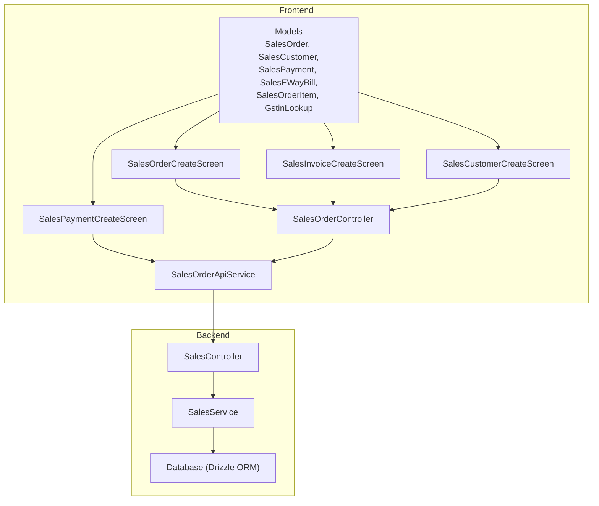

**Diagram sources**

- [sales_sales_order_create.dart](file://lib/modules/sales/presentation/sales_sales_order_create.dart#L1-L685)
- [sales_invoice_invoice_create.dart](file://lib/modules/sales/presentation/sales_invoice_invoice_create.dart#L1-L573)
- [sales_customer_customer_create.dart](file://lib/modules/sales/presentation/sales_customer_customer_create.dart#L1-L454)
- [sales_payment_create.dart](file://lib/modules/sales/presentation/sales_payment_create.dart#L1-L280)
- [sales_order_controller.dart](file://lib/modules/sales/controller/sales_order_controller.dart#L1-L119)
- [sales_order_api_service.dart](file://lib/modules/sales/services/sales_order_api_service.dart#L1-L192)
- [sales_order_model.dart](file://lib/modules/sales/models/sales_order_model.dart#L1-L118)
- [sales_order_item_model.dart](file://lib/modules/sales/models/sales_order_item_model.dart#L1-L62)
- [sales_customer_model.dart](file://lib/modules/sales/models/sales_customer_model.dart#L1-L93)
- [sales_payment_model.dart](file://lib/modules/sales/models/sales_payment_model.dart#L1-L61)
- [sales_eway_bill_model.dart](file://lib/modules/sales/models/sales_eway_bill_model.dart#L1-L52)
- [gstin_lookup_model.dart](file://lib/modules/sales/models/gstin_lookup_model.dart#L1-L173)
- [sales.controller.ts](file://backend/src/sales/sales.controller.ts#L1-L102)
- [sales.service.ts](file://backend/src/sales/sales.service.ts#L1-L162)

**Section sources**

- [sales_sales_order_create.dart](file://lib/modules/sales/presentation/sales_sales_order_create.dart#L1-L685)
- [sales_invoice_invoice_create.dart](file://lib/modules/sales/presentation/sales_invoice_invoice_create.dart#L1-L573)
- [sales_customer_customer_create.dart](file://lib/modules/sales/presentation/sales_customer_customer_create.dart#L1-L454)
- [sales_payment_create.dart](file://lib/modules/sales/presentation/sales_payment_create.dart#L1-L280)
- [sales_order_controller.dart](file://lib/modules/sales/controller/sales_order_controller.dart#L1-L119)
- [sales_order_api_service.dart](file://lib/modules/sales/services/sales_order_api_service.dart#L1-L192)
- [sales_order_model.dart](file://lib/modules/sales/models/sales_order_model.dart#L1-L118)
- [sales_order_item_model.dart](file://lib/modules/sales/models/sales_order_item_model.dart#L1-L62)
- [sales_customer_model.dart](file://lib/modules/sales/models/sales_customer_model.dart#L1-L93)
- [sales_payment_model.dart](file://lib/modules/sales/models/sales_payment_model.dart#L1-L61)
- [sales_eway_bill_model.dart](file://lib/modules/sales/models/sales_eway_bill_model.dart#L1-L52)
- [gstin_lookup_model.dart](file://lib/modules/sales/models/gstin_lookup_model.dart#L1-L173)
- [sales.controller.ts](file://backend/src/sales/sales.controller.ts#L1-L102)
- [sales.service.ts](file://backend/src/sales/sales.service.ts#L1-L162)

## Core Components

- SalesOrderController: Manages lists of sales orders, quotes, invoices, payments, credit notes, challans, retainer invoices, recurring invoices, e-way bills, and payment links. Provides create/delete operations and customer creation.
- SalesOrderApiService: Encapsulates HTTP calls to backend endpoints for customers, sales orders, payments, e-way bills, and payment links.
- Models:
  - SalesOrder, SalesOrderItem, SalesCustomer, SalesPayment, SalesEWayBill
  - GstinLookupResult and GstinAddress for GST compliance
- Presentation Screens:
  - SalesOrderCreateScreen, SalesInvoiceCreateScreen, SalesCustomerCreateScreen, SalesPaymentCreateScreen
- Backend SalesController and SalesService: Expose endpoints and implement CRUD operations for sales entities and mock GSTIN lookup.

**Section sources**

- [sales_order_controller.dart](file://lib/modules/sales/controller/sales_order_controller.dart#L1-L119)
- [sales_order_api_service.dart](file://lib/modules/sales/services/sales_order_api_service.dart#L1-L192)
- [sales_order_model.dart](file://lib/modules/sales/models/sales_order_model.dart#L1-L118)
- [sales_order_item_model.dart](file://lib/modules/sales/models/sales_order_item_model.dart#L1-L62)
- [sales_customer_model.dart](file://lib/modules/sales/models/sales_customer_model.dart#L1-L93)
- [sales_payment_model.dart](file://lib/modules/sales/models/sales_payment_model.dart#L1-L61)
- [sales_eway_bill_model.dart](file://lib/modules/sales/models/sales_eway_bill_model.dart#L1-L52)
- [gstin_lookup_model.dart](file://lib/modules/sales/models/gstin_lookup_model.dart#L1-L173)
- [sales.controller.ts](file://backend/src/sales/sales.controller.ts#L1-L102)
- [sales.service.ts](file://backend/src/sales/sales.service.ts#L1-L162)

## Architecture Overview

The frontend uses Riverpod for state management and API-driven data flow. The backend exposes REST endpoints mapped to domain-specific controllers and services.

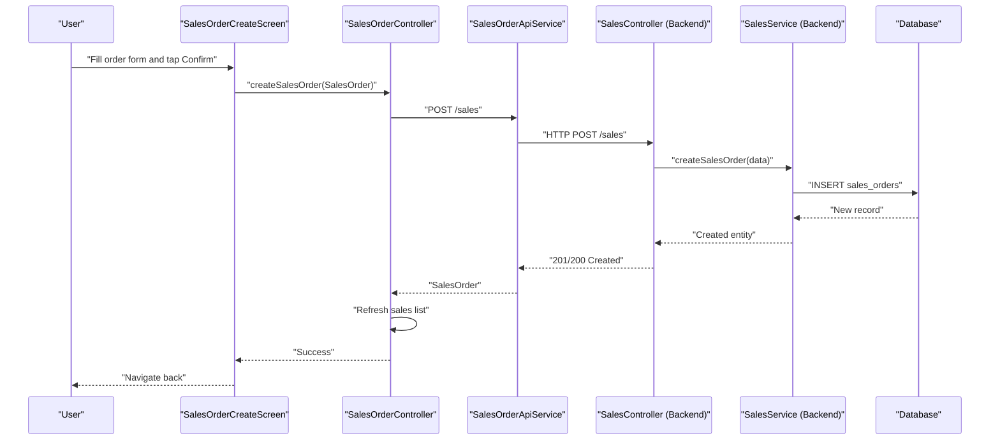

**Diagram sources**

- [sales_sales_order_create.dart](file://lib/modules/sales/presentation/sales_sales_order_create.dart#L635-L683)
- [sales_order_controller.dart](file://lib/modules/sales/controller/sales_order_controller.dart#L86-L95)
- [sales_order_api_service.dart](file://lib/modules/sales/services/sales_order_api_service.dart#L104-L121)
- [sales.controller.ts](file://backend/src/sales/sales.controller.ts#L91-L95)
- [sales.service.ts](file://backend/src/sales/sales.service.ts#L80-L97)

## Detailed Component Analysis

### Sales Lifecycle: Multi-Document Workflow

- Quotes → Sales Orders → Invoices → Payments → Credit Notes (Returns)
- Supporting documents: Challans, Retainer Invoices, Recurring Invoices, E-Way Bills
- Providers for lists:
  - Quotes, Invoices, Payments, Credit Notes, Challans, Retainer Invoices, Recurring Invoices, E-Way Bills, Payment Links
- Deletion supported for sales orders.

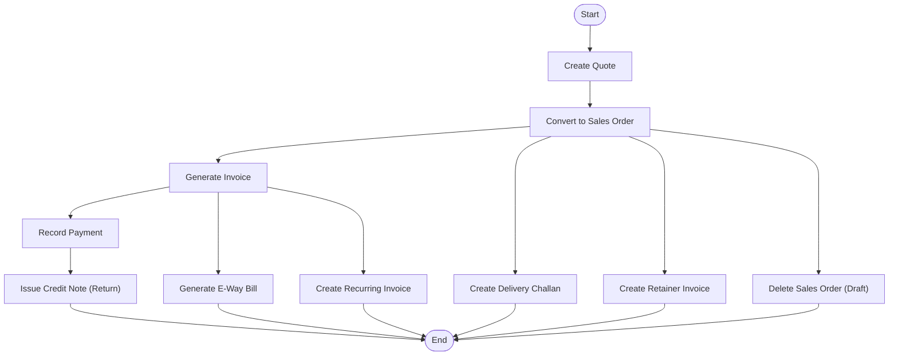

**Section sources**

- [sales_order_controller.dart](file://lib/modules/sales/controller/sales_order_controller.dart#L27-L61)
- [sales_order_api_service.dart](file://lib/modules/sales/services/sales_order_api_service.dart#L43-L132)

### Customer Onboarding and GST Compliance

- Customer creation supports:
  - Basic info (name, type, contact)
  - Billing/shipping addresses
  - PAN and GSTIN fields
  - Currency, payment terms, portal enablement
- GSTIN lookup service:
  - Calls backend endpoint to resolve GSTIN details
  - Parses flexible JSON shapes into GstinLookupResult and GstinAddress
- UI integrates GSTIN lookup to prefill legal/business names and addresses.

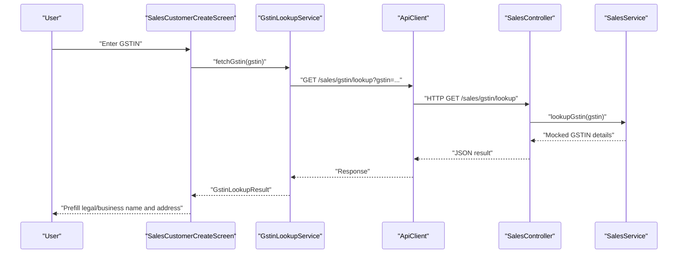

**Diagram sources**

- [sales_customer_customer_create.dart](file://lib/modules/sales/presentation/sales_customer_customer_create.dart#L233-L269)
- [gstin_lookup_service.dart](file://lib/modules/sales/services/gstin_lookup_service.dart#L7-L26)
- [gstin_lookup_model.dart](file://lib/modules/sales/models/gstin_lookup_model.dart#L18-L105)
- [sales.controller.ts](file://backend/src/sales/sales.controller.ts#L36-L39)
- [sales.service.ts](file://backend/src/sales/sales.service.ts#L9-L27)

**Section sources**

- [sales_customer_customer_create.dart](file://lib/modules/sales/presentation/sales_customer_customer_create.dart#L1-L454)
- [gstin_lookup_service.dart](file://lib/modules/sales/services/gstin_lookup_service.dart#L1-L28)
- [gstin_lookup_model.dart](file://lib/modules/sales/models/gstin_lookup_model.dart#L1-L173)
- [sales.controller.ts](file://backend/src/sales/sales.controller.ts#L36-L39)
- [sales.service.ts](file://backend/src/sales/sales.service.ts#L9-L27)

### Pricing Calculations and Discount Management

- Line items:
  - Quantity × Rate − Discount per line
  - Subtotal accumulates line totals
  - Shipping and Adjustment are separate line inputs
  - Tax total is computed in the UI; backend currently stores subtotal/total fields
- Example:
  - 2 units at rs100 with rs10 discount → Line amount = rs190
  - Add shipping rs20 and adjustment rs0 → Total = rs210

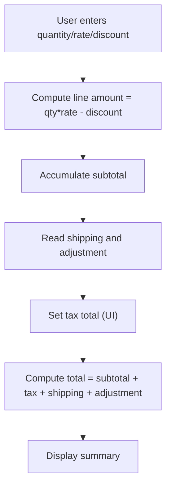

**Section sources**

- [sales_sales_order_create.dart](file://lib/modules/sales/presentation/sales_sales_order_create.dart#L96-L114)
- [sales_invoice_invoice_create.dart](file://lib/modules/sales/presentation/sales_invoice_invoice_create.dart#L91-L108)
- [sales_order_model.dart](file://lib/modules/sales/models/sales_order_model.dart#L16-L21)

### Sales Order Creation (POS-like Capabilities)

- Header fields: customer, order number, dates, payment terms, delivery method, salesperson
- Items grid: product selection, quantity, rate, discount, amount
- Summary panel: subtotal, shipping, adjustment, total
- Actions: Save as Draft, Confirm Sale
- Offline readiness: No explicit offline persistence logic observed in the referenced files; network calls are synchronous UI actions.

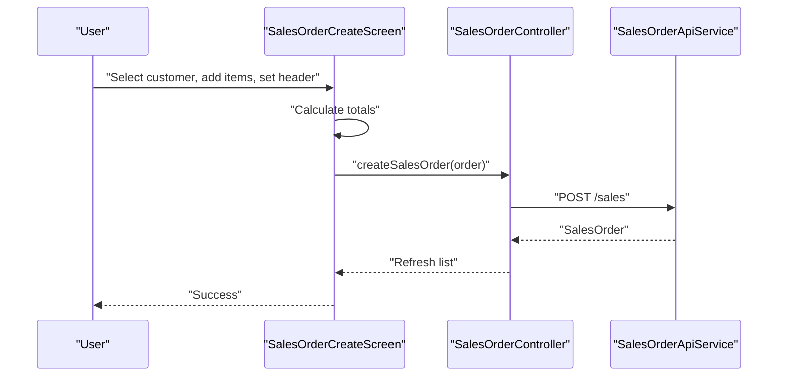

**Diagram sources**

- [sales_sales_order_create.dart](file://lib/modules/sales/presentation/sales_sales_order_create.dart#L635-L683)
- [sales_order_controller.dart](file://lib/modules/sales/controller/sales_order_controller.dart#L86-L95)
- [sales_order_api_service.dart](file://lib/modules/sales/services/sales_order_api_service.dart#L104-L121)

**Section sources**

- [sales_sales_order_create.dart](file://lib/modules/sales/presentation/sales_sales_order_create.dart#L1-L685)
- [sales_order_controller.dart](file://lib/modules/sales/controller/sales_order_controller.dart#L67-L119)
- [sales_order_api_service.dart](file://lib/modules/sales/services/sales_order_api_service.dart#L104-L121)

### Invoice Generation

- Similar to sales order but with invoice number, order reference, invoice date, due date, and terms
- Status defaults to confirmed upon save
- Uses the same controller/service pipeline for persistence

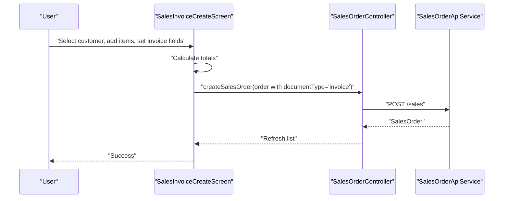

**Diagram sources**

- [sales_invoice_invoice_create.dart](file://lib/modules/sales/presentation/sales_invoice_invoice_create.dart#L525-L565)
- [sales_order_controller.dart](file://lib/modules/sales/controller/sales_order_controller.dart#L86-L95)
- [sales_order_api_service.dart](file://lib/modules/sales/services/sales_order_api_service.dart#L104-L121)

**Section sources**

- [sales_invoice_invoice_create.dart](file://lib/modules/sales/presentation/sales_invoice_invoice_create.dart#L1-L573)
- [sales_order_controller.dart](file://lib/modules/sales/controller/sales_order_controller.dart#L86-L95)
- [sales_order_api_service.dart](file://lib/modules/sales/services/sales_order_api_service.dart#L104-L121)

### Payment Handling

- Record Payment screen captures:
  - Customer, amount, payment date, mode, deposit to, reference, notes
- Persists via POST /sales/payments
- Integrates with accounting accounts via depositTo and bankCharges fields

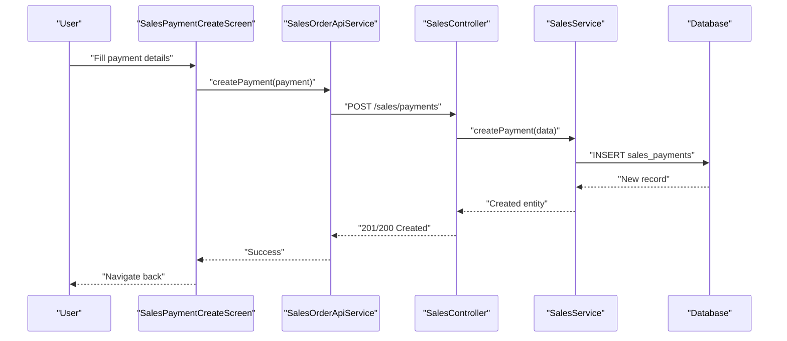

**Diagram sources**

- [sales_payment_create.dart](file://lib/modules/sales/presentation/sales_payment_create.dart#L254-L278)
- [sales_order_api_service.dart](file://lib/modules/sales/services/sales_order_api_service.dart#L77-L90)
- [sales.controller.ts](file://backend/src/sales/sales.controller.ts#L47-L51)
- [sales.service.ts](file://backend/src/sales/sales.service.ts#L113-L126)

**Section sources**

- [sales_payment_create.dart](file://lib/modules/sales/presentation/sales_payment_create.dart#L1-L280)
- [sales_order_api_service.dart](file://lib/modules/sales/services/sales_order_api_service.dart#L63-L90)
- [sales.service.ts](file://backend/src/sales/sales.service.ts#L109-L126)

### Returns Management (Credit Notes)

- Credit Notes are represented as a sales document type and are fetched via a dedicated provider
- UI pattern mirrors invoices/orders; create via the same controller/service pipeline with documentType set accordingly

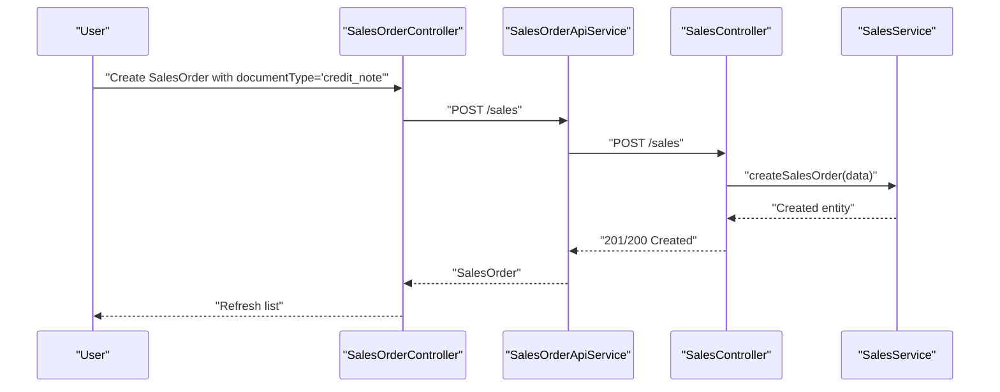

**Diagram sources**

- [sales_order_controller.dart](file://lib/modules/sales/controller/sales_order_controller.dart#L39-L41)
- [sales_order_api_service.dart](file://lib/modules/sales/services/sales_order_api_service.dart#L104-L121)
- [sales.controller.ts](file://backend/src/sales/sales.controller.ts#L91-L95)
- [sales.service.ts](file://backend/src/sales/sales.service.ts#L80-L97)

**Section sources**

- [sales_order_controller.dart](file://lib/modules/sales/controller/sales_order_controller.dart#L39-L41)
- [sales_order_model.dart](file://lib/modules/sales/models/sales_order_model.dart#L14-L15)

### E-Way Bill Generation

- E-Way Bill model includes sale association, bill number/date, supply/sub-type, transporter, vehicle, and status
- UI triggers POST /sales/eway-bills
- Backend persists and returns the created record

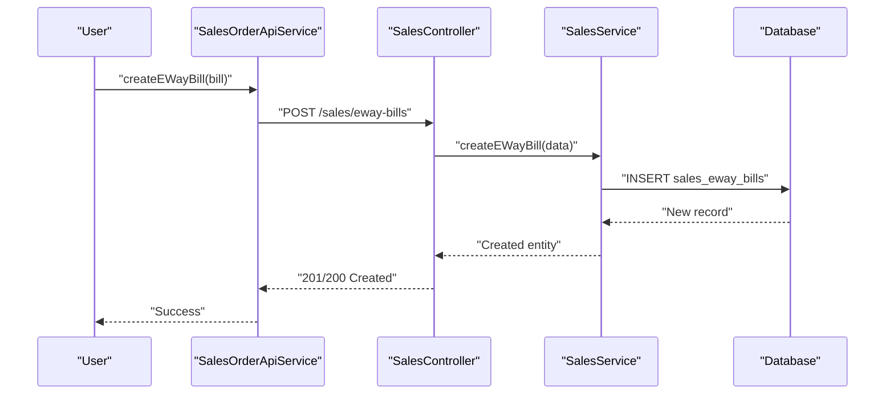

**Diagram sources**

- [sales_order_api_service.dart](file://lib/modules/sales/services/sales_order_api_service.dart#L148-L161)
- [sales_eway_bill_model.dart](file://lib/modules/sales/models/sales_eway_bill_model.dart#L1-L52)
- [sales.controller.ts](file://backend/src/sales/sales.controller.ts#L59-L63)
- [sales.service.ts](file://backend/src/sales/sales.service.ts#L133-L145)

**Section sources**

- [sales_order_api_service.dart](file://lib/modules/sales/services/sales_order_api_service.dart#L134-L161)
- [sales_eway_bill_model.dart](file://lib/modules/sales/models/sales_eway_bill_model.dart#L1-L52)
- [sales.service.ts](file://backend/src/sales/sales.service.ts#L128-L145)

### POS Interface Capabilities and Offline Sales

- POS-like capabilities:
  - Quick item selection, quantity/rate/discount editing, instant totals
  - Multiple payment modes recorded against a customer
- Offline processing:
  - No client-side persistence or sync logic detected in the referenced frontend files
  - Network calls are synchronous UI actions; offline support would require additional storage and sync layers

**Section sources**

- [sales_sales_order_create.dart](file://lib/modules/sales/presentation/sales_sales_order_create.dart#L311-L462)
- [sales_payment_create.dart](file://lib/modules/sales/presentation/sales_payment_create.dart#L13-L280)

### Integration Between Sales and Inventory

- SalesOrderItem references Item and includes quantity, rate, discount, tax fields
- Item selection in sales forms drives rate population and line computations
- Inventory assemblies and batch management are present in inventory modules; integration with sales would typically occur at the item level and stock reservation/commitment points

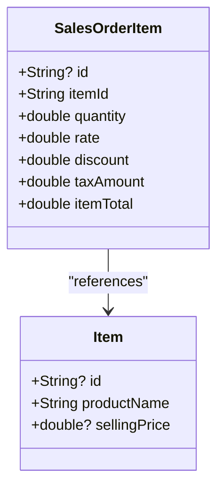

**Diagram sources**

- [sales_order_item_model.dart](file://lib/modules/sales/models/sales_order_item_model.dart#L3-L26)
- [sales_sales_order_create.dart](file://lib/modules/sales/presentation/sales_sales_order_create.dart#L374-L395)

**Section sources**

- [sales_order_item_model.dart](file://lib/modules/sales/models/sales_order_item_model.dart#L1-L62)
- [sales_sales_order_create.dart](file://lib/modules/sales/presentation/sales_sales_order_create.dart#L374-L395)

## Dependency Analysis

- Frontend dependencies:
  - Controllers depend on API services for remote operations
  - API services depend on shared ApiClient
  - Models are used across screens and services
- Backend dependencies:
  - Controllers depend on SalesService
  - SalesService depends on database schema and Drizzle ORM
- No circular dependencies observed among the referenced components.

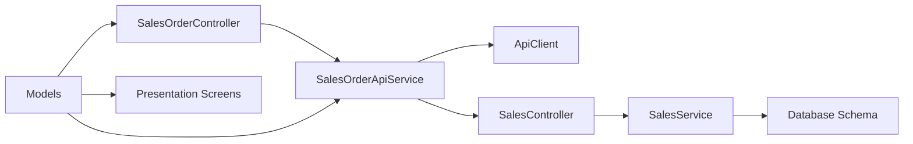

**Diagram sources**

- [sales_order_controller.dart](file://lib/modules/sales/controller/sales_order_controller.dart#L1-L119)
- [sales_order_api_service.dart](file://lib/modules/sales/services/sales_order_api_service.dart#L1-L192)
- [sales.controller.ts](file://backend/src/sales/sales.controller.ts#L1-L102)
- [sales.service.ts](file://backend/src/sales/sales.service.ts#L1-L162)

**Section sources**

- [sales_order_controller.dart](file://lib/modules/sales/controller/sales_order_controller.dart#L1-L119)
- [sales_order_api_service.dart](file://lib/modules/sales/services/sales_order_api_service.dart#L1-L192)
- [sales.controller.ts](file://backend/src/sales/sales.controller.ts#L1-L102)
- [sales.service.ts](file://backend/src/sales/sales.service.ts#L1-L162)

## Performance Considerations

- UI calculations are client-side and lightweight; keep line counts reasonable to avoid excessive rebuilds.
- Debounce or batch API calls when adding/removing many items.
- Use FutureProvider/StreamProvider appropriately to avoid redundant network requests.
- Backend inserts are single-row operations; ensure database indexing on frequently queried fields (customer, documentType, status).

## Troubleshooting Guide

- Error handling patterns:
  - API service catches exceptions and surfaces descriptive messages
  - Controller logs errors and rethrows for UI handling
- Common issues:
  - Missing customer selection prevents order creation
  - Invalid numeric inputs cause parsing failures
  - Network errors surface as exceptions in API service
- Recommendations:
  - Validate required fields before submission
  - Show user-friendly snackbars for errors
  - Implement retry logic for transient network failures

**Section sources**

- [sales_order_api_service.dart](file://lib/modules/sales/services/sales_order_api_service.dart#L114-L120)
- [sales_sales_order_create.dart](file://lib/modules/sales/presentation/sales_sales_order_create.dart#L676-L682)
- [sales_payment_create.dart](file://lib/modules/sales/presentation/sales_payment_create.dart#L271-L277)

## Conclusion

The Sales Operations feature provides a robust, API-backed workflow spanning customer onboarding with GST compliance, quoting, sales orders, invoicing, payments, returns (credit notes), and e-way bills. The frontend leverages Riverpod for state and a clean separation of concerns, while the backend offers REST endpoints backed by a database. While POS-like capabilities are present, offline processing is not implemented in the referenced files. Extending inventory integration and offline support would be natural next steps.

## Appendices

- Practical Examples
  - Creating a Sales Order:
    - Select customer, add items, confirm totals, save as draft or confirm
  - Generating an Invoice:
    - Choose order number, set invoice/due dates, terms, confirm
  - Recording a Payment:
    - Select customer, enter amount/date/mode/reference, save
  - Issuing a Credit Note:
    - Use the same order pipeline with documentType set to credit note
  - E-Way Bill:
    - Create bill with sale association, transport details, and status

[No sources needed since this section aggregates previously analyzed content]
