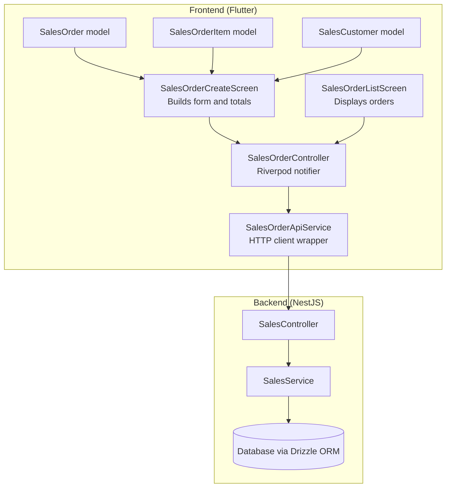
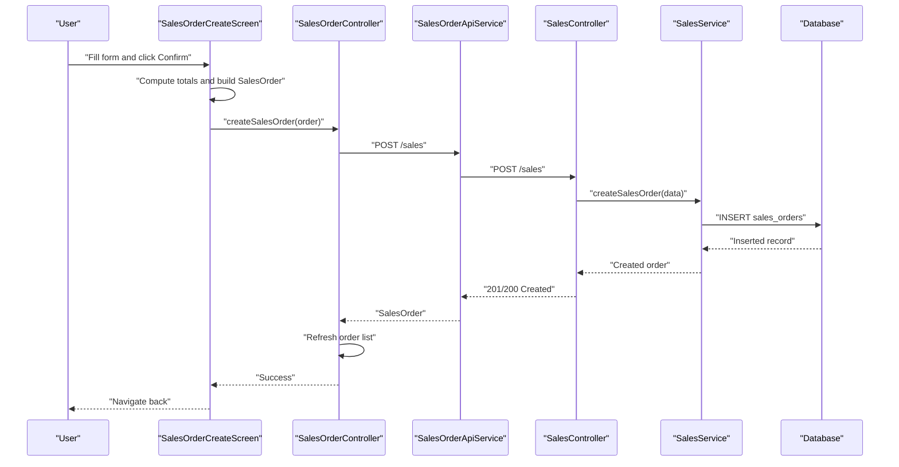
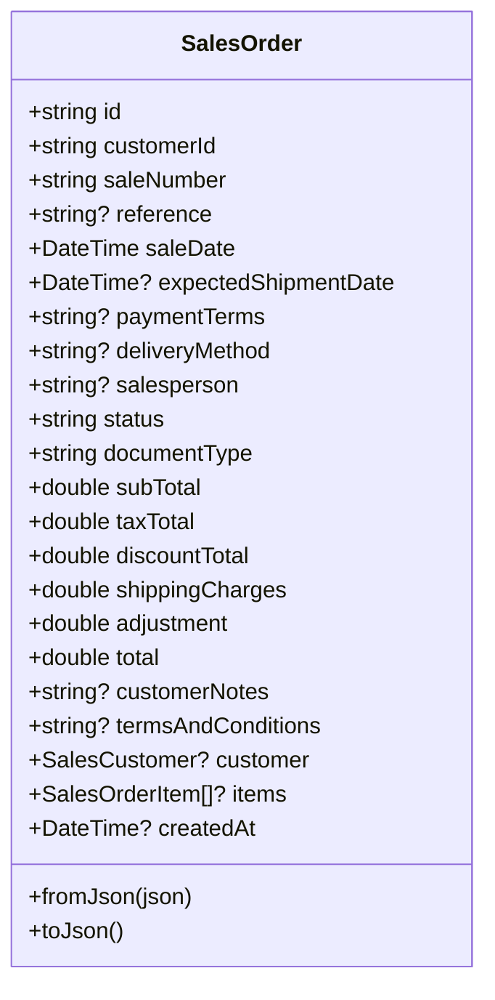
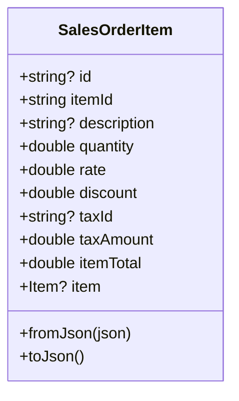
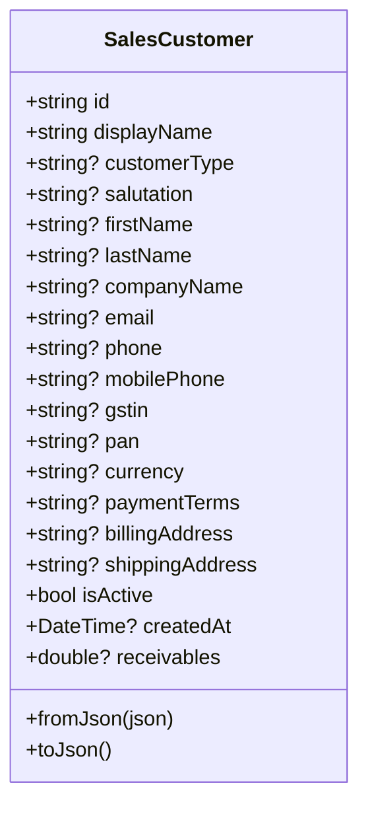
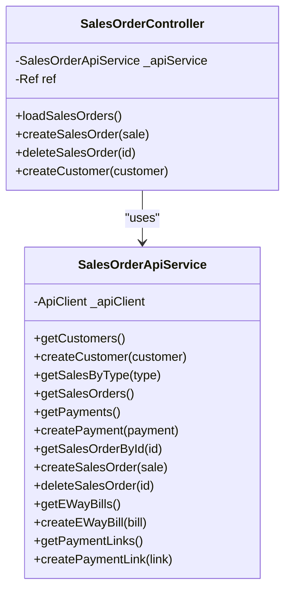
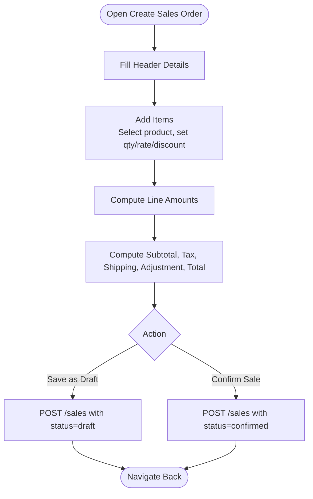
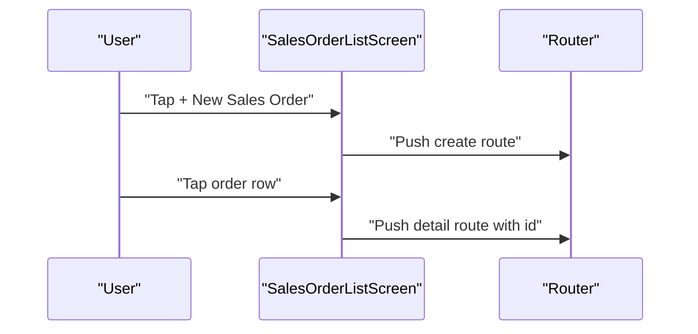
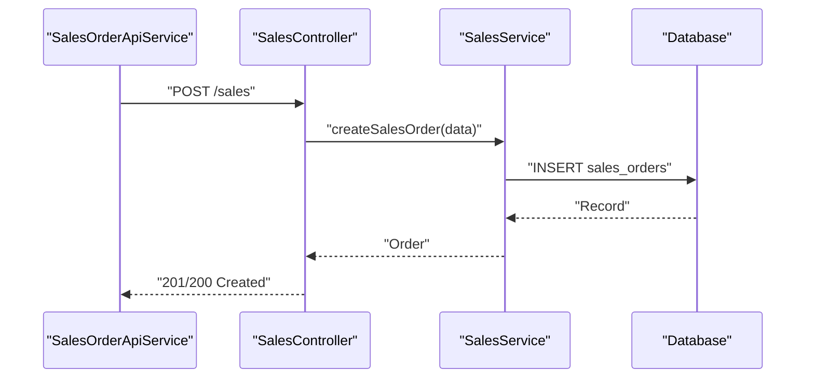
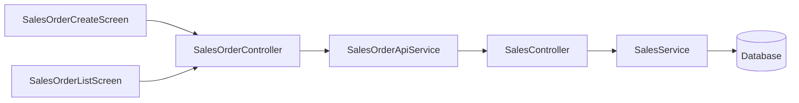

# Sales Orders

<cite>
**Referenced Files in This Document**
- [sales_order_model.dart](file://lib/modules/sales/models/sales_order_model.dart)
- [sales_order_item_model.dart](file://lib/modules/sales/models/sales_order_item_model.dart)
- [sales_customer_model.dart](file://lib/modules/sales/models/sales_customer_model.dart)
- [sales_order_controller.dart](file://lib/modules/sales/controller/sales_order_controller.dart)
- [sales_order_api_service.dart](file://lib/modules/sales/services/sales_order_api_service.dart)
- [sales_sales_order_create.dart](file://lib/modules/sales/presentation/sales_sales_order_create.dart)
- [sales_order_item_row.dart](file://lib/modules/sales/presentation/widgets/sales_order_item_row.dart)
- [sales_sales_order_list.dart](file://lib/modules/sales/presentation/sales_sales_order_list.dart)
- [sales.controller.ts](file://backend/src/sales/sales.controller.ts)
- [sales.service.ts](file://backend/src/sales/sales.service.ts)
</cite>

## Table of Contents
1. [Introduction](#introduction)
2. [Project Structure](#project-structure)
3. [Core Components](#core-components)
4. [Architecture Overview](#architecture-overview)
5. [Detailed Component Analysis](#detailed-component-analysis)
6. [Dependency Analysis](#dependency-analysis)
7. [Performance Considerations](#performance-considerations)
8. [Troubleshooting Guide](#troubleshooting-guide)
9. [Conclusion](#conclusion)
10. [Appendices](#appendices)

## Introduction
This document describes the Sales Orders system in ZerpAI ERP. It covers the complete lifecycle from creation and modification to confirmation and fulfillment tracking, including order item management, quantity and pricing handling, discount application, totals computation, and order status updates. It also documents order validation rules, inventory reservation considerations, and integration points with warehouse management systems.

## Project Structure
The Sales Orders feature spans the frontend (Flutter) and backend (NestJS) layers:
- Frontend models define typed order and item structures.
- A Riverpod controller orchestrates state and API interactions.
- A dedicated screen composes the order creation form and computes totals.
- Backend exposes REST endpoints for sales orders and related entities.

**Diagram sources**
- [sales_sales_order_create.dart](file://lib/modules/sales/presentation/sales_sales_order_create.dart#L1-L685)
- [sales_sales_order_list.dart](file://lib/modules/sales/presentation/sales_sales_order_list.dart#L1-L154)
- [sales_order_model.dart](file://lib/modules/sales/models/sales_order_model.dart#L1-L118)
- [sales_order_item_model.dart](file://lib/modules/sales/models/sales_order_item_model.dart#L1-L62)
- [sales_customer_model.dart](file://lib/modules/sales/models/sales_customer_model.dart#L1-L93)
- [sales_order_controller.dart](file://lib/modules/sales/controller/sales_order_controller.dart#L1-L119)
- [sales_order_api_service.dart](file://lib/modules/sales/services/sales_order_api_service.dart#L1-L192)
- [sales.controller.ts](file://backend/src/sales/sales.controller.ts#L1-L102)
- [sales.service.ts](file://backend/src/sales/sales.service.ts#L1-L162)

**Section sources**
- [sales_sales_order_create.dart](file://lib/modules/sales/presentation/sales_sales_order_create.dart#L1-L685)
- [sales_sales_order_list.dart](file://lib/modules/sales/presentation/sales_sales_order_list.dart#L1-L154)
- [sales_order_model.dart](file://lib/modules/sales/models/sales_order_model.dart#L1-L118)
- [sales_order_item_model.dart](file://lib/modules/sales/models/sales_order_item_model.dart#L1-L62)
- [sales_customer_model.dart](file://lib/modules/sales/models/sales_customer_model.dart#L1-L93)
- [sales_order_controller.dart](file://lib/modules/sales/controller/sales_order_controller.dart#L1-L119)
- [sales_order_api_service.dart](file://lib/modules/sales/services/sales_order_api_service.dart#L1-L192)
- [sales.controller.ts](file://backend/src/sales/sales.controller.ts#L1-L102)
- [sales.service.ts](file://backend/src/sales/sales.service.ts#L1-L162)

## Core Components
- SalesOrder: Encapsulates order header fields, totals, and associated items and customer.
- SalesOrderItem: Encapsulates per-line item details including quantity, rate, discount, tax, and computed item total.
- SalesCustomer: Customer metadata used to associate orders with a customer profile.
- SalesOrderController: Riverpod state notifier that loads orders, creates orders, and manages customer lists.
- SalesOrderApiService: HTTP client wrapper around the backend sales endpoints.
- SalesOrderCreateScreen: UI form for creating orders, selecting items, computing totals, and saving.
- SalesOrderListScreen: Lists existing orders with status badges and navigation.
- Backend SalesController/SalesService: Expose endpoints and implement persistence for sales orders and related entities.

**Section sources**
- [sales_order_model.dart](file://lib/modules/sales/models/sales_order_model.dart#L4-L118)
- [sales_order_item_model.dart](file://lib/modules/sales/models/sales_order_item_model.dart#L3-L62)
- [sales_customer_model.dart](file://lib/modules/sales/models/sales_customer_model.dart#L1-L93)
- [sales_order_controller.dart](file://lib/modules/sales/controller/sales_order_controller.dart#L67-L119)
- [sales_order_api_service.dart](file://lib/modules/sales/services/sales_order_api_service.dart#L10-L192)
- [sales_sales_order_create.dart](file://lib/modules/sales/presentation/sales_sales_order_create.dart#L17-L685)
- [sales_sales_order_list.dart](file://lib/modules/sales/presentation/sales_sales_order_list.dart#L8-L154)
- [sales.controller.ts](file://backend/src/sales/sales.controller.ts#L14-L102)
- [sales.service.ts](file://backend/src/sales/sales.service.ts#L63-L106)

## Architecture Overview
The Sales Orders feature follows a layered architecture:
- Presentation layer (Flutter): UI screens and state management.
- Domain layer (Riverpod): Controllers orchestrate data fetching and mutations.
- API layer (Flutter): HTTP service wraps backend endpoints.
- Application layer (NestJS): Controllers expose endpoints; Services implement business logic and database operations.

**Diagram sources**
- [sales_sales_order_create.dart](file://lib/modules/sales/presentation/sales_sales_order_create.dart#L635-L683)
- [sales_order_controller.dart](file://lib/modules/sales/controller/sales_order_controller.dart#L86-L95)
- [sales_order_api_service.dart](file://lib/modules/sales/services/sales_order_api_service.dart#L104-L121)
- [sales.controller.ts](file://backend/src/sales/sales.controller.ts#L91-L95)
- [sales.service.ts](file://backend/src/sales/sales.service.ts#L80-L97)

## Detailed Component Analysis

### SalesOrder Model
- Purpose: Represents a sales order with header fields, totals, and nested items and customer.
- Key fields: identifiers, dates, customer association, totals (subtotal, tax, discount, shipping, adjustment, total), status, document type, notes, and timestamps.
- JSON mapping: Robust parsing and serialization support for frontend/backend interchange.

**Diagram sources**
- [sales_order_model.dart](file://lib/modules/sales/models/sales_order_model.dart#L4-L118)

**Section sources**
- [sales_order_model.dart](file://lib/modules/sales/models/sales_order_model.dart#L4-L118)

### SalesOrderItem Model
- Purpose: Represents a single line item in an order.
- Key fields: item identifier, description, quantity, rate, discount, tax linkage, tax amount, item total, and optional item reference.
- JSON mapping: Handles multiple backend field variants for item/product identifiers.

**Diagram sources**
- [sales_order_item_model.dart](file://lib/modules/sales/models/sales_order_item_model.dart#L3-L62)

**Section sources**
- [sales_order_item_model.dart](file://lib/modules/sales/models/sales_order_item_model.dart#L3-L62)

### SalesCustomer Model
- Purpose: Represents customer metadata used to associate orders with a customer.
- Fields include personal/business info, contact details, tax identifiers, payment terms, addresses, and activity flag.

**Diagram sources**
- [sales_customer_model.dart](file://lib/modules/sales/models/sales_customer_model.dart#L1-L93)

**Section sources**
- [sales_customer_model.dart](file://lib/modules/sales/models/sales_customer_model.dart#L1-L93)

### SalesOrderController and SalesOrderApiService
- Controller responsibilities:
  - Load sales orders and refresh lists after mutations.
  - Create customers and invalidate providers to update UI.
- API service responsibilities:
  - Encapsulate HTTP calls to backend endpoints for orders, customers, payments, e-way bills, and payment links.
  - Provide strongly-typed models for deserialization.

**Diagram sources**
- [sales_order_controller.dart](file://lib/modules/sales/controller/sales_order_controller.dart#L67-L119)
- [sales_order_api_service.dart](file://lib/modules/sales/services/sales_order_api_service.dart#L10-L192)

**Section sources**
- [sales_order_controller.dart](file://lib/modules/sales/controller/sales_order_controller.dart#L67-L119)
- [sales_order_api_service.dart](file://lib/modules/sales/services/sales_order_api_service.dart#L10-L192)

### SalesOrderCreateScreen: Order Creation Workflow
- Header section: customer selection, order number, reference, dates, payment terms, delivery method, salesperson.
- Items table: dynamic rows for item selection, quantity, rate, discount, and computed amount per line.
- Totals summary: sub-total, shipping charges, adjustment, and total computation.
- Footer actions: save as draft or confirm sale, triggering backend creation.

**Diagram sources**
- [sales_sales_order_create.dart](file://lib/modules/sales/presentation/sales_sales_order_create.dart#L96-L114)
- [sales_sales_order_create.dart](file://lib/modules/sales/presentation/sales_sales_order_create.dart#L635-L683)

**Section sources**
- [sales_sales_order_create.dart](file://lib/modules/sales/presentation/sales_sales_order_create.dart#L27-L685)

### SalesOrderListScreen: Order Listing and Navigation
- Displays a scrollable list of orders with sale number, customer, date, total, and status badge.
- Provides a floating action button to create a new order.
- Navigates to order detail by tapping a list item.

**Diagram sources**
- [sales_sales_order_list.dart](file://lib/modules/sales/presentation/sales_sales_order_list.dart#L19-L125)

**Section sources**
- [sales_sales_order_list.dart](file://lib/modules/sales/presentation/sales_sales_order_list.dart#L8-L154)

### Backend SalesController and SalesService
- SalesController:
  - GET /sales/customers, POST /sales/customers
  - GET /sales, GET /sales/:id, POST /sales, DELETE /sales/:id
  - Payment/e-way/payment-link endpoints for related entities.
- SalesService:
  - Implements CRUD for sales orders, customers, payments, e-way bills, and payment links.
  - Uses Drizzle ORM for database operations.

**Diagram sources**
- [sales.controller.ts](file://backend/src/sales/sales.controller.ts#L77-L100)
- [sales.service.ts](file://backend/src/sales/sales.service.ts#L80-L97)

**Section sources**
- [sales.controller.ts](file://backend/src/sales/sales.controller.ts#L14-L102)
- [sales.service.ts](file://backend/src/sales/sales.service.ts#L63-L106)

## Dependency Analysis
- Frontend:
  - UI screens depend on models and Riverpod providers.
  - Controller depends on API service for network operations.
  - API service depends on a generic HTTP client abstraction.
- Backend:
  - Controller depends on SalesService.
  - SalesService depends on database schema and Drizzle ORM.

**Diagram sources**
- [sales_sales_order_create.dart](file://lib/modules/sales/presentation/sales_sales_order_create.dart#L1-L685)
- [sales_sales_order_list.dart](file://lib/modules/sales/presentation/sales_sales_order_list.dart#L1-L154)
- [sales_order_controller.dart](file://lib/modules/sales/controller/sales_order_controller.dart#L1-L119)
- [sales_order_api_service.dart](file://lib/modules/sales/services/sales_order_api_service.dart#L1-L192)
- [sales.controller.ts](file://backend/src/sales/sales.controller.ts#L1-L102)
- [sales.service.ts](file://backend/src/sales/sales.service.ts#L1-L162)

**Section sources**
- [sales_sales_order_create.dart](file://lib/modules/sales/presentation/sales_sales_order_create.dart#L1-L685)
- [sales_sales_order_list.dart](file://lib/modules/sales/presentation/sales_sales_order_list.dart#L1-L154)
- [sales_order_controller.dart](file://lib/modules/sales/controller/sales_order_controller.dart#L1-L119)
- [sales_order_api_service.dart](file://lib/modules/sales/services/sales_order_api_service.dart#L1-L192)
- [sales.controller.ts](file://backend/src/sales/sales.controller.ts#L1-L102)
- [sales.service.ts](file://backend/src/sales/sales.service.ts#L1-L162)

## Performance Considerations
- UI rendering:
  - Use minimal rebuilds by updating only necessary state during totals calculation.
  - Debounce or batch listeners for numeric inputs to avoid frequent recomputation.
- Network requests:
  - Cache customer lists and product catalogs to reduce repeated fetches.
  - Use pagination for large order lists.
- Backend:
  - Index frequently queried fields (e.g., customer_id, sale_date, status).
  - Batch inserts for bulk order operations when supported.

## Troubleshooting Guide
- Order creation fails:
  - Verify customer selection and required fields.
  - Inspect API error logs and response codes from the HTTP client wrapper.
- Totals mismatch:
  - Ensure quantity, rate, and discount inputs parse correctly.
  - Confirm tax computation is applied consistently (current UI simplifies tax).
- Status transitions:
  - Confirm the backend accepts the desired status values and enforces state transitions.
- Inventory reservation and warehouse integration:
  - Current frontend and backend do not implement inventory reservation or warehouse integration.
  - Extend the order model and backend service to integrate with inventory APIs and warehouse systems.

**Section sources**
- [sales_sales_order_create.dart](file://lib/modules/sales/presentation/sales_sales_order_create.dart#L96-L114)
- [sales_order_api_service.dart](file://lib/modules/sales/services/sales_order_api_service.dart#L114-L121)
- [sales.service.ts](file://backend/src/sales/sales.service.ts#L80-L97)

## Conclusion
The Sales Orders system provides a clear, layered implementation for managing sales order lifecycles on the frontend and backend. The current design supports order creation, listing, and basic totals computation. To meet enterprise needs, future enhancements should include robust order validation, inventory reservation, and integration with warehouse management systems.

## Appendices

### Practical Examples

- Order creation workflow
  - Select customer, fill header details, add items with quantity and rate, apply discounts, compute totals, and save as draft or confirm.
  - Reference: [sales_sales_order_create.dart](file://lib/modules/sales/presentation/sales_sales_order_create.dart#L635-L683)

- Item selection process
  - Choose product from a dropdown populated by the items controller; pre-fill rate from product selling price.
  - Reference: [sales_sales_order_create.dart](file://lib/modules/sales/presentation/sales_sales_order_create.dart#L374-L395)

- Bulk order operations
  - Add multiple item rows dynamically and compute totals across all lines.
  - Reference: [sales_sales_order_create.dart](file://lib/modules/sales/presentation/sales_sales_order_create.dart#L80-L94), [sales_order_item_row.dart](file://lib/modules/sales/presentation/widgets/sales_order_item_row.dart#L4-L25)

- Order modification scenarios
  - Modify quantities, rates, or discounts; totals update automatically.
  - Reference: [sales_sales_order_create.dart](file://lib/modules/sales/presentation/sales_sales_order_create.dart#L96-L114)

### Order Validation Rules
- Required fields:
  - Customer selection, sale number, sale date, items present.
- Numeric inputs:
  - Quantity, rate, discount, shipping, adjustment must parse to numbers.
- Totals:
  - Subtotal derived from line amounts; total equals subtotal plus tax plus shipping plus adjustment.
- Status:
  - Supported values include draft, confirmed, shipped, delivered, paid, cancelled.

**Section sources**
- [sales_sales_order_create.dart](file://lib/modules/sales/presentation/sales_sales_order_create.dart#L96-L114)
- [sales_sales_order_create.dart](file://lib/modules/sales/presentation/sales_sales_order_create.dart#L635-L683)

### Inventory Reservation and Warehouse Integration
- Current state:
  - No inventory reservation or warehouse integration is implemented in the frontend or backend.
- Recommended extensions:
  - Add inventory availability checks before confirming orders.
  - Integrate with warehouse APIs to reserve stock and update fulfillment status.
  - Extend order model with reserved quantities and warehouse location fields.

[No sources needed since this section provides general guidance]