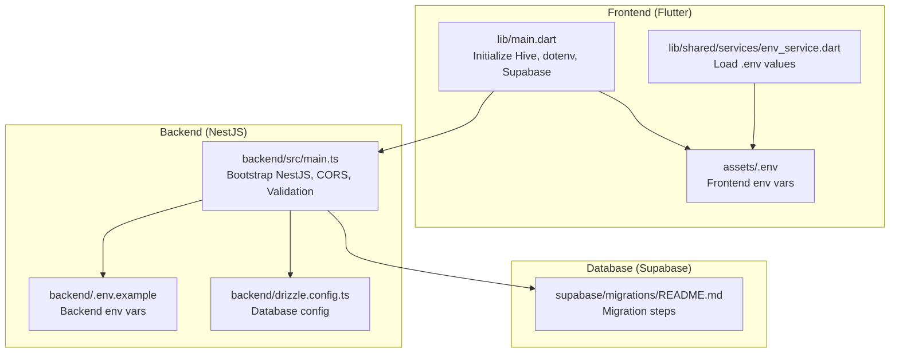
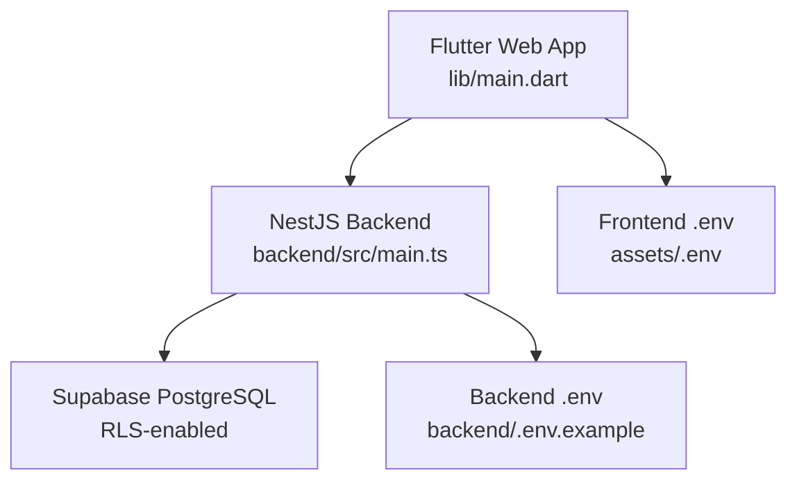
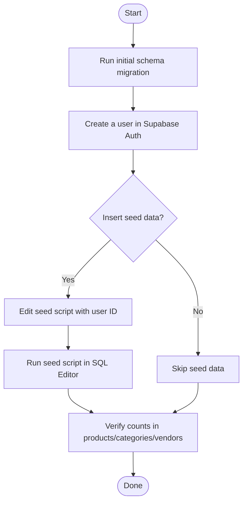
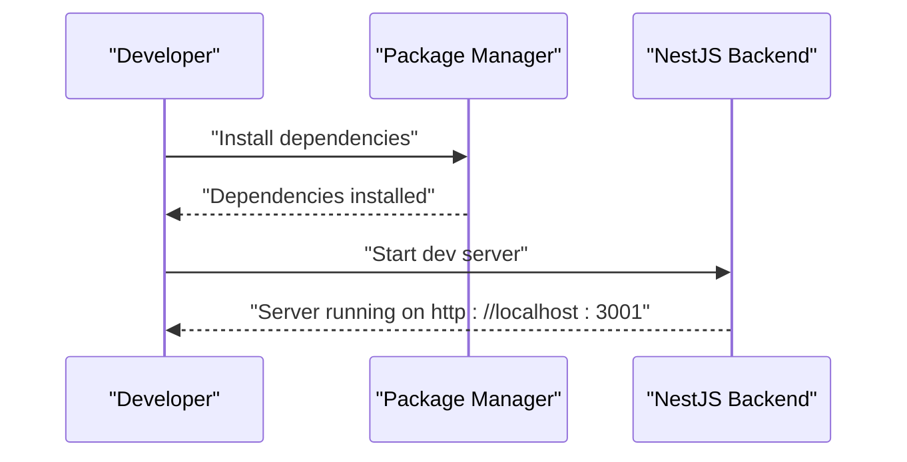
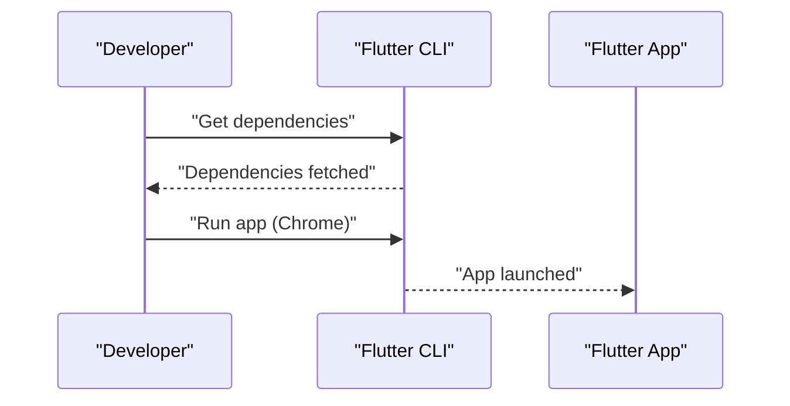
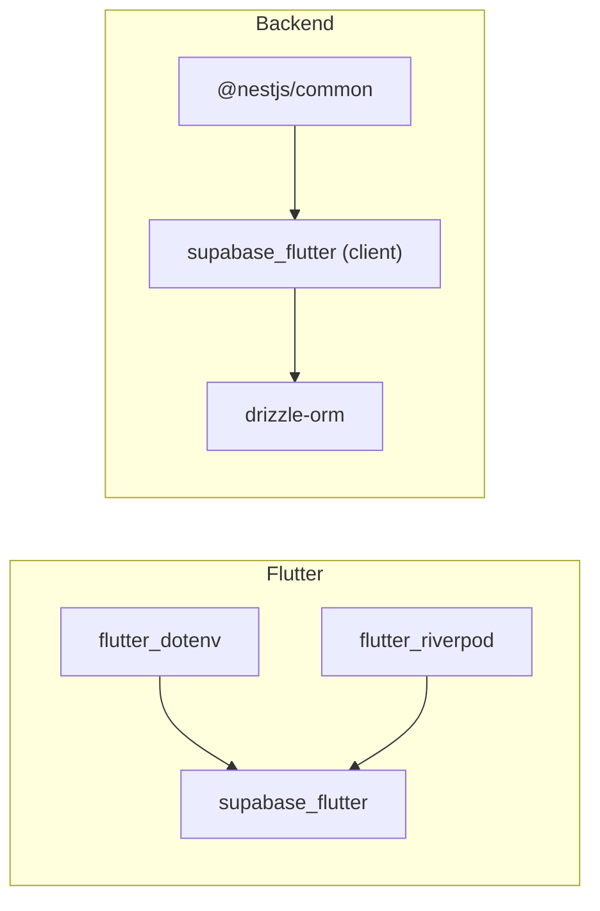

# Getting Started

<cite>
**Referenced Files in This Document**
- [README.md](file://README.md)
- [backend/SETUP.md](file://backend/SETUP.md)
- [backend/QUICKSTART.md](file://backend/QUICKSTART.md)
- [backend/.env.example](file://backend/.env.example)
- [backend/drizzle.config.ts](file://backend/drizzle.config.ts)
- [backend/src/main.ts](file://backend/src/main.ts)
- [pubspec.yaml](file://pubspec.yaml)
- [lib/main.dart](file://lib/main.dart)
- [lib/shared/services/env_service.dart](file://lib/shared/services/env_service.dart)
- [assets/.env](file://assets/.env)
- [supabase/migrations/README.md](file://supabase/migrations/README.md)
- [RUN_MIGRATION_INSTRUCTIONS.md](file://RUN_MIGRATION_INSTRUCTIONS.md)
</cite>

## Table of Contents
1. [Introduction](#introduction)
2. [Project Structure](#project-structure)
3. [Core Components](#core-components)
4. [Architecture Overview](#architecture-overview)
5. [Detailed Component Analysis](#detailed-component-analysis)
6. [Dependency Analysis](#dependency-analysis)
7. [Performance Considerations](#performance-considerations)
8. [Troubleshooting Guide](#troubleshooting-guide)
9. [Conclusion](#conclusion)
10. [Appendices](#appendices)

## Introduction
This guide helps you install and run ZerpAI ERP locally with Flutter (web) and NestJS backend, connect to Supabase, run database migrations, configure environment variables, and verify the setup. It also includes quick start steps to create your first product and process a simple sale.

## Project Structure
ZerpAI ERP is a monorepo with:
- Flutter frontend under lib/ (web and Android)
- NestJS backend under backend/
- Supabase database migrations under supabase/migrations/

**Diagram sources**
- [lib/main.dart](file://lib/main.dart#L1-L29)
- [lib/shared/services/env_service.dart](file://lib/shared/services/env_service.dart#L1-L72)
- [assets/.env](file://assets/.env#L1-L18)
- [backend/src/main.ts](file://backend/src/main.ts#L1-L56)
- [backend/.env.example](file://backend/.env.example#L1-L40)
- [backend/drizzle.config.ts](file://backend/drizzle.config.ts#L1-L16)
- [supabase/migrations/README.md](file://supabase/migrations/README.md#L1-L48)

**Section sources**
- [README.md](file://README.md#L1-L122)

## Core Components
- Flutter frontend loads environment variables from assets/.env and initializes Supabase and Hive.
- NestJS backend loads environment variables from .env, enables CORS, and starts on port 3001.
- Supabase database requires initial schema and seed data to be applied via migrations.

**Section sources**
- [lib/main.dart](file://lib/main.dart#L1-L29)
- [lib/shared/services/env_service.dart](file://lib/shared/services/env_service.dart#L1-L72)
- [assets/.env](file://assets/.env#L1-L18)
- [backend/src/main.ts](file://backend/src/main.ts#L1-L56)
- [backend/.env.example](file://backend/.env.example#L1-L40)
- [supabase/migrations/README.md](file://supabase/migrations/README.md#L1-L48)

## Architecture Overview
High-level flow:
- Flutter app runs in browser and communicates with NestJS backend via HTTP.
- Backend connects to Supabase PostgreSQL using Supabase client and enforces multi-tenancy via headers.

**Diagram sources**
- [lib/main.dart](file://lib/main.dart#L1-L29)
- [backend/src/main.ts](file://backend/src/main.ts#L1-L56)
- [assets/.env](file://assets/.env#L1-L18)
- [backend/.env.example](file://backend/.env.example#L1-L40)

## Detailed Component Analysis

### Prerequisites
- Flutter SDK 3.x
- Node.js 20+
- Supabase account

**Section sources**
- [README.md](file://README.md#L39-L42)

### Database Setup and Migration
Follow these steps to prepare the database:
1. Create tables and RLS policies:
   - Run the initial schema migration in the Supabase SQL Editor.
2. Create a user in Supabase Authentication.
3. Insert seed data (optional):
   - Modify the seed script with your user ID and run it.
4. Verify counts in products, categories, and vendors.

**Diagram sources**
- [supabase/migrations/README.md](file://supabase/migrations/README.md#L1-L48)

**Section sources**
- [supabase/migrations/README.md](file://supabase/migrations/README.md#L1-L48)

### Backend Configuration
1. Copy environment variables:
   - Copy the backend example file to .env.
2. Install dependencies:
   - Run the package manager install command.
3. Start the development server:
   - Launch the NestJS app in dev mode.

**Diagram sources**
- [backend/SETUP.md](file://backend/SETUP.md#L11-L24)
- [backend/SETUP.md](file://backend/SETUP.md#L57-L68)

**Section sources**
- [backend/SETUP.md](file://backend/SETUP.md#L11-L24)
- [backend/SETUP.md](file://backend/SETUP.md#L57-L68)
- [backend/.env.example](file://backend/.env.example#L1-L40)

### Frontend Setup
1. Load environment variables:
   - Flutter loads from assets/.env.
2. Install Flutter dependencies:
   - Run the Flutter package manager get command.
3. Run the app:
   - Launch the Flutter app targeting Chrome.

**Diagram sources**
- [pubspec.yaml](file://pubspec.yaml#L100-L101)
- [lib/main.dart](file://lib/main.dart#L1-L29)

**Section sources**
- [pubspec.yaml](file://pubspec.yaml#L100-L101)
- [lib/main.dart](file://lib/main.dart#L1-L29)
- [assets/.env](file://assets/.env#L1-L18)

### Environment Variables
- Backend:
  - Supabase URL and service role key
  - Port and CORS origins
  - Optional Cloudflare R2 storage keys
- Frontend:
  - Supabase URL and anonymous key
  - API base URL for backend
  - Environment flag

**Section sources**
- [backend/.env.example](file://backend/.env.example#L1-L40)
- [assets/.env](file://assets/.env#L1-L18)
- [lib/shared/services/env_service.dart](file://lib/shared/services/env_service.dart#L1-L72)

### Running the Development Server and Verifying Setup
- Backend:
  - Confirm the server starts on http://localhost:3001.
  - Check CORS configuration and Supabase URL logs.
- Frontend:
  - Open the app in Chrome after running the Flutter app.
  - Ensure environment variables are loaded and Supabase initialized.

**Section sources**
- [backend/src/main.ts](file://backend/src/main.ts#L44-L52)
- [lib/main.dart](file://lib/main.dart#L20-L25)

### Accessing the Application
- Open your browser and navigate to the Flutter app URL shown by the Flutter run command.
- Log in using the Supabase user you created during migration setup.

**Section sources**
- [supabase/migrations/README.md](file://supabase/migrations/README.md#L15-L21)

### Quick Start: First Product and Sale
1. Create a product:
   - Use the product creation UI to define name, unit, category, pricing, and inventory settings.
2. Record a sale:
   - Navigate to the sales module and create a new sales order/invoice.
   - Select the product you created and confirm the transaction.

Note: The exact UI steps depend on the current screens in the app. Use the navigation and forms exposed by the app to complete these actions.

**Section sources**
- [lib/modules/items/presentation/items_item_create.dart](file://lib/modules/items/presentation/items_item_create.dart#L1-L200)

## Dependency Analysis
- Flutter depends on:
  - Supabase Flutter SDK for authentication and real-time features
  - DotEnv for loading environment variables
  - Riverpod for state management
- Backend depends on:
  - Supabase client for database and auth
  - Drizzle ORM for type-safe database operations
  - NestJS for HTTP server and validation

**Diagram sources**
- [pubspec.yaml](file://pubspec.yaml#L56-L68)
- [backend/.env.example](file://backend/.env.example#L6-L10)
- [backend/drizzle.config.ts](file://backend/drizzle.config.ts#L1-L16)
- [backend/src/main.ts](file://backend/src/main.ts#L1-L56)

**Section sources**
- [pubspec.yaml](file://pubspec.yaml#L38-L70)
- [backend/.env.example](file://backend/.env.example#L1-L40)
- [backend/drizzle.config.ts](file://backend/drizzle.config.ts#L1-L16)
- [backend/src/main.ts](file://backend/src/main.ts#L1-L56)

## Performance Considerations
- Keep Flutter and Node.js versions aligned with the documented minimums.
- Use the development server for local iteration; enable caching and compression in production deployments.
- Monitor Supabase RLS policies and indexes to maintain query performance as data grows.

[No sources needed since this section provides general guidance]

## Troubleshooting Guide
- Backend does not start on port 3001:
  - Another process may be using the port; identify and terminate it, or change the PORT in backend .env.
- CORS errors in the browser:
  - Ensure CORS_ORIGIN includes both localhost URLs and your deployed frontend domain.
- Frontend cannot load environment variables:
  - Confirm assets/.env exists and contains required keys.
  - Verify the dotenv loader path in main.dart.
- Database connection failures:
  - Validate DATABASE_URL and Supabase credentials in backend .env.
  - Use Drizzle Studio to test connectivity.
- npm install fails due to memory:
  - Increase Node.js memory limit before installing dependencies.

**Section sources**
- [backend/QUICKSTART.md](file://backend/QUICKSTART.md#L88-L95)
- [backend/SETUP.md](file://backend/SETUP.md#L220-L225)
- [lib/main.dart](file://lib/main.dart#L20-L25)
- [backend/SETUP.md](file://backend/SETUP.md#L226-L232)
- [backend/QUICKSTART.md](file://backend/QUICKSTART.md#L23-L29)

## Conclusion
You now have the essentials to install ZerpAI ERP locally, apply database migrations, configure environment variables, and run both frontend and backend. Proceed to create your first product and process a sale using the app’s UI.

[No sources needed since this section summarizes without analyzing specific files]

## Appendices

### Appendix A: Environment Variable Reference
- Backend .env
  - Required: SUPABASE_URL, SUPABASE_SERVICE_ROLE_KEY, PORT, CORS_ORIGIN
  - Optional: Cloudflare R2 keys and bucket settings
- Frontend .env
  - Required: SUPABASE_URL, SUPABASE_ANON_KEY, API_BASE_URL
  - Optional: R2-related keys

**Section sources**
- [backend/.env.example](file://backend/.env.example#L1-L40)
- [assets/.env](file://assets/.env#L1-L18)

### Appendix B: Additional Migration Example
- Track serial numbers for products:
  - Apply the migration via Supabase SQL Editor or backend API.
  - Verify the column exists and defaults to false.

**Section sources**
- [RUN_MIGRATION_INSTRUCTIONS.md](file://RUN_MIGRATION_INSTRUCTIONS.md#L1-L56)