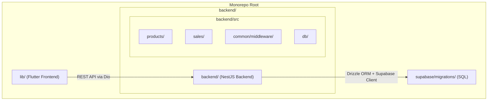
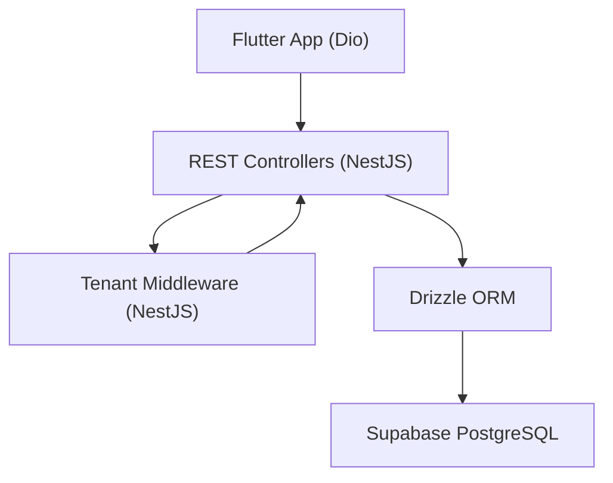
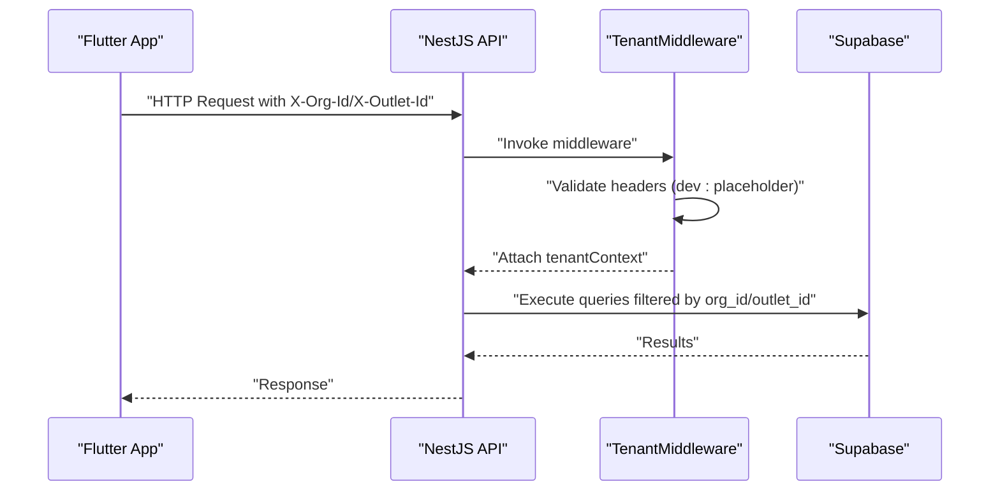
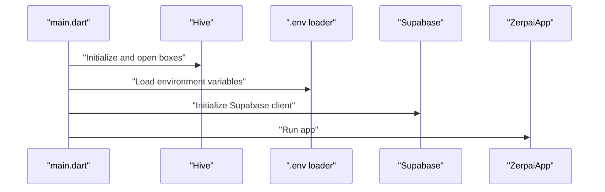
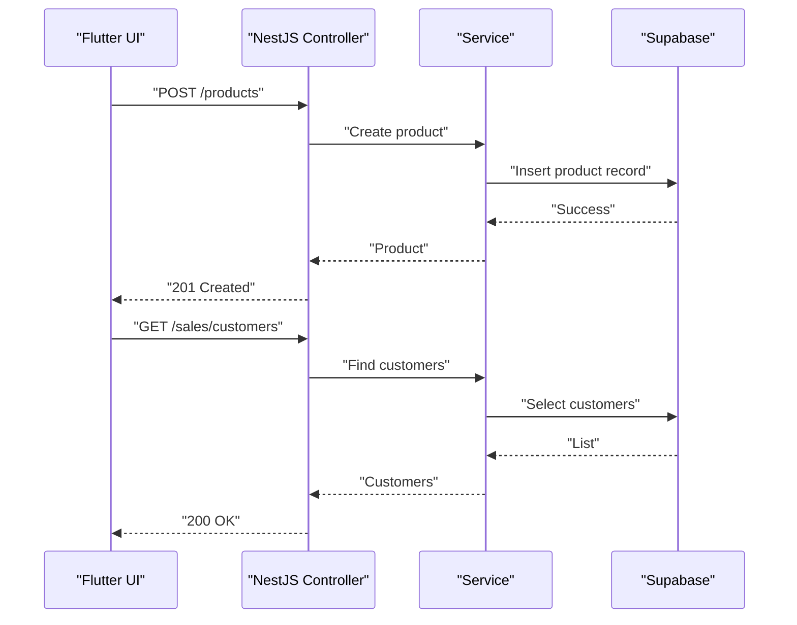
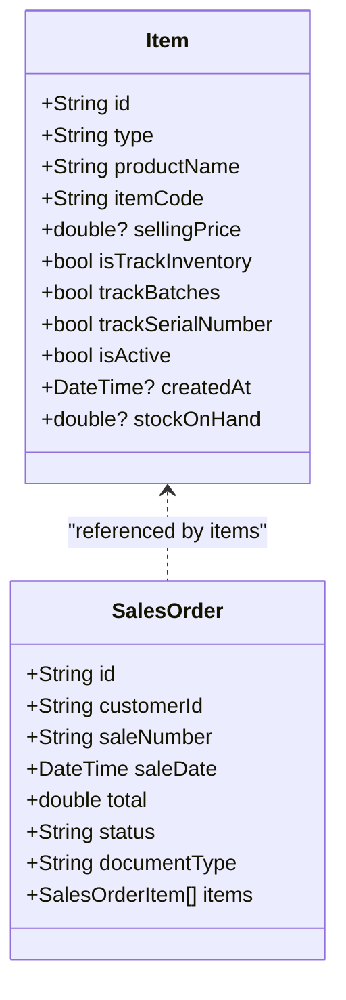
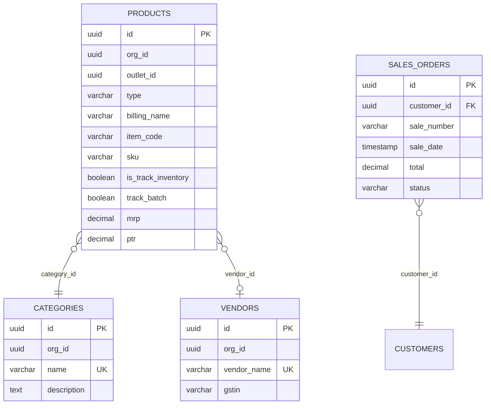
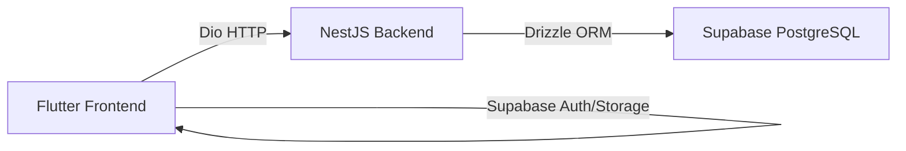

# Project Overview

<cite>
**Referenced Files in This Document**
- [README.md](file://README.md)
- [PRD.md](file://PRD/PRD.md)
- [pubspec.yaml](file://pubspec.yaml)
- [package.json](file://backend/package.json)
- [main.dart](file://lib/main.dart)
- [app.dart](file://lib/app.dart)
- [api_client.dart](file://lib/shared/services/api_client.dart)
- [app.module.ts](file://backend/src/app.module.ts)
- [tenant.middleware.ts](file://backend/src/common/middleware/tenant.middleware.ts)
- [products.controller.ts](file://backend/src/products/products.controller.ts)
- [sales.controller.ts](file://backend/src/sales/sales.controller.ts)
- [schema.ts](file://backend/src/db/schema.ts)
- [item_model.dart](file://lib/modules/items/models/item_model.dart)
- [sales_order_model.dart](file://lib/modules/sales/models/sales_order_model.dart)
- [001_initial_schema_and_seed.sql](file://supabase/migrations/001_initial_schema_and_seed.sql)
</cite>

## Table of Contents
1. [Introduction](#introduction)
2. [Project Structure](#project-structure)
3. [Core Components](#core-components)
4. [Architecture Overview](#architecture-overview)
5. [Detailed Component Analysis](#detailed-component-analysis)
6. [Dependency Analysis](#dependency-analysis)
7. [Performance Considerations](#performance-considerations)
8. [Troubleshooting Guide](#troubleshooting-guide)
9. [Conclusion](#conclusion)

## Introduction
Zerpai ERP is a modern, cloud-native Enterprise Resource Planning (ERP) system designed specifically for Indian Small and Medium Enterprises (SMEs). Its initial focus targets retail, pharmacy, and trading businesses that require reliable inventory management, streamlined sales operations, customer relationship management, and actionable reporting. Built with a cloud-first mindset yet capable of operating during intermittent connectivity, Zerpai ERP replaces fragmented spreadsheets and single-purpose tools with a cohesive, scalable solution.

Target audience
- Retail stores and kiranas
- Pharmacies and medical supply businesses
- Trading and wholesale firms

Core value proposition
- Operational simplicity: intuitive POS and invoicing aligned with Indian business workflows
- Data integrity: structured inventory, GST-compliant tax handling, and audit-ready records
- Scalability: multi-tenant architecture supporting HO → FOFO/CO/CO operations across hundreds of outlets
- Offline capability: local caching for continuous operation and background synchronization

Development philosophy
- Auth-free development stage to accelerate iteration while maintaining an auth-ready architecture
- Modular monorepo enabling feature-focused development and clear separation of concerns
- Consistent UI/UX aligned with proven enterprise patterns (e.g., Zoho Inventory)

**Section sources**
- [README.md](file://README.md#L11-L25)
- [PRD.md](file://PRD/PRD.md#L11-L25)
- [PRD.md](file://PRD/PRD.md#L27-L36)

## Project Structure
Zerpai ERP follows a monorepo architecture with clear separation between the Flutter frontend, NestJS backend, and Supabase database. The frontend organizes code into core, shared, modules, and data layers. The backend is organized by feature modules (products, sales) and common utilities (middleware). The database is managed via SQL migrations and Drizzle ORM schema definitions.

**Diagram sources**
- [README.md](file://README.md#L5-L27)
- [pubspec.yaml](file://pubspec.yaml#L38-L70)
- [package.json](file://backend/package.json#L22-L36)

**Section sources**
- [README.md](file://README.md#L5-L27)
- [pubspec.yaml](file://pubspec.yaml#L38-L70)
- [package.json](file://backend/package.json#L22-L36)

## Core Components
- Flutter frontend (Web + Android)
  - State management: Riverpod
  - HTTP client: Dio
  - Local storage: Hive (offline data), shared_preferences (configuration)
  - UI framework: Flutter Material
- NestJS backend (TypeScript)
  - REST API server
  - Drizzle ORM for database operations
  - Supabase client for database connectivity
- Supabase database (PostgreSQL)
  - SQL migrations define schema and seed data
  - Row Level Security (RLS) policies prepared for production

Key capabilities
- Inventory management: products catalog, units, categories, tax rates, manufacturers, brands, storage locations, racks, reorder terms, and product compositions
- Sales operations: customers, GSTIN lookup, payments, e-way bills, payment links, sales orders, invoices, and related workflows
- Customer management: customer profiles, addresses, GSTIN verification, and payment tracking
- Reporting: dashboards and sales reports (with planned expansion)

**Section sources**
- [README.md](file://README.md#L30-L35)
- [PRD.md](file://PRD/PRD.md#L109-L128)
- [schema.ts](file://backend/src/db/schema.ts#L1-L293)
- [sales.controller.ts](file://backend/src/sales/sales.controller.ts#L1-L102)
- [products.controller.ts](file://backend/src/products/products.controller.ts#L1-L250)

## Architecture Overview
Zerpai ERP employs a layered architecture:
- Frontend (Flutter) communicates with the backend via REST API using Dio
- Backend (NestJS) applies multi-tenant middleware to enforce org_id/outlet_id context
- Database (Supabase/PostgreSQL) persists data with pre-production RLS policies and indexes

**Diagram sources**
- [README.md](file://README.md#L83-L91)
- [app.module.ts](file://backend/src/app.module.ts#L9-L19)
- [tenant.middleware.ts](file://backend/src/common/middleware/tenant.middleware.ts#L23-L69)
- [schema.ts](file://backend/src/db/schema.ts#L1-L20)

**Section sources**
- [README.md](file://README.md#L83-L91)
- [app.module.ts](file://backend/src/app.module.ts#L9-L19)
- [tenant.middleware.ts](file://backend/src/common/middleware/tenant.middleware.ts#L23-L69)

## Detailed Component Analysis

### Multi-Tenant Architecture
Zerpai ERP enforces multi-tenancy through headers and middleware:
- Requests include X-Org-Id and X-Outlet-Id
- TenantMiddleware attaches a tenant context to each request
- Production code includes JWT parsing and role extraction (placeholder in current dev stage)

**Diagram sources**
- [README.md](file://README.md#L93-L100)
- [tenant.middleware.ts](file://backend/src/common/middleware/tenant.middleware.ts#L24-L67)

**Section sources**
- [README.md](file://README.md#L93-L100)
- [tenant.middleware.ts](file://backend/src/common/middleware/tenant.middleware.ts#L23-L69)

### Frontend Initialization and API Client
The Flutter app initializes local storage, environment variables, and Supabase, then mounts the main application. The API client encapsulates base URL, timeouts, and interceptors for requests.

**Diagram sources**
- [main.dart](file://lib/main.dart#L8-L28)
- [api_client.dart](file://lib/shared/services/api_client.dart#L6-L43)

**Section sources**
- [main.dart](file://lib/main.dart#L8-L28)
- [api_client.dart](file://lib/shared/services/api_client.dart#L6-L43)

### Backend Modules: Products and Sales
The backend exposes REST endpoints for products and sales, including lookups, CRUD operations, and specialized workflows (e.g., GSTIN lookup, e-way bills, payment links).

**Diagram sources**
- [products.controller.ts](file://backend/src/products/products.controller.ts#L217-L248)
- [sales.controller.ts](file://backend/src/sales/sales.controller.ts#L18-L33)

**Section sources**
- [products.controller.ts](file://backend/src/products/products.controller.ts#L1-L250)
- [sales.controller.ts](file://backend/src/sales/sales.controller.ts#L1-L102)

### Data Models: Items and Sales Orders
The frontend models align with backend schemas, ensuring consistent serialization and deserialization across layers.

**Diagram sources**
- [item_model.dart](file://lib/modules/items/models/item_model.dart#L4-L172)
- [sales_order_model.dart](file://lib/modules/sales/models/sales_order_model.dart#L4-L51)

**Section sources**
- [item_model.dart](file://lib/modules/items/models/item_model.dart#L1-L461)
- [sales_order_model.dart](file://lib/modules/sales/models/sales_order_model.dart#L1-L118)

### Database Schema and Seed
The database schema defines core entities for products, categories, vendors, and sales, with indexes and placeholders for RLS policies. Seed data demonstrates typical organizations, outlets, categories, vendors, and products.

**Diagram sources**
- [001_initial_schema_and_seed.sql](file://supabase/migrations/001_initial_schema_and_seed.sql#L26-L89)
- [001_initial_schema_and_seed.sql](file://supabase/migrations/001_initial_schema_and_seed.sql#L108-L120)
- [schema.ts](file://backend/src/db/schema.ts#L117-L195)
- [schema.ts](file://backend/src/db/schema.ts#L213-L253)

**Section sources**
- [001_initial_schema_and_seed.sql](file://supabase/migrations/001_initial_schema_and_seed.sql#L1-L200)
- [schema.ts](file://backend/src/db/schema.ts#L1-L293)

## Dependency Analysis
Technology stack alignment
- Frontend: Flutter with Riverpod, Dio, Hive, and Supabase Flutter SDK
- Backend: NestJS with Drizzle ORM, Supabase client, and TypeScript
- Database: Supabase (PostgreSQL) with SQL migrations and RLS policies

**Diagram sources**
- [pubspec.yaml](file://pubspec.yaml#L38-L70)
- [package.json](file://backend/package.json#L22-L36)
- [README.md](file://README.md#L30-L35)

**Section sources**
- [pubspec.yaml](file://pubspec.yaml#L38-L70)
- [package.json](file://backend/package.json#L22-L36)
- [README.md](file://README.md#L30-L35)

## Performance Considerations
- Indexed database queries: product and category indexes improve lookup performance
- Minimal API calls in POS mode: reduce network overhead during transactions
- Local caching: Hive for offline-first operation with background synchronization
- Optimized DTOs: selective field inclusion avoids validation errors and reduces payload sizes

[No sources needed since this section provides general guidance]

## Troubleshooting Guide
Common setup and runtime issues
- Environment variables not loaded: ensure .env is placed and loaded by the app and backend
- Supabase connectivity: verify URLs and keys; confirm service role key for backend
- CORS and RLS: during development, RLS may be disabled; re-enable policies before production
- Tenant context missing: ensure X-Org-Id and X-Outlet-Id headers are present for protected routes

**Section sources**
- [README.md](file://README.md#L67-L81)
- [main.dart](file://lib/main.dart#L20-L25)
- [tenant.middleware.ts](file://backend/src/common/middleware/tenant.middleware.ts#L24-L67)

## Conclusion
Zerpai ERP delivers a modern, scalable ERP tailored for Indian SMEs. Its cloud-native foundation, multi-tenant architecture, and modular design enable rapid deployment and growth. By combining a responsive Flutter frontend, a robust NestJS backend, and a flexible Supabase database, Zerpai ERP streamlines inventory, sales, and reporting while preparing for secure, production-grade operations.

[No sources needed since this section summarizes without analyzing specific files]