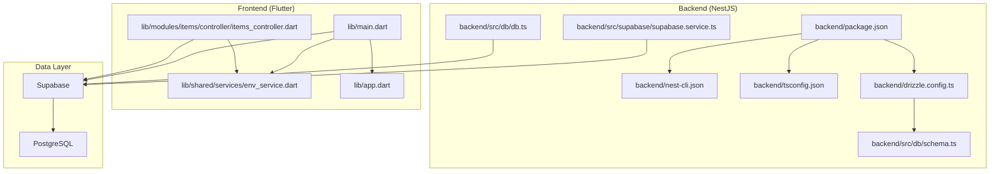
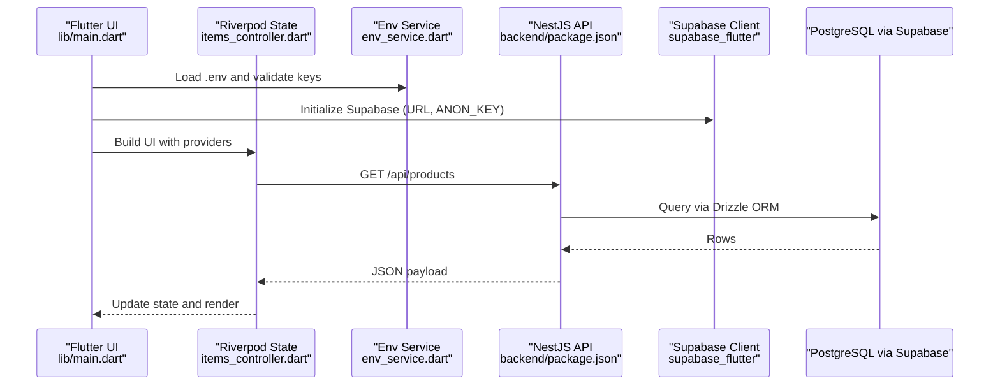
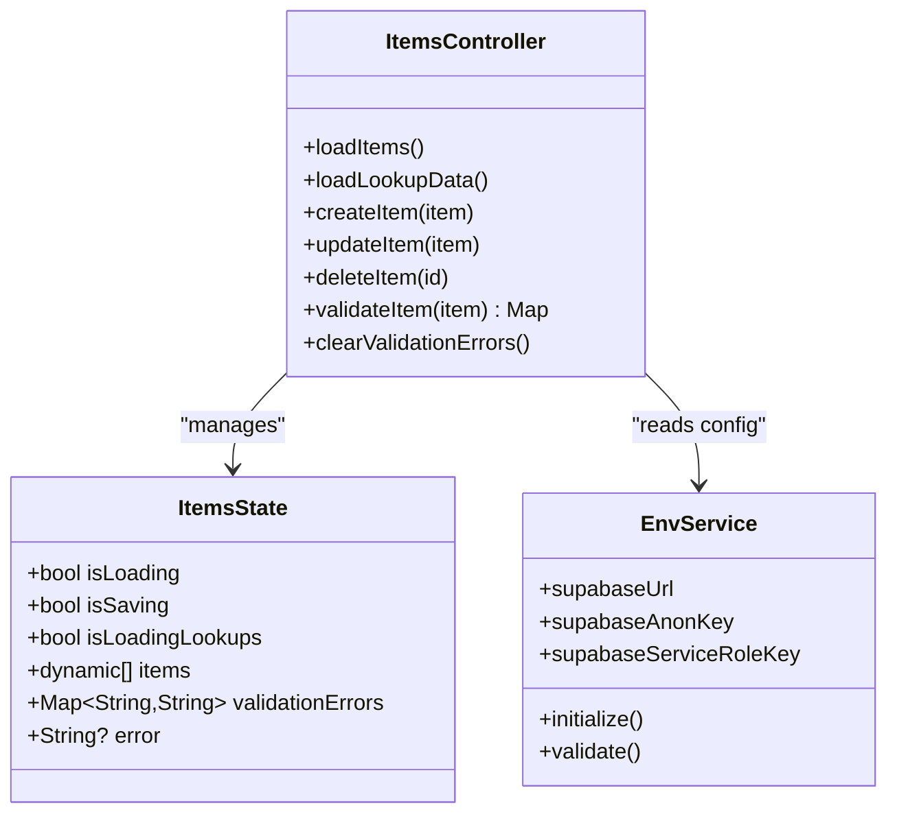
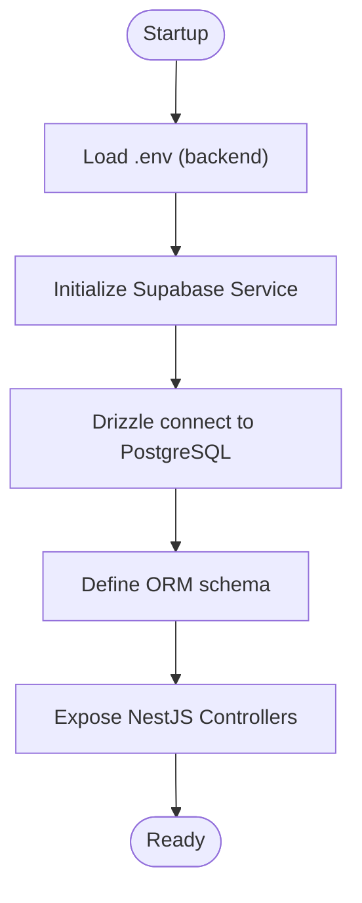
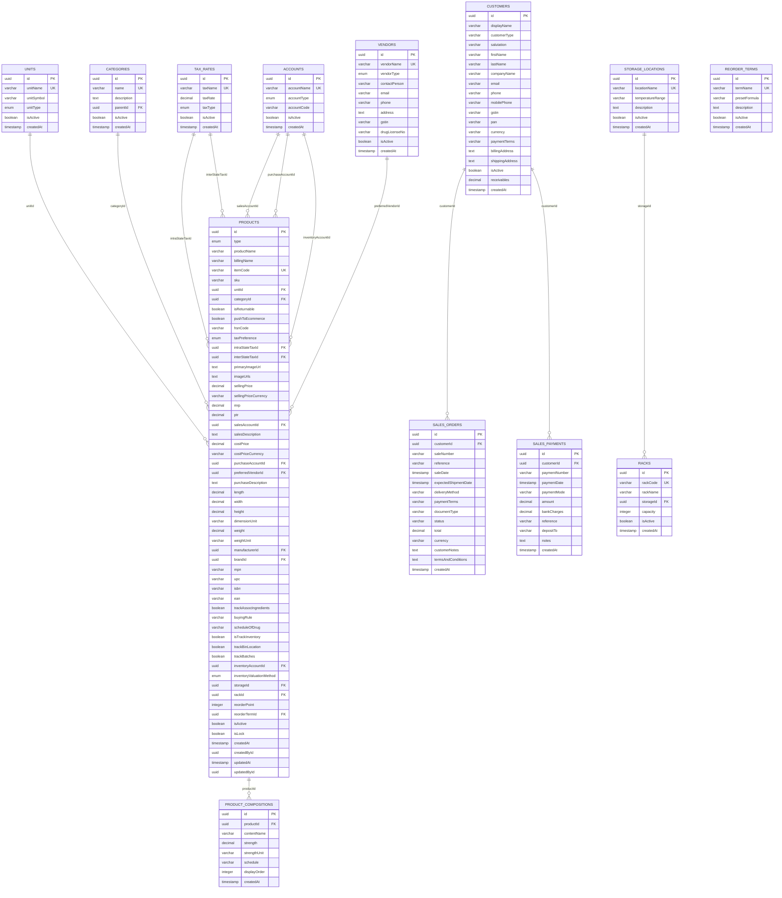
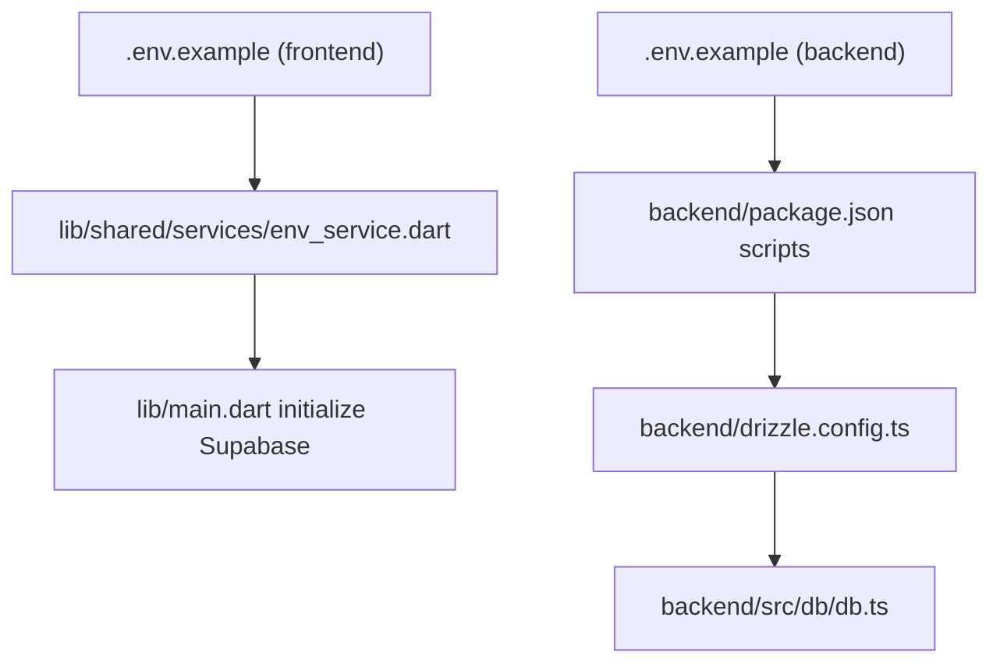
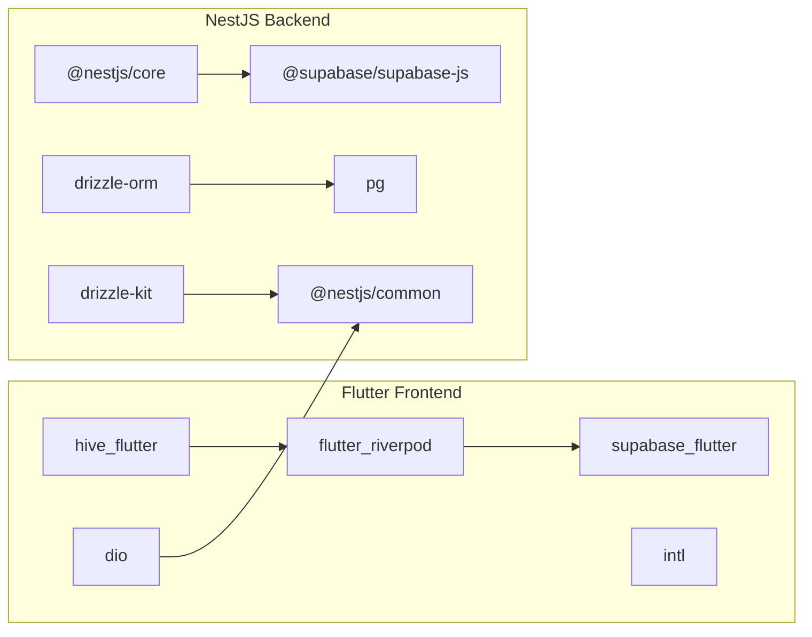

# Technology Stack

<cite>
**Referenced Files in This Document**
- [pubspec.yaml](file://pubspec.yaml)
- [main.dart](file://lib/main.dart)
- [env_service.dart](file://lib/shared/services/env_service.dart)
- [items_controller.dart](file://lib/modules/items/controller/items_controller.dart)
- [app.dart](file://lib/app.dart)
- [backend/package.json](file://backend/package.json)
- [backend/nest-cli.json](file://backend/nest-cli.json)
- [backend/tsconfig.json](file://backend/tsconfig.json)
- [backend/drizzle.config.ts](file://backend/drizzle.config.ts)
- [backend/src/supabase/supabase.service.ts](file://backend/src/supabase/supabase.service.ts)
- [backend/src/db/schema.ts](file://backend/src/db/schema.ts)
- [backend/src/db/db.ts](file://backend/src/db/db.ts)
- [.env.example](file://.env.example)
- [backend/.env.example](file://backend/.env.example)
</cite>

## Table of Contents
1. [Introduction](#introduction)
2. [Project Structure](#project-structure)
3. [Core Components](#core-components)
4. [Architecture Overview](#architecture-overview)
5. [Detailed Component Analysis](#detailed-component-analysis)
6. [Dependency Analysis](#dependency-analysis)
7. [Performance Considerations](#performance-considerations)
8. [Troubleshooting Guide](#troubleshooting-guide)
9. [Conclusion](#conclusion)
10. [Appendices](#appendices)

## Introduction
This document details the complete technology stack powering ZerpAI ERP. It covers the frontend built with Flutter 3.x (with web and Android targets), the backend powered by NestJS 10.x and TypeScript, Supabase for database, authentication, and storage, PostgreSQL for persistent data, and Riverpod for scalable state management. For each technology, we explain version requirements, rationale, compatibility, and practical implications for Indian SMEs, including offline-first capabilities, regulatory alignment, and deployment considerations.

## Project Structure
ZerpAI ERP follows a clear separation of concerns:
- Frontend: Flutter application under lib/, supporting web and mobile targets via Flutter SDK.
- Backend: NestJS application under backend/, written in TypeScript, using Drizzle ORM and Supabase client.
- Database: PostgreSQL schema defined with Drizzle ORM and managed via Supabase.
- Shared configuration: Environment variables under .env.example and backend/.env.example.

**Diagram sources**
- [lib/main.dart](file://lib/main.dart#L1-L29)
- [lib/shared/services/env_service.dart](file://lib/shared/services/env_service.dart#L1-L72)
- [lib/modules/items/controller/items_controller.dart](file://lib/modules/items/controller/items_controller.dart#L1-L568)
- [lib/app.dart](file://lib/app.dart#L1-L200)
- [backend/package.json](file://backend/package.json#L1-L79)
- [backend/nest-cli.json](file://backend/nest-cli.json#L1-L12)
- [backend/tsconfig.json](file://backend/tsconfig.json#L1-L22)
- [backend/drizzle.config.ts](file://backend/drizzle.config.ts#L1-L16)
- [backend/src/supabase/supabase.service.ts](file://backend/src/supabase/supabase.service.ts#L1-L32)
- [backend/src/db/schema.ts](file://backend/src/db/schema.ts#L1-L293)
- [backend/src/db/db.ts](file://backend/src/db/db.ts#L1-L13)

**Section sources**
- [pubspec.yaml](file://pubspec.yaml#L1-L128)
- [lib/main.dart](file://lib/main.dart#L1-L29)
- [backend/package.json](file://backend/package.json#L1-L79)
- [backend/nest-cli.json](file://backend/nest-cli.json#L1-L12)
- [backend/tsconfig.json](file://backend/tsconfig.json#L1-L22)
- [backend/drizzle.config.ts](file://backend/drizzle.config.ts#L1-L16)
- [backend/src/db/schema.ts](file://backend/src/db/schema.ts#L1-L293)
- [backend/src/db/db.ts](file://backend/src/db/db.ts#L1-L13)
- [.env.example](file://.env.example#L1-L68)
- [backend/.env.example](file://backend/.env.example#L1-L40)

## Core Components
- Flutter 3.x (web and Android): Single-codebase UI with Riverpod state management, Supabase Flutter SDK, and offline caching via Hive.
- NestJS 10.x + TypeScript: Modular backend with DTOs, middleware, and Supabase integration.
- Supabase: Authentication, real-time features, storage, and database abstraction.
- PostgreSQL: Persistent relational data via Supabase-managed Postgres.
- Riverpod: Predictable, testable, and scalable state management for Flutter.

Rationale and version requirements:
- Flutter 3.x SDK ensures modern Dart language features and cross-platform builds. The project’s SDK constraint aligns with this.
- NestJS 10.x provides a robust, scalable backend foundation with excellent TypeScript support and modular architecture.
- Supabase offers a unified platform for auth, DB, and storage, simplifying infrastructure for SMEs.
- PostgreSQL is the industry-standard relational engine; Supabase manages migrations and RLS policies.
- Riverpod replaces provider/bloc patterns with a more flexible, composable solution.

Compatibility considerations:
- Flutter and NestJS TypeScript configurations target ES2021 and modern Node LTS.
- Supabase client libraries integrate seamlessly with both environments.
- Drizzle ORM schema aligns with PostgreSQL dialect and supports migrations.

**Section sources**
- [pubspec.yaml](file://pubspec.yaml#L21-L23)
- [backend/package.json](file://backend/package.json#L22-L36)
- [backend/tsconfig.json](file://backend/tsconfig.json#L10-L10)
- [backend/src/supabase/supabase.service.ts](file://backend/src/supabase/supabase.service.ts#L10-L26)
- [backend/src/db/schema.ts](file://backend/src/db/schema.ts#L1-L293)
- [lib/modules/items/controller/items_controller.dart](file://lib/modules/items/controller/items_controller.dart#L1-L20)

## Architecture Overview
The system architecture centers around a Flutter frontend communicating with a NestJS backend over HTTP. Supabase provides authentication, real-time subscriptions, and storage, while PostgreSQL persists data. Riverpod orchestrates UI state locally, and Hive enables offline-first experiences.

**Diagram sources**
- [lib/main.dart](file://lib/main.dart#L8-L28)
- [lib/shared/services/env_service.dart](file://lib/shared/services/env_service.dart#L7-L18)
- [lib/modules/items/controller/items_controller.dart](file://lib/modules/items/controller/items_controller.dart#L25-L60)
- [backend/package.json](file://backend/package.json#L8-L21)
- [backend/src/db/schema.ts](file://backend/src/db/schema.ts#L116-L195)

## Detailed Component Analysis

### Flutter Frontend (State Management with Riverpod)
- Initialization: The app initializes Hive for offline caching, loads environment variables, and sets up Supabase.
- State Management: ItemsController extends StateNotifier and uses Riverpod providers to manage UI state, loading flags, errors, and validation messages.
- Offline Support: Hive boxes are opened during startup to enable offline reads/writes.
- Environment Access: EnvService centralizes .env loading and validation for Supabase credentials and optional R2 storage settings.

**Diagram sources**
- [lib/modules/items/controller/items_controller.dart](file://lib/modules/items/controller/items_controller.dart#L16-L568)
- [lib/shared/services/env_service.dart](file://lib/shared/services/env_service.dart#L6-L71)
- [lib/main.dart](file://lib/main.dart#L11-L25)

**Section sources**
- [lib/main.dart](file://lib/main.dart#L8-L28)
- [lib/shared/services/env_service.dart](file://lib/shared/services/env_service.dart#L7-L71)
- [lib/modules/items/controller/items_controller.dart](file://lib/modules/items/controller/items_controller.dart#L16-L60)

### Backend (NestJS + Supabase + Drizzle ORM)
- Package Scripts: Build, watch, debug, lint, and test commands are defined for iterative development.
- TypeScript Compiler Options: Targets ES2021 and enables decorators and metadata for NestJS.
- Supabase Service: Initializes a Supabase client using service role key and disables auto session persistence for server-side contexts.
- Database Schema: Drizzle ORM tables define product catalogs, sales, tax rates, units, and lookup entities aligned with Indian ERP needs.
- Database Connection: Drizzle connects to PostgreSQL via a connection string from environment variables.

**Diagram sources**
- [backend/.env.example](file://backend/.env.example#L3-L10)
- [backend/src/supabase/supabase.service.ts](file://backend/src/supabase/supabase.service.ts#L10-L26)
- [backend/src/db/db.ts](file://backend/src/db/db.ts#L7-L12)
- [backend/src/db/schema.ts](file://backend/src/db/schema.ts#L1-L293)
- [backend/package.json](file://backend/package.json#L8-L21)

**Section sources**
- [backend/package.json](file://backend/package.json#L8-L21)
- [backend/tsconfig.json](file://backend/tsconfig.json#L2-L21)
- [backend/src/supabase/supabase.service.ts](file://backend/src/supabase/supabase.service.ts#L7-L31)
- [backend/src/db/schema.ts](file://backend/src/db/schema.ts#L1-L293)
- [backend/src/db/db.ts](file://backend/src/db/db.ts#L1-L13)

### Database Schema (PostgreSQL via Supabase)
- Entities: Units, Categories, Tax Rates, Manufacturers, Brands, Accounts, Storage Locations, Racks, Reorder Terms, Vendors, Products, Product Compositions, Customers, Sales Orders/Payments, E-Way Bills, Payment Links.
- Enumerations: Product type, tax preference, valuation method, unit type, tax type, account type, vendor type.
- Relationships: Foreign keys enforce referential integrity across entities.
- Regulatory Alignment: GSTIN, HSN code, and tax rate tables support Indian tax compliance.

**Diagram sources**
- [backend/src/db/schema.ts](file://backend/src/db/schema.ts#L1-L293)

**Section sources**
- [backend/src/db/schema.ts](file://backend/src/db/schema.ts#L1-L293)

### Environment and Configuration
- Frontend .env: API base URL, Supabase keys, environment flags, cache settings, timeouts, and logging preferences.
- Backend .env: Database URL, Supabase keys, JWT secret, CORS origins, API prefix/version, and Cloudflare R2 storage configuration.

**Diagram sources**
- [.env.example](file://.env.example#L5-L68)
- [backend/.env.example](file://backend/.env.example#L3-L40)
- [lib/shared/services/env_service.dart](file://lib/shared/services/env_service.dart#L7-L71)
- [lib/main.dart](file://lib/main.dart#L20-L25)
- [backend/package.json](file://backend/package.json#L8-L21)
- [backend/drizzle.config.ts](file://backend/drizzle.config.ts#L6-L15)
- [backend/src/db/db.ts](file://backend/src/db/db.ts#L7-L12)

**Section sources**
- [.env.example](file://.env.example#L5-L68)
- [backend/.env.example](file://backend/.env.example#L3-L40)
- [lib/shared/services/env_service.dart](file://lib/shared/services/env_service.dart#L7-L71)
- [lib/main.dart](file://lib/main.dart#L20-L25)
- [backend/package.json](file://backend/package.json#L8-L21)
- [backend/drizzle.config.ts](file://backend/drizzle.config.ts#L6-L15)
- [backend/src/db/db.ts](file://backend/src/db/db.ts#L7-L12)

## Dependency Analysis
- Frontend dependencies include Riverpod for state, Supabase Flutter SDK for auth/storage/DB, Hive/Hive Flutter for offline caching, Dio for HTTP, and Google Fonts/intl for UX.
- Backend dependencies include NestJS core/platform, Supabase JS client, Drizzle ORM, PostgreSQL drivers, and testing/linting tools.

**Diagram sources**
- [pubspec.yaml](file://pubspec.yaml#L38-L70)
- [backend/package.json](file://backend/package.json#L22-L36)

**Section sources**
- [pubspec.yaml](file://pubspec.yaml#L38-L70)
- [backend/package.json](file://backend/package.json#L22-L36)

## Performance Considerations
- Parallel Lookup Loading: ItemsController loads lookup lists concurrently to reduce UI latency.
- Caching and Offline: Hive boxes enable offline reads/writes; environment flags control cache staleness and sizes.
- Logging and Monitoring: Structured logging and performance timing are integrated for observability.
- Database Queries: Drizzle ORM schema and PostgreSQL indexing (via Supabase) support efficient queries.

**Section sources**
- [lib/modules/items/controller/items_controller.dart](file://lib/modules/items/controller/items_controller.dart#L71-L88)
- [.env.example](file://.env.example#L47-L68)
- [lib/shared/services/env_service.dart](file://lib/shared/services/env_service.dart#L48-L70)

## Troubleshooting Guide
- Missing Supabase Keys: EnvService throws explicit errors if required keys are missing; verify .env values.
- Supabase Client Initialization: Ensure URL and keys are loaded before initializing Supabase in main().
- Backend Environment: Confirm DATABASE_URL and Supabase keys; verify CORS origins and API prefix/version.
- Drizzle Configuration: Ensure DATABASE_URL is set and Drizzle config matches schema path.

**Section sources**
- [lib/shared/services/env_service.dart](file://lib/shared/services/env_service.dart#L48-L71)
- [lib/main.dart](file://lib/main.dart#L20-L25)
- [backend/.env.example](file://backend/.env.example#L3-L10)
- [backend/drizzle.config.ts](file://backend/drizzle.config.ts#L6-L15)

## Conclusion
ZerpAI ERP leverages a modern, cohesive stack: Flutter 3.x for a responsive, cross-platform UI with Riverpod state management; NestJS 10.x with TypeScript for a maintainable backend; Supabase for authentication, storage, and database; and PostgreSQL for reliable persistence. This combination delivers scalability, regulatory alignment for Indian markets, offline-first capabilities, and simplified infrastructure—ideal for SMEs seeking an enterprise-grade ERP without heavy DevOps overhead.

## Appendices
- Development Environment Setup
  - Flutter: Install SDK per pubspec.yaml environment constraint; configure web and Android targets.
  - Backend: Install Node.js and Nest CLI; run scripts defined in backend/package.json.
  - Database: Provision Supabase project; apply migrations via Drizzle kit; seed data as needed.
  - Environment: Copy .env.example files to .env.local and populate values; load in both frontend and backend.

- Deployment Notes
  - Frontend: Build for web and Android using Flutter build commands; host on Vercel or similar.
  - Backend: Deploy NestJS app to Vercel or a Node-compatible platform; ensure environment variables are configured.
  - Database: Supabase-managed PostgreSQL; configure RLS policies and roles as per schema.

[No sources needed since this section provides general guidance]