# Testing Strategy

<cite>
**Referenced Files in This Document**
- [test_helper.dart](file://test/test_helper.dart)
- [widget_test.dart](file://test/widget_test.dart)
- [app_exceptions_test.dart](file://test/core/errors/app_exceptions_test.dart)
- [hive_service_test.dart](file://test/shared/services/hive_service_test.dart)
- [z_button_test.dart](file://test/shared/widgets/z_button_test.dart)
- [products_repository_test.dart](file://test/modules/items/repositories/products_repository_test.dart)
- [products_repository_full_test.dart](file://test/modules/items/repositories/products_repository_full_test.dart)
- [TESTING.md](file://backend/TESTING.md)
- [package.json](file://backend/package.json)
- [nest-cli.json](file://backend/nest-cli.json)
- [products.controller.ts](file://backend/src/products/products.controller.ts)
- [products.service.ts](file://backend/src/products/products.service.ts)
- [supabase.service.ts](file://backend/src/supabase/supabase.service.ts)
- [db.ts](file://backend/src/db/db.ts)
- [schema.ts](file://backend/src/db/schema.ts)
</cite>

## Table of Contents
1. [Introduction](#introduction)
2. [Project Structure](#project-structure)
3. [Core Components](#core-components)
4. [Architecture Overview](#architecture-overview)
5. [Detailed Component Analysis](#detailed-component-analysis)
6. [Dependency Analysis](#dependency-analysis)
7. [Performance Considerations](#performance-considerations)
8. [Security Testing](#security-testing)
9. [Regression Testing](#regression-testing)
10. [Test Data Management](#test-data-management)
11. [Test Environment Setup](#test-environment-setup)
12. [Continuous Integration Testing](#continuous-integration-testing)
13. [Troubleshooting Guide](#troubleshooting-guide)
14. [Conclusion](#conclusion)

## Introduction
This document defines a comprehensive testing strategy for ZerpAI ERP across Flutter frontend and NestJS backend. It covers unit testing, integration testing, and end-to-end testing approaches, including Flutter widget testing, service-layer testing, repository testing patterns, NestJS controller/service testing with Supabase mocking, database integration testing, API endpoint testing, and cross-module testing strategies. It also documents test data management, environment setup, CI testing, performance testing, security testing, and regression testing.

## Project Structure
The repository organizes tests by domain and layer:
- Flutter tests live under test/ and include widget tests, service tests, repository tests, and core error tests.
- Backend tests leverage Jest with NestJS testing utilities and are configured via package.json and nest-cli.json.
- Backend API endpoints and services are defined under backend/src, with Supabase and database modules supporting data access.

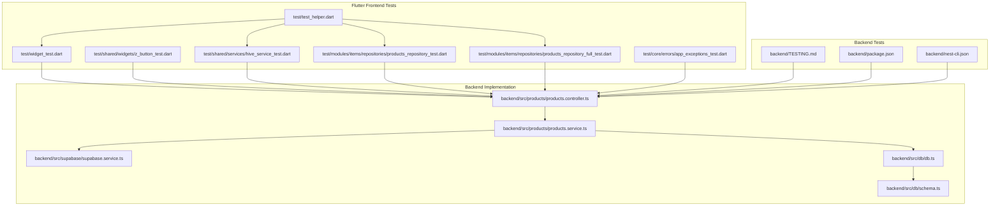

**Diagram sources**
- [widget_test.dart](file://test/widget_test.dart#L1-L8)
- [z_button_test.dart](file://test/shared/widgets/z_button_test.dart#L1-L78)
- [hive_service_test.dart](file://test/shared/services/hive_service_test.dart#L1-L77)
- [products_repository_test.dart](file://test/modules/items/repositories/products_repository_test.dart#L1-L83)
- [products_repository_full_test.dart](file://test/modules/items/repositories/products_repository_full_test.dart#L1-L221)
- [app_exceptions_test.dart](file://test/core/errors/app_exceptions_test.dart#L1-L92)
- [test_helper.dart](file://test/test_helper.dart#L1-L46)
- [TESTING.md](file://backend/TESTING.md#L1-L72)
- [package.json](file://backend/package.json#L1-L79)
- [nest-cli.json](file://backend/nest-cli.json#L1-L12)
- [products.controller.ts](file://backend/src/products/products.controller.ts#L1-L250)
- [products.service.ts](file://backend/src/products/products.service.ts)
- [supabase.service.ts](file://backend/src/supabase/supabase.service.ts)
- [db.ts](file://backend/src/db/db.ts)
- [schema.ts](file://backend/src/db/schema.ts)

**Section sources**
- [TESTING.md](file://backend/TESTING.md#L1-L72)
- [package.json](file://backend/package.json#L1-L79)
- [nest-cli.json](file://backend/nest-cli.json#L1-L12)

## Core Components
- Flutter widget tests validate UI rendering and user interactions.
- Service-layer tests validate business logic and caching behavior.
- Repository tests validate data access patterns and offline-first caching.
- Backend controller tests validate routing, DTO validation, and error handling.
- Backend service tests validate business logic and Supabase integration.
- Supabase service tests validate client initialization and query execution.
- Database module tests validate schema and migrations.

**Section sources**
- [z_button_test.dart](file://test/shared/widgets/z_button_test.dart#L1-L78)
- [hive_service_test.dart](file://test/shared/services/hive_service_test.dart#L1-L77)
- [products_repository_test.dart](file://test/modules/items/repositories/products_repository_test.dart#L1-L83)
- [products_repository_full_test.dart](file://test/modules/items/repositories/products_repository_full_test.dart#L1-L221)
- [products.controller.ts](file://backend/src/products/products.controller.ts#L1-L250)
- [products.service.ts](file://backend/src/products/products.service.ts)
- [supabase.service.ts](file://backend/src/supabase/supabase.service.ts)
- [db.ts](file://backend/src/db/db.ts)
- [schema.ts](file://backend/src/db/schema.ts)

## Architecture Overview
The testing architecture separates concerns across layers:
- Flutter tests depend on test helpers for Hive initialization and teardown.
- Backend tests use NestJS testing utilities and Jest for unit/integration/e2e coverage.
- Controllers delegate to services; services interact with Supabase and database modules.

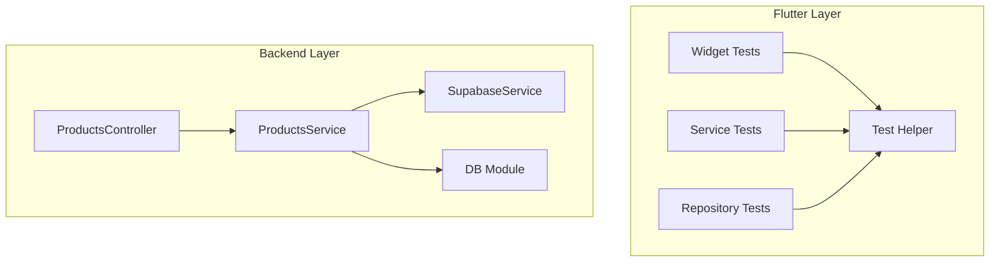

**Diagram sources**
- [test_helper.dart](file://test/test_helper.dart#L1-L46)
- [products.controller.ts](file://backend/src/products/products.controller.ts#L1-L250)
- [products.service.ts](file://backend/src/products/products.service.ts)
- [supabase.service.ts](file://backend/src/supabase/supabase.service.ts)
- [db.ts](file://backend/src/db/db.ts)

## Detailed Component Analysis

### Flutter Widget Testing
Widget tests validate rendering and interaction of UI components. They pump minimal widget trees and assert presence and behavior.

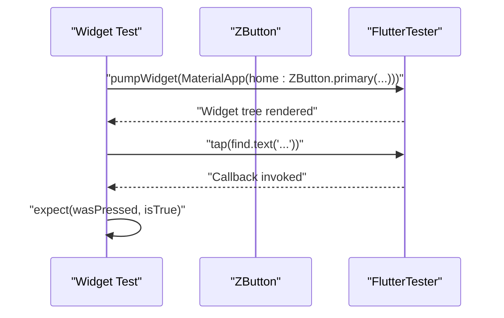

**Diagram sources**
- [z_button_test.dart](file://test/shared/widgets/z_button_test.dart#L10-L36)

**Section sources**
- [z_button_test.dart](file://test/shared/widgets/z_button_test.dart#L1-L78)

### Flutter Service Testing
Service tests validate caching and cache statistics without requiring full Hive initialization for read-only checks.

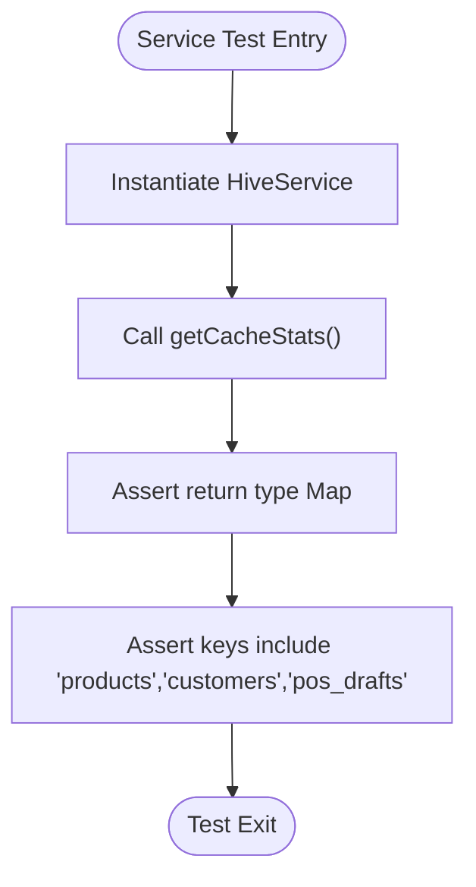

**Diagram sources**
- [hive_service_test.dart](file://test/shared/services/hive_service_test.dart#L65-L74)

**Section sources**
- [hive_service_test.dart](file://test/shared/services/hive_service_test.dart#L1-L77)

### Flutter Repository Testing Patterns
Repository tests validate offline-first caching, fallback behavior, and cache staleness. The full suite demonstrates mocking APIs and caches.

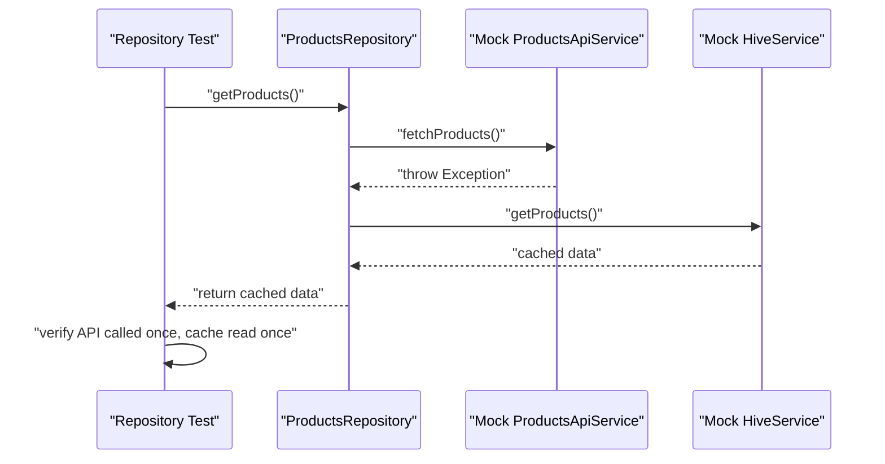

**Diagram sources**
- [products_repository_full_test.dart](file://test/modules/items/repositories/products_repository_full_test.dart#L58-L84)

**Section sources**
- [products_repository_test.dart](file://test/modules/items/repositories/products_repository_test.dart#L1-L83)
- [products_repository_full_test.dart](file://test/modules/items/repositories/products_repository_full_test.dart#L1-L221)

### Backend Controller Testing with Supabase Mocking
Controllers expose endpoints for CRUD and lookup synchronization. Tests should validate:
- Route precedence and lookup endpoints before parameterized routes.
- DTO validation via ValidationPipe.
- Error propagation and logging in catch blocks.

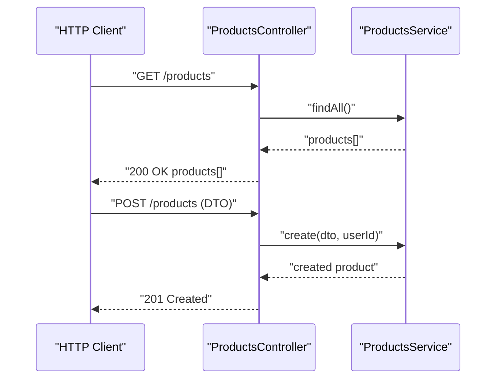

**Diagram sources**
- [products.controller.ts](file://backend/src/products/products.controller.ts#L217-L248)
- [products.service.ts](file://backend/src/products/products.service.ts)

**Section sources**
- [products.controller.ts](file://backend/src/products/products.controller.ts#L1-L250)

### Backend Service Testing with Supabase
Services encapsulate business logic and interact with Supabase and database modules. Tests should:
- Mock Supabase client behavior.
- Validate data transformations and validations.
- Verify database queries and schema adherence.

```mermaid
classDiagram
class ProductsController {
+getUnits()
+syncUnits(units)
+checkUnitUsage(body)
+checkLookupUsage(lookup,id)
+getContentUnits()
+syncContentUnits(items)
+getCategories()
+syncCategories(items)
+getTaxRates()
+getManufacturers()
+syncManufacturers(items)
+getBrands()
+syncBrands(items)
+getVendors()
+syncVendors(items)
+getStorageLocations()
+syncStorageLocations(items)
+getRacks()
+syncRacks(items)
+getReorderTerms()
+syncReorderTerms(items)
+getAccounts()
+syncAccounts(items)
+getContents()
+syncContents(items)
+getStrengths()
+syncStrengths(items)
+getBuyingRules()
+syncBuyingRules(items)
+getDrugSchedules()
+syncDrugSchedules(items)
+findAll()
+findOne(id)
+create(dto, req)
+update(id, dto, req)
+remove(id)
}
class ProductsService {
+getUnits()
+syncUnits(units)
+checkUnitUsage(unitIds)
+checkLookupUsage(lookup,id)
+getContentUnits()
+syncContentUnits(items)
+getCategories()
+syncCategories(items)
+getTaxRates()
+getManufacturers()
+syncManufacturers(items)
+getBrands()
+syncBrands(items)
+getVendors()
+syncVendors(items)
+getStorageLocations()
+syncStorageLocations(items)
+getRacks()
+syncRacks(items)
+getReorderTerms()
+syncReorderTerms(items)
+getAccounts()
+syncAccounts(items)
+getContents()
+syncContents(items)
+getStrengths()
+syncStrengths(items)
+getBuyingRules()
+syncBuyingRules(items)
+getDrugSchedules()
+syncDrugSchedules(items)
+findAll()
+findOne(id)
+create(dto,userId)
+update(id,dto,userId)
+remove(id)
}
class SupabaseService {
+client
+from(table)
+select(columns)
+insert(rows)
+update(set)
+delete()
}
ProductsController --> ProductsService : "delegates"
ProductsService --> SupabaseService : "uses"
```

**Diagram sources**
- [products.controller.ts](file://backend/src/products/products.controller.ts#L1-L250)
- [products.service.ts](file://backend/src/products/products.service.ts)
- [supabase.service.ts](file://backend/src/supabase/supabase.service.ts)

**Section sources**
- [products.controller.ts](file://backend/src/products/products.controller.ts#L1-L250)
- [products.service.ts](file://backend/src/products/products.service.ts)
- [supabase.service.ts](file://backend/src/supabase/supabase.service.ts)

### Database Integration Testing
Database integration tests validate schema correctness and migration readiness. The database module and schema files define the data model.

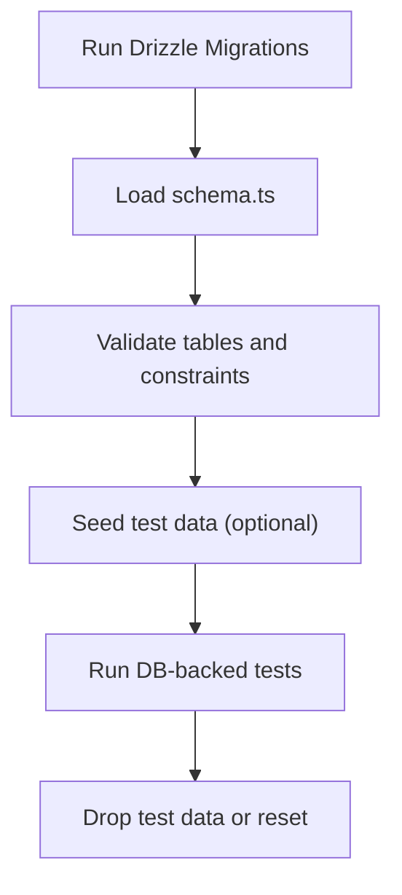

**Diagram sources**
- [db.ts](file://backend/src/db/db.ts)
- [schema.ts](file://backend/src/db/schema.ts)

**Section sources**
- [db.ts](file://backend/src/db/db.ts)
- [schema.ts](file://backend/src/db/schema.ts)

### API Endpoint Testing
Backend TESTING.md documents available endpoints and quick test commands. Tests should cover:
- Lookup endpoints (units, categories, tax-rates).
- CRUD endpoints for products.
- Validation and error responses.

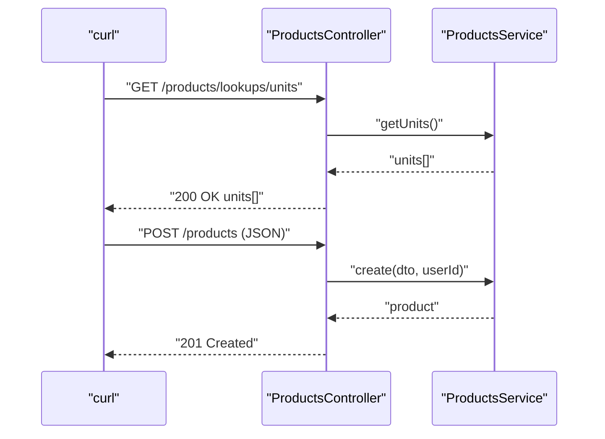

**Diagram sources**
- [TESTING.md](file://backend/TESTING.md#L7-L60)
- [products.controller.ts](file://backend/src/products/products.controller.ts#L217-L248)

**Section sources**
- [TESTING.md](file://backend/TESTING.md#L1-L72)

### Cross-Module Testing Strategies
Cross-module testing ensures data consistency and integration points:
- Validate repository-to-service boundaries.
- Ensure controller DTOs align with service expectations.
- Confirm Supabase operations match schema definitions.

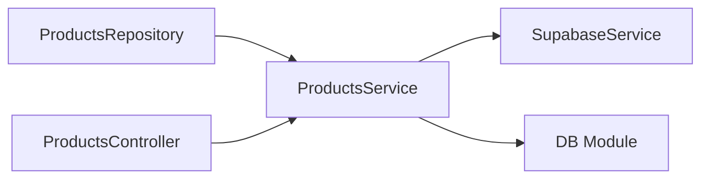

**Diagram sources**
- [products_repository_full_test.dart](file://test/modules/items/repositories/products_repository_full_test.dart#L16-L28)
- [products.controller.ts](file://backend/src/products/products.controller.ts#L19-L21)
- [products.service.ts](file://backend/src/products/products.service.ts)
- [supabase.service.ts](file://backend/src/supabase/supabase.service.ts)
- [db.ts](file://backend/src/db/db.ts)

**Section sources**
- [products_repository_full_test.dart](file://test/modules/items/repositories/products_repository_full_test.dart#L1-L221)
- [products.controller.ts](file://backend/src/products/products.controller.ts#L1-L250)

## Dependency Analysis
Testing dependencies and coupling:
- Flutter tests depend on test_helper for Hive initialization and cleanup.
- Repository tests depend on mocked API and cache services.
- Backend tests depend on NestJS testing utilities and Jest configuration.

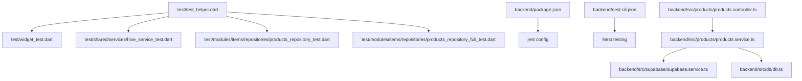

**Diagram sources**
- [test_helper.dart](file://test/test_helper.dart#L1-L46)
- [widget_test.dart](file://test/widget_test.dart#L1-L8)
- [hive_service_test.dart](file://test/shared/services/hive_service_test.dart#L1-L77)
- [products_repository_test.dart](file://test/modules/items/repositories/products_repository_test.dart#L1-L83)
- [products_repository_full_test.dart](file://test/modules/items/repositories/products_repository_full_test.dart#L1-L221)
- [package.json](file://backend/package.json#L61-L77)
- [nest-cli.json](file://backend/nest-cli.json#L1-L12)
- [products.controller.ts](file://backend/src/products/products.controller.ts#L1-L250)
- [products.service.ts](file://backend/src/products/products.service.ts)
- [supabase.service.ts](file://backend/src/supabase/supabase.service.ts)
- [db.ts](file://backend/src/db/db.ts)

**Section sources**
- [package.json](file://backend/package.json#L1-L79)
- [nest-cli.json](file://backend/nest-cli.json#L1-L12)

## Performance Considerations
- Minimize network calls in unit tests by mocking services and repositories.
- Use lightweight test databases or in-memory fixtures for backend tests.
- Profile widget tests to avoid unnecessary rebuilds and heavy computations.
- Batch API requests in integration tests to reduce overhead.

## Security Testing
- Validate DTO validation pipes prevent injection and malformed payloads.
- Ensure middleware enforces tenant isolation and authentication.
- Test error handling does not leak sensitive information.
- Verify Supabase policies and RLS are respected in tests.

## Regression Testing
- Maintain a stable set of snapshot tests for critical UI components.
- Keep integration tests for core API endpoints.
- Version control test data and seed scripts for reproducibility.
- Run regression suites on pull requests targeting critical modules.

## Test Data Management
- Use temporary directories for Hive test data and clean up after tests.
- Seed backend test databases with deterministic fixtures.
- Isolate test environments to prevent cross-test contamination.

**Section sources**
- [test_helper.dart](file://test/test_helper.dart#L8-L33)

## Test Environment Setup
- Backend: Install dependencies, configure Jest via package.json, and run NestJS dev server.
- Flutter: Initialize test binding and Hive in test_helper, then run tests.

**Section sources**
- [package.json](file://backend/package.json#L8-L20)
- [test_helper.dart](file://test/test_helper.dart#L35-L45)

## Continuous Integration Testing
- Configure CI to run Flutter tests and backend Jest suites.
- Use separate jobs for unit, integration, and e2e tests.
- Cache dependencies and use ephemeral test databases.

**Section sources**
- [package.json](file://backend/package.json#L16-L20)

## Troubleshooting Guide
Common issues and resolutions:
- Hive initialization failures: Ensure test_helper initializes and cleans up properly.
- Repository tests failing due to missing mocks: Use mocktail/mockito to stub API/cache behavior.
- Backend tests timing out: Increase timeout values and ensure Supabase client is mocked.
- Flutter widget tests flaky: Avoid asynchronous operations in setup; use pumpAndSettle where appropriate.

**Section sources**
- [test_helper.dart](file://test/test_helper.dart#L8-L33)
- [products_repository_full_test.dart](file://test/modules/items/repositories/products_repository_full_test.dart#L10-L28)
- [products.controller.ts](file://backend/src/products/products.controller.ts#L32-L44)

## Conclusion
ZerpAI ERP’s testing strategy leverages layered testing across Flutter and NestJS. By combining widget tests, service/repository tests, controller/service tests with Supabase mocking, database integration tests, and robust test data/environment management, teams can ensure reliability, maintainability, and rapid feedback loops. Extending coverage with performance, security, and regression testing further strengthens quality assurance.