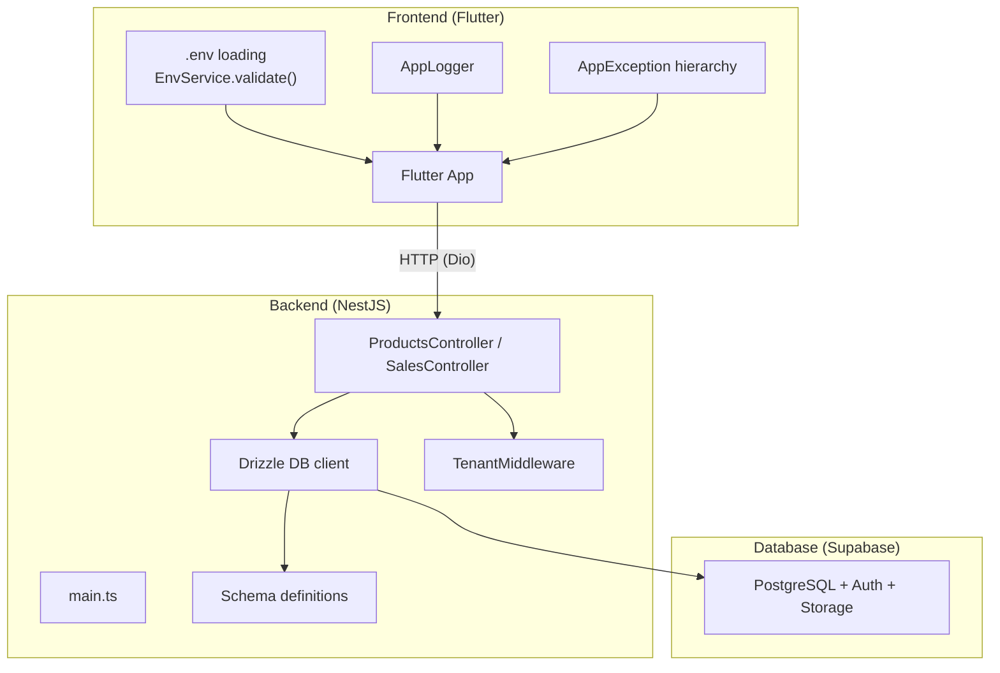
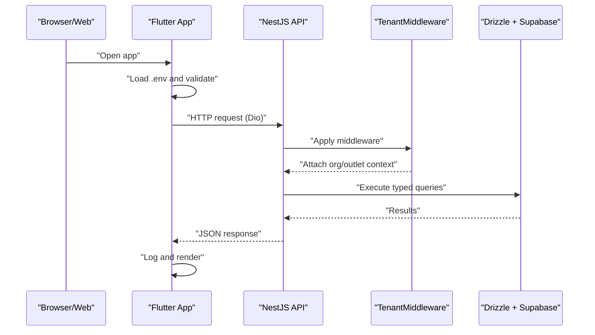
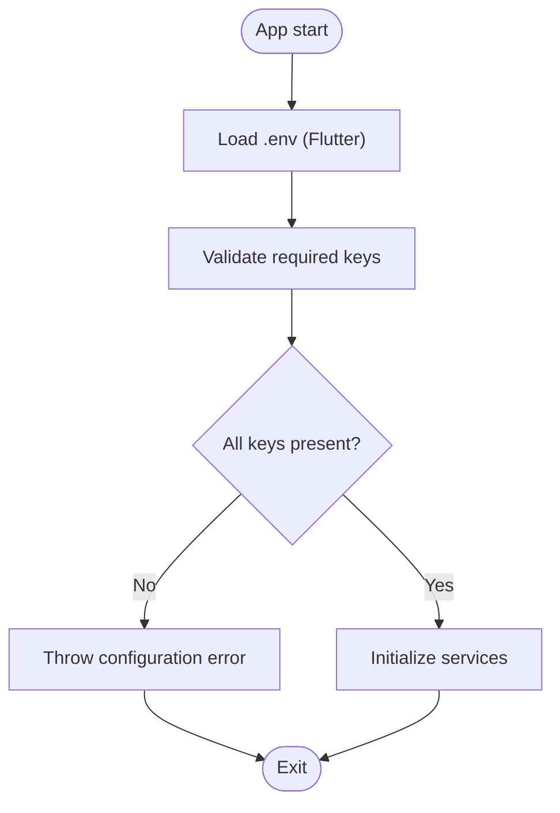
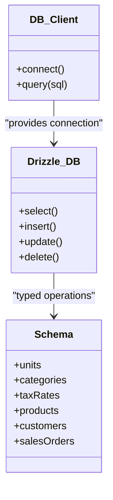
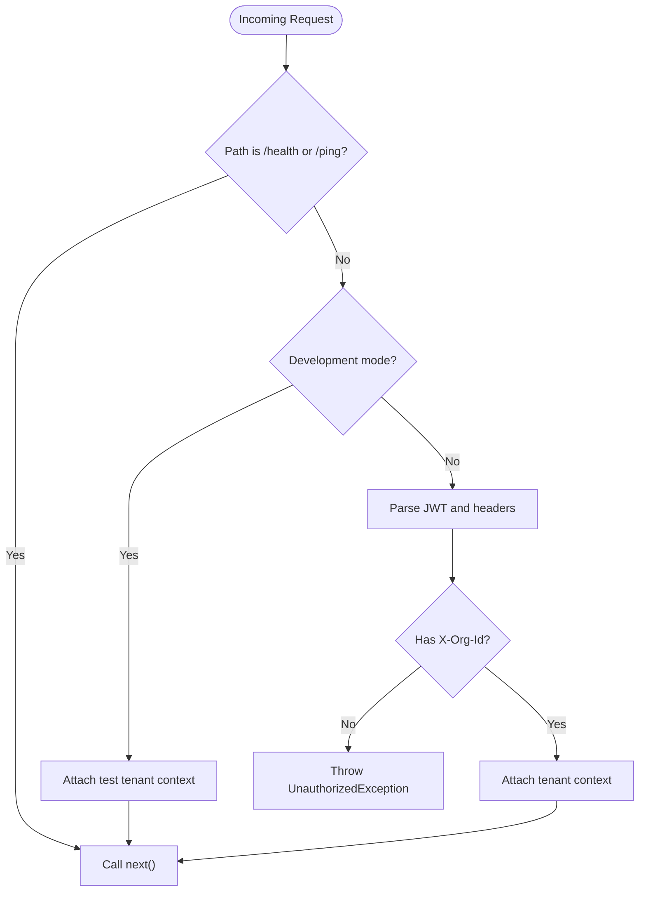
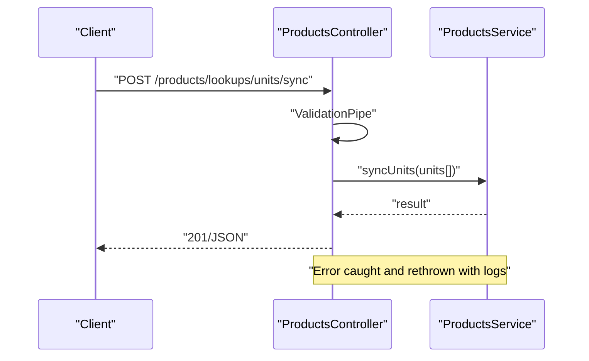
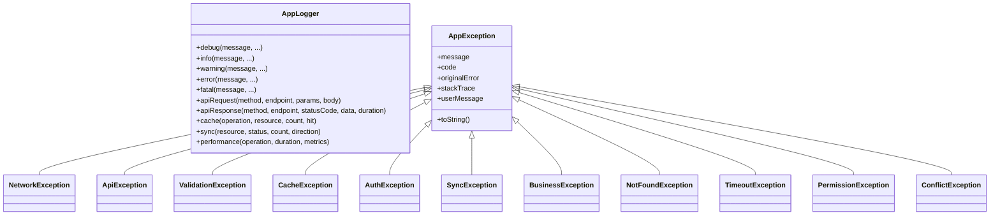
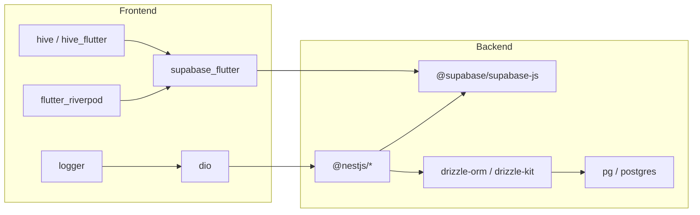

# Troubleshooting & FAQ

<cite>
**Referenced Files in This Document**
- [README.md](file://README.md)
- [backend/SETUP.md](file://backend/SETUP.md)
- [backend/QUICKSTART.md](file://backend/QUICKSTART.md)
- [backend/package.json](file://backend/package.json)
- [pubspec.yaml](file://pubspec.yaml)
- [backend/.env.example](file://backend/.env.example)
- [.env.example](file://.env.example)
- [backend/src/db/db.ts](file://backend/src/db/db.ts)
- [backend/src/db/schema.ts](file://backend/src/db/schema.ts)
- [backend/drizzle.config.ts](file://backend/drizzle.config.ts)
- [backend/src/common/middleware/tenant.middleware.ts](file://backend/src/common/middleware/tenant.middleware.ts)
- [backend/src/products/products.controller.ts](file://backend/src/products/products.controller.ts)
- [backend/src/sales/sales.controller.ts](file://backend/src/sales/sales.controller.ts)
- [lib/core/errors/app_exceptions.dart](file://lib/core/errors/app_exceptions.dart)
- [lib/core/logging/app_logger.dart](file://lib/core/logging/app_logger.dart)
- [lib/shared/services/env_service.dart](file://lib/shared/services/env_service.dart)
</cite>

## Table of Contents
1. [Introduction](#introduction)
2. [Project Structure](#project-structure)
3. [Core Components](#core-components)
4. [Architecture Overview](#architecture-overview)
5. [Detailed Component Analysis](#detailed-component-analysis)
6. [Dependency Analysis](#dependency-analysis)
7. [Performance Considerations](#performance-considerations)
8. [Troubleshooting Guide](#troubleshooting-guide)
9. [FAQ](#faq)
10. [Conclusion](#conclusion)
11. [Appendices](#appendices)

## Introduction
This document provides comprehensive troubleshooting and FAQ guidance for ZerpAI ERP. It covers setup and environment configuration, build and runtime issues, database connectivity, multi-tenancy, error handling, logging, performance tuning, and operational best practices. It also includes migration and upgrade considerations, legacy system integration, and escalation procedures.

## Project Structure
ZerpAI ERP is a monorepo with:
- Flutter frontend (Web + Android) under lib/
- NestJS backend under backend/
- Supabase database and migrations under supabase/
- Flutter dependencies and environment configuration at the root

**Diagram sources**
- [README.md](file://README.md#L83-L91)
- [backend/src/db/db.ts](file://backend/src/db/db.ts#L1-L13)
- [backend/src/db/schema.ts](file://backend/src/db/schema.ts#L1-L293)
- [backend/src/common/middleware/tenant.middleware.ts](file://backend/src/common/middleware/tenant.middleware.ts#L1-L70)
- [backend/src/products/products.controller.ts](file://backend/src/products/products.controller.ts#L1-L250)
- [backend/src/sales/sales.controller.ts](file://backend/src/sales/sales.controller.ts#L1-L102)
- [lib/shared/services/env_service.dart](file://lib/shared/services/env_service.dart#L1-L72)
- [lib/core/logging/app_logger.dart](file://lib/core/logging/app_logger.dart#L1-L218)
- [lib/core/errors/app_exceptions.dart](file://lib/core/errors/app_exceptions.dart#L1-L218)

**Section sources**
- [README.md](file://README.md#L5-L28)

## Core Components
- Environment configuration:
  - Backend .env template and keys for Supabase, JWT, CORS, Cloudflare R2, and deployment URLs.
  - Frontend .env template for API base URL, Supabase keys, offline mode, timeouts, and logging.
- Database:
  - Drizzle ORM with PostgreSQL client and schema definitions.
- Multi-tenancy:
  - TenantMiddleware extracts org/outlet context and guards endpoints.
- Controllers:
  - ProductsController and SalesController expose REST endpoints for CRUD and lookups.
- Logging and error handling:
  - AppLogger provides structured logging with context and performance metrics.
  - AppException hierarchy standardizes error messages and user-facing feedback.

**Section sources**
- [backend/.env.example](file://backend/.env.example#L1-L40)
- [.env.example](file://.env.example#L1-L68)
- [backend/src/db/db.ts](file://backend/src/db/db.ts#L1-L13)
- [backend/src/db/schema.ts](file://backend/src/db/schema.ts#L1-L293)
- [backend/src/common/middleware/tenant.middleware.ts](file://backend/src/common/middleware/tenant.middleware.ts#L1-L70)
- [backend/src/products/products.controller.ts](file://backend/src/products/products.controller.ts#L1-L250)
- [backend/src/sales/sales.controller.ts](file://backend/src/sales/sales.controller.ts#L1-L102)
- [lib/core/logging/app_logger.dart](file://lib/core/logging/app_logger.dart#L1-L218)
- [lib/core/errors/app_exceptions.dart](file://lib/core/errors/app_exceptions.dart#L1-L218)

## Architecture Overview

**Diagram sources**
- [README.md](file://README.md#L83-L91)
- [lib/shared/services/env_service.dart](file://lib/shared/services/env_service.dart#L48-L70)
- [backend/src/common/middleware/tenant.middleware.ts](file://backend/src/common/middleware/tenant.middleware.ts#L24-L68)
- [backend/src/db/db.ts](file://backend/src/db/db.ts#L1-L13)

## Detailed Component Analysis

### Environment Configuration and Validation
- Frontend:
  - Load .env via flutter_dotenv and validate required keys (Supabase URL and keys).
  - Optional R2 keys for Cloudflare R2 storage.
- Backend:
  - .env.example includes DATABASE_URL, Supabase keys, JWT_SECRET, PORT, CORS_ORIGIN, Cloudflare R2, and deployment URLs.
  - Drizzle config reads DATABASE_URL from environment.

**Diagram sources**
- [lib/shared/services/env_service.dart](file://lib/shared/services/env_service.dart#L7-L70)
- [.env.example](file://.env.example#L10-L18)
- [backend/.env.example](file://backend/.env.example#L3-L10)
- [backend/drizzle.config.ts](file://backend/drizzle.config.ts#L6-L15)

**Section sources**
- [lib/shared/services/env_service.dart](file://lib/shared/services/env_service.dart#L1-L72)
- [.env.example](file://.env.example#L1-L68)
- [backend/.env.example](file://backend/.env.example#L1-L40)
- [backend/drizzle.config.ts](file://backend/drizzle.config.ts#L1-L16)

### Database Connectivity and Schema
- Drizzle client connects using DATABASE_URL.
- Schema definitions define enums, tables, and relationships for products, lookups, and sales.
- Drizzle config enforces schema path and credentials.

**Diagram sources**
- [backend/src/db/db.ts](file://backend/src/db/db.ts#L1-L13)
- [backend/src/db/schema.ts](file://backend/src/db/schema.ts#L1-L293)
- [backend/drizzle.config.ts](file://backend/drizzle.config.ts#L6-L15)

**Section sources**
- [backend/src/db/db.ts](file://backend/src/db/db.ts#L1-L13)
- [backend/src/db/schema.ts](file://backend/src/db/schema.ts#L1-L293)
- [backend/drizzle.config.ts](file://backend/drizzle.config.ts#L1-L16)

### Multi-Tenancy Middleware
- TenantMiddleware:
  - Skips tenant checks for health endpoints.
  - Currently attaches a test tenant context for development.
  - Includes commented production code for JWT parsing and header validation (org/outlet).

**Diagram sources**
- [backend/src/common/middleware/tenant.middleware.ts](file://backend/src/common/middleware/tenant.middleware.ts#L24-L68)

**Section sources**
- [backend/src/common/middleware/tenant.middleware.ts](file://backend/src/common/middleware/tenant.middleware.ts#L1-L70)

### Controllers: Products and Sales
- ProductsController:
  - Exposes lookup endpoints and sync endpoints for units, categories, manufacturers, brands, storage locations, racks, reorder terms, accounts, contents, strengths, buying rules, and drug schedules.
  - Uses ValidationPipe and logs request payloads and errors.
- SalesController:
  - Exposes endpoints for customers, GSTIN lookup, payments, e-way bills, payment links, and sales orders/invoices.

**Diagram sources**
- [backend/src/products/products.controller.ts](file://backend/src/products/products.controller.ts#L29-L45)

**Section sources**
- [backend/src/products/products.controller.ts](file://backend/src/products/products.controller.ts#L1-L250)
- [backend/src/sales/sales.controller.ts](file://backend/src/sales/sales.controller.ts#L1-L102)

### Logging and Error Handling
- AppLogger:
  - Provides debug/info/warning/error/fatal logging with structured context (module, org, user).
  - Includes helpers for API requests/responses, cache, sync, and performance metrics.
- AppException:
  - Standardized exception hierarchy with user-friendly messages for network, API, validation, cache, auth, sync, business, not-found, timeout, permission, and conflict scenarios.

**Diagram sources**
- [lib/core/logging/app_logger.dart](file://lib/core/logging/app_logger.dart#L1-L218)
- [lib/core/errors/app_exceptions.dart](file://lib/core/errors/app_exceptions.dart#L1-L218)

**Section sources**
- [lib/core/logging/app_logger.dart](file://lib/core/logging/app_logger.dart#L1-L218)
- [lib/core/errors/app_exceptions.dart](file://lib/core/errors/app_exceptions.dart#L1-L218)

## Dependency Analysis
- Backend dependencies include NestJS core, Supabase client, Drizzle ORM, and PostgreSQL client.
- Flutter dependencies include supabase_flutter, dio, hive, logger, and riverpod.

**Diagram sources**
- [backend/package.json](file://backend/package.json#L22-L37)
- [pubspec.yaml](file://pubspec.yaml#L38-L69)

**Section sources**
- [backend/package.json](file://backend/package.json#L1-L79)
- [pubspec.yaml](file://pubspec.yaml#L1-L128)

## Performance Considerations
- Logging:
  - Use AppLogger.performance to measure operation durations and correlate with business actions.
  - Adjust log level in production to reduce overhead.
- API timeouts:
  - Tune API_CONNECT_TIMEOUT and API_RECEIVE_TIMEOUT in frontend .env to match network conditions.
- Caching:
  - Configure CACHE_STALENESS_HOURS and MAX_CACHE_SIZE_MB to balance freshness and performance.
- Database:
  - Prefer Drizzle’s typed queries and joins to avoid N+1 and unnecessary scans.
  - Use pagination and filters in controllers for large datasets.
- Offline mode:
  - ENABLE_OFFLINE_MODE leverages Hive caching; monitor cache sizes and stale thresholds.

[No sources needed since this section provides general guidance]

## Troubleshooting Guide

### Environment Configuration Problems
- Symptoms:
  - App fails to start or throws configuration errors.
- Steps:
  - Copy templates to .env and fill values:
    - Backend: copy backend/.env.example to backend/.env.
    - Frontend: copy .env.example to .env.local (do not commit).
  - Validate keys:
    - Frontend: ensure SUPABASE_URL, SUPABASE_ANON_KEY, SUPABASE_SERVICE_ROLE_KEY, API_BASE_URL.
    - Backend: ensure DATABASE_URL, SUPABASE_URL, SUPABASE_SERVICE_ROLE_KEY, JWT_SECRET, CORS_ORIGIN.
  - Confirm environment variables are loaded:
    - Flutter: call EnvService.initialize() and EnvService.validate().
    - Backend: Drizzle config reads DATABASE_URL from process.env.

**Section sources**
- [backend/QUICKSTART.md](file://backend/QUICKSTART.md#L66-L79)
- [.env.example](file://.env.example#L10-L18)
- [backend/.env.example](file://backend/.env.example#L3-L10)
- [lib/shared/services/env_service.dart](file://lib/shared/services/env_service.dart#L7-L70)
- [backend/drizzle.config.ts](file://backend/drizzle.config.ts#L6-L15)

### Dependency Conflicts and Build Errors
- Symptoms:
  - npm install fails with memory or peer dependency errors.
- Steps:
  - Increase Node memory: NODE_OPTIONS="--max-old-space-size=4096".
  - Clear cache: npm cache clean --force.
  - Use legacy peers if necessary: npm install --legacy-peer-deps.
  - Install key dependencies individually if needed: drizzle-orm, postgres, drizzle-kit.
  - Verify backend scripts and devDependencies.

**Section sources**
- [backend/QUICKSTART.md](file://backend/QUICKSTART.md#L23-L36)
- [backend/package.json](file://backend/package.json#L1-L79)

### Port Already in Use
- Symptoms:
  - Local backend fails to start on default port.
- Steps:
  - Find process using port 3001 and terminate it.
  - Change PORT in backend/.env if needed.

**Section sources**
- [backend/QUICKSTART.md](file://backend/QUICKSTART.md#L88-L95)
- [backend/.env.example](file://backend/.env.example#L19)

### Database Connection Failures
- Symptoms:
  - Backend cannot connect to Supabase database.
- Steps:
  - Verify DATABASE_URL in backend/.env.
  - Ensure Supabase project is active and reachable.
  - Test connection using Drizzle Studio or a simple script.
  - Confirm Drizzle schema path and credentials in drizzle.config.ts.

**Section sources**
- [backend/QUICKSTART.md](file://backend/QUICKSTART.md#L97-L100)
- [backend/.env.example](file://backend/.env.example#L4)
- [backend/drizzle.config.ts](file://backend/drizzle.config.ts#L6-L15)
- [backend/src/db/db.ts](file://backend/src/db/db.ts#L8-L12)

### CORS Errors
- Symptoms:
  - Frontend receives CORS errors when calling backend.
- Steps:
  - Ensure CORS_ORIGIN includes both local development URL and deployed frontend URL.
  - Re-deploy backend after updating environment variables.

**Section sources**
- [backend/SETUP.md](file://backend/SETUP.md#L220-L225)
- [backend/.env.example](file://backend/.env.example#L23)

### Vercel Build and Runtime Errors
- Symptoms:
  - Vercel deployment fails or crashes at runtime.
- Steps:
  - Check Vercel logs for the specific deployment URL.
  - Ensure all environment variables are set on Vercel.
  - Verify vercel.json configuration and that TypeScript builds locally first.
  - Confirm backend runs locally with npm run start:dev.

**Section sources**
- [backend/SETUP.md](file://backend/SETUP.md#L234-L246)

### Multi-Tenancy and Authentication Issues
- Symptoms:
  - Requests fail with missing org/outlet context or unauthorized errors.
- Steps:
  - Ensure X-Org-Id header is present for protected endpoints.
  - For development, tenant middleware currently attaches a test context; for production, enable JWT verification and header parsing.
  - Confirm tenant context is attached before service logic.

**Section sources**
- [backend/src/common/middleware/tenant.middleware.ts](file://backend/src/common/middleware/tenant.middleware.ts#L24-L68)

### API and Controller Errors
- Symptoms:
  - 4xx/5xx responses, unhandled exceptions, or malformed payloads.
- Steps:
  - Review controller logs for incoming payloads and errors.
  - Use ValidationPipe to enforce DTOs and catch validation failures early.
  - Inspect service logic and database queries for correctness.

**Section sources**
- [backend/src/products/products.controller.ts](file://backend/src/products/products.controller.ts#L32-L44)
- [backend/src/sales/sales.controller.ts](file://backend/src/sales/sales.controller.ts#L1-L102)

### Logging and Diagnostics
- Steps:
  - Use AppLogger.apiRequest/apiResponse for HTTP traces.
  - Use AppLogger.cache and AppLogger.sync for offline and sync diagnostics.
  - Use AppLogger.performance to capture operation durations.
  - For frontend exceptions, wrap in AppException subclasses to show user-friendly messages.

**Section sources**
- [lib/core/logging/app_logger.dart](file://lib/core/logging/app_logger.dart#L135-L216)
- [lib/core/errors/app_exceptions.dart](file://lib/core/errors/app_exceptions.dart#L1-L218)

### Migration and Upgrade Issues
- Steps:
  - Use Drizzle Kit to generate and push schema changes.
  - Keep migrations in supabase/migrations and apply via Supabase SQL Editor if needed.
  - For upgrades, pin compatible versions in pubspec.yaml and backend/package.json, rebuild, and test.

**Section sources**
- [backend/SETUP.md](file://backend/SETUP.md#L42-L55)
- [backend/drizzle.config.ts](file://backend/drizzle.config.ts#L1-L16)

### Legacy System Integration Challenges
- Steps:
  - Map legacy identifiers to current schema enums and tables.
  - Use lookup sync endpoints to migrate reference data incrementally.
  - Validate data integrity and uniqueness constraints before bulk inserts.

**Section sources**
- [backend/src/products/products.controller.ts](file://backend/src/products/products.controller.ts#L24-L193)

### Community Support and Escalation
- Resources:
  - GitHub Issues for bug reports and feature requests.
  - Internal Slack channel for urgent escalations.
- Escalation procedure:
  - Include environment details, logs, steps to reproduce, and affected endpoints.
  - Tag relevant maintainers and PRD references.

[No sources needed since this section provides general guidance]

## FAQ

### Why does npm install fail during backend setup?
- Possible causes:
  - Low memory or peer dependency conflicts.
- Solutions:
  - Increase Node memory, clear cache, or use legacy peers as needed.

**Section sources**
- [backend/QUICKSTART.md](file://backend/QUICKSTART.md#L23-L36)

### How do I configure CORS for local and deployed environments?
- Ensure CORS_ORIGIN includes both local development URL and deployed frontend URL.

**Section sources**
- [backend/SETUP.md](file://backend/SETUP.md#L220-L225)

### What should I check if the database connection fails?
- Verify DATABASE_URL, Supabase project status, and test with Drizzle Studio.

**Section sources**
- [backend/QUICKSTART.md](file://backend/QUICKSTART.md#L97-L100)
- [backend/drizzle.config.ts](file://backend/drizzle.config.ts#L6-L15)

### How do I enable offline mode and configure cache?
- Set ENABLE_OFFLINE_MODE and tune CACHE_STALENESS_HOURS and MAX_CACHE_SIZE_MB in frontend .env.

**Section sources**
- [.env.example](file://.env.example#L24-L52)

### How do I validate environment variables at startup?
- Initialize and validate .env in Flutter using EnvService.

**Section sources**
- [lib/shared/services/env_service.dart](file://lib/shared/services/env_service.dart#L7-L70)

### How do I troubleshoot API timeouts?
- Adjust API_CONNECT_TIMEOUT and API_RECEIVE_TIMEOUT in frontend .env.

**Section sources**
- [.env.example](file://.env.example#L55-L59)

### How do I migrate schema changes?
- Use Drizzle Kit to generate and push schema updates.

**Section sources**
- [backend/SETUP.md](file://backend/SETUP.md#L208-L210)
- [backend/drizzle.config.ts](file://backend/drizzle.config.ts#L1-L16)

### How do I handle multi-tenancy in development vs production?
- Development attaches a test tenant context; production requires JWT verification and proper headers.

**Section sources**
- [backend/src/common/middleware/tenant.middleware.ts](file://backend/src/common/middleware/tenant.middleware.ts#L24-L68)

### How do I debug controller-level errors?
- Review controller logs and ensure ValidationPipe is applied to DTOs.

**Section sources**
- [backend/src/products/products.controller.ts](file://backend/src/products/products.controller.ts#L32-L44)

## Conclusion
This guide consolidates practical troubleshooting steps, configuration checks, and diagnostic techniques for ZerpAI ERP across frontend, backend, and database layers. By validating environment variables, ensuring database connectivity, applying multi-tenancy correctly, and leveraging structured logging and standardized exceptions, most development and runtime issues can be resolved efficiently.

[No sources needed since this section summarizes without analyzing specific files]

## Appendices

### Quick Reference: Environment Variables
- Backend .env:
  - DATABASE_URL, SUPABASE_URL, SUPABASE_SERVICE_ROLE_KEY, JWT_SECRET, PORT, CORS_ORIGIN, Cloudflare R2, FRONTEND_URL, BACKEND_URL.
- Frontend .env:
  - API_BASE_URL, SUPABASE_URL, SUPABASE_ANON_KEY, SUPABASE_SERVICE_ROLE_KEY, ENVIRONMENT, ENABLE_OFFLINE_MODE, ENABLE_DEBUG_LOGGING, ENABLE_PERFORMANCE_MONITORING, DEV_ORG_ID, DEV_OUTLET_ID, R2_* settings, CACHE_STALENESS_HOURS, MAX_CACHE_SIZE_MB, API_CONNECT_TIMEOUT, API_RECEIVE_TIMEOUT, LOG_LEVEL, ENABLE_STRUCTURED_LOGGING.

**Section sources**
- [backend/.env.example](file://backend/.env.example#L1-L40)
- [.env.example](file://.env.example#L5-L68)